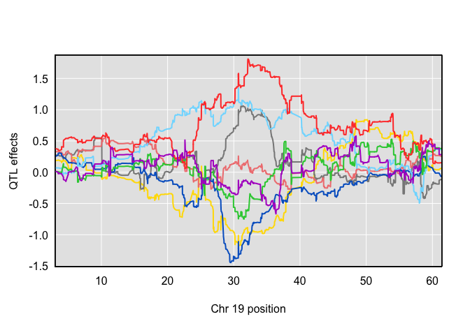
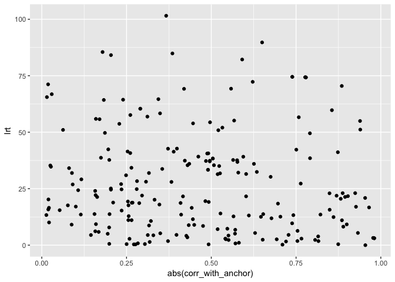
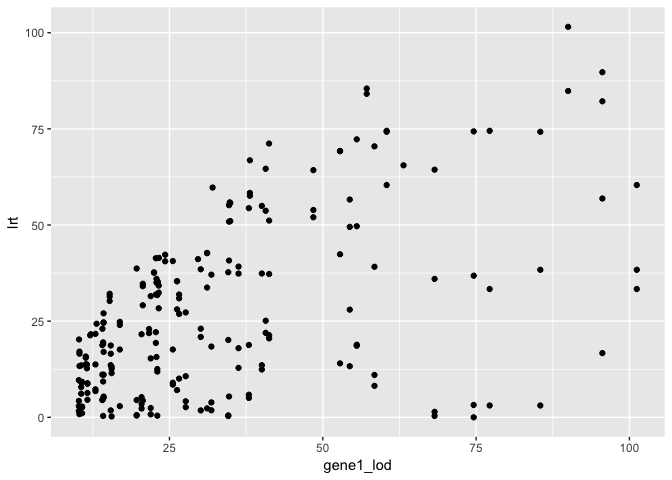
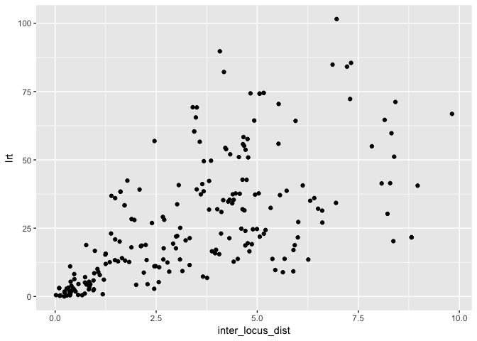

Initial results from power analyses
================
Frederick Boehm
2018-11-20 13:48:43

## Run 3101

``` r
library(readr)
library(qtl2pleio)
library(tidyverse)
```

    ## ── Attaching packages ──────────────────────── tidyverse 1.2.1 ──

    ## ✔ ggplot2 3.1.0     ✔ purrr   0.2.5
    ## ✔ tibble  1.4.2     ✔ dplyr   0.7.8
    ## ✔ tidyr   0.8.2     ✔ stringr 1.3.1
    ## ✔ ggplot2 3.1.0     ✔ forcats 0.3.0

    ## ── Conflicts ─────────────────────────── tidyverse_conflicts() ──
    ## ✖ dplyr::filter() masks stats::filter()
    ## ✖ dplyr::lag()    masks stats::lag()

``` r
scans <- list()
fns <- dir("../results/pvl-run3101/", pattern = ".txt")
for (i in 1:length(fns)){
  scans[[i]] <- as_tibble(read.table(file.path("../results/pvl-run3101", fns[i])))
}
lrt <- purrr::map_dbl(.x = scans, .f = calc_lrt_tib)
```

## Parse file names to recover annotation information

We now parse the file names object `fns`, to recover the annotation
information for the LRT values.

``` r
library(stringr)
```

``` r
gene1 <- str_split(fns, pattern = "_") %>%
  purrr::map_chr(.f = function(x)x[3])
gene2 <- str_split(fns, pattern = "_") %>%
  purrr::map_chr(.f = function(x)x[4]) %>% 
  str_split(pattern = ".txt") %>%
  purrr::map_chr(.f = function(x)x[1])
jobnum <- str_split(fns, pattern = "_") %>%
  purrr::map_chr(.f = function(x)x[2]) %>%
  as.integer()
runnum <- str_split(fns, pattern = "_") %>%
  purrr::map_chr(.f = function(x)x[1]) %>%
  str_remove(pattern = "pvl-run") %>% 
  as.integer()
r3101 <- tibble(filename = fns, gene1 = gene1, gene2 = gene2, run = runnum, job = jobnum, lrt = lrt)
```

## Run 3102

First, we calculate the LRTs from the scan results.

``` r
scans <- list()
fns <- dir("../results/pvl-run3102/", pattern = ".txt")
for (i in 1:length(fns)){
  scans[[i]] <- as_tibble(read.table(file.path("../results/pvl-run3102", fns[i])))
}
lrt <- purrr::map_dbl(.x = scans, .f = calc_lrt_tib)
```

Now, we parse the filenames to get the annotation information.

``` r
gene1 <- str_split(fns, pattern = "_") %>%
  purrr::map_chr(.f = function(x)x[3])
gene2 <- str_split(fns, pattern = "_") %>%
  purrr::map_chr(.f = function(x)x[4]) %>% 
  str_split(pattern = ".txt") %>%
  purrr::map_chr(.f = function(x)x[1])
jobnum <- str_split(fns, pattern = "_") %>%
  purrr::map_chr(.f = function(x)x[2]) %>%
  as.integer()
runnum <- str_split(fns, pattern = "_") %>%
  purrr::map_chr(.f = function(x)x[1]) %>%
  str_remove(pattern = "pvl-run") %>% 
  as.integer()
r3102 <- tibble(filename = fns, gene1 = gene1, gene2 = gene2, run = runnum, job = jobnum, lrt = lrt)
```

Now, combine the two tables before loading the Keller annotation data.
We’ll load the Keller annotation data so that we can get the gene
positions.

``` r
mytib <- bind_rows(r3101, r3102)
```

``` r
load("../data/Attie_DO378_eQTL_viewer_v1.Rdata")
```

``` r
myt <- dataset.islet.rnaseq$annots %>%
  select(gene_id, symbol, middle) %>%
  right_join(mytib, by = c("gene_id" = "gene1")) %>%
  rename(gene1 = gene_id, gene1_symbol = symbol, gene1_middle = middle)
```

We want to add the univariate LOD scores for gene2 values.

``` r
mytib2 <- dataset.islet.rnaseq$lod.peaks %>% 
  select(- marker.id) %>%
  filter(chrom == 19) %>%
  right_join(myt, by = c("annot.id" = "gene1")) %>%
  rename(gene1 = annot.id, gene1_lod_peak_pos = pos, gene1_lod = lod)
```

## Plot for run 3101

Initially, we ignore allele effects patterns.

``` r
# get the position for gene2
r3101$gene2[1]
```

    ## [1] "ENSMUSG00000024887"

``` r
gene2_middle_r3101 <- dataset.islet.rnaseq$annots %>%
  filter(gene_id == r3101$gene2[1]) %>%
  select(middle) %>%
  unlist()
```

``` r
library(plotly)
```

    ## 
    ## Attaching package: 'plotly'

    ## The following object is masked from 'package:ggplot2':
    ## 
    ##     last_plot

    ## The following object is masked from 'package:stats':
    ## 
    ##     filter

    ## The following object is masked from 'package:graphics':
    ## 
    ##     layout

``` r
pp <- mytib2 %>%
  filter(run == 3101) %>%
ggplot() + 
  geom_point(mapping = aes(x = gene1_middle, y = lrt, colour = gene1_lod)) + 
  geom_vline(xintercept = gene2_middle_r3101)
ggplotly(pp)
```

<!--html_preserve-->

<div id="htmlwidget-27ee90afcf98bfd2bdea" class="plotly html-widget" style="width:8px;height:12px;">

</div>

<script type="application/json" data-for="htmlwidget-27ee90afcf98bfd2bdea">{"x":{"data":[{"x":[34.707846,37.399131,34.509896,29.034397,36.41763,30.062118,30.136934,30.236306,26.691718,32.791828,28.874504,37.699668,38.63307,40.839926,29.357994,34.845174,29.564556,28.965359,32.25622,33.639846,36.969416,29.760206,29.628314,37.971306,34.47446,34.028078,29.32335,31.909084,40.246508,34.111815,28.934534,34.144301,36.734195,33.265021,34.586131,34.597428,33.507908,33.61898,33.414886,34.216281,33.740812,36.659846,28.581914,35.8799,34.478177,32.3902,34.309214,29.004032],"y":[17.6367842655831,13.7404549279399,11.0985685869269,17.624984382438,37.3986448772069,27.996188835118,17.974951426659,42.402736848373,32.421847430505,18.8120106944031,9.31144392142198,13.775744284867,27.0360667933879,21.59286120765,29.128670476857,9.09224415725498,56.898203409354,40.7704033482711,1.79754849106291,38.3603578945,37.260150665892,13.3311846070981,26.8788875373319,64.272253945115,2.81352665417796,4.25974579003491,28.083548818928,0.230455859605968,30.250330029055,39.1479794522261,13.549796117782,18.3960318795481,53.704234683448,15.3193540931151,5.24357267910898,10.6847193070349,35.9869064968519,20.114597705252,36.825327214809,8.72032722955203,33.359988362358,31.935452007654,60.401495547042,49.6899511239551,11.06318113037,0.42710186635702,4.48461467030199,33.742264613424],"text":["gene1_middle: 34.70785<br />lrt: 17.6367843<br />gene1_lod: 25.54481","gene1_middle: 37.39913<br />lrt: 13.7404549<br />gene1_lod: 12.93219","gene1_middle: 34.50990<br />lrt: 11.0985686<br />gene1_lod: 14.06188","gene1_middle: 29.03440<br />lrt: 17.6249844<br />gene1_lod: 16.90392","gene1_middle: 36.41763<br />lrt: 37.3986449<br />gene1_lod: 40.06118","gene1_middle: 30.06212<br />lrt: 27.9961888<br />gene1_lod: 54.39595","gene1_middle: 30.13693<br />lrt: 17.9749514<br />gene1_lod: 36.25829","gene1_middle: 30.23631<br />lrt: 42.4027368<br />gene1_lod: 52.80866","gene1_middle: 26.69172<br />lrt: 32.4218474<br />gene1_lod: 23.24616","gene1_middle: 32.79183<br />lrt: 18.8120107<br />gene1_lod: 37.94567","gene1_middle: 28.87450<br />lrt:  9.3114439<br />gene1_lod: 14.18397","gene1_middle: 37.69967<br />lrt: 13.7757443<br />gene1_lod: 11.35189","gene1_middle: 38.63307<br />lrt: 27.0360668<br />gene1_lod: 14.25618","gene1_middle: 40.83993<br />lrt: 21.5928612<br />gene1_lod: 12.18574","gene1_middle: 29.35799<br />lrt: 29.1286705<br />gene1_lod: 20.64732","gene1_middle: 34.84517<br />lrt:  9.0922442<br />gene1_lod: 10.60662","gene1_middle: 29.56456<br />lrt: 56.8982034<br />gene1_lod: 95.58486","gene1_middle: 28.96536<br />lrt: 40.7704033<br />gene1_lod: 34.71154","gene1_middle: 32.25622<br />lrt:  1.7975485<br />gene1_lod: 30.10075","gene1_middle: 33.63985<br />lrt: 38.3603579<br />gene1_lod: 85.46413","gene1_middle: 36.96942<br />lrt: 37.2601507<br />gene1_lod: 41.25054","gene1_middle: 29.76021<br />lrt: 13.3311846<br />gene1_lod: 10.32359","gene1_middle: 29.62831<br />lrt: 26.8788875<br />gene1_lod: 26.57237","gene1_middle: 37.97131<br />lrt: 64.2722539<br />gene1_lod: 48.46025","gene1_middle: 34.47446<br />lrt:  2.8135267<br />gene1_lod: 10.74403","gene1_middle: 34.02808<br />lrt:  4.2597458<br />gene1_lod: 10.22790","gene1_middle: 29.32335<br />lrt: 28.0835488<br />gene1_lod: 26.23347","gene1_middle: 31.90908<br />lrt:  0.2304559<br />gene1_lod: 15.56472","gene1_middle: 40.24651<br />lrt: 30.2503300<br />gene1_lod: 15.24684","gene1_middle: 34.11181<br />lrt: 39.1479795<br />gene1_lod: 58.42683","gene1_middle: 28.93453<br />lrt: 13.5497961<br />gene1_lod: 15.42611","gene1_middle: 34.14430<br />lrt: 18.3960319<br />gene1_lod: 31.83194","gene1_middle: 36.73419<br />lrt: 53.7042347<br />gene1_lod: 40.68810","gene1_middle: 33.26502<br />lrt: 15.3193541<br />gene1_lod: 21.94345","gene1_middle: 34.58613<br />lrt:  5.2435727<br />gene1_lod: 20.45022","gene1_middle: 34.59743<br />lrt: 10.6847193<br />gene1_lod: 27.65202","gene1_middle: 33.50791<br />lrt: 35.9869065<br />gene1_lod: 68.22809","gene1_middle: 33.61898<br />lrt: 20.1145977<br />gene1_lod: 34.58785","gene1_middle: 33.41489<br />lrt: 36.8253272<br />gene1_lod: 74.60633","gene1_middle: 34.21628<br />lrt:  8.7203272<br />gene1_lod: 11.62467","gene1_middle: 33.74081<br />lrt: 33.3599884<br />gene1_lod: 77.20922","gene1_middle: 36.65985<br />lrt: 31.9354520<br />gene1_lod: 22.77815","gene1_middle: 28.58191<br />lrt: 60.4014955<br />gene1_lod: 60.41271","gene1_middle: 35.87990<br />lrt: 49.6899511<br />gene1_lod: 55.53713","gene1_middle: 34.47818<br />lrt: 11.0631811<br />gene1_lod: 14.26288","gene1_middle: 32.39020<br />lrt:  0.4271019<br />gene1_lod: 23.01734","gene1_middle: 34.30921<br />lrt:  4.4846147<br />gene1_lod: 19.65164","gene1_middle: 29.00403<br />lrt: 33.7422646<br />gene1_lod: 31.13501"],"type":"scatter","mode":"markers","marker":{"autocolorscale":false,"color":["rgba(30,65,96,1)","rgba(21,47,72,1)","rgba(22,48,74,1)","rgba(24,52,79,1)","rgba(41,86,125,1)","rgba(52,108,155,1)","rgba(38,80,117,1)","rgba(51,106,152,1)","rgba(28,61,92,1)","rgba(39,83,121,1)","rgba(22,48,74,1)","rgba(20,45,69,1)","rgba(22,49,74,1)","rgba(20,46,71,1)","rgba(26,58,87,1)","rgba(19,44,68,1)","rgba(86,177,247,1)","rgba(37,78,114,1)","rgba(33,71,105,1)","rgba(77,160,224,1)","rgba(42,88,128,1)","rgba(19,43,67,1)","rgba(31,66,98,1)","rgba(47,99,143,1)","rgba(19,44,68,1)","rgba(19,43,67,1)","rgba(30,66,97,1)","rgba(23,50,77,1)","rgba(23,50,76,1)","rgba(55,115,164,1)","rgba(23,50,77,1)","rgba(35,74,109,1)","rgba(41,87,126,1)","rgba(27,59,89,1)","rgba(26,57,86,1)","rgba(31,68,100,1)","rgba(63,131,185,1)","rgba(37,78,114,1)","rgba(68,141,199,1)","rgba(20,45,70,1)","rgba(70,146,205,1)","rgba(28,61,91,1)","rgba(57,118,168,1)","rgba(53,110,158,1)","rgba(22,49,74,1)","rgba(28,61,91,1)","rgba(26,56,85,1)","rgba(34,73,107,1)"],"opacity":1,"size":5.66929133858268,"symbol":"circle","line":{"width":1.88976377952756,"color":["rgba(30,65,96,1)","rgba(21,47,72,1)","rgba(22,48,74,1)","rgba(24,52,79,1)","rgba(41,86,125,1)","rgba(52,108,155,1)","rgba(38,80,117,1)","rgba(51,106,152,1)","rgba(28,61,92,1)","rgba(39,83,121,1)","rgba(22,48,74,1)","rgba(20,45,69,1)","rgba(22,49,74,1)","rgba(20,46,71,1)","rgba(26,58,87,1)","rgba(19,44,68,1)","rgba(86,177,247,1)","rgba(37,78,114,1)","rgba(33,71,105,1)","rgba(77,160,224,1)","rgba(42,88,128,1)","rgba(19,43,67,1)","rgba(31,66,98,1)","rgba(47,99,143,1)","rgba(19,44,68,1)","rgba(19,43,67,1)","rgba(30,66,97,1)","rgba(23,50,77,1)","rgba(23,50,76,1)","rgba(55,115,164,1)","rgba(23,50,77,1)","rgba(35,74,109,1)","rgba(41,87,126,1)","rgba(27,59,89,1)","rgba(26,57,86,1)","rgba(31,68,100,1)","rgba(63,131,185,1)","rgba(37,78,114,1)","rgba(68,141,199,1)","rgba(20,45,70,1)","rgba(70,146,205,1)","rgba(28,61,91,1)","rgba(57,118,168,1)","rgba(53,110,158,1)","rgba(22,49,74,1)","rgba(28,61,91,1)","rgba(26,56,85,1)","rgba(34,73,107,1)"]}},"hoveron":"points","showlegend":false,"xaxis":"x","yaxis":"y","hoverinfo":"text","frame":null},{"x":[32.023062,32.023062],"y":[-2.97163404466949,67.4743438493905],"text":"xintercept: 32.02306","type":"scatter","mode":"lines","line":{"width":1.88976377952756,"color":"rgba(0,0,0,1)","dash":"solid"},"hoveron":"points","showlegend":false,"xaxis":"x","yaxis":"y","hoverinfo":"text","frame":null},{"x":[30],"y":[-4.44089209850063e-16],"name":"99_ebede1f9d6f5696dc0e1f4d94f9f4bbc","type":"scatter","mode":"markers","opacity":0,"hoverinfo":"none","showlegend":false,"marker":{"color":[0,1],"colorscale":[[0,"#132B43"],[0.0526315789473684,"#16314B"],[0.105263157894737,"#193754"],[0.157894736842105,"#1D3E5C"],[0.210526315789474,"#204465"],[0.263157894736842,"#234B6E"],[0.315789473684211,"#275277"],[0.368421052631579,"#2A5980"],[0.421052631578947,"#2E608A"],[0.473684210526316,"#316793"],[0.526315789473684,"#356E9D"],[0.578947368421053,"#3875A6"],[0.631578947368421,"#3C7CB0"],[0.68421052631579,"#3F83BA"],[0.736842105263158,"#438BC4"],[0.789473684210526,"#4792CE"],[0.842105263157895,"#4B9AD8"],[0.894736842105263,"#4EA2E2"],[0.947368421052632,"#52A9ED"],[1,"#56B1F7"]],"colorbar":{"bgcolor":"rgba(255,255,255,1)","bordercolor":"transparent","borderwidth":1.88976377952756,"thickness":23.04,"title":"gene1_lod","titlefont":{"color":"rgba(0,0,0,1)","family":"","size":14.6118721461187},"tickmode":"array","ticktext":["25","50","75"],"tickvals":[0.173062670233831,0.465950318911526,0.758837967589222],"tickfont":{"color":"rgba(0,0,0,1)","family":"","size":11.689497716895},"ticklen":2,"len":0.5}},"xaxis":"x","yaxis":"y","frame":null}],"layout":{"margin":{"t":26.2283105022831,"r":7.30593607305936,"b":40.1826484018265,"l":37.2602739726027},"plot_bgcolor":"rgba(235,235,235,1)","paper_bgcolor":"rgba(255,255,255,1)","font":{"color":"rgba(0,0,0,1)","family":"","size":14.6118721461187},"xaxis":{"domain":[0,1],"automargin":true,"type":"linear","autorange":false,"range":[25.9843076,41.5473364],"tickmode":"array","ticktext":["30","35","40"],"tickvals":[30,35,40],"categoryorder":"array","categoryarray":["30","35","40"],"nticks":null,"ticks":"outside","tickcolor":"rgba(51,51,51,1)","ticklen":3.65296803652968,"tickwidth":0.66417600664176,"showticklabels":true,"tickfont":{"color":"rgba(77,77,77,1)","family":"","size":11.689497716895},"tickangle":-0,"showline":false,"linecolor":null,"linewidth":0,"showgrid":true,"gridcolor":"rgba(255,255,255,1)","gridwidth":0.66417600664176,"zeroline":false,"anchor":"y","title":"gene1_middle","titlefont":{"color":"rgba(0,0,0,1)","family":"","size":14.6118721461187},"hoverformat":".2f"},"yaxis":{"domain":[0,1],"automargin":true,"type":"linear","autorange":false,"range":[-2.97163404466949,67.4743438493905],"tickmode":"array","ticktext":["0","20","40","60"],"tickvals":[-4.44089209850063e-16,20,40,60],"categoryorder":"array","categoryarray":["0","20","40","60"],"nticks":null,"ticks":"outside","tickcolor":"rgba(51,51,51,1)","ticklen":3.65296803652968,"tickwidth":0.66417600664176,"showticklabels":true,"tickfont":{"color":"rgba(77,77,77,1)","family":"","size":11.689497716895},"tickangle":-0,"showline":false,"linecolor":null,"linewidth":0,"showgrid":true,"gridcolor":"rgba(255,255,255,1)","gridwidth":0.66417600664176,"zeroline":false,"anchor":"x","title":"lrt","titlefont":{"color":"rgba(0,0,0,1)","family":"","size":14.6118721461187},"hoverformat":".2f"},"shapes":[{"type":"rect","fillcolor":null,"line":{"color":null,"width":0,"linetype":[]},"yref":"paper","xref":"paper","x0":0,"x1":1,"y0":0,"y1":1}],"showlegend":false,"legend":{"bgcolor":"rgba(255,255,255,1)","bordercolor":"transparent","borderwidth":1.88976377952756,"font":{"color":"rgba(0,0,0,1)","family":"","size":11.689497716895}},"hovermode":"closest","barmode":"relative"},"config":{"doubleClick":"reset","modeBarButtonsToAdd":[{"name":"Collaborate","icon":{"width":1000,"ascent":500,"descent":-50,"path":"M487 375c7-10 9-23 5-36l-79-259c-3-12-11-23-22-31-11-8-22-12-35-12l-263 0c-15 0-29 5-43 15-13 10-23 23-28 37-5 13-5 25-1 37 0 0 0 3 1 7 1 5 1 8 1 11 0 2 0 4-1 6 0 3-1 5-1 6 1 2 2 4 3 6 1 2 2 4 4 6 2 3 4 5 5 7 5 7 9 16 13 26 4 10 7 19 9 26 0 2 0 5 0 9-1 4-1 6 0 8 0 2 2 5 4 8 3 3 5 5 5 7 4 6 8 15 12 26 4 11 7 19 7 26 1 1 0 4 0 9-1 4-1 7 0 8 1 2 3 5 6 8 4 4 6 6 6 7 4 5 8 13 13 24 4 11 7 20 7 28 1 1 0 4 0 7-1 3-1 6-1 7 0 2 1 4 3 6 1 1 3 4 5 6 2 3 3 5 5 6 1 2 3 5 4 9 2 3 3 7 5 10 1 3 2 6 4 10 2 4 4 7 6 9 2 3 4 5 7 7 3 2 7 3 11 3 3 0 8 0 13-1l0-1c7 2 12 2 14 2l218 0c14 0 25-5 32-16 8-10 10-23 6-37l-79-259c-7-22-13-37-20-43-7-7-19-10-37-10l-248 0c-5 0-9-2-11-5-2-3-2-7 0-12 4-13 18-20 41-20l264 0c5 0 10 2 16 5 5 3 8 6 10 11l85 282c2 5 2 10 2 17 7-3 13-7 17-13z m-304 0c-1-3-1-5 0-7 1-1 3-2 6-2l174 0c2 0 4 1 7 2 2 2 4 4 5 7l6 18c0 3 0 5-1 7-1 1-3 2-6 2l-173 0c-3 0-5-1-8-2-2-2-4-4-4-7z m-24-73c-1-3-1-5 0-7 2-2 3-2 6-2l174 0c2 0 5 0 7 2 3 2 4 4 5 7l6 18c1 2 0 5-1 6-1 2-3 3-5 3l-174 0c-3 0-5-1-7-3-3-1-4-4-5-6z"},"click":"function(gd) { \n        // is this being viewed in RStudio?\n        if (location.search == '?viewer_pane=1') {\n          alert('To learn about plotly for collaboration, visit:\\n https://cpsievert.github.io/plotly_book/plot-ly-for-collaboration.html');\n        } else {\n          window.open('https://cpsievert.github.io/plotly_book/plot-ly-for-collaboration.html', '_blank');\n        }\n      }"}],"cloud":false},"source":"A","attrs":{"13928fe10854":{"x":{},"y":{},"colour":{},"type":"scatter"},"139287ee9caf0":{"xintercept":{}}},"cur_data":"13928fe10854","visdat":{"13928fe10854":["function (y) ","x"],"139287ee9caf0":["function (y) ","x"]},"highlight":{"on":"plotly_click","persistent":false,"dynamic":false,"selectize":false,"opacityDim":0.2,"selected":{"opacity":1},"debounce":0},"base_url":"https://plot.ly"},"evals":["config.modeBarButtonsToAdd.0.click"],"jsHooks":[]}</script>

<!--/html_preserve-->

``` r
mytib3 <- dataset.islet.rnaseq$annots %>%
  select(gene_id, middle, symbol) %>%
  right_join(mytib2, by = c("gene_id" = "gene2")) %>%
  rename(gene2 = gene_id, gene2_middle = middle, gene2_symbol = symbol) %>%
  as_tibble()
pp3 <- mytib3 %>%
  ggplot() + 
  geom_point(mapping = aes(x = gene1_middle, y = lrt, colour = gene1_lod)) + facet_grid(rows = vars(gene2_symbol)) + geom_vline(aes(xintercept = gene2_middle))
ggplotly(pp3)
```

<!--html_preserve-->

<div id="htmlwidget-ef467d39f4f7f00e156f" class="plotly html-widget" style="width:8px;height:12px;">

</div>

<script type="application/json" data-for="htmlwidget-ef467d39f4f7f00e156f">{"x":{"data":[{"x":[34.707846,37.399131,32.791828,29.357994,33.639846,34.028078,34.144301,34.216281,34.309214,29.004032,34.509896,29.034397,36.41763,30.062118,30.136934,30.236306,24.940766,32.023062,26.691718,28.874504,23.375466,34.845174,29.564556,28.965359,32.25622,36.969416,24.772436,38.400794,29.760206,29.628314,27.329884,34.47446,29.32335,25.10098,31.909084,34.111815,24.271029,28.934534,36.734195,33.265021,34.586131,24.476929,34.597428,33.507908,24.423169,33.61898,33.414886,33.740812,36.659846,35.8799,34.478177,32.3902,23.056622],"y":[40.631939255915,21.7017876266631,54.3855525086669,4.37234433928302,74.245495416534,9.67156701315798,37.0913516740089,8.85899657777804,38.692024618543,2.32512631994894,18.7677687206481,2.90223009217505,54.967178302565,13.286451085401,12.86221856793,14.025567127631,41.137114656295,60.401495547041,28.344671606397,0.358181820903951,24.331244765768,13.509483556059,16.6974427084469,5.41287807058495,38.491711736369,51.158774600907,42.276440344171,66.8303863024989,0.812797490872072,10.059707326588,15.6818974921199,9.19709578622508,7.08003937736305,65.530636140605,11.4936388445341,70.462112657221,21.3212878776,1.79801426275196,64.6257001247631,31.5018211822941,21.605818102499,23.027550134923,27.2622934803079,64.3887704526239,35.2664991100289,37.725718272636,74.34875068112,74.4956068267351,41.371365243949,72.2868020689821,17.003061896128,31.793203211142,55.894070720508],"text":["gene1_middle: 34.70785<br />lrt:  40.6319393<br />gene1_lod:  25.54481","gene1_middle: 37.39913<br />lrt:  21.7017876<br />gene1_lod:  12.93219","gene1_middle: 32.79183<br />lrt:  54.3855525<br />gene1_lod:  37.94567","gene1_middle: 29.35799<br />lrt:   4.3723443<br />gene1_lod:  20.64732","gene1_middle: 33.63985<br />lrt:  74.2454954<br />gene1_lod:  85.46413","gene1_middle: 34.02808<br />lrt:   9.6715670<br />gene1_lod:  10.22790","gene1_middle: 34.14430<br />lrt:  37.0913517<br />gene1_lod:  31.83194","gene1_middle: 34.21628<br />lrt:   8.8589966<br />gene1_lod:  11.62467","gene1_middle: 34.30921<br />lrt:  38.6920246<br />gene1_lod:  19.65164","gene1_middle: 29.00403<br />lrt:   2.3251263<br />gene1_lod:  31.13501","gene1_middle: 34.50990<br />lrt:  18.7677687<br />gene1_lod:  14.06188","gene1_middle: 29.03440<br />lrt:   2.9022301<br />gene1_lod:  16.90392","gene1_middle: 36.41763<br />lrt:  54.9671783<br />gene1_lod:  40.06118","gene1_middle: 30.06212<br />lrt:  13.2864511<br />gene1_lod:  54.39595","gene1_middle: 30.13693<br />lrt:  12.8622186<br />gene1_lod:  36.25829","gene1_middle: 30.23631<br />lrt:  14.0255671<br />gene1_lod:  52.80866","gene1_middle: 24.94077<br />lrt:  41.1371147<br />gene1_lod:  29.65126","gene1_middle: 32.02306<br />lrt:  60.4014955<br />gene1_lod: 101.19848","gene1_middle: 26.69172<br />lrt:  28.3446716<br />gene1_lod:  23.24616","gene1_middle: 28.87450<br />lrt:   0.3581818<br />gene1_lod:  14.18397","gene1_middle: 23.37547<br />lrt:  24.3312448<br />gene1_lod:  13.11606","gene1_middle: 34.84517<br />lrt:  13.5094836<br />gene1_lod:  10.60662","gene1_middle: 29.56456<br />lrt:  16.6974427<br />gene1_lod:  95.58486","gene1_middle: 28.96536<br />lrt:   5.4128781<br />gene1_lod:  34.71154","gene1_middle: 32.25622<br />lrt:  38.4917117<br />gene1_lod:  30.10075","gene1_middle: 36.96942<br />lrt:  51.1587746<br />gene1_lod:  41.25054","gene1_middle: 24.77244<br />lrt:  42.2764403<br />gene1_lod:  24.29781","gene1_middle: 38.40079<br />lrt:  66.8303863<br />gene1_lod:  38.11355","gene1_middle: 29.76021<br />lrt:   0.8127975<br />gene1_lod:  10.32359","gene1_middle: 29.62831<br />lrt:  10.0597073<br />gene1_lod:  26.57237","gene1_middle: 27.32988<br />lrt:  15.6818975<br />gene1_lod:  22.88134","gene1_middle: 34.47446<br />lrt:   9.1970958<br />gene1_lod:  10.74403","gene1_middle: 29.32335<br />lrt:   7.0800394<br />gene1_lod:  26.23347","gene1_middle: 25.10098<br />lrt:  65.5306361<br />gene1_lod:  63.16513","gene1_middle: 31.90908<br />lrt:  11.4936388<br />gene1_lod:  15.56472","gene1_middle: 34.11181<br />lrt:  70.4621127<br />gene1_lod:  58.42683","gene1_middle: 24.27103<br />lrt:  21.3212879<br />gene1_lod:  12.07136","gene1_middle: 28.93453<br />lrt:   1.7980143<br />gene1_lod:  15.42611","gene1_middle: 36.73419<br />lrt:  64.6257001<br />gene1_lod:  40.68810","gene1_middle: 33.26502<br />lrt:  31.5018212<br />gene1_lod:  21.94345","gene1_middle: 34.58613<br />lrt:  21.6058181<br />gene1_lod:  20.45022","gene1_middle: 24.47693<br />lrt:  23.0275501<br />gene1_lod:  14.06817","gene1_middle: 34.59743<br />lrt:  27.2622935<br />gene1_lod:  27.65202","gene1_middle: 33.50791<br />lrt:  64.3887705<br />gene1_lod:  68.22809","gene1_middle: 24.42317<br />lrt:  35.2664991<br />gene1_lod:  23.09615","gene1_middle: 33.61898<br />lrt:  37.7257183<br />gene1_lod:  34.58785","gene1_middle: 33.41489<br />lrt:  74.3487507<br />gene1_lod:  74.60633","gene1_middle: 33.74081<br />lrt:  74.4956068<br />gene1_lod:  77.20922","gene1_middle: 36.65985<br />lrt:  41.3713652<br />gene1_lod:  22.77815","gene1_middle: 35.87990<br />lrt:  72.2868021<br />gene1_lod:  55.53713","gene1_middle: 34.47818<br />lrt:  17.0030619<br />gene1_lod:  14.26288","gene1_middle: 32.39020<br />lrt:  31.7932032<br />gene1_lod:  23.01734","gene1_middle: 23.05662<br />lrt:  55.8940707<br />gene1_lod:  34.83768"],"type":"scatter","mode":"markers","marker":{"autocolorscale":false,"color":["rgba(29,63,94,1)","rgba(21,46,72,1)","rgba(38,80,117,1)","rgba(26,57,85,1)","rgba(73,152,213,1)","rgba(19,43,67,1)","rgba(34,72,106,1)","rgba(20,45,69,1)","rgba(25,55,84,1)","rgba(33,71,105,1)","rgba(22,48,74,1)","rgba(23,52,79,1)","rgba(39,83,121,1)","rgba(50,104,149,1)","rgba(37,78,114,1)","rgba(49,102,146,1)","rgba(32,69,102,1)","rgba(86,177,247,1)","rgba(28,60,90,1)","rgba(22,48,74,1)","rgba(21,47,72,1)","rgba(19,43,68,1)","rgba(81,168,235,1)","rgba(36,76,111,1)","rgba(32,69,103,1)","rgba(40,85,124,1)","rgba(28,62,92,1)","rgba(38,81,118,1)","rgba(19,43,67,1)","rgba(30,65,96,1)","rgba(27,60,89,1)","rgba(19,44,68,1)","rgba(30,64,95,1)","rgba(56,117,167,1)","rgba(23,50,76,1)","rgba(53,110,157,1)","rgba(20,45,70,1)","rgba(22,50,76,1)","rgba(40,84,123,1)","rgba(27,58,88,1)","rgba(26,56,85,1)","rgba(22,48,74,1)","rgba(31,66,98,1)","rgba(60,125,177,1)","rgba(28,60,90,1)","rgba(36,76,111,1)","rgba(65,135,190,1)","rgba(67,139,196,1)","rgba(27,59,89,1)","rgba(51,106,152,1)","rgba(22,48,74,1)","rgba(28,60,90,1)","rgba(36,76,111,1)"],"opacity":1,"size":5.66929133858268,"symbol":"circle","line":{"width":1.88976377952756,"color":["rgba(29,63,94,1)","rgba(21,46,72,1)","rgba(38,80,117,1)","rgba(26,57,85,1)","rgba(73,152,213,1)","rgba(19,43,67,1)","rgba(34,72,106,1)","rgba(20,45,69,1)","rgba(25,55,84,1)","rgba(33,71,105,1)","rgba(22,48,74,1)","rgba(23,52,79,1)","rgba(39,83,121,1)","rgba(50,104,149,1)","rgba(37,78,114,1)","rgba(49,102,146,1)","rgba(32,69,102,1)","rgba(86,177,247,1)","rgba(28,60,90,1)","rgba(22,48,74,1)","rgba(21,47,72,1)","rgba(19,43,68,1)","rgba(81,168,235,1)","rgba(36,76,111,1)","rgba(32,69,103,1)","rgba(40,85,124,1)","rgba(28,62,92,1)","rgba(38,81,118,1)","rgba(19,43,67,1)","rgba(30,65,96,1)","rgba(27,60,89,1)","rgba(19,44,68,1)","rgba(30,64,95,1)","rgba(56,117,167,1)","rgba(23,50,76,1)","rgba(53,110,157,1)","rgba(20,45,70,1)","rgba(22,50,76,1)","rgba(40,84,123,1)","rgba(27,58,88,1)","rgba(26,56,85,1)","rgba(22,48,74,1)","rgba(31,66,98,1)","rgba(60,125,177,1)","rgba(28,60,90,1)","rgba(36,76,111,1)","rgba(65,135,190,1)","rgba(67,139,196,1)","rgba(27,59,89,1)","rgba(51,106,152,1)","rgba(22,48,74,1)","rgba(28,60,90,1)","rgba(36,76,111,1)"]}},"hoveron":"points","showlegend":false,"xaxis":"x","yaxis":"y","hoverinfo":"text","frame":null},{"x":[34.707846,37.399131,34.509896,29.034397,36.41763,30.062118,30.136934,30.236306,26.691718,32.791828,28.874504,37.699668,38.63307,40.839926,29.357994,34.845174,29.564556,28.965359,32.25622,33.639846,36.969416,29.760206,29.628314,37.971306,34.47446,34.028078,29.32335,31.909084,40.246508,34.111815,28.934534,34.144301,36.734195,33.265021,34.586131,34.597428,33.507908,33.61898,33.414886,34.216281,33.740812,36.659846,28.581914,35.8799,34.478177,32.3902,34.309214,29.004032],"y":[17.6367842655831,13.7404549279399,11.0985685869269,17.624984382438,37.3986448772069,27.996188835118,17.974951426659,42.402736848373,32.421847430505,18.8120106944031,9.31144392142198,13.775744284867,27.0360667933879,21.59286120765,29.128670476857,9.09224415725498,56.898203409354,40.7704033482711,1.79754849106291,38.3603578945,37.260150665892,13.3311846070981,26.8788875373319,64.272253945115,2.81352665417796,4.25974579003491,28.083548818928,0.230455859605968,30.250330029055,39.1479794522261,13.549796117782,18.3960318795481,53.704234683448,15.3193540931151,5.24357267910898,10.6847193070349,35.9869064968519,20.114597705252,36.825327214809,8.72032722955203,33.359988362358,31.935452007654,60.401495547042,49.6899511239551,11.06318113037,0.42710186635702,4.48461467030199,33.742264613424],"text":["gene1_middle: 34.70785<br />lrt:  17.6367843<br />gene1_lod:  25.54481","gene1_middle: 37.39913<br />lrt:  13.7404549<br />gene1_lod:  12.93219","gene1_middle: 34.50990<br />lrt:  11.0985686<br />gene1_lod:  14.06188","gene1_middle: 29.03440<br />lrt:  17.6249844<br />gene1_lod:  16.90392","gene1_middle: 36.41763<br />lrt:  37.3986449<br />gene1_lod:  40.06118","gene1_middle: 30.06212<br />lrt:  27.9961888<br />gene1_lod:  54.39595","gene1_middle: 30.13693<br />lrt:  17.9749514<br />gene1_lod:  36.25829","gene1_middle: 30.23631<br />lrt:  42.4027368<br />gene1_lod:  52.80866","gene1_middle: 26.69172<br />lrt:  32.4218474<br />gene1_lod:  23.24616","gene1_middle: 32.79183<br />lrt:  18.8120107<br />gene1_lod:  37.94567","gene1_middle: 28.87450<br />lrt:   9.3114439<br />gene1_lod:  14.18397","gene1_middle: 37.69967<br />lrt:  13.7757443<br />gene1_lod:  11.35189","gene1_middle: 38.63307<br />lrt:  27.0360668<br />gene1_lod:  14.25618","gene1_middle: 40.83993<br />lrt:  21.5928612<br />gene1_lod:  12.18574","gene1_middle: 29.35799<br />lrt:  29.1286705<br />gene1_lod:  20.64732","gene1_middle: 34.84517<br />lrt:   9.0922442<br />gene1_lod:  10.60662","gene1_middle: 29.56456<br />lrt:  56.8982034<br />gene1_lod:  95.58486","gene1_middle: 28.96536<br />lrt:  40.7704033<br />gene1_lod:  34.71154","gene1_middle: 32.25622<br />lrt:   1.7975485<br />gene1_lod:  30.10075","gene1_middle: 33.63985<br />lrt:  38.3603579<br />gene1_lod:  85.46413","gene1_middle: 36.96942<br />lrt:  37.2601507<br />gene1_lod:  41.25054","gene1_middle: 29.76021<br />lrt:  13.3311846<br />gene1_lod:  10.32359","gene1_middle: 29.62831<br />lrt:  26.8788875<br />gene1_lod:  26.57237","gene1_middle: 37.97131<br />lrt:  64.2722539<br />gene1_lod:  48.46025","gene1_middle: 34.47446<br />lrt:   2.8135267<br />gene1_lod:  10.74403","gene1_middle: 34.02808<br />lrt:   4.2597458<br />gene1_lod:  10.22790","gene1_middle: 29.32335<br />lrt:  28.0835488<br />gene1_lod:  26.23347","gene1_middle: 31.90908<br />lrt:   0.2304559<br />gene1_lod:  15.56472","gene1_middle: 40.24651<br />lrt:  30.2503300<br />gene1_lod:  15.24684","gene1_middle: 34.11181<br />lrt:  39.1479795<br />gene1_lod:  58.42683","gene1_middle: 28.93453<br />lrt:  13.5497961<br />gene1_lod:  15.42611","gene1_middle: 34.14430<br />lrt:  18.3960319<br />gene1_lod:  31.83194","gene1_middle: 36.73419<br />lrt:  53.7042347<br />gene1_lod:  40.68810","gene1_middle: 33.26502<br />lrt:  15.3193541<br />gene1_lod:  21.94345","gene1_middle: 34.58613<br />lrt:   5.2435727<br />gene1_lod:  20.45022","gene1_middle: 34.59743<br />lrt:  10.6847193<br />gene1_lod:  27.65202","gene1_middle: 33.50791<br />lrt:  35.9869065<br />gene1_lod:  68.22809","gene1_middle: 33.61898<br />lrt:  20.1145977<br />gene1_lod:  34.58785","gene1_middle: 33.41489<br />lrt:  36.8253272<br />gene1_lod:  74.60633","gene1_middle: 34.21628<br />lrt:   8.7203272<br />gene1_lod:  11.62467","gene1_middle: 33.74081<br />lrt:  33.3599884<br />gene1_lod:  77.20922","gene1_middle: 36.65985<br />lrt:  31.9354520<br />gene1_lod:  22.77815","gene1_middle: 28.58191<br />lrt:  60.4014955<br />gene1_lod:  60.41271","gene1_middle: 35.87990<br />lrt:  49.6899511<br />gene1_lod:  55.53713","gene1_middle: 34.47818<br />lrt:  11.0631811<br />gene1_lod:  14.26288","gene1_middle: 32.39020<br />lrt:   0.4271019<br />gene1_lod:  23.01734","gene1_middle: 34.30921<br />lrt:   4.4846147<br />gene1_lod:  19.65164","gene1_middle: 29.00403<br />lrt:  33.7422646<br />gene1_lod:  31.13501"],"type":"scatter","mode":"markers","marker":{"autocolorscale":false,"color":["rgba(29,63,94,1)","rgba(21,46,72,1)","rgba(22,48,74,1)","rgba(23,52,79,1)","rgba(39,83,121,1)","rgba(50,104,149,1)","rgba(37,78,114,1)","rgba(49,102,146,1)","rgba(28,60,90,1)","rgba(38,80,117,1)","rgba(22,48,74,1)","rgba(20,44,69,1)","rgba(22,48,74,1)","rgba(20,46,70,1)","rgba(26,57,85,1)","rgba(19,43,68,1)","rgba(81,168,235,1)","rgba(36,76,111,1)","rgba(32,69,103,1)","rgba(73,152,213,1)","rgba(40,85,124,1)","rgba(19,43,67,1)","rgba(30,65,96,1)","rgba(45,95,138,1)","rgba(19,44,68,1)","rgba(19,43,67,1)","rgba(30,64,95,1)","rgba(23,50,76,1)","rgba(22,49,76,1)","rgba(53,110,157,1)","rgba(22,50,76,1)","rgba(34,72,106,1)","rgba(40,84,123,1)","rgba(27,58,88,1)","rgba(26,56,85,1)","rgba(31,66,98,1)","rgba(60,125,177,1)","rgba(36,76,111,1)","rgba(65,135,190,1)","rgba(20,45,69,1)","rgba(67,139,196,1)","rgba(27,59,89,1)","rgba(54,113,161,1)","rgba(51,106,152,1)","rgba(22,48,74,1)","rgba(28,60,90,1)","rgba(25,55,84,1)","rgba(33,71,105,1)"],"opacity":1,"size":5.66929133858268,"symbol":"circle","line":{"width":1.88976377952756,"color":["rgba(29,63,94,1)","rgba(21,46,72,1)","rgba(22,48,74,1)","rgba(23,52,79,1)","rgba(39,83,121,1)","rgba(50,104,149,1)","rgba(37,78,114,1)","rgba(49,102,146,1)","rgba(28,60,90,1)","rgba(38,80,117,1)","rgba(22,48,74,1)","rgba(20,44,69,1)","rgba(22,48,74,1)","rgba(20,46,70,1)","rgba(26,57,85,1)","rgba(19,43,68,1)","rgba(81,168,235,1)","rgba(36,76,111,1)","rgba(32,69,103,1)","rgba(73,152,213,1)","rgba(40,85,124,1)","rgba(19,43,67,1)","rgba(30,65,96,1)","rgba(45,95,138,1)","rgba(19,44,68,1)","rgba(19,43,67,1)","rgba(30,64,95,1)","rgba(23,50,76,1)","rgba(22,49,76,1)","rgba(53,110,157,1)","rgba(22,50,76,1)","rgba(34,72,106,1)","rgba(40,84,123,1)","rgba(27,58,88,1)","rgba(26,56,85,1)","rgba(31,66,98,1)","rgba(60,125,177,1)","rgba(36,76,111,1)","rgba(65,135,190,1)","rgba(20,45,69,1)","rgba(67,139,196,1)","rgba(27,59,89,1)","rgba(54,113,161,1)","rgba(51,106,152,1)","rgba(22,48,74,1)","rgba(28,60,90,1)","rgba(25,55,84,1)","rgba(33,71,105,1)"]}},"hoveron":"points","showlegend":false,"xaxis":"x","yaxis":"y2","hoverinfo":"text","frame":null},{"x":[28.874504,37.699668,38.158364,38.63307,38.803682,40.60434,41.961122,42.008202,42.058282,34.845174,41.928147,29.564556,28.965359,32.25622,36.969416,38.400794,29.760206,29.628314,27.329884,37.971306,34.47446,29.32335,31.909084,38.20631,40.246508,34.111815,40.961731,28.934534,38.28686,36.734195,33.265021,34.586131,34.597428,33.507908,33.61898,33.414886,33.740812,36.659846,28.581914,35.8799,34.478177,32.3902,34.707846,37.399131,32.791828,29.357994,34.028078,34.144301,34.216281,34.309214,29.004032,34.509896,29.034397,36.41763,30.062118,30.136934,30.236306,32.023062,26.691718],"y":[19.490525072713,15.4861149373011,13.750597342678,24.690647745412,22.95998927884,101.538041964007,59.745981688414,20.242778121959,71.184017834027,6.1428664058501,41.457135495226,89.737362614115,55.1515795540299,23.0376423890559,21.345755530902,57.603451260003,16.541006291617,31.9401001131871,35.03159157779,52.022841261194,2.59130641365107,35.388746012754,13.146200164107,37.591702322557,31.4230632110369,8.18760855831499,85.487703279921,18.675823837621,55.753506428499,25.103918295951,0.766353292015992,2.29223168787598,2.62781271850099,0.357739290726045,0.498059204231026,0,3.07298609400004,22.140266948781,74.2454954165349,18.865239499773,5.38941413094699,11.8965895928229,8.98313378569503,6.80987961200799,5.043567054037,34.7169801118031,1.62460813530402,1.82936682147897,4.55249536428096,0.473543748106067,42.743424230383,4.478233794174,24.8144996411501,12.433447609466,56.6271010294699,39.1938908245199,69.2580344474,38.360357519056,34.2549514270059],"text":["gene1_middle: 28.87450<br />lrt:  19.4905251<br />gene1_lod:  14.18397","gene1_middle: 37.69967<br />lrt:  15.4861149<br />gene1_lod:  11.35189","gene1_middle: 38.15836<br />lrt:  13.7505973<br />gene1_lod:  11.53517","gene1_middle: 38.63307<br />lrt:  24.6906477<br />gene1_lod:  14.25618","gene1_middle: 38.80368<br />lrt:  22.9599893<br />gene1_lod:  21.66850","gene1_middle: 40.60434<br />lrt: 101.5380420<br />gene1_lod:  90.00229","gene1_middle: 41.96112<br />lrt:  59.7459817<br />gene1_lod:  32.02688","gene1_middle: 42.00820<br />lrt:  20.2427781<br />gene1_lod:  10.25428","gene1_middle: 42.05828<br />lrt:  71.1840178<br />gene1_lod:  41.23000","gene1_middle: 34.84517<br />lrt:   6.1428664<br />gene1_lod:  10.60662","gene1_middle: 41.92815<br />lrt:  41.4571355<br />gene1_lod:  23.27850","gene1_middle: 29.56456<br />lrt:  89.7373626<br />gene1_lod:  95.58486","gene1_middle: 28.96536<br />lrt:  55.1515796<br />gene1_lod:  34.71154","gene1_middle: 32.25622<br />lrt:  23.0376424<br />gene1_lod:  30.10075","gene1_middle: 36.96942<br />lrt:  21.3457555<br />gene1_lod:  41.25054","gene1_middle: 38.40079<br />lrt:  57.6034513<br />gene1_lod:  38.11355","gene1_middle: 29.76021<br />lrt:  16.5410063<br />gene1_lod:  10.32359","gene1_middle: 29.62831<br />lrt:  31.9401001<br />gene1_lod:  26.57237","gene1_middle: 27.32988<br />lrt:  35.0315916<br />gene1_lod:  22.88134","gene1_middle: 37.97131<br />lrt:  52.0228413<br />gene1_lod:  48.46025","gene1_middle: 34.47446<br />lrt:   2.5913064<br />gene1_lod:  10.74403","gene1_middle: 29.32335<br />lrt:  35.3887460<br />gene1_lod:  26.23347","gene1_middle: 31.90908<br />lrt:  13.1462002<br />gene1_lod:  15.56472","gene1_middle: 38.20631<br />lrt:  37.5917023<br />gene1_lod:  22.48114","gene1_middle: 40.24651<br />lrt:  31.4230632<br />gene1_lod:  15.24684","gene1_middle: 34.11181<br />lrt:   8.1876086<br />gene1_lod:  58.42683","gene1_middle: 40.96173<br />lrt:  85.4877033<br />gene1_lod:  57.15994","gene1_middle: 28.93453<br />lrt:  18.6758238<br />gene1_lod:  15.42611","gene1_middle: 38.28686<br />lrt:  55.7535064<br />gene1_lod:  34.91161","gene1_middle: 36.73419<br />lrt:  25.1039183<br />gene1_lod:  40.68810","gene1_middle: 33.26502<br />lrt:   0.7663533<br />gene1_lod:  21.94345","gene1_middle: 34.58613<br />lrt:   2.2922317<br />gene1_lod:  20.45022","gene1_middle: 34.59743<br />lrt:   2.6278127<br />gene1_lod:  27.65202","gene1_middle: 33.50791<br />lrt:   0.3577393<br />gene1_lod:  68.22809","gene1_middle: 33.61898<br />lrt:   0.4980592<br />gene1_lod:  34.58785","gene1_middle: 33.41489<br />lrt:   0.0000000<br />gene1_lod:  74.60633","gene1_middle: 33.74081<br />lrt:   3.0729861<br />gene1_lod:  77.20922","gene1_middle: 36.65985<br />lrt:  22.1402669<br />gene1_lod:  22.77815","gene1_middle: 28.58191<br />lrt:  74.2454954<br />gene1_lod:  60.41271","gene1_middle: 35.87990<br />lrt:  18.8652395<br />gene1_lod:  55.53713","gene1_middle: 34.47818<br />lrt:   5.3894141<br />gene1_lod:  14.26288","gene1_middle: 32.39020<br />lrt:  11.8965896<br />gene1_lod:  23.01734","gene1_middle: 34.70785<br />lrt:   8.9831338<br />gene1_lod:  25.54481","gene1_middle: 37.39913<br />lrt:   6.8098796<br />gene1_lod:  12.93219","gene1_middle: 32.79183<br />lrt:   5.0435671<br />gene1_lod:  37.94567","gene1_middle: 29.35799<br />lrt:  34.7169801<br />gene1_lod:  20.64732","gene1_middle: 34.02808<br />lrt:   1.6246081<br />gene1_lod:  10.22790","gene1_middle: 34.14430<br />lrt:   1.8293668<br />gene1_lod:  31.83194","gene1_middle: 34.21628<br />lrt:   4.5524954<br />gene1_lod:  11.62467","gene1_middle: 34.30921<br />lrt:   0.4735437<br />gene1_lod:  19.65164","gene1_middle: 29.00403<br />lrt:  42.7434242<br />gene1_lod:  31.13501","gene1_middle: 34.50990<br />lrt:   4.4782338<br />gene1_lod:  14.06188","gene1_middle: 29.03440<br />lrt:  24.8144996<br />gene1_lod:  16.90392","gene1_middle: 36.41763<br />lrt:  12.4334476<br />gene1_lod:  40.06118","gene1_middle: 30.06212<br />lrt:  56.6271010<br />gene1_lod:  54.39595","gene1_middle: 30.13693<br />lrt:  39.1938908<br />gene1_lod:  36.25829","gene1_middle: 30.23631<br />lrt:  69.2580344<br />gene1_lod:  52.80866","gene1_middle: 32.02306<br />lrt:  38.3603575<br />gene1_lod: 101.19848","gene1_middle: 26.69172<br />lrt:  34.2549514<br />gene1_lod:  23.24616"],"type":"scatter","mode":"markers","marker":{"autocolorscale":false,"color":["rgba(22,48,74,1)","rgba(20,44,69,1)","rgba(20,45,69,1)","rgba(22,48,74,1)","rgba(27,58,87,1)","rgba(77,159,223,1)","rgba(34,72,106,1)","rgba(19,43,67,1)","rgba(40,85,124,1)","rgba(19,43,68,1)","rgba(28,60,90,1)","rgba(81,168,235,1)","rgba(36,76,111,1)","rgba(32,69,103,1)","rgba(40,85,124,1)","rgba(38,81,118,1)","rgba(19,43,67,1)","rgba(30,65,96,1)","rgba(27,60,89,1)","rgba(45,95,138,1)","rgba(19,44,68,1)","rgba(30,64,95,1)","rgba(23,50,76,1)","rgba(27,59,89,1)","rgba(22,49,76,1)","rgba(53,110,157,1)","rgba(52,108,155,1)","rgba(22,50,76,1)","rgba(36,76,112,1)","rgba(40,84,123,1)","rgba(27,58,88,1)","rgba(26,56,85,1)","rgba(31,66,98,1)","rgba(60,125,177,1)","rgba(36,76,111,1)","rgba(65,135,190,1)","rgba(67,139,196,1)","rgba(27,59,89,1)","rgba(54,113,161,1)","rgba(51,106,152,1)","rgba(22,48,74,1)","rgba(28,60,90,1)","rgba(29,63,94,1)","rgba(21,46,72,1)","rgba(38,80,117,1)","rgba(26,57,85,1)","rgba(19,43,67,1)","rgba(34,72,106,1)","rgba(20,45,69,1)","rgba(25,55,84,1)","rgba(33,71,105,1)","rgba(22,48,74,1)","rgba(23,52,79,1)","rgba(39,83,121,1)","rgba(50,104,149,1)","rgba(37,78,114,1)","rgba(49,102,146,1)","rgba(86,177,247,1)","rgba(28,60,90,1)"],"opacity":1,"size":5.66929133858268,"symbol":"circle","line":{"width":1.88976377952756,"color":["rgba(22,48,74,1)","rgba(20,44,69,1)","rgba(20,45,69,1)","rgba(22,48,74,1)","rgba(27,58,87,1)","rgba(77,159,223,1)","rgba(34,72,106,1)","rgba(19,43,67,1)","rgba(40,85,124,1)","rgba(19,43,68,1)","rgba(28,60,90,1)","rgba(81,168,235,1)","rgba(36,76,111,1)","rgba(32,69,103,1)","rgba(40,85,124,1)","rgba(38,81,118,1)","rgba(19,43,67,1)","rgba(30,65,96,1)","rgba(27,60,89,1)","rgba(45,95,138,1)","rgba(19,44,68,1)","rgba(30,64,95,1)","rgba(23,50,76,1)","rgba(27,59,89,1)","rgba(22,49,76,1)","rgba(53,110,157,1)","rgba(52,108,155,1)","rgba(22,50,76,1)","rgba(36,76,112,1)","rgba(40,84,123,1)","rgba(27,58,88,1)","rgba(26,56,85,1)","rgba(31,66,98,1)","rgba(60,125,177,1)","rgba(36,76,111,1)","rgba(65,135,190,1)","rgba(67,139,196,1)","rgba(27,59,89,1)","rgba(54,113,161,1)","rgba(51,106,152,1)","rgba(22,48,74,1)","rgba(28,60,90,1)","rgba(29,63,94,1)","rgba(21,46,72,1)","rgba(38,80,117,1)","rgba(26,57,85,1)","rgba(19,43,67,1)","rgba(34,72,106,1)","rgba(20,45,69,1)","rgba(25,55,84,1)","rgba(33,71,105,1)","rgba(22,48,74,1)","rgba(23,52,79,1)","rgba(39,83,121,1)","rgba(50,104,149,1)","rgba(37,78,114,1)","rgba(49,102,146,1)","rgba(86,177,247,1)","rgba(28,60,90,1)"]}},"hoveron":"points","showlegend":false,"xaxis":"x","yaxis":"y3","hoverinfo":"text","frame":null},{"x":[34.707846,37.399131,34.509896,29.034397,36.41763,30.062118,30.136934,30.236306,32.023062,32.791828,28.874504,37.699668,38.158364,38.63307,38.803682,40.60434,29.357994,34.845174,29.564556,28.965359,32.25622,33.639846,36.969416,24.772436,38.400794,29.760206,29.628314,27.329884,37.971306,34.47446,34.028078,29.32335,31.909084,38.20631,40.246508,34.111815,40.961731,28.934534,34.144301,38.28686,36.734195,33.265021,34.586131,34.597428,33.507908,33.61898,33.414886,34.216281,36.659846,28.581914,35.8799,34.478177,32.3902,34.309214,29.004032],"y":[8.50284683972097,7.28036780862408,4.56327750265109,24.018522432744,13.54627326193,49.521920148735,37.3774715961321,69.192607219685,33.359988362359,5.86780067602501,19.1235565156541,15.8135582929871,12.737645003699,24.589688405207,21.8953476978101,84.857627085134,34.0964956124201,7.84551935144702,82.175963133951,50.876331603059,20.8998298371799,3.07298609400004,20.520229613892,40.572437990813,58.341011287284,17.078631893176,30.932631261378,36.00985098971,53.906616313203,1.056340839477,2.89476525438306,35.374235163203,12.613979532009,37.704645101727,32.121894539444,11.017380995274,84.124994593966,16.528198176978,3.87286566432795,51.019583371411,21.9654256393831,2.41319427299209,3.46638576408202,4.16081558119504,1.42681918683502,0.352349579968063,3.20492334764197,6.32701580387197,19.338049256914,74.4956068267351,18.608026557343,5.09830882007395,12.546268914313,0.582498849143008,42.6863661347151],"text":["gene1_middle: 34.70785<br />lrt:   8.5028468<br />gene1_lod:  25.54481","gene1_middle: 37.39913<br />lrt:   7.2803678<br />gene1_lod:  12.93219","gene1_middle: 34.50990<br />lrt:   4.5632775<br />gene1_lod:  14.06188","gene1_middle: 29.03440<br />lrt:  24.0185224<br />gene1_lod:  16.90392","gene1_middle: 36.41763<br />lrt:  13.5462733<br />gene1_lod:  40.06118","gene1_middle: 30.06212<br />lrt:  49.5219201<br />gene1_lod:  54.39595","gene1_middle: 30.13693<br />lrt:  37.3774716<br />gene1_lod:  36.25829","gene1_middle: 30.23631<br />lrt:  69.1926072<br />gene1_lod:  52.80866","gene1_middle: 32.02306<br />lrt:  33.3599884<br />gene1_lod: 101.19848","gene1_middle: 32.79183<br />lrt:   5.8678007<br />gene1_lod:  37.94567","gene1_middle: 28.87450<br />lrt:  19.1235565<br />gene1_lod:  14.18397","gene1_middle: 37.69967<br />lrt:  15.8135583<br />gene1_lod:  11.35189","gene1_middle: 38.15836<br />lrt:  12.7376450<br />gene1_lod:  11.53517","gene1_middle: 38.63307<br />lrt:  24.5896884<br />gene1_lod:  14.25618","gene1_middle: 38.80368<br />lrt:  21.8953477<br />gene1_lod:  21.66850","gene1_middle: 40.60434<br />lrt:  84.8576271<br />gene1_lod:  90.00229","gene1_middle: 29.35799<br />lrt:  34.0964956<br />gene1_lod:  20.64732","gene1_middle: 34.84517<br />lrt:   7.8455194<br />gene1_lod:  10.60662","gene1_middle: 29.56456<br />lrt:  82.1759631<br />gene1_lod:  95.58486","gene1_middle: 28.96536<br />lrt:  50.8763316<br />gene1_lod:  34.71154","gene1_middle: 32.25622<br />lrt:  20.8998298<br />gene1_lod:  30.10075","gene1_middle: 33.63985<br />lrt:   3.0729861<br />gene1_lod:  85.46413","gene1_middle: 36.96942<br />lrt:  20.5202296<br />gene1_lod:  41.25054","gene1_middle: 24.77244<br />lrt:  40.5724380<br />gene1_lod:  24.29781","gene1_middle: 38.40079<br />lrt:  58.3410113<br />gene1_lod:  38.11355","gene1_middle: 29.76021<br />lrt:  17.0786319<br />gene1_lod:  10.32359","gene1_middle: 29.62831<br />lrt:  30.9326313<br />gene1_lod:  26.57237","gene1_middle: 27.32988<br />lrt:  36.0098510<br />gene1_lod:  22.88134","gene1_middle: 37.97131<br />lrt:  53.9066163<br />gene1_lod:  48.46025","gene1_middle: 34.47446<br />lrt:   1.0563408<br />gene1_lod:  10.74403","gene1_middle: 34.02808<br />lrt:   2.8947653<br />gene1_lod:  10.22790","gene1_middle: 29.32335<br />lrt:  35.3742352<br />gene1_lod:  26.23347","gene1_middle: 31.90908<br />lrt:  12.6139795<br />gene1_lod:  15.56472","gene1_middle: 38.20631<br />lrt:  37.7046451<br />gene1_lod:  22.48114","gene1_middle: 40.24651<br />lrt:  32.1218945<br />gene1_lod:  15.24684","gene1_middle: 34.11181<br />lrt:  11.0173810<br />gene1_lod:  58.42683","gene1_middle: 40.96173<br />lrt:  84.1249946<br />gene1_lod:  57.15994","gene1_middle: 28.93453<br />lrt:  16.5281982<br />gene1_lod:  15.42611","gene1_middle: 34.14430<br />lrt:   3.8728657<br />gene1_lod:  31.83194","gene1_middle: 38.28686<br />lrt:  51.0195834<br />gene1_lod:  34.91161","gene1_middle: 36.73419<br />lrt:  21.9654256<br />gene1_lod:  40.68810","gene1_middle: 33.26502<br />lrt:   2.4131943<br />gene1_lod:  21.94345","gene1_middle: 34.58613<br />lrt:   3.4663858<br />gene1_lod:  20.45022","gene1_middle: 34.59743<br />lrt:   4.1608156<br />gene1_lod:  27.65202","gene1_middle: 33.50791<br />lrt:   1.4268192<br />gene1_lod:  68.22809","gene1_middle: 33.61898<br />lrt:   0.3523496<br />gene1_lod:  34.58785","gene1_middle: 33.41489<br />lrt:   3.2049233<br />gene1_lod:  74.60633","gene1_middle: 34.21628<br />lrt:   6.3270158<br />gene1_lod:  11.62467","gene1_middle: 36.65985<br />lrt:  19.3380493<br />gene1_lod:  22.77815","gene1_middle: 28.58191<br />lrt:  74.4956068<br />gene1_lod:  60.41271","gene1_middle: 35.87990<br />lrt:  18.6080266<br />gene1_lod:  55.53713","gene1_middle: 34.47818<br />lrt:   5.0983088<br />gene1_lod:  14.26288","gene1_middle: 32.39020<br />lrt:  12.5462689<br />gene1_lod:  23.01734","gene1_middle: 34.30921<br />lrt:   0.5824988<br />gene1_lod:  19.65164","gene1_middle: 29.00403<br />lrt:  42.6863661<br />gene1_lod:  31.13501"],"type":"scatter","mode":"markers","marker":{"autocolorscale":false,"color":["rgba(29,63,94,1)","rgba(21,46,72,1)","rgba(22,48,74,1)","rgba(23,52,79,1)","rgba(39,83,121,1)","rgba(50,104,149,1)","rgba(37,78,114,1)","rgba(49,102,146,1)","rgba(86,177,247,1)","rgba(38,80,117,1)","rgba(22,48,74,1)","rgba(20,44,69,1)","rgba(20,45,69,1)","rgba(22,48,74,1)","rgba(27,58,87,1)","rgba(77,159,223,1)","rgba(26,57,85,1)","rgba(19,43,68,1)","rgba(81,168,235,1)","rgba(36,76,111,1)","rgba(32,69,103,1)","rgba(73,152,213,1)","rgba(40,85,124,1)","rgba(28,62,92,1)","rgba(38,81,118,1)","rgba(19,43,67,1)","rgba(30,65,96,1)","rgba(27,60,89,1)","rgba(45,95,138,1)","rgba(19,44,68,1)","rgba(19,43,67,1)","rgba(30,64,95,1)","rgba(23,50,76,1)","rgba(27,59,89,1)","rgba(22,49,76,1)","rgba(53,110,157,1)","rgba(52,108,155,1)","rgba(22,50,76,1)","rgba(34,72,106,1)","rgba(36,76,112,1)","rgba(40,84,123,1)","rgba(27,58,88,1)","rgba(26,56,85,1)","rgba(31,66,98,1)","rgba(60,125,177,1)","rgba(36,76,111,1)","rgba(65,135,190,1)","rgba(20,45,69,1)","rgba(27,59,89,1)","rgba(54,113,161,1)","rgba(51,106,152,1)","rgba(22,48,74,1)","rgba(28,60,90,1)","rgba(25,55,84,1)","rgba(33,71,105,1)"],"opacity":1,"size":5.66929133858268,"symbol":"circle","line":{"width":1.88976377952756,"color":["rgba(29,63,94,1)","rgba(21,46,72,1)","rgba(22,48,74,1)","rgba(23,52,79,1)","rgba(39,83,121,1)","rgba(50,104,149,1)","rgba(37,78,114,1)","rgba(49,102,146,1)","rgba(86,177,247,1)","rgba(38,80,117,1)","rgba(22,48,74,1)","rgba(20,44,69,1)","rgba(20,45,69,1)","rgba(22,48,74,1)","rgba(27,58,87,1)","rgba(77,159,223,1)","rgba(26,57,85,1)","rgba(19,43,68,1)","rgba(81,168,235,1)","rgba(36,76,111,1)","rgba(32,69,103,1)","rgba(73,152,213,1)","rgba(40,85,124,1)","rgba(28,62,92,1)","rgba(38,81,118,1)","rgba(19,43,67,1)","rgba(30,65,96,1)","rgba(27,60,89,1)","rgba(45,95,138,1)","rgba(19,44,68,1)","rgba(19,43,67,1)","rgba(30,64,95,1)","rgba(23,50,76,1)","rgba(27,59,89,1)","rgba(22,49,76,1)","rgba(53,110,157,1)","rgba(52,108,155,1)","rgba(22,50,76,1)","rgba(34,72,106,1)","rgba(36,76,112,1)","rgba(40,84,123,1)","rgba(27,58,88,1)","rgba(26,56,85,1)","rgba(31,66,98,1)","rgba(60,125,177,1)","rgba(36,76,111,1)","rgba(65,135,190,1)","rgba(20,45,69,1)","rgba(27,59,89,1)","rgba(54,113,161,1)","rgba(51,106,152,1)","rgba(22,48,74,1)","rgba(28,60,90,1)","rgba(25,55,84,1)","rgba(33,71,105,1)"]}},"hoveron":"points","showlegend":false,"xaxis":"x","yaxis":"y4","hoverinfo":"text","frame":null},{"x":[28.581914,28.581914,28.581914,28.581914,28.581914,28.581914,28.581914,28.581914,28.581914,28.581914,28.581914,28.581914,28.581914,28.581914,28.581914,28.581914,28.581914,28.581914,28.581914,28.581914,28.581914,28.581914,28.581914,28.581914,28.581914,28.581914,28.581914,28.581914,28.581914,28.581914,28.581914,28.581914,28.581914,28.581914,28.581914,28.581914,28.581914,28.581914,28.581914,28.581914,28.581914,28.581914,28.581914,28.581914,28.581914,28.581914,28.581914,28.581914,28.581914,28.581914,28.581914,28.581914,28.581914,28.581914,28.581914,28.581914,28.581914,28.581914,28.581914,28.581914,28.581914,28.581914,28.581914,28.581914,28.581914,28.581914,28.581914,28.581914,28.581914,28.581914,28.581914,28.581914,28.581914,28.581914,28.581914,28.581914,28.581914,28.581914,28.581914,28.581914,28.581914,28.581914,28.581914,28.581914,28.581914,28.581914,28.581914,28.581914,28.581914,28.581914,28.581914,28.581914,28.581914,28.581914,28.581914,28.581914,28.581914,28.581914,28.581914,28.581914,28.581914,28.581914,28.581914,28.581914,28.581914,28.581914],"y":[-5.07690209820035,-5.07690209820035,-5.07690209820035,-5.07690209820035,-5.07690209820035,-5.07690209820035,-5.07690209820035,-5.07690209820035,-5.07690209820035,-5.07690209820035,-5.07690209820035,-5.07690209820035,-5.07690209820035,-5.07690209820035,-5.07690209820035,-5.07690209820035,-5.07690209820035,-5.07690209820035,-5.07690209820035,-5.07690209820035,-5.07690209820035,-5.07690209820035,-5.07690209820035,-5.07690209820035,-5.07690209820035,-5.07690209820035,-5.07690209820035,-5.07690209820035,-5.07690209820035,-5.07690209820035,-5.07690209820035,-5.07690209820035,-5.07690209820035,-5.07690209820035,-5.07690209820035,-5.07690209820035,-5.07690209820035,-5.07690209820035,-5.07690209820035,-5.07690209820035,-5.07690209820035,-5.07690209820035,-5.07690209820035,-5.07690209820035,-5.07690209820035,-5.07690209820035,-5.07690209820035,-5.07690209820035,-5.07690209820035,-5.07690209820035,-5.07690209820035,-5.07690209820035,-5.07690209820035,106.614944062207,106.614944062207,106.614944062207,106.614944062207,106.614944062207,106.614944062207,106.614944062207,106.614944062207,106.614944062207,106.614944062207,106.614944062207,106.614944062207,106.614944062207,106.614944062207,106.614944062207,106.614944062207,106.614944062207,106.614944062207,106.614944062207,106.614944062207,106.614944062207,106.614944062207,106.614944062207,106.614944062207,106.614944062207,106.614944062207,106.614944062207,106.614944062207,106.614944062207,106.614944062207,106.614944062207,106.614944062207,106.614944062207,106.614944062207,106.614944062207,106.614944062207,106.614944062207,106.614944062207,106.614944062207,106.614944062207,106.614944062207,106.614944062207,106.614944062207,106.614944062207,106.614944062207,106.614944062207,106.614944062207,106.614944062207,106.614944062207,106.614944062207,106.614944062207,106.614944062207,106.614944062207],"text":"gene2_middle: 28.58191","type":"scatter","mode":"lines","line":{"width":1.88976377952756,"color":"rgba(0,0,0,1)","dash":"solid"},"hoveron":"points","showlegend":false,"xaxis":"x","yaxis":"y","hoverinfo":"text","frame":null},{"x":[32.023062,32.023062,32.023062,32.023062,32.023062,32.023062,32.023062,32.023062,32.023062,32.023062,32.023062,32.023062,32.023062,32.023062,32.023062,32.023062,32.023062,32.023062,32.023062,32.023062,32.023062,32.023062,32.023062,32.023062,32.023062,32.023062,32.023062,32.023062,32.023062,32.023062,32.023062,32.023062,32.023062,32.023062,32.023062,32.023062,32.023062,32.023062,32.023062,32.023062,32.023062,32.023062,32.023062,32.023062,32.023062,32.023062,32.023062,32.023062,32.023062,32.023062,32.023062,32.023062,32.023062,32.023062,32.023062,32.023062,32.023062,32.023062,32.023062,32.023062,32.023062,32.023062,32.023062,32.023062,32.023062,32.023062,32.023062,32.023062,32.023062,32.023062,32.023062,32.023062,32.023062,32.023062,32.023062,32.023062,32.023062,32.023062,32.023062,32.023062,32.023062,32.023062,32.023062,32.023062,32.023062,32.023062,32.023062,32.023062,32.023062,32.023062,32.023062,32.023062,32.023062,32.023062,32.023062,32.023062],"y":[-5.07690209820035,-5.07690209820035,-5.07690209820035,-5.07690209820035,-5.07690209820035,-5.07690209820035,-5.07690209820035,-5.07690209820035,-5.07690209820035,-5.07690209820035,-5.07690209820035,-5.07690209820035,-5.07690209820035,-5.07690209820035,-5.07690209820035,-5.07690209820035,-5.07690209820035,-5.07690209820035,-5.07690209820035,-5.07690209820035,-5.07690209820035,-5.07690209820035,-5.07690209820035,-5.07690209820035,-5.07690209820035,-5.07690209820035,-5.07690209820035,-5.07690209820035,-5.07690209820035,-5.07690209820035,-5.07690209820035,-5.07690209820035,-5.07690209820035,-5.07690209820035,-5.07690209820035,-5.07690209820035,-5.07690209820035,-5.07690209820035,-5.07690209820035,-5.07690209820035,-5.07690209820035,-5.07690209820035,-5.07690209820035,-5.07690209820035,-5.07690209820035,-5.07690209820035,-5.07690209820035,-5.07690209820035,106.614944062207,106.614944062207,106.614944062207,106.614944062207,106.614944062207,106.614944062207,106.614944062207,106.614944062207,106.614944062207,106.614944062207,106.614944062207,106.614944062207,106.614944062207,106.614944062207,106.614944062207,106.614944062207,106.614944062207,106.614944062207,106.614944062207,106.614944062207,106.614944062207,106.614944062207,106.614944062207,106.614944062207,106.614944062207,106.614944062207,106.614944062207,106.614944062207,106.614944062207,106.614944062207,106.614944062207,106.614944062207,106.614944062207,106.614944062207,106.614944062207,106.614944062207,106.614944062207,106.614944062207,106.614944062207,106.614944062207,106.614944062207,106.614944062207,106.614944062207,106.614944062207,106.614944062207,106.614944062207,106.614944062207,106.614944062207],"text":"gene2_middle: 32.02306","type":"scatter","mode":"lines","line":{"width":1.88976377952756,"color":"rgba(0,0,0,1)","dash":"solid"},"hoveron":"points","showlegend":false,"xaxis":"x","yaxis":"y2","hoverinfo":"text","frame":null},{"x":[33.639846,33.639846,33.639846,33.639846,33.639846,33.639846,33.639846,33.639846,33.639846,33.639846,33.639846,33.639846,33.639846,33.639846,33.639846,33.639846,33.639846,33.639846,33.639846,33.639846,33.639846,33.639846,33.639846,33.639846,33.639846,33.639846,33.639846,33.639846,33.639846,33.639846,33.639846,33.639846,33.639846,33.639846,33.639846,33.639846,33.639846,33.639846,33.639846,33.639846,33.639846,33.639846,33.639846,33.639846,33.639846,33.639846,33.639846,33.639846,33.639846,33.639846,33.639846,33.639846,33.639846,33.639846,33.639846,33.639846,33.639846,33.639846,33.639846,33.639846,33.639846,33.639846,33.639846,33.639846,33.639846,33.639846,33.639846,33.639846,33.639846,33.639846,33.639846,33.639846,33.639846,33.639846,33.639846,33.639846,33.639846,33.639846,33.639846,33.639846,33.639846,33.639846,33.639846,33.639846,33.639846,33.639846,33.639846,33.639846,33.639846,33.639846,33.639846,33.639846,33.639846,33.639846,33.639846,33.639846,33.639846,33.639846,33.639846,33.639846,33.639846,33.639846,33.639846,33.639846,33.639846,33.639846,33.639846,33.639846,33.639846,33.639846,33.639846,33.639846,33.639846,33.639846,33.639846,33.639846,33.639846,33.639846],"y":[-5.07690209820035,-5.07690209820035,-5.07690209820035,-5.07690209820035,-5.07690209820035,-5.07690209820035,-5.07690209820035,-5.07690209820035,-5.07690209820035,-5.07690209820035,-5.07690209820035,-5.07690209820035,-5.07690209820035,-5.07690209820035,-5.07690209820035,-5.07690209820035,-5.07690209820035,-5.07690209820035,-5.07690209820035,-5.07690209820035,-5.07690209820035,-5.07690209820035,-5.07690209820035,-5.07690209820035,-5.07690209820035,-5.07690209820035,-5.07690209820035,-5.07690209820035,-5.07690209820035,-5.07690209820035,-5.07690209820035,-5.07690209820035,-5.07690209820035,-5.07690209820035,-5.07690209820035,-5.07690209820035,-5.07690209820035,-5.07690209820035,-5.07690209820035,-5.07690209820035,-5.07690209820035,-5.07690209820035,-5.07690209820035,-5.07690209820035,-5.07690209820035,-5.07690209820035,-5.07690209820035,-5.07690209820035,-5.07690209820035,-5.07690209820035,-5.07690209820035,-5.07690209820035,-5.07690209820035,-5.07690209820035,-5.07690209820035,-5.07690209820035,-5.07690209820035,-5.07690209820035,-5.07690209820035,106.614944062207,106.614944062207,106.614944062207,106.614944062207,106.614944062207,106.614944062207,106.614944062207,106.614944062207,106.614944062207,106.614944062207,106.614944062207,106.614944062207,106.614944062207,106.614944062207,106.614944062207,106.614944062207,106.614944062207,106.614944062207,106.614944062207,106.614944062207,106.614944062207,106.614944062207,106.614944062207,106.614944062207,106.614944062207,106.614944062207,106.614944062207,106.614944062207,106.614944062207,106.614944062207,106.614944062207,106.614944062207,106.614944062207,106.614944062207,106.614944062207,106.614944062207,106.614944062207,106.614944062207,106.614944062207,106.614944062207,106.614944062207,106.614944062207,106.614944062207,106.614944062207,106.614944062207,106.614944062207,106.614944062207,106.614944062207,106.614944062207,106.614944062207,106.614944062207,106.614944062207,106.614944062207,106.614944062207,106.614944062207,106.614944062207,106.614944062207,106.614944062207,106.614944062207],"text":"gene2_middle: 33.63985","type":"scatter","mode":"lines","line":{"width":1.88976377952756,"color":"rgba(0,0,0,1)","dash":"solid"},"hoveron":"points","showlegend":false,"xaxis":"x","yaxis":"y3","hoverinfo":"text","frame":null},{"x":[33.740812,33.740812,33.740812,33.740812,33.740812,33.740812,33.740812,33.740812,33.740812,33.740812,33.740812,33.740812,33.740812,33.740812,33.740812,33.740812,33.740812,33.740812,33.740812,33.740812,33.740812,33.740812,33.740812,33.740812,33.740812,33.740812,33.740812,33.740812,33.740812,33.740812,33.740812,33.740812,33.740812,33.740812,33.740812,33.740812,33.740812,33.740812,33.740812,33.740812,33.740812,33.740812,33.740812,33.740812,33.740812,33.740812,33.740812,33.740812,33.740812,33.740812,33.740812,33.740812,33.740812,33.740812,33.740812,33.740812,33.740812,33.740812,33.740812,33.740812,33.740812,33.740812,33.740812,33.740812,33.740812,33.740812,33.740812,33.740812,33.740812,33.740812,33.740812,33.740812,33.740812,33.740812,33.740812,33.740812,33.740812,33.740812,33.740812,33.740812,33.740812,33.740812,33.740812,33.740812,33.740812,33.740812,33.740812,33.740812,33.740812,33.740812,33.740812,33.740812,33.740812,33.740812,33.740812,33.740812,33.740812,33.740812,33.740812,33.740812,33.740812,33.740812,33.740812,33.740812,33.740812,33.740812,33.740812,33.740812,33.740812,33.740812],"y":[-5.07690209820035,-5.07690209820035,-5.07690209820035,-5.07690209820035,-5.07690209820035,-5.07690209820035,-5.07690209820035,-5.07690209820035,-5.07690209820035,-5.07690209820035,-5.07690209820035,-5.07690209820035,-5.07690209820035,-5.07690209820035,-5.07690209820035,-5.07690209820035,-5.07690209820035,-5.07690209820035,-5.07690209820035,-5.07690209820035,-5.07690209820035,-5.07690209820035,-5.07690209820035,-5.07690209820035,-5.07690209820035,-5.07690209820035,-5.07690209820035,-5.07690209820035,-5.07690209820035,-5.07690209820035,-5.07690209820035,-5.07690209820035,-5.07690209820035,-5.07690209820035,-5.07690209820035,-5.07690209820035,-5.07690209820035,-5.07690209820035,-5.07690209820035,-5.07690209820035,-5.07690209820035,-5.07690209820035,-5.07690209820035,-5.07690209820035,-5.07690209820035,-5.07690209820035,-5.07690209820035,-5.07690209820035,-5.07690209820035,-5.07690209820035,-5.07690209820035,-5.07690209820035,-5.07690209820035,-5.07690209820035,-5.07690209820035,106.614944062207,106.614944062207,106.614944062207,106.614944062207,106.614944062207,106.614944062207,106.614944062207,106.614944062207,106.614944062207,106.614944062207,106.614944062207,106.614944062207,106.614944062207,106.614944062207,106.614944062207,106.614944062207,106.614944062207,106.614944062207,106.614944062207,106.614944062207,106.614944062207,106.614944062207,106.614944062207,106.614944062207,106.614944062207,106.614944062207,106.614944062207,106.614944062207,106.614944062207,106.614944062207,106.614944062207,106.614944062207,106.614944062207,106.614944062207,106.614944062207,106.614944062207,106.614944062207,106.614944062207,106.614944062207,106.614944062207,106.614944062207,106.614944062207,106.614944062207,106.614944062207,106.614944062207,106.614944062207,106.614944062207,106.614944062207,106.614944062207,106.614944062207,106.614944062207,106.614944062207,106.614944062207,106.614944062207,106.614944062207],"text":"gene2_middle: 33.74081","type":"scatter","mode":"lines","line":{"width":1.88976377952756,"color":"rgba(0,0,0,1)","dash":"solid"},"hoveron":"points","showlegend":false,"xaxis":"x","yaxis":"y4","hoverinfo":"text","frame":null},{"x":[25],"y":[0],"name":"99_231c86a295e48c4d4c7fd7ac97260900","type":"scatter","mode":"markers","opacity":0,"hoverinfo":"none","showlegend":false,"marker":{"color":[0,1],"colorscale":[[0,"#132B43"],[0.0526315789473684,"#16314B"],[0.105263157894737,"#193754"],[0.157894736842105,"#1D3E5C"],[0.210526315789474,"#204465"],[0.263157894736842,"#234B6E"],[0.315789473684211,"#275277"],[0.368421052631579,"#2A5980"],[0.421052631578947,"#2E608A"],[0.473684210526316,"#316793"],[0.526315789473684,"#356E9D"],[0.578947368421053,"#3875A6"],[0.631578947368421,"#3C7CB0"],[0.684210526315789,"#3F83BA"],[0.736842105263158,"#438BC4"],[0.789473684210526,"#4792CE"],[0.842105263157895,"#4B9AD8"],[0.894736842105263,"#4EA2E2"],[0.947368421052632,"#52A9ED"],[1,"#56B1F7"]],"colorbar":{"bgcolor":"rgba(255,255,255,1)","bordercolor":"transparent","borderwidth":1.88976377952756,"thickness":23.04,"title":"gene1_lod","titlefont":{"color":"rgba(0,0,0,1)","family":"","size":14.6118721461187},"tickmode":"array","ticktext":["25","50","75","100"],"tickvals":[0.162383304640856,0.437197418028302,0.712011531415748,0.986825644803195],"tickfont":{"color":"rgba(0,0,0,1)","family":"","size":11.689497716895},"ticklen":2,"len":0.5}},"xaxis":"x","yaxis":"y","frame":null}],"layout":{"margin":{"t":37.9178082191781,"r":18.9954337899543,"b":40.1826484018265,"l":43.1050228310502},"plot_bgcolor":"rgba(235,235,235,1)","paper_bgcolor":"rgba(255,255,255,1)","font":{"color":"rgba(0,0,0,1)","family":"","size":14.6118721461187},"xaxis":{"domain":[0,1],"automargin":true,"type":"linear","autorange":false,"range":[22.106539,43.008365],"tickmode":"array","ticktext":["25","30","35","40"],"tickvals":[25,30,35,40],"categoryorder":"array","categoryarray":["25","30","35","40"],"nticks":null,"ticks":"outside","tickcolor":"rgba(51,51,51,1)","ticklen":3.65296803652968,"tickwidth":0.66417600664176,"showticklabels":true,"tickfont":{"color":"rgba(77,77,77,1)","family":"","size":11.689497716895},"tickangle":-0,"showline":false,"linecolor":null,"linewidth":0,"showgrid":true,"gridcolor":"rgba(255,255,255,1)","gridwidth":0.66417600664176,"zeroline":false,"anchor":"y4","title":"","titlefont":{"color":"rgba(0,0,0,1)","family":"","size":14.6118721461187},"hoverformat":".2f"},"annotations":[{"text":"gene1_middle","x":0.5,"y":-0.0471841704718417,"showarrow":false,"ax":0,"ay":0,"font":{"color":"rgba(0,0,0,1)","family":"","size":14.6118721461187},"xref":"paper","yref":"paper","textangle":-0,"xanchor":"center","yanchor":"top","annotationType":"axis"},{"text":"lrt","x":-0.0424005218525767,"y":0.5,"showarrow":false,"ax":0,"ay":0,"font":{"color":"rgba(0,0,0,1)","family":"","size":14.6118721461187},"xref":"paper","yref":"paper","textangle":-90,"xanchor":"right","yanchor":"center","annotationType":"axis"},{"text":"4933413C19Rik","x":1,"y":0.882610350076104,"showarrow":false,"ax":0,"ay":0,"font":{"color":"rgba(26,26,26,1)","family":"","size":11.689497716895},"xref":"paper","yref":"paper","textangle":90,"xanchor":"left","yanchor":"middle"},{"text":"Asah2","x":1,"y":0.625,"showarrow":false,"ax":0,"ay":0,"font":{"color":"rgba(26,26,26,1)","family":"","size":11.689497716895},"xref":"paper","yref":"paper","textangle":90,"xanchor":"left","yanchor":"middle"},{"text":"Lipo1","x":1,"y":0.375,"showarrow":false,"ax":0,"ay":0,"font":{"color":"rgba(26,26,26,1)","family":"","size":11.689497716895},"xref":"paper","yref":"paper","textangle":90,"xanchor":"left","yanchor":"middle"},{"text":"Lipo2","x":1,"y":0.117389649923896,"showarrow":false,"ax":0,"ay":0,"font":{"color":"rgba(26,26,26,1)","family":"","size":11.689497716895},"xref":"paper","yref":"paper","textangle":90,"xanchor":"left","yanchor":"middle"}],"yaxis":{"domain":[0.765220700152207,1],"automargin":true,"type":"linear","autorange":false,"range":[-5.07690209820035,106.614944062207],"tickmode":"array","ticktext":["0","25","50","75","100"],"tickvals":[0,25,50,75,100],"categoryorder":"array","categoryarray":["0","25","50","75","100"],"nticks":null,"ticks":"outside","tickcolor":"rgba(51,51,51,1)","ticklen":3.65296803652968,"tickwidth":0.66417600664176,"showticklabels":true,"tickfont":{"color":"rgba(77,77,77,1)","family":"","size":11.689497716895},"tickangle":-0,"showline":false,"linecolor":null,"linewidth":0,"showgrid":true,"gridcolor":"rgba(255,255,255,1)","gridwidth":0.66417600664176,"zeroline":false,"anchor":"x","title":"","titlefont":{"color":"rgba(0,0,0,1)","family":"","size":14.6118721461187},"hoverformat":".2f"},"shapes":[{"type":"rect","fillcolor":null,"line":{"color":null,"width":0,"linetype":[]},"yref":"paper","xref":"paper","x0":0,"x1":1,"y0":0.765220700152207,"y1":1},{"type":"rect","fillcolor":"rgba(217,217,217,1)","line":{"color":"transparent","width":0.66417600664176,"linetype":"solid"},"yref":"paper","xref":"paper","y0":0.765220700152207,"y1":1,"x0":0,"x1":23.37899543379,"xanchor":1,"xsizemode":"pixel"},{"type":"rect","fillcolor":null,"line":{"color":null,"width":0,"linetype":[]},"yref":"paper","xref":"paper","x0":0,"x1":1,"y0":0.515220700152207,"y1":0.734779299847793},{"type":"rect","fillcolor":"rgba(217,217,217,1)","line":{"color":"transparent","width":0.66417600664176,"linetype":"solid"},"yref":"paper","xref":"paper","y0":0.515220700152207,"y1":0.734779299847793,"x0":0,"x1":23.37899543379,"xanchor":1,"xsizemode":"pixel"},{"type":"rect","fillcolor":null,"line":{"color":null,"width":0,"linetype":[]},"yref":"paper","xref":"paper","x0":0,"x1":1,"y0":0.265220700152207,"y1":0.484779299847793},{"type":"rect","fillcolor":"rgba(217,217,217,1)","line":{"color":"transparent","width":0.66417600664176,"linetype":"solid"},"yref":"paper","xref":"paper","y0":0.265220700152207,"y1":0.484779299847793,"x0":0,"x1":23.37899543379,"xanchor":1,"xsizemode":"pixel"},{"type":"rect","fillcolor":null,"line":{"color":null,"width":0,"linetype":[]},"yref":"paper","xref":"paper","x0":0,"x1":1,"y0":0,"y1":0.234779299847793},{"type":"rect","fillcolor":"rgba(217,217,217,1)","line":{"color":"transparent","width":0.66417600664176,"linetype":"solid"},"yref":"paper","xref":"paper","y0":0,"y1":0.234779299847793,"x0":0,"x1":23.37899543379,"xanchor":1,"xsizemode":"pixel"}],"yaxis2":{"type":"linear","autorange":false,"range":[-5.07690209820035,106.614944062207],"tickmode":"array","ticktext":["0","25","50","75","100"],"tickvals":[0,25,50,75,100],"categoryorder":"array","categoryarray":["0","25","50","75","100"],"nticks":null,"ticks":"outside","tickcolor":"rgba(51,51,51,1)","ticklen":3.65296803652968,"tickwidth":0.66417600664176,"showticklabels":true,"tickfont":{"color":"rgba(77,77,77,1)","family":"","size":11.689497716895},"tickangle":-0,"showline":false,"linecolor":null,"linewidth":0,"showgrid":true,"domain":[0.515220700152207,0.734779299847793],"gridcolor":"rgba(255,255,255,1)","gridwidth":0.66417600664176,"zeroline":false,"anchor":"x","title":"","titlefont":{"color":"rgba(0,0,0,1)","family":"","size":14.6118721461187},"hoverformat":".2f"},"yaxis3":{"type":"linear","autorange":false,"range":[-5.07690209820035,106.614944062207],"tickmode":"array","ticktext":["0","25","50","75","100"],"tickvals":[0,25,50,75,100],"categoryorder":"array","categoryarray":["0","25","50","75","100"],"nticks":null,"ticks":"outside","tickcolor":"rgba(51,51,51,1)","ticklen":3.65296803652968,"tickwidth":0.66417600664176,"showticklabels":true,"tickfont":{"color":"rgba(77,77,77,1)","family":"","size":11.689497716895},"tickangle":-0,"showline":false,"linecolor":null,"linewidth":0,"showgrid":true,"domain":[0.265220700152207,0.484779299847793],"gridcolor":"rgba(255,255,255,1)","gridwidth":0.66417600664176,"zeroline":false,"anchor":"x","title":"","titlefont":{"color":"rgba(0,0,0,1)","family":"","size":14.6118721461187},"hoverformat":".2f"},"yaxis4":{"type":"linear","autorange":false,"range":[-5.07690209820035,106.614944062207],"tickmode":"array","ticktext":["0","25","50","75","100"],"tickvals":[0,25,50,75,100],"categoryorder":"array","categoryarray":["0","25","50","75","100"],"nticks":null,"ticks":"outside","tickcolor":"rgba(51,51,51,1)","ticklen":3.65296803652968,"tickwidth":0.66417600664176,"showticklabels":true,"tickfont":{"color":"rgba(77,77,77,1)","family":"","size":11.689497716895},"tickangle":-0,"showline":false,"linecolor":null,"linewidth":0,"showgrid":true,"domain":[0,0.234779299847793],"gridcolor":"rgba(255,255,255,1)","gridwidth":0.66417600664176,"zeroline":false,"anchor":"x","title":"","titlefont":{"color":"rgba(0,0,0,1)","family":"","size":14.6118721461187},"hoverformat":".2f"},"showlegend":false,"legend":{"bgcolor":"rgba(255,255,255,1)","bordercolor":"transparent","borderwidth":1.88976377952756,"font":{"color":"rgba(0,0,0,1)","family":"","size":11.689497716895}},"hovermode":"closest","barmode":"relative"},"config":{"doubleClick":"reset","modeBarButtonsToAdd":[{"name":"Collaborate","icon":{"width":1000,"ascent":500,"descent":-50,"path":"M487 375c7-10 9-23 5-36l-79-259c-3-12-11-23-22-31-11-8-22-12-35-12l-263 0c-15 0-29 5-43 15-13 10-23 23-28 37-5 13-5 25-1 37 0 0 0 3 1 7 1 5 1 8 1 11 0 2 0 4-1 6 0 3-1 5-1 6 1 2 2 4 3 6 1 2 2 4 4 6 2 3 4 5 5 7 5 7 9 16 13 26 4 10 7 19 9 26 0 2 0 5 0 9-1 4-1 6 0 8 0 2 2 5 4 8 3 3 5 5 5 7 4 6 8 15 12 26 4 11 7 19 7 26 1 1 0 4 0 9-1 4-1 7 0 8 1 2 3 5 6 8 4 4 6 6 6 7 4 5 8 13 13 24 4 11 7 20 7 28 1 1 0 4 0 7-1 3-1 6-1 7 0 2 1 4 3 6 1 1 3 4 5 6 2 3 3 5 5 6 1 2 3 5 4 9 2 3 3 7 5 10 1 3 2 6 4 10 2 4 4 7 6 9 2 3 4 5 7 7 3 2 7 3 11 3 3 0 8 0 13-1l0-1c7 2 12 2 14 2l218 0c14 0 25-5 32-16 8-10 10-23 6-37l-79-259c-7-22-13-37-20-43-7-7-19-10-37-10l-248 0c-5 0-9-2-11-5-2-3-2-7 0-12 4-13 18-20 41-20l264 0c5 0 10 2 16 5 5 3 8 6 10 11l85 282c2 5 2 10 2 17 7-3 13-7 17-13z m-304 0c-1-3-1-5 0-7 1-1 3-2 6-2l174 0c2 0 4 1 7 2 2 2 4 4 5 7l6 18c0 3 0 5-1 7-1 1-3 2-6 2l-173 0c-3 0-5-1-8-2-2-2-4-4-4-7z m-24-73c-1-3-1-5 0-7 2-2 3-2 6-2l174 0c2 0 5 0 7 2 3 2 4 4 5 7l6 18c1 2 0 5-1 6-1 2-3 3-5 3l-174 0c-3 0-5-1-7-3-3-1-4-4-5-6z"},"click":"function(gd) { \n        // is this being viewed in RStudio?\n        if (location.search == '?viewer_pane=1') {\n          alert('To learn about plotly for collaboration, visit:\\n https://cpsievert.github.io/plotly_book/plot-ly-for-collaboration.html');\n        } else {\n          window.open('https://cpsievert.github.io/plotly_book/plot-ly-for-collaboration.html', '_blank');\n        }\n      }"}],"cloud":false},"source":"A","attrs":{"1392822f1f6a7":{"x":{},"y":{},"colour":{},"type":"scatter"},"139283b785fdd":{"xintercept":{}}},"cur_data":"1392822f1f6a7","visdat":{"1392822f1f6a7":["function (y) ","x"],"139283b785fdd":["function (y) ","x"]},"highlight":{"on":"plotly_click","persistent":false,"dynamic":false,"selectize":false,"opacityDim":0.2,"selected":{"opacity":1},"debounce":0},"base_url":"https://plot.ly"},"evals":["config.modeBarButtonsToAdd.0.click"],"jsHooks":[]}</script>

<!--/html_preserve-->

## Truncated LRT plots

``` r
pp4 <- mytib3 %>%
  mutate(lrt_trunc = pmin(20, .$lrt)) %>%
  ggplot() + 
  geom_point(mapping = aes(x = gene1_middle, y = lrt_trunc, colour = gene1_lod)) + facet_grid(rows = vars(gene2_symbol)) + geom_vline(aes(xintercept = gene2_middle))
ggplotly(pp4)
```

<!--html_preserve-->

<div id="htmlwidget-1cb1ba694255c459c49d" class="plotly html-widget" style="width:672px;height:480px;">

</div>

<script type="application/json" data-for="htmlwidget-1cb1ba694255c459c49d">{"x":{"data":[{"x":[34.707846,37.399131,32.791828,29.357994,33.639846,34.028078,34.144301,34.216281,34.309214,29.004032,34.509896,29.034397,36.41763,30.062118,30.136934,30.236306,24.940766,32.023062,26.691718,28.874504,23.375466,34.845174,29.564556,28.965359,32.25622,36.969416,24.772436,38.400794,29.760206,29.628314,27.329884,34.47446,29.32335,25.10098,31.909084,34.111815,24.271029,28.934534,36.734195,33.265021,34.586131,24.476929,34.597428,33.507908,24.423169,33.61898,33.414886,33.740812,36.659846,35.8799,34.478177,32.3902,23.056622],"y":[20,20,20,4.37234433928302,20,9.67156701315798,20,8.85899657777804,20,2.32512631994894,18.7677687206481,2.90223009217505,20,13.286451085401,12.86221856793,14.025567127631,20,20,20,0.358181820903951,20,13.509483556059,16.6974427084469,5.41287807058495,20,20,20,20,0.812797490872072,10.059707326588,15.6818974921199,9.19709578622508,7.08003937736305,20,11.4936388445341,20,20,1.79801426275196,20,20,20,20,20,20,20,20,20,20,20,20,17.003061896128,20,20],"text":["gene1_middle: 34.70785<br />lrt_trunc: 20.0000000<br />gene1_lod:  25.54481","gene1_middle: 37.39913<br />lrt_trunc: 20.0000000<br />gene1_lod:  12.93219","gene1_middle: 32.79183<br />lrt_trunc: 20.0000000<br />gene1_lod:  37.94567","gene1_middle: 29.35799<br />lrt_trunc:  4.3723443<br />gene1_lod:  20.64732","gene1_middle: 33.63985<br />lrt_trunc: 20.0000000<br />gene1_lod:  85.46413","gene1_middle: 34.02808<br />lrt_trunc:  9.6715670<br />gene1_lod:  10.22790","gene1_middle: 34.14430<br />lrt_trunc: 20.0000000<br />gene1_lod:  31.83194","gene1_middle: 34.21628<br />lrt_trunc:  8.8589966<br />gene1_lod:  11.62467","gene1_middle: 34.30921<br />lrt_trunc: 20.0000000<br />gene1_lod:  19.65164","gene1_middle: 29.00403<br />lrt_trunc:  2.3251263<br />gene1_lod:  31.13501","gene1_middle: 34.50990<br />lrt_trunc: 18.7677687<br />gene1_lod:  14.06188","gene1_middle: 29.03440<br />lrt_trunc:  2.9022301<br />gene1_lod:  16.90392","gene1_middle: 36.41763<br />lrt_trunc: 20.0000000<br />gene1_lod:  40.06118","gene1_middle: 30.06212<br />lrt_trunc: 13.2864511<br />gene1_lod:  54.39595","gene1_middle: 30.13693<br />lrt_trunc: 12.8622186<br />gene1_lod:  36.25829","gene1_middle: 30.23631<br />lrt_trunc: 14.0255671<br />gene1_lod:  52.80866","gene1_middle: 24.94077<br />lrt_trunc: 20.0000000<br />gene1_lod:  29.65126","gene1_middle: 32.02306<br />lrt_trunc: 20.0000000<br />gene1_lod: 101.19848","gene1_middle: 26.69172<br />lrt_trunc: 20.0000000<br />gene1_lod:  23.24616","gene1_middle: 28.87450<br />lrt_trunc:  0.3581818<br />gene1_lod:  14.18397","gene1_middle: 23.37547<br />lrt_trunc: 20.0000000<br />gene1_lod:  13.11606","gene1_middle: 34.84517<br />lrt_trunc: 13.5094836<br />gene1_lod:  10.60662","gene1_middle: 29.56456<br />lrt_trunc: 16.6974427<br />gene1_lod:  95.58486","gene1_middle: 28.96536<br />lrt_trunc:  5.4128781<br />gene1_lod:  34.71154","gene1_middle: 32.25622<br />lrt_trunc: 20.0000000<br />gene1_lod:  30.10075","gene1_middle: 36.96942<br />lrt_trunc: 20.0000000<br />gene1_lod:  41.25054","gene1_middle: 24.77244<br />lrt_trunc: 20.0000000<br />gene1_lod:  24.29781","gene1_middle: 38.40079<br />lrt_trunc: 20.0000000<br />gene1_lod:  38.11355","gene1_middle: 29.76021<br />lrt_trunc:  0.8127975<br />gene1_lod:  10.32359","gene1_middle: 29.62831<br />lrt_trunc: 10.0597073<br />gene1_lod:  26.57237","gene1_middle: 27.32988<br />lrt_trunc: 15.6818975<br />gene1_lod:  22.88134","gene1_middle: 34.47446<br />lrt_trunc:  9.1970958<br />gene1_lod:  10.74403","gene1_middle: 29.32335<br />lrt_trunc:  7.0800394<br />gene1_lod:  26.23347","gene1_middle: 25.10098<br />lrt_trunc: 20.0000000<br />gene1_lod:  63.16513","gene1_middle: 31.90908<br />lrt_trunc: 11.4936388<br />gene1_lod:  15.56472","gene1_middle: 34.11181<br />lrt_trunc: 20.0000000<br />gene1_lod:  58.42683","gene1_middle: 24.27103<br />lrt_trunc: 20.0000000<br />gene1_lod:  12.07136","gene1_middle: 28.93453<br />lrt_trunc:  1.7980143<br />gene1_lod:  15.42611","gene1_middle: 36.73419<br />lrt_trunc: 20.0000000<br />gene1_lod:  40.68810","gene1_middle: 33.26502<br />lrt_trunc: 20.0000000<br />gene1_lod:  21.94345","gene1_middle: 34.58613<br />lrt_trunc: 20.0000000<br />gene1_lod:  20.45022","gene1_middle: 24.47693<br />lrt_trunc: 20.0000000<br />gene1_lod:  14.06817","gene1_middle: 34.59743<br />lrt_trunc: 20.0000000<br />gene1_lod:  27.65202","gene1_middle: 33.50791<br />lrt_trunc: 20.0000000<br />gene1_lod:  68.22809","gene1_middle: 24.42317<br />lrt_trunc: 20.0000000<br />gene1_lod:  23.09615","gene1_middle: 33.61898<br />lrt_trunc: 20.0000000<br />gene1_lod:  34.58785","gene1_middle: 33.41489<br />lrt_trunc: 20.0000000<br />gene1_lod:  74.60633","gene1_middle: 33.74081<br />lrt_trunc: 20.0000000<br />gene1_lod:  77.20922","gene1_middle: 36.65985<br />lrt_trunc: 20.0000000<br />gene1_lod:  22.77815","gene1_middle: 35.87990<br />lrt_trunc: 20.0000000<br />gene1_lod:  55.53713","gene1_middle: 34.47818<br />lrt_trunc: 17.0030619<br />gene1_lod:  14.26288","gene1_middle: 32.39020<br />lrt_trunc: 20.0000000<br />gene1_lod:  23.01734","gene1_middle: 23.05662<br />lrt_trunc: 20.0000000<br />gene1_lod:  34.83768"],"type":"scatter","mode":"markers","marker":{"autocolorscale":false,"color":["rgba(29,63,94,1)","rgba(21,46,72,1)","rgba(38,80,117,1)","rgba(26,57,85,1)","rgba(73,152,213,1)","rgba(19,43,67,1)","rgba(34,72,106,1)","rgba(20,45,69,1)","rgba(25,55,84,1)","rgba(33,71,105,1)","rgba(22,48,74,1)","rgba(23,52,79,1)","rgba(39,83,121,1)","rgba(50,104,149,1)","rgba(37,78,114,1)","rgba(49,102,146,1)","rgba(32,69,102,1)","rgba(86,177,247,1)","rgba(28,60,90,1)","rgba(22,48,74,1)","rgba(21,47,72,1)","rgba(19,43,68,1)","rgba(81,168,235,1)","rgba(36,76,111,1)","rgba(32,69,103,1)","rgba(40,85,124,1)","rgba(28,62,92,1)","rgba(38,81,118,1)","rgba(19,43,67,1)","rgba(30,65,96,1)","rgba(27,60,89,1)","rgba(19,44,68,1)","rgba(30,64,95,1)","rgba(56,117,167,1)","rgba(23,50,76,1)","rgba(53,110,157,1)","rgba(20,45,70,1)","rgba(22,50,76,1)","rgba(40,84,123,1)","rgba(27,58,88,1)","rgba(26,56,85,1)","rgba(22,48,74,1)","rgba(31,66,98,1)","rgba(60,125,177,1)","rgba(28,60,90,1)","rgba(36,76,111,1)","rgba(65,135,190,1)","rgba(67,139,196,1)","rgba(27,59,89,1)","rgba(51,106,152,1)","rgba(22,48,74,1)","rgba(28,60,90,1)","rgba(36,76,111,1)"],"opacity":1,"size":5.66929133858268,"symbol":"circle","line":{"width":1.88976377952756,"color":["rgba(29,63,94,1)","rgba(21,46,72,1)","rgba(38,80,117,1)","rgba(26,57,85,1)","rgba(73,152,213,1)","rgba(19,43,67,1)","rgba(34,72,106,1)","rgba(20,45,69,1)","rgba(25,55,84,1)","rgba(33,71,105,1)","rgba(22,48,74,1)","rgba(23,52,79,1)","rgba(39,83,121,1)","rgba(50,104,149,1)","rgba(37,78,114,1)","rgba(49,102,146,1)","rgba(32,69,102,1)","rgba(86,177,247,1)","rgba(28,60,90,1)","rgba(22,48,74,1)","rgba(21,47,72,1)","rgba(19,43,68,1)","rgba(81,168,235,1)","rgba(36,76,111,1)","rgba(32,69,103,1)","rgba(40,85,124,1)","rgba(28,62,92,1)","rgba(38,81,118,1)","rgba(19,43,67,1)","rgba(30,65,96,1)","rgba(27,60,89,1)","rgba(19,44,68,1)","rgba(30,64,95,1)","rgba(56,117,167,1)","rgba(23,50,76,1)","rgba(53,110,157,1)","rgba(20,45,70,1)","rgba(22,50,76,1)","rgba(40,84,123,1)","rgba(27,58,88,1)","rgba(26,56,85,1)","rgba(22,48,74,1)","rgba(31,66,98,1)","rgba(60,125,177,1)","rgba(28,60,90,1)","rgba(36,76,111,1)","rgba(65,135,190,1)","rgba(67,139,196,1)","rgba(27,59,89,1)","rgba(51,106,152,1)","rgba(22,48,74,1)","rgba(28,60,90,1)","rgba(36,76,111,1)"]}},"hoveron":"points","showlegend":false,"xaxis":"x","yaxis":"y","hoverinfo":"text","frame":null},{"x":[34.707846,37.399131,34.509896,29.034397,36.41763,30.062118,30.136934,30.236306,26.691718,32.791828,28.874504,37.699668,38.63307,40.839926,29.357994,34.845174,29.564556,28.965359,32.25622,33.639846,36.969416,29.760206,29.628314,37.971306,34.47446,34.028078,29.32335,31.909084,40.246508,34.111815,28.934534,34.144301,36.734195,33.265021,34.586131,34.597428,33.507908,33.61898,33.414886,34.216281,33.740812,36.659846,28.581914,35.8799,34.478177,32.3902,34.309214,29.004032],"y":[17.6367842655831,13.7404549279399,11.0985685869269,17.624984382438,20,20,17.974951426659,20,20,18.8120106944031,9.31144392142198,13.775744284867,20,20,20,9.09224415725498,20,20,1.79754849106291,20,20,13.3311846070981,20,20,2.81352665417796,4.25974579003491,20,0.230455859605968,20,20,13.549796117782,18.3960318795481,20,15.3193540931151,5.24357267910898,10.6847193070349,20,20,20,8.72032722955203,20,20,20,20,11.06318113037,0.42710186635702,4.48461467030199,20],"text":["gene1_middle: 34.70785<br />lrt_trunc: 17.6367843<br />gene1_lod:  25.54481","gene1_middle: 37.39913<br />lrt_trunc: 13.7404549<br />gene1_lod:  12.93219","gene1_middle: 34.50990<br />lrt_trunc: 11.0985686<br />gene1_lod:  14.06188","gene1_middle: 29.03440<br />lrt_trunc: 17.6249844<br />gene1_lod:  16.90392","gene1_middle: 36.41763<br />lrt_trunc: 20.0000000<br />gene1_lod:  40.06118","gene1_middle: 30.06212<br />lrt_trunc: 20.0000000<br />gene1_lod:  54.39595","gene1_middle: 30.13693<br />lrt_trunc: 17.9749514<br />gene1_lod:  36.25829","gene1_middle: 30.23631<br />lrt_trunc: 20.0000000<br />gene1_lod:  52.80866","gene1_middle: 26.69172<br />lrt_trunc: 20.0000000<br />gene1_lod:  23.24616","gene1_middle: 32.79183<br />lrt_trunc: 18.8120107<br />gene1_lod:  37.94567","gene1_middle: 28.87450<br />lrt_trunc:  9.3114439<br />gene1_lod:  14.18397","gene1_middle: 37.69967<br />lrt_trunc: 13.7757443<br />gene1_lod:  11.35189","gene1_middle: 38.63307<br />lrt_trunc: 20.0000000<br />gene1_lod:  14.25618","gene1_middle: 40.83993<br />lrt_trunc: 20.0000000<br />gene1_lod:  12.18574","gene1_middle: 29.35799<br />lrt_trunc: 20.0000000<br />gene1_lod:  20.64732","gene1_middle: 34.84517<br />lrt_trunc:  9.0922442<br />gene1_lod:  10.60662","gene1_middle: 29.56456<br />lrt_trunc: 20.0000000<br />gene1_lod:  95.58486","gene1_middle: 28.96536<br />lrt_trunc: 20.0000000<br />gene1_lod:  34.71154","gene1_middle: 32.25622<br />lrt_trunc:  1.7975485<br />gene1_lod:  30.10075","gene1_middle: 33.63985<br />lrt_trunc: 20.0000000<br />gene1_lod:  85.46413","gene1_middle: 36.96942<br />lrt_trunc: 20.0000000<br />gene1_lod:  41.25054","gene1_middle: 29.76021<br />lrt_trunc: 13.3311846<br />gene1_lod:  10.32359","gene1_middle: 29.62831<br />lrt_trunc: 20.0000000<br />gene1_lod:  26.57237","gene1_middle: 37.97131<br />lrt_trunc: 20.0000000<br />gene1_lod:  48.46025","gene1_middle: 34.47446<br />lrt_trunc:  2.8135267<br />gene1_lod:  10.74403","gene1_middle: 34.02808<br />lrt_trunc:  4.2597458<br />gene1_lod:  10.22790","gene1_middle: 29.32335<br />lrt_trunc: 20.0000000<br />gene1_lod:  26.23347","gene1_middle: 31.90908<br />lrt_trunc:  0.2304559<br />gene1_lod:  15.56472","gene1_middle: 40.24651<br />lrt_trunc: 20.0000000<br />gene1_lod:  15.24684","gene1_middle: 34.11181<br />lrt_trunc: 20.0000000<br />gene1_lod:  58.42683","gene1_middle: 28.93453<br />lrt_trunc: 13.5497961<br />gene1_lod:  15.42611","gene1_middle: 34.14430<br />lrt_trunc: 18.3960319<br />gene1_lod:  31.83194","gene1_middle: 36.73419<br />lrt_trunc: 20.0000000<br />gene1_lod:  40.68810","gene1_middle: 33.26502<br />lrt_trunc: 15.3193541<br />gene1_lod:  21.94345","gene1_middle: 34.58613<br />lrt_trunc:  5.2435727<br />gene1_lod:  20.45022","gene1_middle: 34.59743<br />lrt_trunc: 10.6847193<br />gene1_lod:  27.65202","gene1_middle: 33.50791<br />lrt_trunc: 20.0000000<br />gene1_lod:  68.22809","gene1_middle: 33.61898<br />lrt_trunc: 20.0000000<br />gene1_lod:  34.58785","gene1_middle: 33.41489<br />lrt_trunc: 20.0000000<br />gene1_lod:  74.60633","gene1_middle: 34.21628<br />lrt_trunc:  8.7203272<br />gene1_lod:  11.62467","gene1_middle: 33.74081<br />lrt_trunc: 20.0000000<br />gene1_lod:  77.20922","gene1_middle: 36.65985<br />lrt_trunc: 20.0000000<br />gene1_lod:  22.77815","gene1_middle: 28.58191<br />lrt_trunc: 20.0000000<br />gene1_lod:  60.41271","gene1_middle: 35.87990<br />lrt_trunc: 20.0000000<br />gene1_lod:  55.53713","gene1_middle: 34.47818<br />lrt_trunc: 11.0631811<br />gene1_lod:  14.26288","gene1_middle: 32.39020<br />lrt_trunc:  0.4271019<br />gene1_lod:  23.01734","gene1_middle: 34.30921<br />lrt_trunc:  4.4846147<br />gene1_lod:  19.65164","gene1_middle: 29.00403<br />lrt_trunc: 20.0000000<br />gene1_lod:  31.13501"],"type":"scatter","mode":"markers","marker":{"autocolorscale":false,"color":["rgba(29,63,94,1)","rgba(21,46,72,1)","rgba(22,48,74,1)","rgba(23,52,79,1)","rgba(39,83,121,1)","rgba(50,104,149,1)","rgba(37,78,114,1)","rgba(49,102,146,1)","rgba(28,60,90,1)","rgba(38,80,117,1)","rgba(22,48,74,1)","rgba(20,44,69,1)","rgba(22,48,74,1)","rgba(20,46,70,1)","rgba(26,57,85,1)","rgba(19,43,68,1)","rgba(81,168,235,1)","rgba(36,76,111,1)","rgba(32,69,103,1)","rgba(73,152,213,1)","rgba(40,85,124,1)","rgba(19,43,67,1)","rgba(30,65,96,1)","rgba(45,95,138,1)","rgba(19,44,68,1)","rgba(19,43,67,1)","rgba(30,64,95,1)","rgba(23,50,76,1)","rgba(22,49,76,1)","rgba(53,110,157,1)","rgba(22,50,76,1)","rgba(34,72,106,1)","rgba(40,84,123,1)","rgba(27,58,88,1)","rgba(26,56,85,1)","rgba(31,66,98,1)","rgba(60,125,177,1)","rgba(36,76,111,1)","rgba(65,135,190,1)","rgba(20,45,69,1)","rgba(67,139,196,1)","rgba(27,59,89,1)","rgba(54,113,161,1)","rgba(51,106,152,1)","rgba(22,48,74,1)","rgba(28,60,90,1)","rgba(25,55,84,1)","rgba(33,71,105,1)"],"opacity":1,"size":5.66929133858268,"symbol":"circle","line":{"width":1.88976377952756,"color":["rgba(29,63,94,1)","rgba(21,46,72,1)","rgba(22,48,74,1)","rgba(23,52,79,1)","rgba(39,83,121,1)","rgba(50,104,149,1)","rgba(37,78,114,1)","rgba(49,102,146,1)","rgba(28,60,90,1)","rgba(38,80,117,1)","rgba(22,48,74,1)","rgba(20,44,69,1)","rgba(22,48,74,1)","rgba(20,46,70,1)","rgba(26,57,85,1)","rgba(19,43,68,1)","rgba(81,168,235,1)","rgba(36,76,111,1)","rgba(32,69,103,1)","rgba(73,152,213,1)","rgba(40,85,124,1)","rgba(19,43,67,1)","rgba(30,65,96,1)","rgba(45,95,138,1)","rgba(19,44,68,1)","rgba(19,43,67,1)","rgba(30,64,95,1)","rgba(23,50,76,1)","rgba(22,49,76,1)","rgba(53,110,157,1)","rgba(22,50,76,1)","rgba(34,72,106,1)","rgba(40,84,123,1)","rgba(27,58,88,1)","rgba(26,56,85,1)","rgba(31,66,98,1)","rgba(60,125,177,1)","rgba(36,76,111,1)","rgba(65,135,190,1)","rgba(20,45,69,1)","rgba(67,139,196,1)","rgba(27,59,89,1)","rgba(54,113,161,1)","rgba(51,106,152,1)","rgba(22,48,74,1)","rgba(28,60,90,1)","rgba(25,55,84,1)","rgba(33,71,105,1)"]}},"hoveron":"points","showlegend":false,"xaxis":"x","yaxis":"y2","hoverinfo":"text","frame":null},{"x":[28.874504,37.699668,38.158364,38.63307,38.803682,40.60434,41.961122,42.008202,42.058282,34.845174,41.928147,29.564556,28.965359,32.25622,36.969416,38.400794,29.760206,29.628314,27.329884,37.971306,34.47446,29.32335,31.909084,38.20631,40.246508,34.111815,40.961731,28.934534,38.28686,36.734195,33.265021,34.586131,34.597428,33.507908,33.61898,33.414886,33.740812,36.659846,28.581914,35.8799,34.478177,32.3902,34.707846,37.399131,32.791828,29.357994,34.028078,34.144301,34.216281,34.309214,29.004032,34.509896,29.034397,36.41763,30.062118,30.136934,30.236306,32.023062,26.691718],"y":[19.490525072713,15.4861149373011,13.750597342678,20,20,20,20,20,20,6.1428664058501,20,20,20,20,20,20,16.541006291617,20,20,20,2.59130641365107,20,13.146200164107,20,20,8.18760855831499,20,18.675823837621,20,20,0.766353292015992,2.29223168787598,2.62781271850099,0.357739290726045,0.498059204231026,0,3.07298609400004,20,20,18.865239499773,5.38941413094699,11.8965895928229,8.98313378569503,6.80987961200799,5.043567054037,20,1.62460813530402,1.82936682147897,4.55249536428096,0.473543748106067,20,4.478233794174,20,12.433447609466,20,20,20,20,20],"text":["gene1_middle: 28.87450<br />lrt_trunc: 19.4905251<br />gene1_lod:  14.18397","gene1_middle: 37.69967<br />lrt_trunc: 15.4861149<br />gene1_lod:  11.35189","gene1_middle: 38.15836<br />lrt_trunc: 13.7505973<br />gene1_lod:  11.53517","gene1_middle: 38.63307<br />lrt_trunc: 20.0000000<br />gene1_lod:  14.25618","gene1_middle: 38.80368<br />lrt_trunc: 20.0000000<br />gene1_lod:  21.66850","gene1_middle: 40.60434<br />lrt_trunc: 20.0000000<br />gene1_lod:  90.00229","gene1_middle: 41.96112<br />lrt_trunc: 20.0000000<br />gene1_lod:  32.02688","gene1_middle: 42.00820<br />lrt_trunc: 20.0000000<br />gene1_lod:  10.25428","gene1_middle: 42.05828<br />lrt_trunc: 20.0000000<br />gene1_lod:  41.23000","gene1_middle: 34.84517<br />lrt_trunc:  6.1428664<br />gene1_lod:  10.60662","gene1_middle: 41.92815<br />lrt_trunc: 20.0000000<br />gene1_lod:  23.27850","gene1_middle: 29.56456<br />lrt_trunc: 20.0000000<br />gene1_lod:  95.58486","gene1_middle: 28.96536<br />lrt_trunc: 20.0000000<br />gene1_lod:  34.71154","gene1_middle: 32.25622<br />lrt_trunc: 20.0000000<br />gene1_lod:  30.10075","gene1_middle: 36.96942<br />lrt_trunc: 20.0000000<br />gene1_lod:  41.25054","gene1_middle: 38.40079<br />lrt_trunc: 20.0000000<br />gene1_lod:  38.11355","gene1_middle: 29.76021<br />lrt_trunc: 16.5410063<br />gene1_lod:  10.32359","gene1_middle: 29.62831<br />lrt_trunc: 20.0000000<br />gene1_lod:  26.57237","gene1_middle: 27.32988<br />lrt_trunc: 20.0000000<br />gene1_lod:  22.88134","gene1_middle: 37.97131<br />lrt_trunc: 20.0000000<br />gene1_lod:  48.46025","gene1_middle: 34.47446<br />lrt_trunc:  2.5913064<br />gene1_lod:  10.74403","gene1_middle: 29.32335<br />lrt_trunc: 20.0000000<br />gene1_lod:  26.23347","gene1_middle: 31.90908<br />lrt_trunc: 13.1462002<br />gene1_lod:  15.56472","gene1_middle: 38.20631<br />lrt_trunc: 20.0000000<br />gene1_lod:  22.48114","gene1_middle: 40.24651<br />lrt_trunc: 20.0000000<br />gene1_lod:  15.24684","gene1_middle: 34.11181<br />lrt_trunc:  8.1876086<br />gene1_lod:  58.42683","gene1_middle: 40.96173<br />lrt_trunc: 20.0000000<br />gene1_lod:  57.15994","gene1_middle: 28.93453<br />lrt_trunc: 18.6758238<br />gene1_lod:  15.42611","gene1_middle: 38.28686<br />lrt_trunc: 20.0000000<br />gene1_lod:  34.91161","gene1_middle: 36.73419<br />lrt_trunc: 20.0000000<br />gene1_lod:  40.68810","gene1_middle: 33.26502<br />lrt_trunc:  0.7663533<br />gene1_lod:  21.94345","gene1_middle: 34.58613<br />lrt_trunc:  2.2922317<br />gene1_lod:  20.45022","gene1_middle: 34.59743<br />lrt_trunc:  2.6278127<br />gene1_lod:  27.65202","gene1_middle: 33.50791<br />lrt_trunc:  0.3577393<br />gene1_lod:  68.22809","gene1_middle: 33.61898<br />lrt_trunc:  0.4980592<br />gene1_lod:  34.58785","gene1_middle: 33.41489<br />lrt_trunc:  0.0000000<br />gene1_lod:  74.60633","gene1_middle: 33.74081<br />lrt_trunc:  3.0729861<br />gene1_lod:  77.20922","gene1_middle: 36.65985<br />lrt_trunc: 20.0000000<br />gene1_lod:  22.77815","gene1_middle: 28.58191<br />lrt_trunc: 20.0000000<br />gene1_lod:  60.41271","gene1_middle: 35.87990<br />lrt_trunc: 18.8652395<br />gene1_lod:  55.53713","gene1_middle: 34.47818<br />lrt_trunc:  5.3894141<br />gene1_lod:  14.26288","gene1_middle: 32.39020<br />lrt_trunc: 11.8965896<br />gene1_lod:  23.01734","gene1_middle: 34.70785<br />lrt_trunc:  8.9831338<br />gene1_lod:  25.54481","gene1_middle: 37.39913<br />lrt_trunc:  6.8098796<br />gene1_lod:  12.93219","gene1_middle: 32.79183<br />lrt_trunc:  5.0435671<br />gene1_lod:  37.94567","gene1_middle: 29.35799<br />lrt_trunc: 20.0000000<br />gene1_lod:  20.64732","gene1_middle: 34.02808<br />lrt_trunc:  1.6246081<br />gene1_lod:  10.22790","gene1_middle: 34.14430<br />lrt_trunc:  1.8293668<br />gene1_lod:  31.83194","gene1_middle: 34.21628<br />lrt_trunc:  4.5524954<br />gene1_lod:  11.62467","gene1_middle: 34.30921<br />lrt_trunc:  0.4735437<br />gene1_lod:  19.65164","gene1_middle: 29.00403<br />lrt_trunc: 20.0000000<br />gene1_lod:  31.13501","gene1_middle: 34.50990<br />lrt_trunc:  4.4782338<br />gene1_lod:  14.06188","gene1_middle: 29.03440<br />lrt_trunc: 20.0000000<br />gene1_lod:  16.90392","gene1_middle: 36.41763<br />lrt_trunc: 12.4334476<br />gene1_lod:  40.06118","gene1_middle: 30.06212<br />lrt_trunc: 20.0000000<br />gene1_lod:  54.39595","gene1_middle: 30.13693<br />lrt_trunc: 20.0000000<br />gene1_lod:  36.25829","gene1_middle: 30.23631<br />lrt_trunc: 20.0000000<br />gene1_lod:  52.80866","gene1_middle: 32.02306<br />lrt_trunc: 20.0000000<br />gene1_lod: 101.19848","gene1_middle: 26.69172<br />lrt_trunc: 20.0000000<br />gene1_lod:  23.24616"],"type":"scatter","mode":"markers","marker":{"autocolorscale":false,"color":["rgba(22,48,74,1)","rgba(20,44,69,1)","rgba(20,45,69,1)","rgba(22,48,74,1)","rgba(27,58,87,1)","rgba(77,159,223,1)","rgba(34,72,106,1)","rgba(19,43,67,1)","rgba(40,85,124,1)","rgba(19,43,68,1)","rgba(28,60,90,1)","rgba(81,168,235,1)","rgba(36,76,111,1)","rgba(32,69,103,1)","rgba(40,85,124,1)","rgba(38,81,118,1)","rgba(19,43,67,1)","rgba(30,65,96,1)","rgba(27,60,89,1)","rgba(45,95,138,1)","rgba(19,44,68,1)","rgba(30,64,95,1)","rgba(23,50,76,1)","rgba(27,59,89,1)","rgba(22,49,76,1)","rgba(53,110,157,1)","rgba(52,108,155,1)","rgba(22,50,76,1)","rgba(36,76,112,1)","rgba(40,84,123,1)","rgba(27,58,88,1)","rgba(26,56,85,1)","rgba(31,66,98,1)","rgba(60,125,177,1)","rgba(36,76,111,1)","rgba(65,135,190,1)","rgba(67,139,196,1)","rgba(27,59,89,1)","rgba(54,113,161,1)","rgba(51,106,152,1)","rgba(22,48,74,1)","rgba(28,60,90,1)","rgba(29,63,94,1)","rgba(21,46,72,1)","rgba(38,80,117,1)","rgba(26,57,85,1)","rgba(19,43,67,1)","rgba(34,72,106,1)","rgba(20,45,69,1)","rgba(25,55,84,1)","rgba(33,71,105,1)","rgba(22,48,74,1)","rgba(23,52,79,1)","rgba(39,83,121,1)","rgba(50,104,149,1)","rgba(37,78,114,1)","rgba(49,102,146,1)","rgba(86,177,247,1)","rgba(28,60,90,1)"],"opacity":1,"size":5.66929133858268,"symbol":"circle","line":{"width":1.88976377952756,"color":["rgba(22,48,74,1)","rgba(20,44,69,1)","rgba(20,45,69,1)","rgba(22,48,74,1)","rgba(27,58,87,1)","rgba(77,159,223,1)","rgba(34,72,106,1)","rgba(19,43,67,1)","rgba(40,85,124,1)","rgba(19,43,68,1)","rgba(28,60,90,1)","rgba(81,168,235,1)","rgba(36,76,111,1)","rgba(32,69,103,1)","rgba(40,85,124,1)","rgba(38,81,118,1)","rgba(19,43,67,1)","rgba(30,65,96,1)","rgba(27,60,89,1)","rgba(45,95,138,1)","rgba(19,44,68,1)","rgba(30,64,95,1)","rgba(23,50,76,1)","rgba(27,59,89,1)","rgba(22,49,76,1)","rgba(53,110,157,1)","rgba(52,108,155,1)","rgba(22,50,76,1)","rgba(36,76,112,1)","rgba(40,84,123,1)","rgba(27,58,88,1)","rgba(26,56,85,1)","rgba(31,66,98,1)","rgba(60,125,177,1)","rgba(36,76,111,1)","rgba(65,135,190,1)","rgba(67,139,196,1)","rgba(27,59,89,1)","rgba(54,113,161,1)","rgba(51,106,152,1)","rgba(22,48,74,1)","rgba(28,60,90,1)","rgba(29,63,94,1)","rgba(21,46,72,1)","rgba(38,80,117,1)","rgba(26,57,85,1)","rgba(19,43,67,1)","rgba(34,72,106,1)","rgba(20,45,69,1)","rgba(25,55,84,1)","rgba(33,71,105,1)","rgba(22,48,74,1)","rgba(23,52,79,1)","rgba(39,83,121,1)","rgba(50,104,149,1)","rgba(37,78,114,1)","rgba(49,102,146,1)","rgba(86,177,247,1)","rgba(28,60,90,1)"]}},"hoveron":"points","showlegend":false,"xaxis":"x","yaxis":"y3","hoverinfo":"text","frame":null},{"x":[34.707846,37.399131,34.509896,29.034397,36.41763,30.062118,30.136934,30.236306,32.023062,32.791828,28.874504,37.699668,38.158364,38.63307,38.803682,40.60434,29.357994,34.845174,29.564556,28.965359,32.25622,33.639846,36.969416,24.772436,38.400794,29.760206,29.628314,27.329884,37.971306,34.47446,34.028078,29.32335,31.909084,38.20631,40.246508,34.111815,40.961731,28.934534,34.144301,38.28686,36.734195,33.265021,34.586131,34.597428,33.507908,33.61898,33.414886,34.216281,36.659846,28.581914,35.8799,34.478177,32.3902,34.309214,29.004032],"y":[8.50284683972097,7.28036780862408,4.56327750265109,20,13.54627326193,20,20,20,20,5.86780067602501,19.1235565156541,15.8135582929871,12.737645003699,20,20,20,20,7.84551935144702,20,20,20,3.07298609400004,20,20,20,17.078631893176,20,20,20,1.056340839477,2.89476525438306,20,12.613979532009,20,20,11.017380995274,20,16.528198176978,3.87286566432795,20,20,2.41319427299209,3.46638576408202,4.16081558119504,1.42681918683502,0.352349579968063,3.20492334764197,6.32701580387197,19.338049256914,20,18.608026557343,5.09830882007395,12.546268914313,0.582498849143008,20],"text":["gene1_middle: 34.70785<br />lrt_trunc:  8.5028468<br />gene1_lod:  25.54481","gene1_middle: 37.39913<br />lrt_trunc:  7.2803678<br />gene1_lod:  12.93219","gene1_middle: 34.50990<br />lrt_trunc:  4.5632775<br />gene1_lod:  14.06188","gene1_middle: 29.03440<br />lrt_trunc: 20.0000000<br />gene1_lod:  16.90392","gene1_middle: 36.41763<br />lrt_trunc: 13.5462733<br />gene1_lod:  40.06118","gene1_middle: 30.06212<br />lrt_trunc: 20.0000000<br />gene1_lod:  54.39595","gene1_middle: 30.13693<br />lrt_trunc: 20.0000000<br />gene1_lod:  36.25829","gene1_middle: 30.23631<br />lrt_trunc: 20.0000000<br />gene1_lod:  52.80866","gene1_middle: 32.02306<br />lrt_trunc: 20.0000000<br />gene1_lod: 101.19848","gene1_middle: 32.79183<br />lrt_trunc:  5.8678007<br />gene1_lod:  37.94567","gene1_middle: 28.87450<br />lrt_trunc: 19.1235565<br />gene1_lod:  14.18397","gene1_middle: 37.69967<br />lrt_trunc: 15.8135583<br />gene1_lod:  11.35189","gene1_middle: 38.15836<br />lrt_trunc: 12.7376450<br />gene1_lod:  11.53517","gene1_middle: 38.63307<br />lrt_trunc: 20.0000000<br />gene1_lod:  14.25618","gene1_middle: 38.80368<br />lrt_trunc: 20.0000000<br />gene1_lod:  21.66850","gene1_middle: 40.60434<br />lrt_trunc: 20.0000000<br />gene1_lod:  90.00229","gene1_middle: 29.35799<br />lrt_trunc: 20.0000000<br />gene1_lod:  20.64732","gene1_middle: 34.84517<br />lrt_trunc:  7.8455194<br />gene1_lod:  10.60662","gene1_middle: 29.56456<br />lrt_trunc: 20.0000000<br />gene1_lod:  95.58486","gene1_middle: 28.96536<br />lrt_trunc: 20.0000000<br />gene1_lod:  34.71154","gene1_middle: 32.25622<br />lrt_trunc: 20.0000000<br />gene1_lod:  30.10075","gene1_middle: 33.63985<br />lrt_trunc:  3.0729861<br />gene1_lod:  85.46413","gene1_middle: 36.96942<br />lrt_trunc: 20.0000000<br />gene1_lod:  41.25054","gene1_middle: 24.77244<br />lrt_trunc: 20.0000000<br />gene1_lod:  24.29781","gene1_middle: 38.40079<br />lrt_trunc: 20.0000000<br />gene1_lod:  38.11355","gene1_middle: 29.76021<br />lrt_trunc: 17.0786319<br />gene1_lod:  10.32359","gene1_middle: 29.62831<br />lrt_trunc: 20.0000000<br />gene1_lod:  26.57237","gene1_middle: 27.32988<br />lrt_trunc: 20.0000000<br />gene1_lod:  22.88134","gene1_middle: 37.97131<br />lrt_trunc: 20.0000000<br />gene1_lod:  48.46025","gene1_middle: 34.47446<br />lrt_trunc:  1.0563408<br />gene1_lod:  10.74403","gene1_middle: 34.02808<br />lrt_trunc:  2.8947653<br />gene1_lod:  10.22790","gene1_middle: 29.32335<br />lrt_trunc: 20.0000000<br />gene1_lod:  26.23347","gene1_middle: 31.90908<br />lrt_trunc: 12.6139795<br />gene1_lod:  15.56472","gene1_middle: 38.20631<br />lrt_trunc: 20.0000000<br />gene1_lod:  22.48114","gene1_middle: 40.24651<br />lrt_trunc: 20.0000000<br />gene1_lod:  15.24684","gene1_middle: 34.11181<br />lrt_trunc: 11.0173810<br />gene1_lod:  58.42683","gene1_middle: 40.96173<br />lrt_trunc: 20.0000000<br />gene1_lod:  57.15994","gene1_middle: 28.93453<br />lrt_trunc: 16.5281982<br />gene1_lod:  15.42611","gene1_middle: 34.14430<br />lrt_trunc:  3.8728657<br />gene1_lod:  31.83194","gene1_middle: 38.28686<br />lrt_trunc: 20.0000000<br />gene1_lod:  34.91161","gene1_middle: 36.73419<br />lrt_trunc: 20.0000000<br />gene1_lod:  40.68810","gene1_middle: 33.26502<br />lrt_trunc:  2.4131943<br />gene1_lod:  21.94345","gene1_middle: 34.58613<br />lrt_trunc:  3.4663858<br />gene1_lod:  20.45022","gene1_middle: 34.59743<br />lrt_trunc:  4.1608156<br />gene1_lod:  27.65202","gene1_middle: 33.50791<br />lrt_trunc:  1.4268192<br />gene1_lod:  68.22809","gene1_middle: 33.61898<br />lrt_trunc:  0.3523496<br />gene1_lod:  34.58785","gene1_middle: 33.41489<br />lrt_trunc:  3.2049233<br />gene1_lod:  74.60633","gene1_middle: 34.21628<br />lrt_trunc:  6.3270158<br />gene1_lod:  11.62467","gene1_middle: 36.65985<br />lrt_trunc: 19.3380493<br />gene1_lod:  22.77815","gene1_middle: 28.58191<br />lrt_trunc: 20.0000000<br />gene1_lod:  60.41271","gene1_middle: 35.87990<br />lrt_trunc: 18.6080266<br />gene1_lod:  55.53713","gene1_middle: 34.47818<br />lrt_trunc:  5.0983088<br />gene1_lod:  14.26288","gene1_middle: 32.39020<br />lrt_trunc: 12.5462689<br />gene1_lod:  23.01734","gene1_middle: 34.30921<br />lrt_trunc:  0.5824988<br />gene1_lod:  19.65164","gene1_middle: 29.00403<br />lrt_trunc: 20.0000000<br />gene1_lod:  31.13501"],"type":"scatter","mode":"markers","marker":{"autocolorscale":false,"color":["rgba(29,63,94,1)","rgba(21,46,72,1)","rgba(22,48,74,1)","rgba(23,52,79,1)","rgba(39,83,121,1)","rgba(50,104,149,1)","rgba(37,78,114,1)","rgba(49,102,146,1)","rgba(86,177,247,1)","rgba(38,80,117,1)","rgba(22,48,74,1)","rgba(20,44,69,1)","rgba(20,45,69,1)","rgba(22,48,74,1)","rgba(27,58,87,1)","rgba(77,159,223,1)","rgba(26,57,85,1)","rgba(19,43,68,1)","rgba(81,168,235,1)","rgba(36,76,111,1)","rgba(32,69,103,1)","rgba(73,152,213,1)","rgba(40,85,124,1)","rgba(28,62,92,1)","rgba(38,81,118,1)","rgba(19,43,67,1)","rgba(30,65,96,1)","rgba(27,60,89,1)","rgba(45,95,138,1)","rgba(19,44,68,1)","rgba(19,43,67,1)","rgba(30,64,95,1)","rgba(23,50,76,1)","rgba(27,59,89,1)","rgba(22,49,76,1)","rgba(53,110,157,1)","rgba(52,108,155,1)","rgba(22,50,76,1)","rgba(34,72,106,1)","rgba(36,76,112,1)","rgba(40,84,123,1)","rgba(27,58,88,1)","rgba(26,56,85,1)","rgba(31,66,98,1)","rgba(60,125,177,1)","rgba(36,76,111,1)","rgba(65,135,190,1)","rgba(20,45,69,1)","rgba(27,59,89,1)","rgba(54,113,161,1)","rgba(51,106,152,1)","rgba(22,48,74,1)","rgba(28,60,90,1)","rgba(25,55,84,1)","rgba(33,71,105,1)"],"opacity":1,"size":5.66929133858268,"symbol":"circle","line":{"width":1.88976377952756,"color":["rgba(29,63,94,1)","rgba(21,46,72,1)","rgba(22,48,74,1)","rgba(23,52,79,1)","rgba(39,83,121,1)","rgba(50,104,149,1)","rgba(37,78,114,1)","rgba(49,102,146,1)","rgba(86,177,247,1)","rgba(38,80,117,1)","rgba(22,48,74,1)","rgba(20,44,69,1)","rgba(20,45,69,1)","rgba(22,48,74,1)","rgba(27,58,87,1)","rgba(77,159,223,1)","rgba(26,57,85,1)","rgba(19,43,68,1)","rgba(81,168,235,1)","rgba(36,76,111,1)","rgba(32,69,103,1)","rgba(73,152,213,1)","rgba(40,85,124,1)","rgba(28,62,92,1)","rgba(38,81,118,1)","rgba(19,43,67,1)","rgba(30,65,96,1)","rgba(27,60,89,1)","rgba(45,95,138,1)","rgba(19,44,68,1)","rgba(19,43,67,1)","rgba(30,64,95,1)","rgba(23,50,76,1)","rgba(27,59,89,1)","rgba(22,49,76,1)","rgba(53,110,157,1)","rgba(52,108,155,1)","rgba(22,50,76,1)","rgba(34,72,106,1)","rgba(36,76,112,1)","rgba(40,84,123,1)","rgba(27,58,88,1)","rgba(26,56,85,1)","rgba(31,66,98,1)","rgba(60,125,177,1)","rgba(36,76,111,1)","rgba(65,135,190,1)","rgba(20,45,69,1)","rgba(27,59,89,1)","rgba(54,113,161,1)","rgba(51,106,152,1)","rgba(22,48,74,1)","rgba(28,60,90,1)","rgba(25,55,84,1)","rgba(33,71,105,1)"]}},"hoveron":"points","showlegend":false,"xaxis":"x","yaxis":"y4","hoverinfo":"text","frame":null},{"x":[28.581914,28.581914,28.581914,28.581914,28.581914,28.581914,28.581914,28.581914,28.581914,28.581914,28.581914,28.581914,28.581914,28.581914,28.581914,28.581914,28.581914,28.581914,28.581914,28.581914,28.581914,28.581914,28.581914,28.581914,28.581914,28.581914,28.581914,28.581914,28.581914,28.581914,28.581914,28.581914,28.581914,28.581914,28.581914,28.581914,28.581914,28.581914,28.581914,28.581914,28.581914,28.581914,28.581914,28.581914,28.581914,28.581914,28.581914,28.581914,28.581914,28.581914,28.581914,28.581914,28.581914,28.581914,28.581914,28.581914,28.581914,28.581914,28.581914,28.581914,28.581914,28.581914,28.581914,28.581914,28.581914,28.581914,28.581914,28.581914,28.581914,28.581914,28.581914,28.581914,28.581914,28.581914,28.581914,28.581914,28.581914,28.581914,28.581914,28.581914,28.581914,28.581914,28.581914,28.581914,28.581914,28.581914,28.581914,28.581914,28.581914,28.581914,28.581914,28.581914,28.581914,28.581914,28.581914,28.581914,28.581914,28.581914,28.581914,28.581914,28.581914,28.581914,28.581914,28.581914,28.581914,28.581914],"y":[-1,-1,-1,-1,-1,-1,-1,-1,-1,-1,-1,-1,-1,-1,-1,-1,-1,-1,-1,-1,-1,-1,-1,-1,-1,-1,-1,-1,-1,-1,-1,-1,-1,-1,-1,-1,-1,-1,-1,-1,-1,-1,-1,-1,-1,-1,-1,-1,-1,-1,-1,-1,-1,21,21,21,21,21,21,21,21,21,21,21,21,21,21,21,21,21,21,21,21,21,21,21,21,21,21,21,21,21,21,21,21,21,21,21,21,21,21,21,21,21,21,21,21,21,21,21,21,21,21,21,21,21],"text":"gene2_middle: 28.58191","type":"scatter","mode":"lines","line":{"width":1.88976377952756,"color":"rgba(0,0,0,1)","dash":"solid"},"hoveron":"points","showlegend":false,"xaxis":"x","yaxis":"y","hoverinfo":"text","frame":null},{"x":[32.023062,32.023062,32.023062,32.023062,32.023062,32.023062,32.023062,32.023062,32.023062,32.023062,32.023062,32.023062,32.023062,32.023062,32.023062,32.023062,32.023062,32.023062,32.023062,32.023062,32.023062,32.023062,32.023062,32.023062,32.023062,32.023062,32.023062,32.023062,32.023062,32.023062,32.023062,32.023062,32.023062,32.023062,32.023062,32.023062,32.023062,32.023062,32.023062,32.023062,32.023062,32.023062,32.023062,32.023062,32.023062,32.023062,32.023062,32.023062,32.023062,32.023062,32.023062,32.023062,32.023062,32.023062,32.023062,32.023062,32.023062,32.023062,32.023062,32.023062,32.023062,32.023062,32.023062,32.023062,32.023062,32.023062,32.023062,32.023062,32.023062,32.023062,32.023062,32.023062,32.023062,32.023062,32.023062,32.023062,32.023062,32.023062,32.023062,32.023062,32.023062,32.023062,32.023062,32.023062,32.023062,32.023062,32.023062,32.023062,32.023062,32.023062,32.023062,32.023062,32.023062,32.023062,32.023062,32.023062],"y":[-1,-1,-1,-1,-1,-1,-1,-1,-1,-1,-1,-1,-1,-1,-1,-1,-1,-1,-1,-1,-1,-1,-1,-1,-1,-1,-1,-1,-1,-1,-1,-1,-1,-1,-1,-1,-1,-1,-1,-1,-1,-1,-1,-1,-1,-1,-1,-1,21,21,21,21,21,21,21,21,21,21,21,21,21,21,21,21,21,21,21,21,21,21,21,21,21,21,21,21,21,21,21,21,21,21,21,21,21,21,21,21,21,21,21,21,21,21,21,21],"text":"gene2_middle: 32.02306","type":"scatter","mode":"lines","line":{"width":1.88976377952756,"color":"rgba(0,0,0,1)","dash":"solid"},"hoveron":"points","showlegend":false,"xaxis":"x","yaxis":"y2","hoverinfo":"text","frame":null},{"x":[33.639846,33.639846,33.639846,33.639846,33.639846,33.639846,33.639846,33.639846,33.639846,33.639846,33.639846,33.639846,33.639846,33.639846,33.639846,33.639846,33.639846,33.639846,33.639846,33.639846,33.639846,33.639846,33.639846,33.639846,33.639846,33.639846,33.639846,33.639846,33.639846,33.639846,33.639846,33.639846,33.639846,33.639846,33.639846,33.639846,33.639846,33.639846,33.639846,33.639846,33.639846,33.639846,33.639846,33.639846,33.639846,33.639846,33.639846,33.639846,33.639846,33.639846,33.639846,33.639846,33.639846,33.639846,33.639846,33.639846,33.639846,33.639846,33.639846,33.639846,33.639846,33.639846,33.639846,33.639846,33.639846,33.639846,33.639846,33.639846,33.639846,33.639846,33.639846,33.639846,33.639846,33.639846,33.639846,33.639846,33.639846,33.639846,33.639846,33.639846,33.639846,33.639846,33.639846,33.639846,33.639846,33.639846,33.639846,33.639846,33.639846,33.639846,33.639846,33.639846,33.639846,33.639846,33.639846,33.639846,33.639846,33.639846,33.639846,33.639846,33.639846,33.639846,33.639846,33.639846,33.639846,33.639846,33.639846,33.639846,33.639846,33.639846,33.639846,33.639846,33.639846,33.639846,33.639846,33.639846,33.639846,33.639846],"y":[-1,-1,-1,-1,-1,-1,-1,-1,-1,-1,-1,-1,-1,-1,-1,-1,-1,-1,-1,-1,-1,-1,-1,-1,-1,-1,-1,-1,-1,-1,-1,-1,-1,-1,-1,-1,-1,-1,-1,-1,-1,-1,-1,-1,-1,-1,-1,-1,-1,-1,-1,-1,-1,-1,-1,-1,-1,-1,-1,21,21,21,21,21,21,21,21,21,21,21,21,21,21,21,21,21,21,21,21,21,21,21,21,21,21,21,21,21,21,21,21,21,21,21,21,21,21,21,21,21,21,21,21,21,21,21,21,21,21,21,21,21,21,21,21,21,21,21],"text":"gene2_middle: 33.63985","type":"scatter","mode":"lines","line":{"width":1.88976377952756,"color":"rgba(0,0,0,1)","dash":"solid"},"hoveron":"points","showlegend":false,"xaxis":"x","yaxis":"y3","hoverinfo":"text","frame":null},{"x":[33.740812,33.740812,33.740812,33.740812,33.740812,33.740812,33.740812,33.740812,33.740812,33.740812,33.740812,33.740812,33.740812,33.740812,33.740812,33.740812,33.740812,33.740812,33.740812,33.740812,33.740812,33.740812,33.740812,33.740812,33.740812,33.740812,33.740812,33.740812,33.740812,33.740812,33.740812,33.740812,33.740812,33.740812,33.740812,33.740812,33.740812,33.740812,33.740812,33.740812,33.740812,33.740812,33.740812,33.740812,33.740812,33.740812,33.740812,33.740812,33.740812,33.740812,33.740812,33.740812,33.740812,33.740812,33.740812,33.740812,33.740812,33.740812,33.740812,33.740812,33.740812,33.740812,33.740812,33.740812,33.740812,33.740812,33.740812,33.740812,33.740812,33.740812,33.740812,33.740812,33.740812,33.740812,33.740812,33.740812,33.740812,33.740812,33.740812,33.740812,33.740812,33.740812,33.740812,33.740812,33.740812,33.740812,33.740812,33.740812,33.740812,33.740812,33.740812,33.740812,33.740812,33.740812,33.740812,33.740812,33.740812,33.740812,33.740812,33.740812,33.740812,33.740812,33.740812,33.740812,33.740812,33.740812,33.740812,33.740812,33.740812,33.740812],"y":[-1,-1,-1,-1,-1,-1,-1,-1,-1,-1,-1,-1,-1,-1,-1,-1,-1,-1,-1,-1,-1,-1,-1,-1,-1,-1,-1,-1,-1,-1,-1,-1,-1,-1,-1,-1,-1,-1,-1,-1,-1,-1,-1,-1,-1,-1,-1,-1,-1,-1,-1,-1,-1,-1,-1,21,21,21,21,21,21,21,21,21,21,21,21,21,21,21,21,21,21,21,21,21,21,21,21,21,21,21,21,21,21,21,21,21,21,21,21,21,21,21,21,21,21,21,21,21,21,21,21,21,21,21,21,21,21,21],"text":"gene2_middle: 33.74081","type":"scatter","mode":"lines","line":{"width":1.88976377952756,"color":"rgba(0,0,0,1)","dash":"solid"},"hoveron":"points","showlegend":false,"xaxis":"x","yaxis":"y4","hoverinfo":"text","frame":null},{"x":[25],"y":[0],"name":"99_231c86a295e48c4d4c7fd7ac97260900","type":"scatter","mode":"markers","opacity":0,"hoverinfo":"none","showlegend":false,"marker":{"color":[0,1],"colorscale":[[0,"#132B43"],[0.0526315789473684,"#16314B"],[0.105263157894737,"#193754"],[0.157894736842105,"#1D3E5C"],[0.210526315789474,"#204465"],[0.263157894736842,"#234B6E"],[0.315789473684211,"#275277"],[0.368421052631579,"#2A5980"],[0.421052631578947,"#2E608A"],[0.473684210526316,"#316793"],[0.526315789473684,"#356E9D"],[0.578947368421053,"#3875A6"],[0.631578947368421,"#3C7CB0"],[0.684210526315789,"#3F83BA"],[0.736842105263158,"#438BC4"],[0.789473684210526,"#4792CE"],[0.842105263157895,"#4B9AD8"],[0.894736842105263,"#4EA2E2"],[0.947368421052632,"#52A9ED"],[1,"#56B1F7"]],"colorbar":{"bgcolor":"rgba(255,255,255,1)","bordercolor":"transparent","borderwidth":1.88976377952756,"thickness":23.04,"title":"gene1_lod","titlefont":{"color":"rgba(0,0,0,1)","family":"","size":14.6118721461187},"tickmode":"array","ticktext":["25","50","75","100"],"tickvals":[0.162383304640856,0.437197418028302,0.712011531415748,0.986825644803195],"tickfont":{"color":"rgba(0,0,0,1)","family":"","size":11.689497716895},"ticklen":2,"len":0.5}},"xaxis":"x","yaxis":"y","frame":null}],"layout":{"margin":{"t":37.9178082191781,"r":18.9954337899543,"b":40.1826484018265,"l":37.2602739726027},"plot_bgcolor":"rgba(235,235,235,1)","paper_bgcolor":"rgba(255,255,255,1)","font":{"color":"rgba(0,0,0,1)","family":"","size":14.6118721461187},"xaxis":{"domain":[0,1],"automargin":true,"type":"linear","autorange":false,"range":[22.106539,43.008365],"tickmode":"array","ticktext":["25","30","35","40"],"tickvals":[25,30,35,40],"categoryorder":"array","categoryarray":["25","30","35","40"],"nticks":null,"ticks":"outside","tickcolor":"rgba(51,51,51,1)","ticklen":3.65296803652968,"tickwidth":0.66417600664176,"showticklabels":true,"tickfont":{"color":"rgba(77,77,77,1)","family":"","size":11.689497716895},"tickangle":-0,"showline":false,"linecolor":null,"linewidth":0,"showgrid":true,"gridcolor":"rgba(255,255,255,1)","gridwidth":0.66417600664176,"zeroline":false,"anchor":"y4","title":"","titlefont":{"color":"rgba(0,0,0,1)","family":"","size":14.6118721461187},"hoverformat":".2f"},"annotations":[{"text":"gene1_middle","x":0.5,"y":-0.0471841704718417,"showarrow":false,"ax":0,"ay":0,"font":{"color":"rgba(0,0,0,1)","family":"","size":14.6118721461187},"xref":"paper","yref":"paper","textangle":-0,"xanchor":"center","yanchor":"top","annotationType":"axis"},{"text":"lrt_trunc","x":-0.0337029789084584,"y":0.5,"showarrow":false,"ax":0,"ay":0,"font":{"color":"rgba(0,0,0,1)","family":"","size":14.6118721461187},"xref":"paper","yref":"paper","textangle":-90,"xanchor":"right","yanchor":"center","annotationType":"axis"},{"text":"4933413C19Rik","x":1,"y":0.882610350076104,"showarrow":false,"ax":0,"ay":0,"font":{"color":"rgba(26,26,26,1)","family":"","size":11.689497716895},"xref":"paper","yref":"paper","textangle":90,"xanchor":"left","yanchor":"middle"},{"text":"Asah2","x":1,"y":0.625,"showarrow":false,"ax":0,"ay":0,"font":{"color":"rgba(26,26,26,1)","family":"","size":11.689497716895},"xref":"paper","yref":"paper","textangle":90,"xanchor":"left","yanchor":"middle"},{"text":"Lipo1","x":1,"y":0.375,"showarrow":false,"ax":0,"ay":0,"font":{"color":"rgba(26,26,26,1)","family":"","size":11.689497716895},"xref":"paper","yref":"paper","textangle":90,"xanchor":"left","yanchor":"middle"},{"text":"Lipo2","x":1,"y":0.117389649923896,"showarrow":false,"ax":0,"ay":0,"font":{"color":"rgba(26,26,26,1)","family":"","size":11.689497716895},"xref":"paper","yref":"paper","textangle":90,"xanchor":"left","yanchor":"middle"}],"yaxis":{"domain":[0.765220700152207,1],"automargin":true,"type":"linear","autorange":false,"range":[-1,21],"tickmode":"array","ticktext":["0","5","10","15","20"],"tickvals":[0,5,10,15,20],"categoryorder":"array","categoryarray":["0","5","10","15","20"],"nticks":null,"ticks":"outside","tickcolor":"rgba(51,51,51,1)","ticklen":3.65296803652968,"tickwidth":0.66417600664176,"showticklabels":true,"tickfont":{"color":"rgba(77,77,77,1)","family":"","size":11.689497716895},"tickangle":-0,"showline":false,"linecolor":null,"linewidth":0,"showgrid":true,"gridcolor":"rgba(255,255,255,1)","gridwidth":0.66417600664176,"zeroline":false,"anchor":"x","title":"","titlefont":{"color":"rgba(0,0,0,1)","family":"","size":14.6118721461187},"hoverformat":".2f"},"shapes":[{"type":"rect","fillcolor":null,"line":{"color":null,"width":0,"linetype":[]},"yref":"paper","xref":"paper","x0":0,"x1":1,"y0":0.765220700152207,"y1":1},{"type":"rect","fillcolor":"rgba(217,217,217,1)","line":{"color":"transparent","width":0.66417600664176,"linetype":"solid"},"yref":"paper","xref":"paper","y0":0.765220700152207,"y1":1,"x0":0,"x1":23.37899543379,"xanchor":1,"xsizemode":"pixel"},{"type":"rect","fillcolor":null,"line":{"color":null,"width":0,"linetype":[]},"yref":"paper","xref":"paper","x0":0,"x1":1,"y0":0.515220700152207,"y1":0.734779299847793},{"type":"rect","fillcolor":"rgba(217,217,217,1)","line":{"color":"transparent","width":0.66417600664176,"linetype":"solid"},"yref":"paper","xref":"paper","y0":0.515220700152207,"y1":0.734779299847793,"x0":0,"x1":23.37899543379,"xanchor":1,"xsizemode":"pixel"},{"type":"rect","fillcolor":null,"line":{"color":null,"width":0,"linetype":[]},"yref":"paper","xref":"paper","x0":0,"x1":1,"y0":0.265220700152207,"y1":0.484779299847793},{"type":"rect","fillcolor":"rgba(217,217,217,1)","line":{"color":"transparent","width":0.66417600664176,"linetype":"solid"},"yref":"paper","xref":"paper","y0":0.265220700152207,"y1":0.484779299847793,"x0":0,"x1":23.37899543379,"xanchor":1,"xsizemode":"pixel"},{"type":"rect","fillcolor":null,"line":{"color":null,"width":0,"linetype":[]},"yref":"paper","xref":"paper","x0":0,"x1":1,"y0":0,"y1":0.234779299847793},{"type":"rect","fillcolor":"rgba(217,217,217,1)","line":{"color":"transparent","width":0.66417600664176,"linetype":"solid"},"yref":"paper","xref":"paper","y0":0,"y1":0.234779299847793,"x0":0,"x1":23.37899543379,"xanchor":1,"xsizemode":"pixel"}],"yaxis2":{"type":"linear","autorange":false,"range":[-1,21],"tickmode":"array","ticktext":["0","5","10","15","20"],"tickvals":[0,5,10,15,20],"categoryorder":"array","categoryarray":["0","5","10","15","20"],"nticks":null,"ticks":"outside","tickcolor":"rgba(51,51,51,1)","ticklen":3.65296803652968,"tickwidth":0.66417600664176,"showticklabels":true,"tickfont":{"color":"rgba(77,77,77,1)","family":"","size":11.689497716895},"tickangle":-0,"showline":false,"linecolor":null,"linewidth":0,"showgrid":true,"domain":[0.515220700152207,0.734779299847793],"gridcolor":"rgba(255,255,255,1)","gridwidth":0.66417600664176,"zeroline":false,"anchor":"x","title":"","titlefont":{"color":"rgba(0,0,0,1)","family":"","size":14.6118721461187},"hoverformat":".2f"},"yaxis3":{"type":"linear","autorange":false,"range":[-1,21],"tickmode":"array","ticktext":["0","5","10","15","20"],"tickvals":[0,5,10,15,20],"categoryorder":"array","categoryarray":["0","5","10","15","20"],"nticks":null,"ticks":"outside","tickcolor":"rgba(51,51,51,1)","ticklen":3.65296803652968,"tickwidth":0.66417600664176,"showticklabels":true,"tickfont":{"color":"rgba(77,77,77,1)","family":"","size":11.689497716895},"tickangle":-0,"showline":false,"linecolor":null,"linewidth":0,"showgrid":true,"domain":[0.265220700152207,0.484779299847793],"gridcolor":"rgba(255,255,255,1)","gridwidth":0.66417600664176,"zeroline":false,"anchor":"x","title":"","titlefont":{"color":"rgba(0,0,0,1)","family":"","size":14.6118721461187},"hoverformat":".2f"},"yaxis4":{"type":"linear","autorange":false,"range":[-1,21],"tickmode":"array","ticktext":["0","5","10","15","20"],"tickvals":[0,5,10,15,20],"categoryorder":"array","categoryarray":["0","5","10","15","20"],"nticks":null,"ticks":"outside","tickcolor":"rgba(51,51,51,1)","ticklen":3.65296803652968,"tickwidth":0.66417600664176,"showticklabels":true,"tickfont":{"color":"rgba(77,77,77,1)","family":"","size":11.689497716895},"tickangle":-0,"showline":false,"linecolor":null,"linewidth":0,"showgrid":true,"domain":[0,0.234779299847793],"gridcolor":"rgba(255,255,255,1)","gridwidth":0.66417600664176,"zeroline":false,"anchor":"x","title":"","titlefont":{"color":"rgba(0,0,0,1)","family":"","size":14.6118721461187},"hoverformat":".2f"},"showlegend":false,"legend":{"bgcolor":"rgba(255,255,255,1)","bordercolor":"transparent","borderwidth":1.88976377952756,"font":{"color":"rgba(0,0,0,1)","family":"","size":11.689497716895}},"hovermode":"closest","barmode":"relative"},"config":{"doubleClick":"reset","modeBarButtonsToAdd":[{"name":"Collaborate","icon":{"width":1000,"ascent":500,"descent":-50,"path":"M487 375c7-10 9-23 5-36l-79-259c-3-12-11-23-22-31-11-8-22-12-35-12l-263 0c-15 0-29 5-43 15-13 10-23 23-28 37-5 13-5 25-1 37 0 0 0 3 1 7 1 5 1 8 1 11 0 2 0 4-1 6 0 3-1 5-1 6 1 2 2 4 3 6 1 2 2 4 4 6 2 3 4 5 5 7 5 7 9 16 13 26 4 10 7 19 9 26 0 2 0 5 0 9-1 4-1 6 0 8 0 2 2 5 4 8 3 3 5 5 5 7 4 6 8 15 12 26 4 11 7 19 7 26 1 1 0 4 0 9-1 4-1 7 0 8 1 2 3 5 6 8 4 4 6 6 6 7 4 5 8 13 13 24 4 11 7 20 7 28 1 1 0 4 0 7-1 3-1 6-1 7 0 2 1 4 3 6 1 1 3 4 5 6 2 3 3 5 5 6 1 2 3 5 4 9 2 3 3 7 5 10 1 3 2 6 4 10 2 4 4 7 6 9 2 3 4 5 7 7 3 2 7 3 11 3 3 0 8 0 13-1l0-1c7 2 12 2 14 2l218 0c14 0 25-5 32-16 8-10 10-23 6-37l-79-259c-7-22-13-37-20-43-7-7-19-10-37-10l-248 0c-5 0-9-2-11-5-2-3-2-7 0-12 4-13 18-20 41-20l264 0c5 0 10 2 16 5 5 3 8 6 10 11l85 282c2 5 2 10 2 17 7-3 13-7 17-13z m-304 0c-1-3-1-5 0-7 1-1 3-2 6-2l174 0c2 0 4 1 7 2 2 2 4 4 5 7l6 18c0 3 0 5-1 7-1 1-3 2-6 2l-173 0c-3 0-5-1-8-2-2-2-4-4-4-7z m-24-73c-1-3-1-5 0-7 2-2 3-2 6-2l174 0c2 0 5 0 7 2 3 2 4 4 5 7l6 18c1 2 0 5-1 6-1 2-3 3-5 3l-174 0c-3 0-5-1-7-3-3-1-4-4-5-6z"},"click":"function(gd) { \n        // is this being viewed in RStudio?\n        if (location.search == '?viewer_pane=1') {\n          alert('To learn about plotly for collaboration, visit:\\n https://cpsievert.github.io/plotly_book/plot-ly-for-collaboration.html');\n        } else {\n          window.open('https://cpsievert.github.io/plotly_book/plot-ly-for-collaboration.html', '_blank');\n        }\n      }"}],"cloud":false},"source":"A","attrs":{"1392863de2cae":{"x":{},"y":{},"colour":{},"type":"scatter"},"13928f4786bb":{"xintercept":{}}},"cur_data":"1392863de2cae","visdat":{"1392863de2cae":["function (y) ","x"],"13928f4786bb":["function (y) ","x"]},"highlight":{"on":"plotly_click","persistent":false,"dynamic":false,"selectize":false,"opacityDim":0.2,"selected":{"opacity":1},"debounce":0},"base_url":"https://plot.ly"},"evals":["config.modeBarButtonsToAdd.0.click"],"jsHooks":[]}</script>

<!--/html_preserve-->

## Allele effects

We now calculate allele effects on chromosome 19 for all traits in our
study.

We first need to use the annotation object to get a list of trait ids
that are in our study.

``` r
foo <- dataset.islet.rnaseq$lod.peaks %>%
  filter(chrom == 19, lod > 10)

(dat <- dataset.islet.rnaseq$annots %>% 
  filter(chr == 19) %>%
  right_join(foo, by = c("gene_id" = "annot.id")) %>%
  filter(chrom == 19, chr == 19) %>%
  arrange(desc(lod)) %>%
    as_tibble()
 )
```

    ## # A tibble: 346 x 15
    ##    gene_id symbol chr   start   end strand middle nearest.marker.… biotype
    ##    <chr>   <chr>  <chr> <dbl> <dbl>  <int>  <dbl> <chr>            <chr>  
    ##  1 ENSMUS… Pyrox… 19    42.7  42.8      -1  42.7  19_42721127      protei…
    ##  2 ENSMUS… Fau    19     6.06  6.06      1   6.06 19_6205523       protei…
    ##  3 ENSMUS… Ms4a8a 19    11.1  11.1      -1  11.1  19_11101925      protei…
    ##  4 ENSMUS… Cacul1 19    60.5  60.6      -1  60.6  19_60485339      protei…
    ##  5 ENSMUS… Asah2  19    32.0  32.1      -1  32.0  19_32054356      protei…
    ##  6 ENSMUS… C0300… 19    29.5  29.6       1  29.6  19_29551490      protei…
    ##  7 ENSMUS… Ptprc… 19     4.15  4.16      1   4.16 19_4267368       protei…
    ##  8 ENSMUS… Tctn3  19    40.6  40.6      -1  40.6  19_40601303      protei…
    ##  9 ENSMUS… Lipo1  19    33.5  33.8      -1  33.6  19_33671910      protei…
    ## 10 ENSMUS… Fth1   19     9.98  9.99      1   9.98 19_9967736       protei…
    ## # ... with 336 more rows, and 6 more variables: module <chr>,
    ## #   hotspot <chr>, marker.id <chr>, chrom <chr>, pos <dbl>, lod <dbl>

``` r
asah2_id <- dat %>%
  filter(symbol == "Asah2") %>%
  select(gene_id) %>%
  unlist()
```

``` r
asah2_pos <- dat %>%
  filter(symbol == "Asah2") %>%
  select(pos) %>%
  unlist()
trait_ids_10mb <- dat %>% 
  filter(pos < asah2_pos + 10, pos > asah2_pos - 10) %>%
  select(gene_id) %>%
  unlist()
```

``` r
expr_chr19_10mb <- dataset.islet.rnaseq$expr[ , 
                           colnames(dataset.islet.rnaseq$expr) %in% trait_ids_10mb, 
                           drop = FALSE]
```

``` r
m19 <- map$`19`
m19_tib <- tibble(marker_id = names(m19), position = m19)
which(m19_tib$position > 22)[1]
```

    ## [1] 485

``` r
which(m19_tib$position > 42)[1]
```

    ## [1] 1361

## Calculate allele effects for Asah2

``` r
library(qtl2)
```

    ## 
    ## Attaching package: 'qtl2'

    ## The following object is masked from 'package:readr':
    ## 
    ##     read_csv

``` r
asah2_expr <- dataset.islet.rnaseq$expr[ , colnames(dataset.islet.rnaseq$expr) == asah2_id, drop = FALSE]
```

``` r
s1c_asah2 <- scan1coef(genoprobs = genoprobs[, 19], pheno = asah2_expr, kinship = K$`19`, addcovar = dataset.islet.rnaseq$covar[ , -5], reml = TRUE)
```

``` r
plot_coefCC(x = s1c_asah2, map = map)
```

<!-- -->

## Calculate allele effects for all genes of interest

``` r
s1c_out <- list()
for (i in 1:ncol(expr_chr19_10mb)){
  s1c_out[[i]] <- scan1coef(genoprobs = genoprobs[, 19], 
                            pheno = expr_chr19_10mb[ , i], 
                            kinship = K$`19`, 
                            addcovar = dataset.islet.rnaseq$covar[ , -5], 
                            reml = TRUE
                            )
}
names(s1c_out) <- colnames(expr_chr19_10mb)
```

## `get_effects` to extract founder allele effects at each trait’s QTL peak position

``` r
asah2_peak_marker_index <- which(m19 %in% asah2_pos)
asah2_peak_effects <- get_effects(marker_index = asah2_peak_marker_index, allele_effects_matrix = s1c_asah2, map = m19)
```

Define `traits_of_interest` as those in the `expr_chr19_10mb` object.

``` r
colnames(expr_chr19_10mb) -> traits_of_interest
```

``` r
# get peak positions (in Mb) for all traits in traits_of_interest
d1 <- dat[dat$gene_id %in% traits_of_interest, ]
(d2 <- d1[match(x = traits_of_interest, table = d1$gene_id), ])
```

    ## # A tibble: 80 x 15
    ##    gene_id symbol chr   start   end strand middle nearest.marker.… biotype
    ##    <chr>   <chr>  <chr> <dbl> <dbl>  <int>  <dbl> <chr>            <chr>  
    ##  1 ENSMUS… Slc16… 19     34.7  34.7     -1   34.7 19_34707402      protei…
    ##  2 ENSMUS… Kif11  19     37.4  37.4      1   37.4 19_37399704      protei…
    ##  3 ENSMUS… Pten   19     32.8  32.8      1   32.8 19_32773697      protei…
    ##  4 ENSMUS… Plgrkt 19     29.3  29.4     -1   29.4 19_29367672      protei…
    ##  5 ENSMUS… Lipo1  19     33.5  33.8     -1   33.6 19_33671910      protei…
    ##  6 ENSMUS… Lipk   19     34.0  34.0      1   34.0 19_34034981      protei…
    ##  7 ENSMUS… Ankrd… 19     34.1  34.2     -1   34.1 19_34132400      protei…
    ##  8 ENSMUS… Stamb… 19     34.2  34.2      1   34.2 19_34203962      protei…
    ##  9 ENSMUS… Fas    19     34.3  34.3      1   34.3 19_34317647      protei…
    ## 10 ENSMUS… Cdc37… 19     29.0  29.0      1   29.0 19_29004492      protei…
    ## # ... with 70 more rows, and 6 more variables: module <chr>,
    ## #   hotspot <chr>, marker.id <chr>, chrom <chr>, pos <dbl>, lod <dbl>

``` r
# get founder allele effects at each trait's peak position
ae <- list()
for (i in 1:length(traits_of_interest)){
  marker_index <- which(names(m19) %in% d2$nearest.marker.id[i])
  ae[[i]] <- get_effects(marker_index = marker_index, 
              allele_effects_matrix = s1c_out[[i]], 
              map = m19)
  names(ae)[i] <- names(s1c_out)[i]
}
```

``` r
asah2_ae <- as.matrix(asah2_peak_effects) %>% 
  t()
rownames(asah2_ae) <- asah2_id
ae6 <- bind_rows(ae)
```

``` r
traits_of_interest
```

    ##  [1] "ENSMUSG00000009378" "ENSMUSG00000012443" "ENSMUSG00000013663"
    ##  [4] "ENSMUSG00000016495" "ENSMUSG00000024766" "ENSMUSG00000024771"
    ##  [7] "ENSMUSG00000024774" "ENSMUSG00000024776" "ENSMUSG00000024778"
    ## [10] "ENSMUSG00000024780" "ENSMUSG00000024781" "ENSMUSG00000024782"
    ## [13] "ENSMUSG00000024805" "ENSMUSG00000024817" "ENSMUSG00000024827"
    ## [16] "ENSMUSG00000024863" "ENSMUSG00000024867" "ENSMUSG00000024878"
    ## [19] "ENSMUSG00000024887" "ENSMUSG00000024921" "ENSMUSG00000024935"
    ## [22] "ENSMUSG00000024987" "ENSMUSG00000024992" "ENSMUSG00000024998"
    ## [25] "ENSMUSG00000024999" "ENSMUSG00000025006" "ENSMUSG00000025008"
    ## [28] "ENSMUSG00000025010" "ENSMUSG00000025020" "ENSMUSG00000025159"
    ## [31] "ENSMUSG00000025171" "ENSMUSG00000025176" "ENSMUSG00000033207"
    ## [34] "ENSMUSG00000033610" "ENSMUSG00000033863" "ENSMUSG00000034321"
    ## [37] "ENSMUSG00000035049" "ENSMUSG00000038658" "ENSMUSG00000040105"
    ## [40] "ENSMUSG00000040451" "ENSMUSG00000040565" "ENSMUSG00000041731"
    ## [43] "ENSMUSG00000044026" "ENSMUSG00000046138" "ENSMUSG00000046324"
    ## [46] "ENSMUSG00000047298" "ENSMUSG00000048120" "ENSMUSG00000048612"
    ## [49] "ENSMUSG00000049670" "ENSMUSG00000050370" "ENSMUSG00000050957"
    ## [52] "ENSMUSG00000052085" "ENSMUSG00000052595" "ENSMUSG00000054178"
    ## [55] "ENSMUSG00000054237" "ENSMUSG00000055044" "ENSMUSG00000056078"
    ## [58] "ENSMUSG00000059363" "ENSMUSG00000061132" "ENSMUSG00000064202"
    ## [61] "ENSMUSG00000067242" "ENSMUSG00000067279" "ENSMUSG00000071573"
    ## [64] "ENSMUSG00000074896" "ENSMUSG00000074922" "ENSMUSG00000079339"
    ## [67] "ENSMUSG00000079344" "ENSMUSG00000085003" "ENSMUSG00000086812"
    ## [70] "ENSMUSG00000087112" "ENSMUSG00000087303" "ENSMUSG00000087579"
    ## [73] "ENSMUSG00000089952" "ENSMUSG00000090369" "ENSMUSG00000090673"
    ## [76] "ENSMUSG00000094707" "ENSMUSG00000097558" "ENSMUSG00000097787"
    ## [79] "ENSMUSG00000097792" "ENSMUSG00000097930"

``` r
(cor(ae6) -> cormat)
```

    ##                    ENSMUSG00000009378 ENSMUSG00000012443
    ## ENSMUSG00000009378         1.00000000       -0.417878302
    ## ENSMUSG00000012443        -0.41787830        1.000000000
    ## ENSMUSG00000013663        -0.75834920        0.612438784
    ## ENSMUSG00000016495         0.28053903       -0.554468109
    ## ENSMUSG00000024766         0.44967499       -0.570674007
    ## ENSMUSG00000024771         0.24740851       -0.773250200
    ## ENSMUSG00000024774         0.15495223       -0.396298419
    ## ENSMUSG00000024776         0.06252081        0.193230707
    ## ENSMUSG00000024778        -0.54291402        0.364373441
    ## ENSMUSG00000024780        -0.55661966        0.893571517
    ## ENSMUSG00000024781         0.27293408       -0.422678786
    ## ENSMUSG00000024782        -0.38772099        0.367475356
    ## ENSMUSG00000024805         0.35995122       -0.818263619
    ## ENSMUSG00000024817         0.23159067       -0.501396747
    ## ENSMUSG00000024827        -0.09390832        0.046883639
    ## ENSMUSG00000024863        -0.27276848        0.214365778
    ## ENSMUSG00000024867         0.39607803        0.132931497
    ## ENSMUSG00000024878        -0.31161676        0.704529105
    ## ENSMUSG00000024887         0.25561478       -0.199914448
    ## ENSMUSG00000024921        -0.03567380       -0.315144623
    ## ENSMUSG00000024935         0.38697657       -0.696083312
    ## ENSMUSG00000024987        -0.36626346        0.585324915
    ## ENSMUSG00000024992         0.57225063       -0.664155341
    ## ENSMUSG00000024998        -0.70568689        0.137325807
    ## ENSMUSG00000024999         0.42364902       -0.598454983
    ## ENSMUSG00000025006         0.55802891       -0.941903981
    ## ENSMUSG00000025008        -0.47037935        0.843331347
    ## ENSMUSG00000025010        -0.01648431        0.478612734
    ## ENSMUSG00000025020        -0.75026058        0.522149084
    ## ENSMUSG00000025159         0.11430477       -0.610957384
    ## ENSMUSG00000025171        -0.65386056        0.104830479
    ## ENSMUSG00000025176         0.46136977       -0.621722419
    ## ENSMUSG00000033207        -0.37198370        0.305756377
    ## ENSMUSG00000033610        -0.03087025       -0.490403267
    ## ENSMUSG00000033863        -0.19250409        0.846005085
    ## ENSMUSG00000034321        -0.43401374        0.538893587
    ## ENSMUSG00000035049        -0.24613326       -0.240827210
    ## ENSMUSG00000038658         0.53239882       -0.901286271
    ## ENSMUSG00000040105         0.50136814       -0.957466824
    ## ENSMUSG00000040451         0.49875274       -0.658892181
    ## ENSMUSG00000040565         0.40876639       -0.838314806
    ## ENSMUSG00000041731         0.61604876       -0.675696752
    ## ENSMUSG00000044026         0.41106547        0.063358364
    ## ENSMUSG00000046138        -0.38259040        0.538241275
    ## ENSMUSG00000046324        -0.12339976        0.034322721
    ## ENSMUSG00000047298        -0.10007755        0.769087471
    ## ENSMUSG00000048120         0.61408229       -0.589115269
    ## ENSMUSG00000048612         0.47441299       -0.905982944
    ## ENSMUSG00000049670         0.15695332       -0.636686248
    ## ENSMUSG00000050370        -0.42043048        0.717009130
    ## ENSMUSG00000050957         0.34865447       -0.654179534
    ## ENSMUSG00000052085        -0.02988973       -0.165703449
    ## ENSMUSG00000052595         0.37879956       -0.345199519
    ## ENSMUSG00000054178         0.43867557        0.206345172
    ## ENSMUSG00000054237        -0.01187847        0.568690002
    ## ENSMUSG00000055044        -0.25647428       -0.217535431
    ## ENSMUSG00000056078         0.39290313       -0.787391768
    ## ENSMUSG00000059363         0.62575267       -0.058121931
    ## ENSMUSG00000061132        -0.09712629        0.610178400
    ## ENSMUSG00000064202         0.30369067       -0.880040768
    ## ENSMUSG00000067242         0.30520424       -0.768694008
    ## ENSMUSG00000067279         0.36095185       -0.475243324
    ## ENSMUSG00000071573         0.13014953       -0.714407506
    ## ENSMUSG00000074896         0.26769508        0.452524971
    ## ENSMUSG00000074922        -0.33776951        0.834044263
    ## ENSMUSG00000079339         0.07325932        0.679580579
    ## ENSMUSG00000079344        -0.25829593       -0.295053447
    ## ENSMUSG00000085003         0.18410423       -0.110196212
    ## ENSMUSG00000086812        -0.52994954       -0.006277927
    ## ENSMUSG00000087112         0.42707396       -0.585354917
    ## ENSMUSG00000087303         0.47567863       -0.547354920
    ## ENSMUSG00000087579         0.32637020       -0.521001906
    ## ENSMUSG00000089952        -0.49127175        0.902930403
    ## ENSMUSG00000090369         0.58704965       -0.735023987
    ## ENSMUSG00000090673         0.22326506        0.386872261
    ## ENSMUSG00000094707        -0.40148373        0.735381644
    ## ENSMUSG00000097558        -0.64357045        0.916059179
    ## ENSMUSG00000097787         0.43465795       -0.358833871
    ## ENSMUSG00000097792        -0.26506349        0.590066865
    ## ENSMUSG00000097930        -0.21822656       -0.005273463
    ##                    ENSMUSG00000013663 ENSMUSG00000016495
    ## ENSMUSG00000009378        -0.75834920        0.280539026
    ## ENSMUSG00000012443         0.61243878       -0.554468109
    ## ENSMUSG00000013663         1.00000000       -0.530847467
    ## ENSMUSG00000016495        -0.53084747        1.000000000
    ## ENSMUSG00000024766        -0.19445864       -0.027016054
    ## ENSMUSG00000024771        -0.26201437        0.542256887
    ## ENSMUSG00000024774         0.06545157        0.228950646
    ## ENSMUSG00000024776        -0.26235832        0.012147013
    ## ENSMUSG00000024778         0.73272204       -0.730343579
    ## ENSMUSG00000024780         0.75147833       -0.589754375
    ## ENSMUSG00000024781        -0.67457416        0.301049262
    ## ENSMUSG00000024782         0.28936003        0.309171423
    ## ENSMUSG00000024805        -0.27355008        0.168814866
    ## ENSMUSG00000024817         0.04649634        0.204264656
    ## ENSMUSG00000024827         0.51364574       -0.196030858
    ## ENSMUSG00000024863         0.08148484        0.565432216
    ## ENSMUSG00000024867        -0.46734171       -0.081103485
    ## ENSMUSG00000024878         0.40574444       -0.098151949
    ## ENSMUSG00000024887        -0.26777287        0.116789272
    ## ENSMUSG00000024921        -0.24320929        0.177719990
    ## ENSMUSG00000024935        -0.57473828        0.435848346
    ## ENSMUSG00000024987         0.67454360       -0.429339796
    ## ENSMUSG00000024992        -0.68528642        0.189386239
    ## ENSMUSG00000024998         0.56507569       -0.084535175
    ## ENSMUSG00000024999        -0.30994569        0.342565662
    ## ENSMUSG00000025006        -0.64207181        0.351194256
    ## ENSMUSG00000025008         0.62722277       -0.745798937
    ## ENSMUSG00000025010        -0.17613948        0.188508339
    ## ENSMUSG00000025020         0.73737441       -0.076617289
    ## ENSMUSG00000025159         0.02496627        0.196538367
    ## ENSMUSG00000025171         0.72406046       -0.103276315
    ## ENSMUSG00000025176        -0.71834589        0.302198658
    ## ENSMUSG00000033207         0.65705296       -0.741145520
    ## ENSMUSG00000033610        -0.42846912        0.577942614
    ## ENSMUSG00000033863         0.44450920       -0.447654049
    ## ENSMUSG00000034321         0.40522815       -0.594151380
    ## ENSMUSG00000035049        -0.10168551        0.251194277
    ## ENSMUSG00000038658        -0.65897281        0.392472260
    ## ENSMUSG00000040105        -0.64042874        0.448347704
    ## ENSMUSG00000040451        -0.18050948        0.159379378
    ## ENSMUSG00000040565        -0.35808943        0.320793961
    ## ENSMUSG00000041731        -0.37517215        0.254990845
    ## ENSMUSG00000044026        -0.55888552       -0.049205203
    ## ENSMUSG00000046138         0.55899417       -0.967160823
    ## ENSMUSG00000046324         0.35025684        0.484103246
    ## ENSMUSG00000047298         0.32213861       -0.201615967
    ## ENSMUSG00000048120        -0.33794399       -0.046854642
    ## ENSMUSG00000048612        -0.65841178        0.296833231
    ## ENSMUSG00000049670        -0.06574115        0.047730565
    ## ENSMUSG00000050370         0.44422745        0.020124843
    ## ENSMUSG00000050957        -0.62898316        0.148115785
    ## ENSMUSG00000052085        -0.40167489        0.212702152
    ## ENSMUSG00000052595        -0.24113426        0.520016229
    ## ENSMUSG00000054178        -0.25651886        0.146771598
    ## ENSMUSG00000054237        -0.02344677        0.005214232
    ## ENSMUSG00000055044        -0.12947268        0.088529390
    ## ENSMUSG00000056078        -0.31312854        0.308037716
    ## ENSMUSG00000059363        -0.56736732        0.024464093
    ## ENSMUSG00000061132         0.32685043       -0.658805996
    ## ENSMUSG00000064202        -0.40380453        0.697331623
    ## ENSMUSG00000067242        -0.66989352        0.256411068
    ## ENSMUSG00000067279        -0.72666283        0.267588850
    ## ENSMUSG00000071573        -0.09207280        0.551483306
    ## ENSMUSG00000074896        -0.07658117        0.183214143
    ## ENSMUSG00000074922         0.22903072       -0.399764833
    ## ENSMUSG00000079339         0.21212351       -0.067559711
    ## ENSMUSG00000079344         0.18058417        0.353307600
    ## ENSMUSG00000085003        -0.60571647        0.071524935
    ## ENSMUSG00000086812         0.25562873        0.278737528
    ## ENSMUSG00000087112        -0.16695942        0.177866212
    ## ENSMUSG00000087303        -0.16778619        0.080446832
    ## ENSMUSG00000087579        -0.66912773        0.227832693
    ## ENSMUSG00000089952         0.49628341       -0.329117537
    ## ENSMUSG00000090369        -0.79578130        0.221503642
    ## ENSMUSG00000090673        -0.05010021       -0.311665191
    ## ENSMUSG00000094707         0.55385443       -0.916804240
    ## ENSMUSG00000097558         0.76102469       -0.375333069
    ## ENSMUSG00000097787        -0.26025743       -0.014786340
    ## ENSMUSG00000097792         0.51022995       -0.858941108
    ## ENSMUSG00000097930        -0.05883211       -0.060821902
    ##                    ENSMUSG00000024766 ENSMUSG00000024771
    ## ENSMUSG00000009378         0.44967499        0.247408513
    ## ENSMUSG00000012443        -0.57067401       -0.773250200
    ## ENSMUSG00000013663        -0.19445864       -0.262014368
    ## ENSMUSG00000016495        -0.02701605        0.542256887
    ## ENSMUSG00000024766         1.00000000        0.720386614
    ## ENSMUSG00000024771         0.72038661        1.000000000
    ## ENSMUSG00000024774         0.75400262        0.868690146
    ## ENSMUSG00000024776        -0.72782410       -0.546966914
    ## ENSMUSG00000024778         0.25030238       -0.148506942
    ## ENSMUSG00000024780        -0.39864615       -0.646466523
    ## ENSMUSG00000024781        -0.31265591       -0.180673550
    ## ENSMUSG00000024782        -0.28006522        0.060815190
    ## ENSMUSG00000024805         0.86056273        0.815509889
    ## ENSMUSG00000024817         0.75805876        0.728484119
    ## ENSMUSG00000024827         0.46178945        0.358003967
    ## ENSMUSG00000024863        -0.55827138       -0.018667218
    ## ENSMUSG00000024867        -0.23513415       -0.546707191
    ## ENSMUSG00000024878        -0.69391266       -0.458972301
    ## ENSMUSG00000024887         0.50452978        0.550622879
    ## ENSMUSG00000024921        -0.26442952       -0.243120673
    ## ENSMUSG00000024935         0.48254822        0.597047085
    ## ENSMUSG00000024987        -0.05279351       -0.186426062
    ## ENSMUSG00000024992         0.65311609        0.504339886
    ## ENSMUSG00000024998        -0.23522746        0.077281363
    ## ENSMUSG00000024999         0.84869299        0.868984289
    ## ENSMUSG00000025006         0.72893843        0.712115588
    ## ENSMUSG00000025008        -0.36687064       -0.697725182
    ## ENSMUSG00000025010        -0.86483815       -0.710990815
    ## ENSMUSG00000025020        -0.43944591       -0.181413586
    ## ENSMUSG00000025159         0.85574146        0.916070910
    ## ENSMUSG00000025171         0.01965139        0.250498598
    ## ENSMUSG00000025176         0.01864669        0.038344190
    ## ENSMUSG00000033207         0.40070644       -0.039018644
    ## ENSMUSG00000033610        -0.15786119        0.222782970
    ## ENSMUSG00000033863        -0.24031370       -0.596937456
    ## ENSMUSG00000034321        -0.25310604       -0.681894429
    ## ENSMUSG00000035049        -0.45667376        0.001025924
    ## ENSMUSG00000038658         0.64986642        0.641683320
    ## ENSMUSG00000040105         0.56741402        0.687538858
    ## ENSMUSG00000040451         0.92440782        0.809139498
    ## ENSMUSG00000040565         0.89463517        0.891211551
    ## ENSMUSG00000041731         0.47565397        0.383483022
    ## ENSMUSG00000044026        -0.26121473       -0.492382553
    ## ENSMUSG00000046138         0.02116358       -0.497059284
    ## ENSMUSG00000046324         0.08899373        0.411748183
    ## ENSMUSG00000047298        -0.52327973       -0.475482989
    ## ENSMUSG00000048120         0.93032781        0.533596753
    ## ENSMUSG00000048612         0.53270656        0.530695271
    ## ENSMUSG00000049670         0.84950484        0.854794279
    ## ENSMUSG00000050370        -0.69294907       -0.437258068
    ## ENSMUSG00000050957         0.50781006        0.453727894
    ## ENSMUSG00000052085        -0.58727731       -0.419808508
    ## ENSMUSG00000052595         0.61078445        0.754381209
    ## ENSMUSG00000054178        -0.38585447       -0.524147426
    ## ENSMUSG00000054237        -0.57616812       -0.638031007
    ## ENSMUSG00000055044        -0.51877204       -0.292151288
    ## ENSMUSG00000056078         0.88935853        0.923625428
    ## ENSMUSG00000059363         0.42918425        0.095253420
    ## ENSMUSG00000061132        -0.17930484       -0.408956623
    ## ENSMUSG00000064202         0.40940119        0.762798004
    ## ENSMUSG00000067242         0.17043885        0.208548255
    ## ENSMUSG00000067279        -0.20372709       -0.144020611
    ## ENSMUSG00000071573         0.57123245        0.919884141
    ## ENSMUSG00000074896        -0.55108995       -0.449134906
    ## ENSMUSG00000074922        -0.77368000       -0.906954242
    ## ENSMUSG00000079339        -0.54311405       -0.536384881
    ## ENSMUSG00000079344         0.27156219        0.727058837
    ## ENSMUSG00000085003        -0.46027672       -0.444452300
    ## ENSMUSG00000086812        -0.30411308        0.285776773
    ## ENSMUSG00000087112         0.95438392        0.837823364
    ## ENSMUSG00000087303         0.98081386        0.765992142
    ## ENSMUSG00000087579        -0.15887224       -0.120044787
    ## ENSMUSG00000089952        -0.77902996       -0.738427099
    ## ENSMUSG00000090369         0.34347071        0.261841293
    ## ENSMUSG00000090673         0.21897298       -0.087731934
    ## ENSMUSG00000094707        -0.21051243       -0.669891432
    ## ENSMUSG00000097558        -0.62915782       -0.596479469
    ## ENSMUSG00000097787         0.67747227        0.591897862
    ## ENSMUSG00000097792         0.11480252       -0.421059308
    ## ENSMUSG00000097930        -0.22405974       -0.322724857
    ##                    ENSMUSG00000024774 ENSMUSG00000024776
    ## ENSMUSG00000009378         0.15495223         0.06252081
    ## ENSMUSG00000012443        -0.39629842         0.19323071
    ## ENSMUSG00000013663         0.06545157        -0.26235832
    ## ENSMUSG00000016495         0.22895065         0.01214701
    ## ENSMUSG00000024766         0.75400262        -0.72782410
    ## ENSMUSG00000024771         0.86869015        -0.54696691
    ## ENSMUSG00000024774         1.00000000        -0.68296578
    ## ENSMUSG00000024776        -0.68296578         1.00000000
    ## ENSMUSG00000024778         0.11214779        -0.54833266
    ## ENSMUSG00000024780        -0.30903827        -0.08182763
    ## ENSMUSG00000024781        -0.58148648         0.62762058
    ## ENSMUSG00000024782         0.17088220        -0.19091069
    ## ENSMUSG00000024805         0.68982183        -0.50928328
    ## ENSMUSG00000024817         0.77517618        -0.72660993
    ## ENSMUSG00000024827         0.65919370        -0.58166647
    ## ENSMUSG00000024863        -0.08957830         0.22255053
    ## ENSMUSG00000024867        -0.69322874         0.35702564
    ## ENSMUSG00000024878        -0.23754002         0.53334990
    ## ENSMUSG00000024887         0.69659146        -0.31635059
    ## ENSMUSG00000024921        -0.59995949         0.22867449
    ## ENSMUSG00000024935         0.30442112        -0.18982883
    ## ENSMUSG00000024987         0.13169912        -0.20258845
    ## ENSMUSG00000024992         0.35069876        -0.26796128
    ## ENSMUSG00000024998         0.09148885         0.01446711
    ## ENSMUSG00000024999         0.87930621        -0.67573205
    ## ENSMUSG00000025006         0.42087638        -0.27946961
    ## ENSMUSG00000025008        -0.38483927         0.09816979
    ## ENSMUSG00000025010        -0.78392133         0.69164054
    ## ENSMUSG00000025020        -0.02843992        -0.07265882
    ## ENSMUSG00000025159         0.91958762        -0.74601061
    ## ENSMUSG00000025171         0.35879309        -0.30711473
    ## ENSMUSG00000025176        -0.35225159         0.38186914
    ## ENSMUSG00000033207         0.25633642        -0.56309674
    ## ENSMUSG00000033610        -0.10545424         0.12536313
    ## ENSMUSG00000033863        -0.22558198        -0.20432321
    ## ENSMUSG00000034321        -0.56566347        -0.15212228
    ## ENSMUSG00000035049        -0.28494783         0.65344449
    ## ENSMUSG00000038658         0.34253127        -0.27896467
    ## ENSMUSG00000040105         0.35283474        -0.10860586
    ## ENSMUSG00000040451         0.79421104        -0.60292576
    ## ENSMUSG00000040565         0.74834249        -0.62044017
    ## ENSMUSG00000041731         0.16505576        -0.07504664
    ## ENSMUSG00000044026        -0.59830464         0.45562312
    ## ENSMUSG00000046138        -0.18155420        -0.07927141
    ## ENSMUSG00000046324         0.53421623        -0.49803425
    ## ENSMUSG00000047298        -0.16981054         0.41983781
    ## ENSMUSG00000048120         0.49419325        -0.59588648
    ## ENSMUSG00000048612         0.18415716        -0.06869331
    ## ENSMUSG00000049670         0.84406927        -0.55659397
    ## ENSMUSG00000050370        -0.25457353         0.31383213
    ## ENSMUSG00000050957         0.18845350        -0.10977593
    ## ENSMUSG00000052085        -0.78449424         0.67342946
    ## ENSMUSG00000052595         0.82460183        -0.64664146
    ## ENSMUSG00000054178        -0.61394616         0.40334750
    ## ENSMUSG00000054237        -0.53244493         0.27145569
    ## ENSMUSG00000055044        -0.65440440         0.63182731
    ## ENSMUSG00000056078         0.83408918        -0.59868612
    ## ENSMUSG00000059363         0.14603019        -0.24653216
    ## ENSMUSG00000061132        -0.07156152         0.35636288
    ## ENSMUSG00000064202         0.44282815        -0.20796807
    ## ENSMUSG00000067242        -0.23419513         0.23143155
    ## ENSMUSG00000067279        -0.54557154         0.57211801
    ## ENSMUSG00000071573         0.76312185        -0.45318387
    ## ENSMUSG00000074896        -0.38882025         0.54970308
    ## ENSMUSG00000074922        -0.75721298         0.50701239
    ## ENSMUSG00000079339        -0.33011721         0.43479051
    ## ENSMUSG00000079344         0.78261817        -0.33056616
    ## ENSMUSG00000085003        -0.73087952         0.71641613
    ## ENSMUSG00000086812         0.29481239         0.18369220
    ## ENSMUSG00000087112         0.87860577        -0.76334653
    ## ENSMUSG00000087303         0.81525343        -0.75438162
    ## ENSMUSG00000087579        -0.53766186         0.53365196
    ## ENSMUSG00000089952        -0.49548639         0.43348080
    ## ENSMUSG00000090369        -0.06703627         0.17537571
    ## ENSMUSG00000090673         0.25192072        -0.20585352
    ## ENSMUSG00000094707        -0.35716864         0.09836946
    ## ENSMUSG00000097558        -0.27011415         0.14062847
    ## ENSMUSG00000097787         0.72660898        -0.27960817
    ## ENSMUSG00000097792        -0.09053930        -0.22743517
    ## ENSMUSG00000097930        -0.55798023         0.06202843
    ##                    ENSMUSG00000024778 ENSMUSG00000024780
    ## ENSMUSG00000009378      -0.5429140249        -0.55661966
    ## ENSMUSG00000012443       0.3643734410         0.89357152
    ## ENSMUSG00000013663       0.7327220369         0.75147833
    ## ENSMUSG00000016495      -0.7303435791        -0.58975437
    ## ENSMUSG00000024766       0.2503023786        -0.39864615
    ## ENSMUSG00000024771      -0.1485069423        -0.64646652
    ## ENSMUSG00000024774       0.1121477909        -0.30903827
    ## ENSMUSG00000024776      -0.5483326580        -0.08182763
    ## ENSMUSG00000024778       1.0000000000         0.66546542
    ## ENSMUSG00000024780       0.6654654180         1.00000000
    ## ENSMUSG00000024781      -0.6377032063        -0.58729555
    ## ENSMUSG00000024782       0.1090666256         0.47900416
    ## ENSMUSG00000024805      -0.0008301471        -0.71116310
    ## ENSMUSG00000024817       0.0812292484        -0.42168105
    ## ENSMUSG00000024827       0.3211260078         0.03309082
    ## ENSMUSG00000024863      -0.2900619359         0.23831860
    ## ENSMUSG00000024867      -0.1396721565         0.14793569
    ## ENSMUSG00000024878      -0.0907338750         0.53986444
    ## ENSMUSG00000024887      -0.1449425287        -0.35530779
    ## ENSMUSG00000024921      -0.2075757659        -0.27208458
    ## ENSMUSG00000024935      -0.1435678300        -0.46849145
    ## ENSMUSG00000024987       0.6407429553         0.78453515
    ## ENSMUSG00000024992      -0.2883312307        -0.74889834
    ## ENSMUSG00000024998       0.4200471474         0.37378926
    ## ENSMUSG00000024999      -0.0921451898        -0.56589788
    ## ENSMUSG00000025006      -0.2748960731        -0.87366709
    ## ENSMUSG00000025008       0.6639891974         0.92904188
    ## ENSMUSG00000025010      -0.4842788739         0.24946532
    ## ENSMUSG00000025020       0.4457325403         0.71119418
    ## ENSMUSG00000025159       0.2338701261        -0.39647001
    ## ENSMUSG00000025171       0.5589593531         0.38806816
    ## ENSMUSG00000025176      -0.5845162026        -0.74378938
    ## ENSMUSG00000033207       0.9658975691         0.59096989
    ## ENSMUSG00000033610      -0.5585375844        -0.62584598
    ## ENSMUSG00000033863       0.4024819265         0.79446072
    ## ENSMUSG00000034321       0.6125922806         0.66386667
    ## ENSMUSG00000035049      -0.3117074392        -0.23051939
    ## ENSMUSG00000038658      -0.3339814815        -0.87686454
    ## ENSMUSG00000040105      -0.4281454213        -0.95099516
    ## ENSMUSG00000040451       0.0764120322        -0.50026690
    ## ENSMUSG00000040565      -0.0388949552        -0.69927850
    ## ENSMUSG00000041731      -0.2939196832        -0.63156357
    ## ENSMUSG00000044026      -0.4610453006        -0.22460970
    ## ENSMUSG00000046138       0.7231497670         0.54358160
    ## ENSMUSG00000046324      -0.0440849351         0.08557811
    ## ENSMUSG00000047298      -0.0386550668         0.59187330
    ## ENSMUSG00000048120       0.1591623153        -0.43241601
    ## ENSMUSG00000048612      -0.3414271928        -0.89018825
    ## ENSMUSG00000049670       0.2170421259        -0.46551911
    ## ENSMUSG00000050370       0.0336984352         0.68031772
    ## ENSMUSG00000050957      -0.0518796893        -0.49598042
    ## ENSMUSG00000052085      -0.4810793564        -0.28604971
    ## ENSMUSG00000052595      -0.1910706431        -0.34236476
    ## ENSMUSG00000054178      -0.3700247492         0.12460650
    ## ENSMUSG00000054237      -0.2779000272         0.29666806
    ## ENSMUSG00000055044      -0.1964518629        -0.16419316
    ## ENSMUSG00000056078      -0.0568645437        -0.68895293
    ## ENSMUSG00000059363      -0.0851869766        -0.08287608
    ## ENSMUSG00000061132       0.2693366545         0.47508101
    ## ENSMUSG00000064202      -0.4633143763        -0.83816901
    ## ENSMUSG00000067242      -0.3595813903        -0.73641692
    ## ENSMUSG00000067279      -0.6063883727        -0.61892437
    ## ENSMUSG00000071573      -0.0871181189        -0.50905514
    ## ENSMUSG00000074896      -0.4062088933         0.30102629
    ## ENSMUSG00000074922       0.1178316349         0.71292130
    ## ENSMUSG00000079339      -0.1296793950         0.55927764
    ## ENSMUSG00000079344      -0.0718226978        -0.31775484
    ## ENSMUSG00000085003      -0.5235015731        -0.32770008
    ## ENSMUSG00000086812      -0.1917379110        -0.12548381
    ## ENSMUSG00000087112       0.1130476050        -0.45539598
    ## ENSMUSG00000087303       0.1990514686        -0.37235600
    ## ENSMUSG00000087579      -0.5235297734        -0.60959276
    ## ENSMUSG00000089952       0.1745231149         0.80626056
    ## ENSMUSG00000090369      -0.4848050817        -0.83964276
    ## ENSMUSG00000090673       0.0619191485         0.15809716
    ## ENSMUSG00000094707       0.7088325186         0.78803135
    ## ENSMUSG00000097558       0.3901105751         0.89388691
    ## ENSMUSG00000097787      -0.1399493612        -0.51987530
    ## ENSMUSG00000097792       0.8297436449         0.75021911
    ## ENSMUSG00000097930       0.2857352088         0.28967899
    ##                    ENSMUSG00000024781 ENSMUSG00000024782
    ## ENSMUSG00000009378       0.2729340789       -0.387720986
    ## ENSMUSG00000012443      -0.4226787860        0.367475356
    ## ENSMUSG00000013663      -0.6745741621        0.289360030
    ## ENSMUSG00000016495       0.3010492621        0.309171423
    ## ENSMUSG00000024766      -0.3126559063       -0.280065218
    ## ENSMUSG00000024771      -0.1806735500        0.060815190
    ## ENSMUSG00000024774      -0.5814864841        0.170882196
    ## ENSMUSG00000024776       0.6276205822       -0.190910694
    ## ENSMUSG00000024778      -0.6377032063        0.109066626
    ## ENSMUSG00000024780      -0.5872955461        0.479004163
    ## ENSMUSG00000024781       1.0000000000       -0.542192228
    ## ENSMUSG00000024782      -0.5421922285        1.000000000
    ## ENSMUSG00000024805       0.0239048783       -0.493061365
    ## ENSMUSG00000024817      -0.2951122888       -0.255203243
    ## ENSMUSG00000024827      -0.5761210549       -0.145828061
    ## ENSMUSG00000024863      -0.1365169064        0.847065893
    ## ENSMUSG00000024867       0.4188615908       -0.083813256
    ## ENSMUSG00000024878      -0.2807520213        0.526755719
    ## ENSMUSG00000024887      -0.2552711959        0.076933611
    ## ENSMUSG00000024921       0.7542147490       -0.480555393
    ## ENSMUSG00000024935       0.1167294675        0.136481101
    ## ENSMUSG00000024987      -0.8082514185        0.588791599
    ## ENSMUSG00000024992       0.3621110522       -0.536762701
    ## ENSMUSG00000024998      -0.3796265613        0.530918849
    ## ENSMUSG00000024999      -0.2541255903       -0.070660152
    ## ENSMUSG00000025006       0.3832550952       -0.548366720
    ## ENSMUSG00000025008      -0.4683583097        0.324034146
    ## ENSMUSG00000025010       0.4417542229        0.209398100
    ## ENSMUSG00000025020      -0.5701018339        0.776296905
    ## ENSMUSG00000025159      -0.4356825400        0.008960306
    ## ENSMUSG00000025171      -0.6258335443        0.492387893
    ## ENSMUSG00000025176       0.9286000271       -0.726720904
    ## ENSMUSG00000033207      -0.7129221285        0.080223444
    ## ENSMUSG00000033610       0.6797094768       -0.242393548
    ## ENSMUSG00000033863      -0.4791878238        0.326632380
    ## ENSMUSG00000034321      -0.0517377337       -0.046127868
    ## ENSMUSG00000035049       0.4333182840        0.050468662
    ## ENSMUSG00000038658       0.4640936781       -0.575445717
    ## ENSMUSG00000040105       0.5094664890       -0.578737321
    ## ENSMUSG00000040451      -0.2830669329       -0.261640416
    ## ENSMUSG00000040565      -0.0358281414       -0.304652091
    ## ENSMUSG00000041731       0.3405010181       -0.653455109
    ## ENSMUSG00000044026       0.7041469045       -0.518027088
    ## ENSMUSG00000046138      -0.2781904003       -0.322071404
    ## ENSMUSG00000046324      -0.5314729755        0.510404453
    ## ENSMUSG00000047298      -0.3961701228        0.508561915
    ## ENSMUSG00000048120      -0.0808813400       -0.482415994
    ## ENSMUSG00000048612       0.6078000724       -0.690422077
    ## ENSMUSG00000049670      -0.3128525712       -0.146679091
    ## ENSMUSG00000050370      -0.3780379530        0.779542540
    ## ENSMUSG00000050957       0.2652882250       -0.127900160
    ## ENSMUSG00000052085       0.9244013804       -0.370479794
    ## ENSMUSG00000052595      -0.4075533923        0.315863928
    ## ENSMUSG00000054178       0.3427979893       -0.102376197
    ## ENSMUSG00000054237       0.2154569833        0.059655156
    ## ENSMUSG00000055044       0.6982840590       -0.249616067
    ## ENSMUSG00000056078      -0.1164539408       -0.256497371
    ## ENSMUSG00000059363      -0.0729137354        0.084440227
    ## ENSMUSG00000061132      -0.3638866794        0.074147237
    ## ENSMUSG00000064202       0.3361275724       -0.286954067
    ## ENSMUSG00000067242       0.8350602094       -0.626452405
    ## ENSMUSG00000067279       0.9906969511       -0.599343976
    ## ENSMUSG00000071573      -0.2285832314        0.156420479
    ## ENSMUSG00000074896       0.0001691404        0.358934506
    ## ENSMUSG00000074922       0.0434652867        0.297988523
    ## ENSMUSG00000079339      -0.2611763265        0.441387050
    ## ENSMUSG00000079344      -0.3491265422        0.278536846
    ## ENSMUSG00000085003       0.9155576483       -0.428202954
    ## ENSMUSG00000086812      -0.0896633768        0.349609607
    ## ENSMUSG00000087112      -0.3670243710       -0.152462854
    ## ENSMUSG00000087303      -0.3973609357       -0.157478742
    ## ENSMUSG00000087579       0.9723097023       -0.639052153
    ## ENSMUSG00000089952      -0.2655608066        0.541356761
    ## ENSMUSG00000090369       0.7732011755       -0.757298323
    ## ENSMUSG00000090673      -0.3270566526        0.029793000
    ## ENSMUSG00000094707      -0.3617004597        0.031797261
    ## ENSMUSG00000097558      -0.5224650903        0.590950359
    ## ENSMUSG00000097787      -0.1657410511       -0.326651168
    ## ENSMUSG00000097792      -0.5645476221        0.113062013
    ## ENSMUSG00000097930       0.2237688301        0.181980902
    ##                    ENSMUSG00000024805 ENSMUSG00000024817
    ## ENSMUSG00000009378       0.3599512179        0.231590671
    ## ENSMUSG00000012443      -0.8182636189       -0.501396747
    ## ENSMUSG00000013663      -0.2735500751        0.046496345
    ## ENSMUSG00000016495       0.1688148656        0.204264656
    ## ENSMUSG00000024766       0.8605627339        0.758058762
    ## ENSMUSG00000024771       0.8155098894        0.728484119
    ## ENSMUSG00000024774       0.6898218272        0.775176180
    ## ENSMUSG00000024776      -0.5092832823       -0.726609926
    ## ENSMUSG00000024778      -0.0008301471        0.081229248
    ## ENSMUSG00000024780      -0.7111631024       -0.421681052
    ## ENSMUSG00000024781       0.0239048783       -0.295112289
    ## ENSMUSG00000024782      -0.4930613653       -0.255203243
    ## ENSMUSG00000024805       1.0000000000        0.818745455
    ## ENSMUSG00000024817       0.8187454548        1.000000000
    ## ENSMUSG00000024827       0.4631178245        0.803265703
    ## ENSMUSG00000024863      -0.5660369492       -0.406977169
    ## ENSMUSG00000024867      -0.4350533817       -0.610135923
    ## ENSMUSG00000024878      -0.7513690046       -0.580046244
    ## ENSMUSG00000024887       0.4219529683        0.382420587
    ## ENSMUSG00000024921       0.0285208406       -0.062139517
    ## ENSMUSG00000024935       0.4217280960        0.049855796
    ## ENSMUSG00000024987      -0.3903510081       -0.235085219
    ## ENSMUSG00000024992       0.7201636102        0.493076498
    ## ENSMUSG00000024998      -0.1983726035       -0.274378050
    ## ENSMUSG00000024999       0.8086896461        0.821006873
    ## ENSMUSG00000025006       0.8955902523        0.585979369
    ## ENSMUSG00000025008      -0.6788288419       -0.586487984
    ## ENSMUSG00000025010      -0.8307479739       -0.712116809
    ## ENSMUSG00000025020      -0.5391848130       -0.313314320
    ## ENSMUSG00000025159       0.8454191888        0.803843101
    ## ENSMUSG00000025171       0.0122125045        0.095089853
    ## ENSMUSG00000025176       0.3406207078        0.039640716
    ## ENSMUSG00000033207       0.1035204598        0.140869489
    ## ENSMUSG00000033610       0.2338434297        0.191765336
    ## ENSMUSG00000033863      -0.6001149412       -0.187702877
    ## ENSMUSG00000034321      -0.4313158148       -0.285936924
    ## ENSMUSG00000035049      -0.1398151988       -0.478691485
    ## ENSMUSG00000038658       0.8456324657        0.604825467
    ## ENSMUSG00000040105       0.8521215364        0.547218654
    ## ENSMUSG00000040451       0.8823283131        0.805332127
    ## ENSMUSG00000040565       0.9627324596        0.821064265
    ## ENSMUSG00000041731       0.6575097131        0.550764151
    ## ENSMUSG00000044026      -0.1996816313       -0.280530009
    ## ENSMUSG00000046138      -0.1204315895       -0.112387543
    ## ENSMUSG00000046324       0.0752605426        0.556140566
    ## ENSMUSG00000047298      -0.7311861404       -0.540632757
    ## ENSMUSG00000048120       0.8024136044        0.673518037
    ## ENSMUSG00000048612       0.7983102900        0.441297765
    ## ENSMUSG00000049670       0.8655672183        0.656256646
    ## ENSMUSG00000050370      -0.8380054899       -0.589781016
    ## ENSMUSG00000050957       0.4635608115       -0.034596667
    ## ENSMUSG00000052085      -0.2577501293       -0.468904724
    ## ENSMUSG00000052595       0.4766978685        0.673968564
    ## ENSMUSG00000054178      -0.4524595625       -0.324863344
    ## ENSMUSG00000054237      -0.6173090879       -0.285653955
    ## ENSMUSG00000055044      -0.1861212621       -0.507065377
    ## ENSMUSG00000056078       0.9553212143        0.830835143
    ## ENSMUSG00000059363       0.0625383311       -0.029904663
    ## ENSMUSG00000061132      -0.3781082059       -0.457322672
    ## ENSMUSG00000064202       0.7436024025        0.665323972
    ## ENSMUSG00000067242       0.4680058701        0.024370286
    ## ENSMUSG00000067279       0.0983159639       -0.251906252
    ## ENSMUSG00000071573       0.6899738611        0.622888132
    ## ENSMUSG00000074896      -0.6800253930       -0.533577772
    ## ENSMUSG00000074922      -0.9436092489       -0.855503962
    ## ENSMUSG00000079339      -0.7536954255       -0.530510669
    ## ENSMUSG00000079344       0.4453986686        0.523552625
    ## ENSMUSG00000085003      -0.2477764323       -0.558023358
    ## ENSMUSG00000086812      -0.0252752410       -0.002253515
    ## ENSMUSG00000087112       0.8650022961        0.875888879
    ## ENSMUSG00000087303       0.8220389126        0.790878851
    ## ENSMUSG00000087579       0.1544686370       -0.217351175
    ## ENSMUSG00000089952      -0.9387341936       -0.742089791
    ## ENSMUSG00000090369       0.5777660244        0.203435281
    ## ENSMUSG00000090673      -0.0536109763        0.101229985
    ## ENSMUSG00000094707      -0.4810571075       -0.499783209
    ## ENSMUSG00000097558      -0.7990180836       -0.463011193
    ## ENSMUSG00000097787       0.6815413674        0.590997549
    ## ENSMUSG00000097792      -0.2729094741       -0.275613553
    ## ENSMUSG00000097930      -0.3269541614       -0.531370193
    ##                    ENSMUSG00000024827 ENSMUSG00000024863
    ## ENSMUSG00000009378       -0.093908323       -0.272768481
    ## ENSMUSG00000012443        0.046883639        0.214365778
    ## ENSMUSG00000013663        0.513645736        0.081484844
    ## ENSMUSG00000016495       -0.196030858        0.565432216
    ## ENSMUSG00000024766        0.461789447       -0.558271378
    ## ENSMUSG00000024771        0.358003967       -0.018667218
    ## ENSMUSG00000024774        0.659193703       -0.089578300
    ## ENSMUSG00000024776       -0.581666467        0.222550526
    ## ENSMUSG00000024778        0.321126008       -0.290061936
    ## ENSMUSG00000024780        0.033090824        0.238318602
    ## ENSMUSG00000024781       -0.576121055       -0.136516906
    ## ENSMUSG00000024782       -0.145828061        0.847065893
    ## ENSMUSG00000024805        0.463117825       -0.566036949
    ## ENSMUSG00000024817        0.803265703       -0.406977169
    ## ENSMUSG00000024827        1.000000000       -0.376157082
    ## ENSMUSG00000024863       -0.376157082        1.000000000
    ## ENSMUSG00000024867       -0.770988922        0.029864357
    ## ENSMUSG00000024878       -0.127565690        0.632488093
    ## ENSMUSG00000024887        0.347018793       -0.196158945
    ## ENSMUSG00000024921       -0.317811912       -0.170772564
    ## ENSMUSG00000024935       -0.445549798        0.145008362
    ## ENSMUSG00000024987        0.101609988        0.339134796
    ## ENSMUSG00000024992        0.110951689       -0.617934839
    ## ENSMUSG00000024998       -0.100930076        0.502240486
    ## ENSMUSG00000024999        0.517435186       -0.296959905
    ## ENSMUSG00000025006        0.069723476       -0.491367359
    ## ENSMUSG00000025008       -0.132760707        0.102888063
    ## ENSMUSG00000025010       -0.579558721        0.495157690
    ## ENSMUSG00000025020       -0.007059194        0.686594744
    ## ENSMUSG00000025159        0.552050093       -0.221783963
    ## ENSMUSG00000025171        0.271495565        0.369485649
    ## ENSMUSG00000025176       -0.339942143       -0.374606630
    ## ENSMUSG00000033207        0.364958776       -0.340349403
    ## ENSMUSG00000033610       -0.085250667       -0.008750209
    ## ENSMUSG00000033863        0.180582386        0.034089429
    ## ENSMUSG00000034321       -0.093036544       -0.244524745
    ## ENSMUSG00000035049       -0.526605278        0.425749514
    ## ENSMUSG00000038658        0.092961113       -0.507547027
    ## ENSMUSG00000040105        0.058729518       -0.406965934
    ## ENSMUSG00000040451        0.493580505       -0.387891385
    ## ENSMUSG00000040565        0.390338300       -0.421494458
    ## ENSMUSG00000041731        0.190280396       -0.407781932
    ## ENSMUSG00000044026       -0.343457618       -0.357784168
    ## ENSMUSG00000046138        0.299017110       -0.609318424
    ## ENSMUSG00000046324        0.577648278        0.450399808
    ## ENSMUSG00000047298       -0.094256293        0.507389146
    ## ENSMUSG00000048120        0.311257158       -0.659136894
    ## ENSMUSG00000048612       -0.040020390       -0.538068823
    ## ENSMUSG00000049670        0.430684060       -0.352458269
    ## ENSMUSG00000050370       -0.225830782        0.811899036
    ## ENSMUSG00000050957       -0.468427972       -0.190526310
    ## ENSMUSG00000052085       -0.620091570        0.041865706
    ## ENSMUSG00000052595        0.441707159        0.094548861
    ## ENSMUSG00000054178       -0.387530252        0.191992956
    ## ENSMUSG00000054237       -0.079296850        0.114954668
    ## ENSMUSG00000055044       -0.617482434        0.152152756
    ## ENSMUSG00000056078        0.463216694       -0.391180069
    ## ENSMUSG00000059363       -0.247130533       -0.161194394
    ## ENSMUSG00000061132        0.003578350       -0.057008363
    ## ENSMUSG00000064202        0.220233094       -0.063507887
    ## ENSMUSG00000067242       -0.430785940       -0.361050082
    ## ENSMUSG00000067279       -0.573152338       -0.220775745
    ## ENSMUSG00000071573        0.288811811        0.173617010
    ## ENSMUSG00000074896       -0.382510772        0.602904598
    ## ENSMUSG00000074922       -0.481988390        0.297331523
    ## ENSMUSG00000079339       -0.214738157        0.555277722
    ## ENSMUSG00000079344        0.539757677        0.173730037
    ## ENSMUSG00000085003       -0.686204929       -0.124938563
    ## ENSMUSG00000086812        0.185103885        0.420482902
    ## ENSMUSG00000087112        0.585197790       -0.398319874
    ## ENSMUSG00000087303        0.495652271       -0.419610062
    ## ENSMUSG00000087579       -0.554245248       -0.255192169
    ## ENSMUSG00000089952       -0.256250508        0.527069704
    ## ENSMUSG00000090369       -0.217465173       -0.559181400
    ## ENSMUSG00000090673        0.318122330       -0.314548612
    ## ENSMUSG00000094707       -0.057057325       -0.220964290
    ## ENSMUSG00000097558        0.070132750        0.475067380
    ## ENSMUSG00000097787        0.536600678       -0.509872794
    ## ENSMUSG00000097792        0.046049181       -0.266254376
    ## ENSMUSG00000097930       -0.723162304        0.221789906
    ##                    ENSMUSG00000024867 ENSMUSG00000024878
    ## ENSMUSG00000009378        0.396078029        -0.31161676
    ## ENSMUSG00000012443        0.132931497         0.70452911
    ## ENSMUSG00000013663       -0.467341710         0.40574444
    ## ENSMUSG00000016495       -0.081103485        -0.09815195
    ## ENSMUSG00000024766       -0.235134147        -0.69391266
    ## ENSMUSG00000024771       -0.546707191        -0.45897230
    ## ENSMUSG00000024774       -0.693228738        -0.23754002
    ## ENSMUSG00000024776        0.357025644         0.53334990
    ## ENSMUSG00000024778       -0.139672157        -0.09073388
    ## ENSMUSG00000024780        0.147935687         0.53986444
    ## ENSMUSG00000024781        0.418861591        -0.28075202
    ## ENSMUSG00000024782       -0.083813256         0.52675572
    ## ENSMUSG00000024805       -0.435053382        -0.75136900
    ## ENSMUSG00000024817       -0.610135923        -0.58004624
    ## ENSMUSG00000024827       -0.770988922        -0.12756569
    ## ENSMUSG00000024863        0.029864357         0.63248809
    ## ENSMUSG00000024867        1.000000000        -0.04685535
    ## ENSMUSG00000024878       -0.046855351         1.00000000
    ## ENSMUSG00000024887       -0.430248231        -0.15092485
    ## ENSMUSG00000024921        0.337600252        -0.45195703
    ## ENSMUSG00000024935        0.252350602        -0.39045804
    ## ENSMUSG00000024987       -0.041748314         0.56336451
    ## ENSMUSG00000024992       -0.018347984        -0.78638393
    ## ENSMUSG00000024998       -0.325604137         0.44614042
    ## ENSMUSG00000024999       -0.455386846        -0.57202947
    ## ENSMUSG00000025006       -0.074959052        -0.82992723
    ## ENSMUSG00000025008        0.267602411         0.54429488
    ## ENSMUSG00000025010        0.549777380         0.51749189
    ## ENSMUSG00000025020       -0.224461291         0.63444961
    ## ENSMUSG00000025159       -0.600052595        -0.49653739
    ## ENSMUSG00000025171       -0.533008684         0.31228502
    ## ENSMUSG00000025176        0.323658137        -0.54605765
    ## ENSMUSG00000033207       -0.153658105        -0.07782049
    ## ENSMUSG00000033610       -0.171082415        -0.40766465
    ## ENSMUSG00000033863        0.215306269         0.30592497
    ## ENSMUSG00000034321        0.385351413        -0.12428481
    ## ENSMUSG00000035049       -0.008131144         0.34827679
    ## ENSMUSG00000038658       -0.066622809        -0.87429465
    ## ENSMUSG00000040105       -0.159329725        -0.72674475
    ## ENSMUSG00000040451       -0.333136884        -0.55155980
    ## ENSMUSG00000040565       -0.362936400        -0.77635394
    ## ENSMUSG00000041731        0.031884968        -0.53872589
    ## ENSMUSG00000044026        0.558186331        -0.20524068
    ## ENSMUSG00000046138       -0.060595467         0.02597127
    ## ENSMUSG00000046324       -0.545113801         0.14722349
    ## ENSMUSG00000047298        0.090474799         0.93983522
    ## ENSMUSG00000048120        0.046327711        -0.79349785
    ## ENSMUSG00000048612       -0.009550429        -0.80890443
    ## ENSMUSG00000049670       -0.538284157        -0.47125690
    ## ENSMUSG00000050370        0.065350791         0.91067339
    ## ENSMUSG00000050957        0.290465916        -0.52376873
    ## ENSMUSG00000052085        0.440053399        -0.09123786
    ## ENSMUSG00000052595       -0.378990196        -0.27358031
    ## ENSMUSG00000054178        0.714657152         0.17021657
    ## ENSMUSG00000054237        0.300992421         0.24209326
    ## ENSMUSG00000055044        0.289326261         0.04086926
    ## ENSMUSG00000056078       -0.470419421        -0.67013095
    ## ENSMUSG00000059363        0.515832075        -0.28356678
    ## ENSMUSG00000061132        0.013575438         0.64718038
    ## ENSMUSG00000064202       -0.380021864        -0.54449176
    ## ENSMUSG00000067242        0.280512648        -0.65791489
    ## ENSMUSG00000067279        0.468132205        -0.36635854
    ## ENSMUSG00000071573       -0.515509676        -0.28265805
    ## ENSMUSG00000074896        0.459822141         0.72594612
    ## ENSMUSG00000074922        0.517482942         0.61035370
    ## ENSMUSG00000079339        0.338598469         0.83778139
    ## ENSMUSG00000079344       -0.908075371         0.04099422
    ## ENSMUSG00000085003        0.560450578        -0.10081782
    ## ENSMUSG00000086812       -0.736096259         0.42903790
    ## ENSMUSG00000087112       -0.411855945        -0.61294967
    ## ENSMUSG00000087303       -0.265350826        -0.60565932
    ## ENSMUSG00000087579        0.454262074        -0.41048704
    ## ENSMUSG00000089952        0.188985470         0.87330934
    ## ENSMUSG00000090369        0.228242110        -0.69710856
    ## ENSMUSG00000090673       -0.059238568         0.04184595
    ## ENSMUSG00000094707        0.227582772         0.35482440
    ## ENSMUSG00000097558       -0.084005483         0.80513876
    ## ENSMUSG00000097787       -0.488505697        -0.29427211
    ## ENSMUSG00000097792        0.213433029         0.15952935
    ## ENSMUSG00000097930        0.670076576        -0.13780763
    ##                    ENSMUSG00000024887 ENSMUSG00000024921
    ## ENSMUSG00000009378         0.25561478       -0.035673799
    ## ENSMUSG00000012443        -0.19991445       -0.315144623
    ## ENSMUSG00000013663        -0.26777287       -0.243209287
    ## ENSMUSG00000016495         0.11678927        0.177719990
    ## ENSMUSG00000024766         0.50452978       -0.264429517
    ## ENSMUSG00000024771         0.55062288       -0.243120673
    ## ENSMUSG00000024774         0.69659146       -0.599959492
    ## ENSMUSG00000024776        -0.31635059        0.228674493
    ## ENSMUSG00000024778        -0.14494253       -0.207575766
    ## ENSMUSG00000024780        -0.35530779       -0.272084576
    ## ENSMUSG00000024781        -0.25527120        0.754214749
    ## ENSMUSG00000024782         0.07693361       -0.480555393
    ## ENSMUSG00000024805         0.42195297        0.028520841
    ## ENSMUSG00000024817         0.38242059       -0.062139517
    ## ENSMUSG00000024827         0.34701879       -0.317811912
    ## ENSMUSG00000024863        -0.19615894       -0.170772564
    ## ENSMUSG00000024867        -0.43024823        0.337600252
    ## ENSMUSG00000024878        -0.15092485       -0.451957029
    ## ENSMUSG00000024887         1.00000000       -0.634330658
    ## ENSMUSG00000024921        -0.63433066        1.000000000
    ## ENSMUSG00000024935         0.15977298       -0.061809513
    ## ENSMUSG00000024987        -0.15550933       -0.625429832
    ## ENSMUSG00000024992         0.61105279        0.124453219
    ## ENSMUSG00000024998        -0.23397429       -0.262940861
    ## ENSMUSG00000024999         0.76204703       -0.332900710
    ## ENSMUSG00000025006         0.32212231        0.262136405
    ## ENSMUSG00000025008        -0.31050132       -0.322031307
    ## ENSMUSG00000025010        -0.41650325        0.315505975
    ## ENSMUSG00000025020        -0.33327896       -0.293723663
    ## ENSMUSG00000025159         0.50162395       -0.339583482
    ## ENSMUSG00000025171        -0.17197757       -0.335817344
    ## ENSMUSG00000025176        -0.16296597        0.758626553
    ## ENSMUSG00000033207        -0.01004256       -0.382427353
    ## ENSMUSG00000033610         0.08801012        0.626348798
    ## ENSMUSG00000033863        -0.04688332       -0.243159332
    ## ENSMUSG00000034321        -0.45392776        0.365800735
    ## ENSMUSG00000035049        -0.34078146        0.198862587
    ## ENSMUSG00000038658         0.31148819        0.381968127
    ## ENSMUSG00000040105         0.26096158        0.349366368
    ## ENSMUSG00000040451         0.37226513       -0.239774883
    ## ENSMUSG00000040565         0.48419566       -0.024087507
    ## ENSMUSG00000041731        -0.20644711        0.425970515
    ## ENSMUSG00000044026        -0.02289525        0.478139489
    ## ENSMUSG00000046138        -0.01351364       -0.133196641
    ## ENSMUSG00000046324         0.09115716       -0.225186831
    ## ENSMUSG00000047298        -0.01362921       -0.605965439
    ## ENSMUSG00000048120         0.27115627        0.005504971
    ## ENSMUSG00000048612         0.18298235        0.469451698
    ## ENSMUSG00000049670         0.55964085       -0.379031721
    ## ENSMUSG00000050370        -0.25879286       -0.377074699
    ## ENSMUSG00000050957         0.30743621       -0.017836061
    ## ENSMUSG00000052085        -0.51597918        0.840084124
    ## ENSMUSG00000052595         0.70993639       -0.462784858
    ## ENSMUSG00000054178        -0.63074507        0.420526959
    ## ENSMUSG00000054237        -0.11704444        0.244738510
    ## ENSMUSG00000055044        -0.67507700        0.687011596
    ## ENSMUSG00000056078         0.59433115       -0.168150008
    ## ENSMUSG00000059363         0.48743913       -0.324560662
    ## ENSMUSG00000061132         0.17494060       -0.662534197
    ## ENSMUSG00000064202         0.11511310        0.359759329
    ## ENSMUSG00000067242        -0.13724806        0.694499588
    ## ENSMUSG00000067279        -0.22872201        0.742116642
    ## ENSMUSG00000071573         0.23548857       -0.180545590
    ## ENSMUSG00000074896        -0.34951914       -0.164009666
    ## ENSMUSG00000074922        -0.34327038       -0.003470822
    ## ENSMUSG00000079339        -0.32189548       -0.341374257
    ## ENSMUSG00000079344         0.62576038       -0.448884683
    ## ENSMUSG00000085003        -0.18105504        0.591059656
    ## ENSMUSG00000086812         0.33262218       -0.285578319
    ## ENSMUSG00000087112         0.57696499       -0.311253644
    ## ENSMUSG00000087303         0.49023987       -0.329042369
    ## ENSMUSG00000087579        -0.31607361        0.786861126
    ## ENSMUSG00000089952        -0.29056175       -0.280972877
    ## ENSMUSG00000090369         0.17102228        0.505471985
    ## ENSMUSG00000090673         0.72621375       -0.562934917
    ## ENSMUSG00000094707        -0.18625663       -0.280781454
    ## ENSMUSG00000097558        -0.26488624       -0.344380162
    ## ENSMUSG00000097787         0.87440846       -0.500626291
    ## ENSMUSG00000097792        -0.05356361       -0.415266742
    ## ENSMUSG00000097930        -0.63730612        0.446550161
    ##                    ENSMUSG00000024935 ENSMUSG00000024987
    ## ENSMUSG00000009378         0.38697657        -0.36626346
    ## ENSMUSG00000012443        -0.69608331         0.58532492
    ## ENSMUSG00000013663        -0.57473828         0.67454360
    ## ENSMUSG00000016495         0.43584835        -0.42933980
    ## ENSMUSG00000024766         0.48254822        -0.05279351
    ## ENSMUSG00000024771         0.59704708        -0.18642606
    ## ENSMUSG00000024774         0.30442112         0.13169912
    ## ENSMUSG00000024776        -0.18982883        -0.20258845
    ## ENSMUSG00000024778        -0.14356783         0.64074296
    ## ENSMUSG00000024780        -0.46849145         0.78453515
    ## ENSMUSG00000024781         0.11672947        -0.80825142
    ## ENSMUSG00000024782         0.13648110         0.58879160
    ## ENSMUSG00000024805         0.42172810        -0.39035101
    ## ENSMUSG00000024817         0.04985580        -0.23508522
    ## ENSMUSG00000024827        -0.44554980         0.10160999
    ## ENSMUSG00000024863         0.14500836         0.33913480
    ## ENSMUSG00000024867         0.25235060        -0.04174831
    ## ENSMUSG00000024878        -0.39045804         0.56336451
    ## ENSMUSG00000024887         0.15977298        -0.15550933
    ## ENSMUSG00000024921        -0.06180951        -0.62542983
    ## ENSMUSG00000024935         1.00000000        -0.03203444
    ## ENSMUSG00000024987        -0.03203444         1.00000000
    ## ENSMUSG00000024992         0.34428997        -0.71602622
    ## ENSMUSG00000024998         0.16513478         0.63962774
    ## ENSMUSG00000024999         0.39283914        -0.26343543
    ## ENSMUSG00000025006         0.60734977        -0.62401227
    ## ENSMUSG00000025008        -0.34522903         0.78396298
    ## ENSMUSG00000025010        -0.34537124        -0.13677586
    ## ENSMUSG00000025020        -0.14889398         0.77070224
    ## ENSMUSG00000025159         0.48061701         0.05287090
    ## ENSMUSG00000025171         0.07795933         0.69618997
    ## ENSMUSG00000025176         0.18843503        -0.88716112
    ## ENSMUSG00000033207        -0.03700045         0.69756691
    ## ENSMUSG00000033610        -0.03595207        -0.87906131
    ## ENSMUSG00000033863        -0.58906354         0.41980825
    ## ENSMUSG00000034321        -0.42775808         0.16415730
    ## ENSMUSG00000035049         0.28241771        -0.02402744
    ## ENSMUSG00000038658         0.47613419        -0.75921475
    ## ENSMUSG00000040105         0.51293205        -0.72351354
    ## ENSMUSG00000040451         0.50212311        -0.03721079
    ## ENSMUSG00000040565         0.55128361        -0.36290204
    ## ENSMUSG00000041731         0.26762854        -0.43709275
    ## ENSMUSG00000044026        -0.26898861        -0.66979825
    ## ENSMUSG00000046138        -0.53973870         0.30213218
    ## ENSMUSG00000046324        -0.16305695         0.19082852
    ## ENSMUSG00000047298        -0.34898920         0.62802060
    ## ENSMUSG00000048120         0.45990332        -0.19750326
    ## ENSMUSG00000048612         0.47603520        -0.76772877
    ## ENSMUSG00000049670         0.53213231         0.02346157
    ## ENSMUSG00000050370        -0.26375961         0.65716369
    ## ENSMUSG00000050957         0.88336153        -0.19262322
    ## ENSMUSG00000052085        -0.07676582        -0.63286319
    ## ENSMUSG00000052595         0.31465236        -0.08195927
    ## ENSMUSG00000054178        -0.11692508        -0.07885210
    ## ENSMUSG00000054237        -0.66294726        -0.25812355
    ## ENSMUSG00000055044         0.12581958        -0.25359298
    ## ENSMUSG00000056078         0.50525708        -0.30879071
    ## ENSMUSG00000059363         0.43275456        -0.03229360
    ## ENSMUSG00000061132        -0.26345900         0.58754526
    ## ENSMUSG00000064202         0.38439528        -0.60662898
    ## ENSMUSG00000067242         0.47171108        -0.74156854
    ## ENSMUSG00000067279         0.18786129        -0.81002198
    ## ENSMUSG00000071573         0.60958320         0.01649292
    ## ENSMUSG00000074896        -0.10103601         0.32432941
    ## ENSMUSG00000074922        -0.45056136         0.32033555
    ## ENSMUSG00000079339        -0.26459483         0.56657126
    ## ENSMUSG00000079344         0.05819987        -0.01865593
    ## ENSMUSG00000085003        -0.01375479        -0.65648005
    ## ENSMUSG00000086812        -0.16182536         0.00155852
    ## ENSMUSG00000087112         0.41630756        -0.09341254
    ## ENSMUSG00000087303         0.49243497         0.01922652
    ## ENSMUSG00000087579         0.22554345        -0.76619142
    ## ENSMUSG00000089952        -0.49206710         0.59214778
    ## ENSMUSG00000090369         0.35213071        -0.85326093
    ## ENSMUSG00000090673        -0.31111620         0.01797035
    ## ENSMUSG00000094707        -0.36540591         0.62593547
    ## ENSMUSG00000097558        -0.60006617         0.70320341
    ## ENSMUSG00000097787         0.10261171        -0.25414772
    ## ENSMUSG00000097792        -0.13220724         0.72027921
    ## ENSMUSG00000097930         0.41401419         0.18985457
    ##                    ENSMUSG00000024992 ENSMUSG00000024998
    ## ENSMUSG00000009378         0.57225063       -0.705686889
    ## ENSMUSG00000012443        -0.66415534        0.137325807
    ## ENSMUSG00000013663        -0.68528642        0.565075694
    ## ENSMUSG00000016495         0.18938624       -0.084535175
    ## ENSMUSG00000024766         0.65311609       -0.235227458
    ## ENSMUSG00000024771         0.50433989        0.077281363
    ## ENSMUSG00000024774         0.35069876        0.091488847
    ## ENSMUSG00000024776        -0.26796128        0.014467108
    ## ENSMUSG00000024778        -0.28833123        0.420047147
    ## ENSMUSG00000024780        -0.74889834        0.373789264
    ## ENSMUSG00000024781         0.36211105       -0.379626561
    ## ENSMUSG00000024782        -0.53676270        0.530918849
    ## ENSMUSG00000024805         0.72016361       -0.198372603
    ## ENSMUSG00000024817         0.49307650       -0.274378050
    ## ENSMUSG00000024827         0.11095169       -0.100930076
    ## ENSMUSG00000024863        -0.61793484        0.502240486
    ## ENSMUSG00000024867        -0.01834798       -0.325604137
    ## ENSMUSG00000024878        -0.78638393        0.446140422
    ## ENSMUSG00000024887         0.61105279       -0.233974291
    ## ENSMUSG00000024921         0.12445322       -0.262940861
    ## ENSMUSG00000024935         0.34428997        0.165134775
    ## ENSMUSG00000024987        -0.71602622        0.639627738
    ## ENSMUSG00000024992         1.00000000       -0.657681583
    ## ENSMUSG00000024998        -0.65768158        1.000000000
    ## ENSMUSG00000024999         0.72636795       -0.311029766
    ## ENSMUSG00000025006         0.83929152       -0.368110328
    ## ENSMUSG00000025008        -0.66974067        0.405244416
    ## ENSMUSG00000025010        -0.39150132       -0.187714500
    ## ENSMUSG00000025020        -0.87367424        0.835176588
    ## ENSMUSG00000025159         0.41856387        0.158745896
    ## ENSMUSG00000025171        -0.60525795        0.909342554
    ## ENSMUSG00000025176         0.57939479       -0.542564751
    ## ENSMUSG00000033207        -0.21427772        0.391606484
    ## ENSMUSG00000033610         0.46283205       -0.321464690
    ## ENSMUSG00000033863        -0.33178653       -0.214114850
    ## ENSMUSG00000034321        -0.22951143       -0.077553072
    ## ENSMUSG00000035049        -0.34033623        0.605265176
    ## ENSMUSG00000038658         0.88486066       -0.500632129
    ## ENSMUSG00000040105         0.77342264       -0.330564901
    ## ENSMUSG00000040451         0.50278329       -0.129942340
    ## ENSMUSG00000040565         0.74398223       -0.219686212
    ## ENSMUSG00000041731         0.39467075       -0.392157382
    ## ENSMUSG00000044026         0.42889862       -0.796315342
    ## ENSMUSG00000046138        -0.09750440        0.036958315
    ## ENSMUSG00000046324        -0.24322296        0.102269502
    ## ENSMUSG00000047298        -0.66404143        0.254605673
    ## ENSMUSG00000048120         0.68630490       -0.444108261
    ## ENSMUSG00000048612         0.81310130       -0.395691339
    ## ENSMUSG00000049670         0.48969465        0.183788209
    ## ENSMUSG00000050370        -0.86353109        0.518873303
    ## ENSMUSG00000050957         0.56852295        0.024968925
    ## ENSMUSG00000052085         0.03632939       -0.187272541
    ## ENSMUSG00000052595         0.46069738       -0.264035098
    ## ENSMUSG00000054178        -0.26358077       -0.412241074
    ## ENSMUSG00000054237        -0.10150837       -0.539521876
    ## ENSMUSG00000055044        -0.25234672        0.329887317
    ## ENSMUSG00000056078         0.72024896       -0.178188030
    ## ENSMUSG00000059363         0.51528765       -0.517907964
    ## ENSMUSG00000061132        -0.35481677        0.266742038
    ## ENSMUSG00000064202         0.48420104       -0.153990657
    ## ENSMUSG00000067242         0.58325528       -0.250836753
    ## ENSMUSG00000067279         0.43907661       -0.433277241
    ## ENSMUSG00000071573         0.18301221        0.327923429
    ## ENSMUSG00000074896        -0.57060713       -0.001974456
    ## ENSMUSG00000074922        -0.55290378        0.084073960
    ## ENSMUSG00000079339        -0.71624657        0.131627777
    ## ENSMUSG00000079344         0.14740700        0.338134576
    ## ENSMUSG00000085003         0.27675327       -0.382177270
    ## ENSMUSG00000086812        -0.19931953        0.531035125
    ## ENSMUSG00000087112         0.61809732       -0.231754001
    ## ENSMUSG00000087303         0.56555678       -0.203985463
    ## ENSMUSG00000087579         0.40227186       -0.360151299
    ## ENSMUSG00000089952        -0.80450558        0.384500037
    ## ENSMUSG00000090369         0.82793257       -0.591826880
    ## ENSMUSG00000090673         0.36787727       -0.494168207
    ## ENSMUSG00000094707        -0.43051338        0.275266112
    ## ENSMUSG00000097558        -0.85223083        0.468900508
    ## ENSMUSG00000097787         0.69834378       -0.350855151
    ## ENSMUSG00000097792        -0.29614829        0.248880490
    ## ENSMUSG00000097930        -0.27905528        0.311002744
    ##                    ENSMUSG00000024999 ENSMUSG00000025006
    ## ENSMUSG00000009378         0.42364902         0.55802891
    ## ENSMUSG00000012443        -0.59845498        -0.94190398
    ## ENSMUSG00000013663        -0.30994569        -0.64207181
    ## ENSMUSG00000016495         0.34256566         0.35119426
    ## ENSMUSG00000024766         0.84869299         0.72893843
    ## ENSMUSG00000024771         0.86898429         0.71211559
    ## ENSMUSG00000024774         0.87930621         0.42087638
    ## ENSMUSG00000024776        -0.67573205        -0.27946961
    ## ENSMUSG00000024778        -0.09214519        -0.27489607
    ## ENSMUSG00000024780        -0.56589788        -0.87366709
    ## ENSMUSG00000024781        -0.25412559         0.38325510
    ## ENSMUSG00000024782        -0.07066015        -0.54836672
    ## ENSMUSG00000024805         0.80868965         0.89559025
    ## ENSMUSG00000024817         0.82100687         0.58597937
    ## ENSMUSG00000024827         0.51743519         0.06972348
    ## ENSMUSG00000024863        -0.29695991        -0.49136736
    ## ENSMUSG00000024867        -0.45538685        -0.07495905
    ## ENSMUSG00000024878        -0.57202947        -0.82992723
    ## ENSMUSG00000024887         0.76204703         0.32212231
    ## ENSMUSG00000024921        -0.33290071         0.26213641
    ## ENSMUSG00000024935         0.39283914         0.60734977
    ## ENSMUSG00000024987        -0.26343543        -0.62401227
    ## ENSMUSG00000024992         0.72636795         0.83929152
    ## ENSMUSG00000024998        -0.31102977        -0.36811033
    ## ENSMUSG00000024999         1.00000000         0.69437313
    ## ENSMUSG00000025006         0.69437313         1.00000000
    ## ENSMUSG00000025008        -0.62987596        -0.79357689
    ## ENSMUSG00000025010        -0.69146035        -0.55971932
    ## ENSMUSG00000025020        -0.43131253        -0.72747758
    ## ENSMUSG00000025159         0.84668890         0.61896379
    ## ENSMUSG00000025171        -0.07183476        -0.28823693
    ## ENSMUSG00000025176         0.02237692         0.64500569
    ## ENSMUSG00000033207         0.03408850        -0.18811209
    ## ENSMUSG00000033610         0.17663086         0.40852498
    ## ENSMUSG00000033863        -0.25562942        -0.69662343
    ## ENSMUSG00000034321        -0.48523561        -0.42450012
    ## ENSMUSG00000035049        -0.44376311        -0.01585298
    ## ENSMUSG00000038658         0.67915837         0.97264544
    ## ENSMUSG00000040105         0.60534261         0.96549568
    ## ENSMUSG00000040451         0.80738603         0.73531710
    ## ENSMUSG00000040565         0.89616253         0.89801314
    ## ENSMUSG00000041731         0.32356729         0.71175956
    ## ENSMUSG00000044026        -0.20138362         0.09837714
    ## ENSMUSG00000046138        -0.26314030        -0.32843489
    ## ENSMUSG00000046324         0.36189447        -0.14565836
    ## ENSMUSG00000047298        -0.45157542        -0.80262657
    ## ENSMUSG00000048120         0.69739684         0.77774305
    ## ENSMUSG00000048612         0.49665568         0.95495011
    ## ENSMUSG00000049670         0.77855154         0.67148503
    ## ENSMUSG00000050370        -0.57065269        -0.88391956
    ## ENSMUSG00000050957         0.37104855         0.66685657
    ## ENSMUSG00000052085        -0.54402818         0.07185250
    ## ENSMUSG00000052595         0.88539321         0.38110474
    ## ENSMUSG00000054178        -0.47623577        -0.20656773
    ## ENSMUSG00000054237        -0.35098425        -0.49106812
    ## ENSMUSG00000055044        -0.63667390         0.03164119
    ## ENSMUSG00000056078         0.93323155         0.84715657
    ## ENSMUSG00000059363         0.40303945         0.24280322
    ## ENSMUSG00000061132        -0.32489774        -0.51692824
    ## ENSMUSG00000064202         0.57518214         0.77592572
    ## ENSMUSG00000067242         0.08355355         0.75035230
    ## ENSMUSG00000067279        -0.19161423         0.46499404
    ## ENSMUSG00000071573         0.64059692         0.56692793
    ## ENSMUSG00000074896        -0.50093878        -0.54027658
    ## ENSMUSG00000074922        -0.80346283        -0.82515310
    ## ENSMUSG00000079339        -0.54575441        -0.73473162
    ## ENSMUSG00000079344         0.59502883         0.19052455
    ## ENSMUSG00000085003        -0.41312599         0.12330727
    ## ENSMUSG00000086812         0.05225928        -0.18488058
    ## ENSMUSG00000087112         0.94198686         0.69792608
    ## ENSMUSG00000087303         0.86951303         0.67505216
    ## ENSMUSG00000087579        -0.20968587         0.50023911
    ## ENSMUSG00000089952        -0.74669595        -0.97198078
    ## ENSMUSG00000090369         0.32511994         0.83170212
    ## ENSMUSG00000090673         0.35656651        -0.13770004
    ## ENSMUSG00000094707        -0.53283882        -0.60625828
    ## ENSMUSG00000097558        -0.59958066        -0.98064423
    ## ENSMUSG00000097787         0.79737135         0.53240596
    ## ENSMUSG00000097792        -0.25332355        -0.43198303
    ## ENSMUSG00000097930        -0.50161913        -0.09627105
    ##                    ENSMUSG00000025008 ENSMUSG00000025010
    ## ENSMUSG00000009378       -0.470379347        -0.01648431
    ## ENSMUSG00000012443        0.843331347         0.47861273
    ## ENSMUSG00000013663        0.627222771        -0.17613948
    ## ENSMUSG00000016495       -0.745798937         0.18850834
    ## ENSMUSG00000024766       -0.366870638        -0.86483815
    ## ENSMUSG00000024771       -0.697725182        -0.71099081
    ## ENSMUSG00000024774       -0.384839274        -0.78392133
    ## ENSMUSG00000024776        0.098169787         0.69164054
    ## ENSMUSG00000024778        0.663989197        -0.48427887
    ## ENSMUSG00000024780        0.929041876         0.24946532
    ## ENSMUSG00000024781       -0.468358310         0.44175422
    ## ENSMUSG00000024782        0.324034146         0.20939810
    ## ENSMUSG00000024805       -0.678828842        -0.83074797
    ## ENSMUSG00000024817       -0.586487984        -0.71211681
    ## ENSMUSG00000024827       -0.132760707        -0.57955872
    ## ENSMUSG00000024863        0.102888063         0.49515769
    ## ENSMUSG00000024867        0.267602411         0.54977738
    ## ENSMUSG00000024878        0.544294877         0.51749189
    ## ENSMUSG00000024887       -0.310501316        -0.41650325
    ## ENSMUSG00000024921       -0.322031307         0.31550597
    ## ENSMUSG00000024935       -0.345229030        -0.34537124
    ## ENSMUSG00000024987        0.783962981        -0.13677586
    ## ENSMUSG00000024992       -0.669740668        -0.39150132
    ## ENSMUSG00000024998        0.405244416        -0.18771450
    ## ENSMUSG00000024999       -0.629875957        -0.69146035
    ## ENSMUSG00000025006       -0.793576887        -0.55971932
    ## ENSMUSG00000025008        1.000000000         0.20366234
    ## ENSMUSG00000025010        0.203662338         1.00000000
    ## ENSMUSG00000025020        0.589906483         0.11627569
    ## ENSMUSG00000025159       -0.438985257        -0.91611402
    ## ENSMUSG00000025171        0.325240682        -0.42550491
    ## ENSMUSG00000025176       -0.646839480         0.17131100
    ## ENSMUSG00000033207        0.635579668        -0.59803507
    ## ENSMUSG00000033610       -0.729492383         0.19967149
    ## ENSMUSG00000033863        0.652710063         0.34472773
    ## ENSMUSG00000034321        0.607420329         0.23531660
    ## ENSMUSG00000035049       -0.074864731         0.19477084
    ## ENSMUSG00000038658       -0.846652186        -0.44737522
    ## ENSMUSG00000040105       -0.881200879        -0.45040934
    ## ENSMUSG00000040451       -0.495089745        -0.82840712
    ## ENSMUSG00000040565       -0.710421062        -0.79035757
    ## ENSMUSG00000041731       -0.627852130        -0.31048932
    ## ENSMUSG00000044026       -0.153205844         0.56573107
    ## ENSMUSG00000046138        0.659194704        -0.20948754
    ## ENSMUSG00000046324       -0.245863182        -0.10761559
    ## ENSMUSG00000047298        0.616237393         0.47270885
    ## ENSMUSG00000048120       -0.387672905        -0.69126939
    ## ENSMUSG00000048612       -0.782450828        -0.40110630
    ## ENSMUSG00000049670       -0.383341117        -0.94211325
    ## ENSMUSG00000050370        0.597600290         0.55554973
    ## ENSMUSG00000050957       -0.269437151        -0.38810330
    ## ENSMUSG00000052085       -0.226508408         0.61882888
    ## ENSMUSG00000052595       -0.507943749        -0.40000270
    ## ENSMUSG00000054178        0.067386590         0.68196566
    ## ENSMUSG00000054237        0.143390971         0.77294649
    ## ENSMUSG00000055044       -0.039638891         0.33954333
    ## ENSMUSG00000056078       -0.692436858        -0.81566004
    ## ENSMUSG00000059363       -0.001915255        -0.01865217
    ## ENSMUSG00000061132        0.691640934         0.03219505
    ## ENSMUSG00000064202       -0.932986405        -0.36333464
    ## ENSMUSG00000067242       -0.583005465        -0.07891300
    ## ENSMUSG00000067279       -0.479859078         0.37006809
    ## ENSMUSG00000071573       -0.575535818        -0.64831410
    ## ENSMUSG00000074896        0.285318508         0.70336240
    ## ENSMUSG00000074922        0.756703110         0.75826391
    ## ENSMUSG00000079339        0.536102082         0.60327332
    ## ENSMUSG00000079344       -0.409452631        -0.50305544
    ## ENSMUSG00000085003       -0.162504086         0.59722879
    ## ENSMUSG00000086812       -0.161167651        -0.04276916
    ## ENSMUSG00000087112       -0.506584816        -0.82610630
    ## ENSMUSG00000087303       -0.385338253        -0.83037134
    ## ENSMUSG00000087579       -0.464575828         0.28921185
    ## ENSMUSG00000089952        0.796799269         0.62784314
    ## ENSMUSG00000090369       -0.686388677        -0.12123856
    ## ENSMUSG00000090673        0.172929316        -0.03219928
    ## ENSMUSG00000094707        0.936762383         0.04137400
    ## ENSMUSG00000097558        0.793874250         0.40023329
    ## ENSMUSG00000097787       -0.431029490        -0.60067814
    ## ENSMUSG00000097792        0.871277545        -0.20924493
    ## ENSMUSG00000097930        0.347882835         0.23252780
    ##                    ENSMUSG00000025020 ENSMUSG00000025159
    ## ENSMUSG00000009378       -0.750260577        0.114304768
    ## ENSMUSG00000012443        0.522149084       -0.610957384
    ## ENSMUSG00000013663        0.737374414        0.024966269
    ## ENSMUSG00000016495       -0.076617289        0.196538367
    ## ENSMUSG00000024766       -0.439445912        0.855741457
    ## ENSMUSG00000024771       -0.181413586        0.916070910
    ## ENSMUSG00000024774       -0.028439919        0.919587616
    ## ENSMUSG00000024776       -0.072658818       -0.746010611
    ## ENSMUSG00000024778        0.445732540        0.233870126
    ## ENSMUSG00000024780        0.711194176       -0.396470009
    ## ENSMUSG00000024781       -0.570101834       -0.435682540
    ## ENSMUSG00000024782        0.776296905        0.008960306
    ## ENSMUSG00000024805       -0.539184813        0.845419189
    ## ENSMUSG00000024817       -0.313314320        0.803843101
    ## ENSMUSG00000024827       -0.007059194        0.552050093
    ## ENSMUSG00000024863        0.686594744       -0.221783963
    ## ENSMUSG00000024867       -0.224461291       -0.600052595
    ## ENSMUSG00000024878        0.634449606       -0.496537385
    ## ENSMUSG00000024887       -0.333278955        0.501623950
    ## ENSMUSG00000024921       -0.293723663       -0.339583482
    ## ENSMUSG00000024935       -0.148893985        0.480617012
    ## ENSMUSG00000024987        0.770702243        0.052870895
    ## ENSMUSG00000024992       -0.873674236        0.418563873
    ## ENSMUSG00000024998        0.835176588        0.158745896
    ## ENSMUSG00000024999       -0.431312528        0.846688898
    ## ENSMUSG00000025006       -0.727477583        0.618963793
    ## ENSMUSG00000025008        0.589906483       -0.438985257
    ## ENSMUSG00000025010        0.116275687       -0.916114016
    ## ENSMUSG00000025020        1.000000000       -0.082095651
    ## ENSMUSG00000025159       -0.082095651        1.000000000
    ## ENSMUSG00000025171        0.817746583        0.413443039
    ## ENSMUSG00000025176       -0.767042720       -0.167436481
    ## ENSMUSG00000033207        0.365821499        0.348514299
    ## ENSMUSG00000033610       -0.387376130       -0.039585812
    ## ENSMUSG00000033863        0.278218875       -0.414822612
    ## ENSMUSG00000034321        0.177860631       -0.452822287
    ## ENSMUSG00000035049        0.270824707       -0.177919545
    ## ENSMUSG00000038658       -0.783127723        0.524842331
    ## ENSMUSG00000040105       -0.706849459        0.533523359
    ## ENSMUSG00000040451       -0.358597822        0.884414369
    ## ENSMUSG00000040565       -0.495978386        0.884823161
    ## ENSMUSG00000041731       -0.575502248        0.341373564
    ## ENSMUSG00000044026       -0.688957601       -0.625936654
    ## ENSMUSG00000046138        0.045458610       -0.162739634
    ## ENSMUSG00000046324        0.396804638        0.381547215
    ## ENSMUSG00000047298        0.501553284       -0.469036342
    ## ENSMUSG00000048120       -0.613215894        0.653165144
    ## ENSMUSG00000048612       -0.777420776        0.411972473
    ## ENSMUSG00000049670       -0.193357899        0.941810635
    ## ENSMUSG00000050370        0.810236682       -0.467398324
    ## ENSMUSG00000050957       -0.375799216        0.386181766
    ## ENSMUSG00000052085       -0.265322539       -0.634198979
    ## ENSMUSG00000052595       -0.170383442        0.674141939
    ## ENSMUSG00000054178       -0.130953191       -0.622501588
    ## ENSMUSG00000054237       -0.088433523       -0.726116514
    ## ENSMUSG00000055044        0.077950461       -0.414868943
    ## ENSMUSG00000056078       -0.458806807        0.915319174
    ## ENSMUSG00000059363       -0.436720881        0.072898280
    ## ENSMUSG00000061132        0.229792656       -0.254125562
    ## ENSMUSG00000064202       -0.383058305        0.574027375
    ## ENSMUSG00000067242       -0.627992685        0.051846942
    ## ENSMUSG00000067279       -0.646353331       -0.379193634
    ## ENSMUSG00000071573        0.071976131        0.853084831
    ## ENSMUSG00000074896        0.263990510       -0.583857659
    ## ENSMUSG00000074922        0.367164586       -0.878078625
    ## ENSMUSG00000079339        0.444553706       -0.557225141
    ## ENSMUSG00000079344        0.187353871        0.663414997
    ## ENSMUSG00000085003       -0.492886225       -0.657012484
    ## ENSMUSG00000086812        0.399776536        0.153003569
    ## ENSMUSG00000087112       -0.371423549        0.913703790
    ## ENSMUSG00000087303       -0.352485008        0.879971933
    ## ENSMUSG00000087579       -0.611557152       -0.322655135
    ## ENSMUSG00000089952        0.675559531       -0.691575172
    ## ENSMUSG00000090369       -0.905071530        0.102965345
    ## ENSMUSG00000090673       -0.294497864       -0.012947567
    ## ENSMUSG00000094707        0.343184028       -0.370659320
    ## ENSMUSG00000097558        0.805819521       -0.462072181
    ## ENSMUSG00000097787       -0.555591205        0.600103999
    ## ENSMUSG00000097792        0.313998930       -0.077706487
    ## ENSMUSG00000097930        0.278517410       -0.291257273
    ##                    ENSMUSG00000025171 ENSMUSG00000025176
    ## ENSMUSG00000009378       -0.653860560       0.4613697664
    ## ENSMUSG00000012443        0.104830479      -0.6217224187
    ## ENSMUSG00000013663        0.724060460      -0.7183458905
    ## ENSMUSG00000016495       -0.103276315       0.3021986580
    ## ENSMUSG00000024766        0.019651392       0.0186466868
    ## ENSMUSG00000024771        0.250498598       0.0383441903
    ## ENSMUSG00000024774        0.358793086      -0.3522515873
    ## ENSMUSG00000024776       -0.307114729       0.3818691426
    ## ENSMUSG00000024778        0.558959353      -0.5845162026
    ## ENSMUSG00000024780        0.388068159      -0.7437893770
    ## ENSMUSG00000024781       -0.625833544       0.9286000271
    ## ENSMUSG00000024782        0.492387893      -0.7267209045
    ## ENSMUSG00000024805        0.012212505       0.3406207078
    ## ENSMUSG00000024817        0.095089853       0.0396407164
    ## ENSMUSG00000024827        0.271495565      -0.3399421430
    ## ENSMUSG00000024863        0.369485649      -0.3746066302
    ## ENSMUSG00000024867       -0.533008684       0.3236581375
    ## ENSMUSG00000024878        0.312285021      -0.5460576498
    ## ENSMUSG00000024887       -0.171977570      -0.1629659702
    ## ENSMUSG00000024921       -0.335817344       0.7586265530
    ## ENSMUSG00000024935        0.077959326       0.1884350292
    ## ENSMUSG00000024987        0.696189965      -0.8871611193
    ## ENSMUSG00000024992       -0.605257950       0.5793947855
    ## ENSMUSG00000024998        0.909342554      -0.5425647505
    ## ENSMUSG00000024999       -0.071834757       0.0223769244
    ## ENSMUSG00000025006       -0.288236928       0.6450056862
    ## ENSMUSG00000025008        0.325240682      -0.6468394797
    ## ENSMUSG00000025010       -0.425504909       0.1713110039
    ## ENSMUSG00000025020        0.817746583      -0.7670427201
    ## ENSMUSG00000025159        0.413443039      -0.1674364811
    ## ENSMUSG00000025171        1.000000000      -0.6600032732
    ## ENSMUSG00000025176       -0.660003273       1.0000000000
    ## ENSMUSG00000033207        0.549793394      -0.6196099945
    ## ENSMUSG00000033610       -0.389607182       0.6700027661
    ## ENSMUSG00000033863       -0.120984420      -0.5469149680
    ## ENSMUSG00000034321       -0.083408214      -0.1178129304
    ## ENSMUSG00000035049        0.326326596       0.2341039406
    ## ENSMUSG00000038658       -0.412991138       0.7184672041
    ## ENSMUSG00000040105       -0.281889674       0.7332772982
    ## ENSMUSG00000040451        0.145074635       0.0524521582
    ## ENSMUSG00000040565       -0.007029996       0.2744154429
    ## ENSMUSG00000041731       -0.217957190       0.6183071052
    ## ENSMUSG00000044026       -0.945442555       0.6618073609
    ## ENSMUSG00000046138        0.073149267      -0.2770803986
    ## ENSMUSG00000046324        0.388773800      -0.4386341835
    ## ENSMUSG00000047298        0.160110517      -0.6115953890
    ## ENSMUSG00000048120       -0.211467760       0.2638766290
    ## ENSMUSG00000048612       -0.386769545       0.8170744206
    ## ENSMUSG00000049670        0.350370984      -0.0732390368
    ## ENSMUSG00000050370        0.402087305      -0.6562089170
    ## ENSMUSG00000050957       -0.127749002       0.3254381603
    ## ENSMUSG00000052085       -0.453140286       0.7676832614
    ## ENSMUSG00000052595       -0.032181014      -0.2162236262
    ## ENSMUSG00000054178       -0.450280272       0.3064313162
    ## ENSMUSG00000054237       -0.582262000       0.0822648819
    ## ENSMUSG00000055044        0.060647357       0.5321465962
    ## ENSMUSG00000056078        0.038622354       0.1829313265
    ## ENSMUSG00000059363       -0.540171330      -0.0005676689
    ## ENSMUSG00000061132        0.158093460      -0.4955488011
    ## ENSMUSG00000064202       -0.020608564       0.5407227495
    ## ENSMUSG00000067242       -0.402123369       0.9042055541
    ## ENSMUSG00000067279       -0.663739906       0.9545063719
    ## ENSMUSG00000071573        0.495455695      -0.0445807558
    ## ENSMUSG00000074896       -0.113113799      -0.1684820136
    ## ENSMUSG00000074922       -0.153691478      -0.2571723808
    ## ENSMUSG00000079339        0.065655296      -0.4372572347
    ## ENSMUSG00000079344        0.461659868      -0.2937908789
    ## ENSMUSG00000085003       -0.703115694       0.7556511406
    ## ENSMUSG00000086812        0.452300984      -0.2425810322
    ## ENSMUSG00000087112        0.067530187      -0.0356750609
    ## ENSMUSG00000087303        0.080589915      -0.0655361284
    ## ENSMUSG00000087579       -0.572595405       0.9574028633
    ## ENSMUSG00000089952        0.217316413      -0.5710707794
    ## ENSMUSG00000090369       -0.669187467       0.9172419945
    ## ENSMUSG00000090673       -0.425404636      -0.2919425727
    ## ENSMUSG00000094707        0.196340986      -0.4860364704
    ## ENSMUSG00000097558        0.440388914      -0.7539330916
    ## ENSMUSG00000097787       -0.204200621       0.0444617599
    ## ENSMUSG00000097792        0.263676990      -0.5914199490
    ## ENSMUSG00000097930        0.118858724       0.0976905801
    ##                    ENSMUSG00000033207 ENSMUSG00000033610
    ## ENSMUSG00000009378       -0.371983698       -0.030870253
    ## ENSMUSG00000012443        0.305756377       -0.490403267
    ## ENSMUSG00000013663        0.657052962       -0.428469118
    ## ENSMUSG00000016495       -0.741145520        0.577942614
    ## ENSMUSG00000024766        0.400706436       -0.157861187
    ## ENSMUSG00000024771       -0.039018644        0.222782970
    ## ENSMUSG00000024774        0.256336422       -0.105454238
    ## ENSMUSG00000024776       -0.563096740        0.125363129
    ## ENSMUSG00000024778        0.965897569       -0.558537584
    ## ENSMUSG00000024780        0.590969893       -0.625845975
    ## ENSMUSG00000024781       -0.712922129        0.679709477
    ## ENSMUSG00000024782        0.080223444       -0.242393548
    ## ENSMUSG00000024805        0.103520460        0.233843430
    ## ENSMUSG00000024817        0.140869489        0.191765336
    ## ENSMUSG00000024827        0.364958776       -0.085250667
    ## ENSMUSG00000024863       -0.340349403       -0.008750209
    ## ENSMUSG00000024867       -0.153658105       -0.171082415
    ## ENSMUSG00000024878       -0.077820492       -0.407664654
    ## ENSMUSG00000024887       -0.010042561        0.088010119
    ## ENSMUSG00000024921       -0.382427353        0.626348798
    ## ENSMUSG00000024935       -0.037000453       -0.035952071
    ## ENSMUSG00000024987        0.697566909       -0.879061310
    ## ENSMUSG00000024992       -0.214277724        0.462832048
    ## ENSMUSG00000024998        0.391606484       -0.321464690
    ## ENSMUSG00000024999        0.034088501        0.176630857
    ## ENSMUSG00000025006       -0.188112094        0.408524984
    ## ENSMUSG00000025008        0.635579668       -0.729492383
    ## ENSMUSG00000025010       -0.598035074        0.199671493
    ## ENSMUSG00000025020        0.365821499       -0.387376130
    ## ENSMUSG00000025159        0.348514299       -0.039585812
    ## ENSMUSG00000025171        0.549793394       -0.389607182
    ## ENSMUSG00000025176       -0.619609994        0.670002766
    ## ENSMUSG00000033207        1.000000000       -0.694468050
    ## ENSMUSG00000033610       -0.694468050        1.000000000
    ## ENSMUSG00000033863        0.341070782       -0.382749325
    ## ENSMUSG00000034321        0.444809913       -0.114613364
    ## ENSMUSG00000035049       -0.330251170        0.153468821
    ## ENSMUSG00000038658       -0.289185457        0.566229594
    ## ENSMUSG00000040105       -0.362288401        0.548506572
    ## ENSMUSG00000040451        0.244891490       -0.149113210
    ## ENSMUSG00000040565        0.064445431        0.243964243
    ## ENSMUSG00000041731       -0.218821507        0.174615210
    ## ENSMUSG00000044026       -0.514657403        0.423185438
    ## ENSMUSG00000046138        0.699554639       -0.397128930
    ## ENSMUSG00000046324       -0.063601182        0.065310060
    ## ENSMUSG00000047298        0.024920715       -0.582968487
    ## ENSMUSG00000048120        0.288362202       -0.109928070
    ## ENSMUSG00000048612       -0.301211960        0.553468956
    ## ENSMUSG00000049670        0.365590606       -0.092710248
    ## ENSMUSG00000050370       -0.005247125       -0.395424790
    ## ENSMUSG00000050957        0.045660508        0.038328745
    ## ENSMUSG00000052085       -0.631000730        0.631895932
    ## ENSMUSG00000052595       -0.085217012        0.102867191
    ## ENSMUSG00000054178       -0.398762143       -0.079796133
    ## ENSMUSG00000054237       -0.405982570        0.285975059
    ## ENSMUSG00000055044       -0.311591611        0.322761344
    ## ENSMUSG00000056078        0.069426995        0.198764259
    ## ENSMUSG00000059363        0.033518535       -0.216959859
    ## ENSMUSG00000061132        0.390055356       -0.707892998
    ## ENSMUSG00000064202       -0.447507265        0.617178527
    ## ENSMUSG00000067242       -0.387371746        0.581519702
    ## ENSMUSG00000067279       -0.661094461        0.630671347
    ## ENSMUSG00000071573        0.008069469        0.079094135
    ## ENSMUSG00000074896       -0.361015058       -0.362187399
    ## ENSMUSG00000074922        0.018087809       -0.251685392
    ## ENSMUSG00000079339       -0.085496117       -0.566874394
    ## ENSMUSG00000079344       -0.025643968        0.248554105
    ## ENSMUSG00000085003       -0.602741246        0.519971987
    ## ENSMUSG00000086812       -0.220943839        0.315658695
    ## ENSMUSG00000087112        0.255320547       -0.039253229
    ## ENSMUSG00000087303        0.358737181       -0.198737015
    ## ENSMUSG00000087579       -0.579722527        0.587666041
    ## ENSMUSG00000089952        0.107296996       -0.411066902
    ## ENSMUSG00000090369       -0.448444739        0.561469827
    ## ENSMUSG00000090673        0.143786668       -0.166664028
    ## ENSMUSG00000094707        0.700761138       -0.674705869
    ## ENSMUSG00000097558        0.309843628       -0.448831116
    ## ENSMUSG00000097787        0.035778215        0.039973440
    ## ENSMUSG00000097792        0.866741382       -0.796826235
    ## ENSMUSG00000097930        0.178428472       -0.112683668
    ##                    ENSMUSG00000033863 ENSMUSG00000034321
    ## ENSMUSG00000009378      -0.1925040862        -0.43401374
    ## ENSMUSG00000012443       0.8460050855         0.53889359
    ## ENSMUSG00000013663       0.4445091975         0.40522815
    ## ENSMUSG00000016495      -0.4476540489        -0.59415138
    ## ENSMUSG00000024766      -0.2403137011        -0.25310604
    ## ENSMUSG00000024771      -0.5969374564        -0.68189443
    ## ENSMUSG00000024774      -0.2255819847        -0.56566347
    ## ENSMUSG00000024776      -0.2043232149        -0.15212228
    ## ENSMUSG00000024778       0.4024819265         0.61259228
    ## ENSMUSG00000024780       0.7944607176         0.66386667
    ## ENSMUSG00000024781      -0.4791878238        -0.05173773
    ## ENSMUSG00000024782       0.3266323798        -0.04612787
    ## ENSMUSG00000024805      -0.6001149412        -0.43131581
    ## ENSMUSG00000024817      -0.1877028774        -0.28593692
    ## ENSMUSG00000024827       0.1805823861        -0.09303654
    ## ENSMUSG00000024863       0.0340894286        -0.24452475
    ## ENSMUSG00000024867       0.2153062695         0.38535141
    ## ENSMUSG00000024878       0.3059249735        -0.12428481
    ## ENSMUSG00000024887      -0.0468833248        -0.45392776
    ## ENSMUSG00000024921      -0.2431593318         0.36580074
    ## ENSMUSG00000024935      -0.5890635411        -0.42775808
    ## ENSMUSG00000024987       0.4198082520         0.16415730
    ## ENSMUSG00000024992      -0.3317865289        -0.22951143
    ## ENSMUSG00000024998      -0.2141148496        -0.07755307
    ## ENSMUSG00000024999      -0.2556294155        -0.48523561
    ## ENSMUSG00000025006      -0.6966234347        -0.42450012
    ## ENSMUSG00000025008       0.6527100634         0.60742033
    ## ENSMUSG00000025010       0.3447277266         0.23531660
    ## ENSMUSG00000025020       0.2782188751         0.17786063
    ## ENSMUSG00000025159      -0.4148226121        -0.45282229
    ## ENSMUSG00000025171      -0.1209844197        -0.08340821
    ## ENSMUSG00000025176      -0.5469149680        -0.11781293
    ## ENSMUSG00000033207       0.3410707821         0.44480991
    ## ENSMUSG00000033610      -0.3827493251        -0.11461336
    ## ENSMUSG00000033863       1.0000000000         0.66701504
    ## ENSMUSG00000034321       0.6670150440         1.00000000
    ## ENSMUSG00000035049      -0.6851650851        -0.39305985
    ## ENSMUSG00000038658      -0.6025710751        -0.32384771
    ## ENSMUSG00000040105      -0.8015647424        -0.52071348
    ## ENSMUSG00000040451      -0.4267977777        -0.49693725
    ## ENSMUSG00000040565      -0.5349003186        -0.44136476
    ## ENSMUSG00000041731      -0.5345160649        -0.34211184
    ## ENSMUSG00000044026       0.1908941661         0.28844734
    ## ENSMUSG00000046138       0.4688258455         0.63184049
    ## ENSMUSG00000046324       0.1803056954        -0.24814776
    ## ENSMUSG00000047298       0.4793773867        -0.07849114
    ## ENSMUSG00000048120      -0.2173394259        -0.11415650
    ## ENSMUSG00000048612      -0.7326288837        -0.32257576
    ## ENSMUSG00000049670      -0.5399718326        -0.50510494
    ## ENSMUSG00000050370       0.4366923494         0.05763077
    ## ENSMUSG00000050957      -0.5509087789        -0.25137322
    ## ENSMUSG00000052085      -0.2932605982         0.18858903
    ## ENSMUSG00000052595       0.0005008146        -0.47712804
    ## ENSMUSG00000054178       0.2512819623         0.18946988
    ## ENSMUSG00000054237       0.6768151681         0.45354597
    ## ENSMUSG00000055044      -0.5253310107         0.07501885
    ## ENSMUSG00000056078      -0.5273780209        -0.53657581
    ## ENSMUSG00000059363       0.2780901266         0.01766323
    ## ENSMUSG00000061132       0.2873373895        -0.01130973
    ## ENSMUSG00000064202      -0.7404697026        -0.58309543
    ## ENSMUSG00000067242      -0.7170097054        -0.11826040
    ## ENSMUSG00000067279      -0.4908435982        -0.04929622
    ## ENSMUSG00000071573      -0.6561347403        -0.68525940
    ## ENSMUSG00000074896       0.2661130987        -0.15805539
    ## ENSMUSG00000074922       0.6462614186         0.58430589
    ## ENSMUSG00000079339       0.4627958009        -0.01321391
    ## ENSMUSG00000079344      -0.3493834257        -0.59949628
    ## ENSMUSG00000085003      -0.1983266521         0.14485611
    ## ENSMUSG00000086812      -0.3128229663        -0.46271830
    ## ENSMUSG00000087112      -0.2477495035        -0.39813447
    ## ENSMUSG00000087303      -0.2143871894        -0.33389313
    ## ENSMUSG00000087579      -0.5492879716        -0.02959994
    ## ENSMUSG00000089952       0.6035941177         0.35050009
    ## ENSMUSG00000090369      -0.5816817330        -0.22718291
    ## ENSMUSG00000090673       0.5849669622         0.10206938
    ## ENSMUSG00000094707       0.5606162802         0.62650607
    ## ENSMUSG00000097558       0.6755361080         0.39572674
    ## ENSMUSG00000097787      -0.2302725890        -0.53592877
    ## ENSMUSG00000097792       0.5642736098         0.57571564
    ## ENSMUSG00000097930      -0.0030164652         0.50942431
    ##                    ENSMUSG00000035049 ENSMUSG00000038658
    ## ENSMUSG00000009378       -0.246133264         0.53239882
    ## ENSMUSG00000012443       -0.240827210        -0.90128627
    ## ENSMUSG00000013663       -0.101685511        -0.65897281
    ## ENSMUSG00000016495        0.251194277         0.39247226
    ## ENSMUSG00000024766       -0.456673765         0.64986642
    ## ENSMUSG00000024771        0.001025924         0.64168332
    ## ENSMUSG00000024774       -0.284947827         0.34253127
    ## ENSMUSG00000024776        0.653444491        -0.27896467
    ## ENSMUSG00000024778       -0.311707439        -0.33398148
    ## ENSMUSG00000024780       -0.230519389        -0.87686454
    ## ENSMUSG00000024781        0.433318284         0.46409368
    ## ENSMUSG00000024782        0.050468662        -0.57544572
    ## ENSMUSG00000024805       -0.139815199         0.84563247
    ## ENSMUSG00000024817       -0.478691485         0.60482547
    ## ENSMUSG00000024827       -0.526605278         0.09296111
    ## ENSMUSG00000024863        0.425749514        -0.50754703
    ## ENSMUSG00000024867       -0.008131144        -0.06662281
    ## ENSMUSG00000024878        0.348276794        -0.87429465
    ## ENSMUSG00000024887       -0.340781458         0.31148819
    ## ENSMUSG00000024921        0.198862587         0.38196813
    ## ENSMUSG00000024935        0.282417714         0.47613419
    ## ENSMUSG00000024987       -0.024027436        -0.75921475
    ## ENSMUSG00000024992       -0.340336229         0.88486066
    ## ENSMUSG00000024998        0.605265176        -0.50063213
    ## ENSMUSG00000024999       -0.443763109         0.67915837
    ## ENSMUSG00000025006       -0.015852979         0.97264544
    ## ENSMUSG00000025008       -0.074864731        -0.84665219
    ## ENSMUSG00000025010        0.194770845        -0.44737522
    ## ENSMUSG00000025020        0.270824707        -0.78312772
    ## ENSMUSG00000025159       -0.177919545         0.52484233
    ## ENSMUSG00000025171        0.326326596        -0.41299114
    ## ENSMUSG00000025176        0.234103941         0.71846720
    ## ENSMUSG00000033207       -0.330251170        -0.28918546
    ## ENSMUSG00000033610        0.153468821         0.56622959
    ## ENSMUSG00000033863       -0.685165085        -0.60257108
    ## ENSMUSG00000034321       -0.393059846        -0.32384771
    ## ENSMUSG00000035049        1.000000000        -0.11085220
    ## ENSMUSG00000038658       -0.110852200         1.00000000
    ## ENSMUSG00000040105        0.149832104         0.95340248
    ## ENSMUSG00000040451       -0.245694307         0.63040891
    ## ENSMUSG00000040565       -0.221196907         0.85556866
    ## ENSMUSG00000041731        0.013370351         0.68605311
    ## ENSMUSG00000044026       -0.212933186         0.24512954
    ## ENSMUSG00000046138       -0.318887115        -0.32748101
    ## ENSMUSG00000046324       -0.281636455        -0.10093079
    ## ENSMUSG00000047298        0.093578825        -0.85472158
    ## ENSMUSG00000048120       -0.478238803         0.72568462
    ## ENSMUSG00000048612        0.111755511         0.95849971
    ## ENSMUSG00000049670       -0.028574377         0.54212117
    ## ENSMUSG00000050370        0.247542574        -0.90875316
    ## ENSMUSG00000050957        0.212212954         0.55885214
    ## ENSMUSG00000052085        0.490513881         0.17500918
    ## ENSMUSG00000052595       -0.496725322         0.38975582
    ## ENSMUSG00000054178       -0.039263765        -0.15252665
    ## ENSMUSG00000054237       -0.391825347        -0.29520170
    ## ENSMUSG00000055044        0.815123171         0.01821144
    ## ENSMUSG00000056078       -0.209826330         0.79321547
    ## ENSMUSG00000059363       -0.528964929         0.23243264
    ## ENSMUSG00000061132        0.092355179        -0.63081039
    ## ENSMUSG00000064202        0.184047876         0.78994746
    ## ENSMUSG00000067242        0.377076320         0.76193416
    ## ENSMUSG00000067279        0.376620658         0.53381213
    ## ENSMUSG00000071573        0.218937143         0.45759855
    ## ENSMUSG00000074896        0.197947160        -0.56673403
    ## ENSMUSG00000074922        0.041924936        -0.77005606
    ## ENSMUSG00000079339        0.085949161        -0.77459528
    ## ENSMUSG00000079344        0.107140805         0.16273030
    ## ENSMUSG00000085003        0.337282228         0.21205414
    ## ENSMUSG00000086812        0.487888456        -0.19171456
    ## ENSMUSG00000087112       -0.463958753         0.64268978
    ## ENSMUSG00000087303       -0.462043430         0.59106885
    ## ENSMUSG00000087579        0.419489702         0.55099917
    ## ENSMUSG00000089952        0.150475676        -0.96531764
    ## ENSMUSG00000090369        0.077690136         0.86720170
    ## ENSMUSG00000090673       -0.701757845        -0.07926598
    ## ENSMUSG00000094707       -0.124345574        -0.65983100
    ## ENSMUSG00000097558       -0.010111388        -0.96867835
    ## ENSMUSG00000097787       -0.321990129         0.49595667
    ## ENSMUSG00000097792       -0.319225843        -0.51634741
    ## ENSMUSG00000097930        0.280441353        -0.12798448
    ##                    ENSMUSG00000040105 ENSMUSG00000040451
    ## ENSMUSG00000009378         0.50136814         0.49875274
    ## ENSMUSG00000012443        -0.95746682        -0.65889218
    ## ENSMUSG00000013663        -0.64042874        -0.18050948
    ## ENSMUSG00000016495         0.44834770         0.15937938
    ## ENSMUSG00000024766         0.56741402         0.92440782
    ## ENSMUSG00000024771         0.68753886         0.80913950
    ## ENSMUSG00000024774         0.35283474         0.79421104
    ## ENSMUSG00000024776        -0.10860586        -0.60292576
    ## ENSMUSG00000024778        -0.42814542         0.07641203
    ## ENSMUSG00000024780        -0.95099516        -0.50026690
    ## ENSMUSG00000024781         0.50946649        -0.28306693
    ## ENSMUSG00000024782        -0.57873732        -0.26164042
    ## ENSMUSG00000024805         0.85212154         0.88232831
    ## ENSMUSG00000024817         0.54721865         0.80533213
    ## ENSMUSG00000024827         0.05872952         0.49358051
    ## ENSMUSG00000024863        -0.40696593        -0.38789138
    ## ENSMUSG00000024867        -0.15932972        -0.33313688
    ## ENSMUSG00000024878        -0.72674475        -0.55155980
    ## ENSMUSG00000024887         0.26096158         0.37226513
    ## ENSMUSG00000024921         0.34936637        -0.23977488
    ## ENSMUSG00000024935         0.51293205         0.50212311
    ## ENSMUSG00000024987        -0.72351354        -0.03721079
    ## ENSMUSG00000024992         0.77342264         0.50278329
    ## ENSMUSG00000024998        -0.33056490        -0.12994234
    ## ENSMUSG00000024999         0.60534261         0.80738603
    ## ENSMUSG00000025006         0.96549568         0.73531710
    ## ENSMUSG00000025008        -0.88120088        -0.49508975
    ## ENSMUSG00000025010        -0.45040934        -0.82840712
    ## ENSMUSG00000025020        -0.70684946        -0.35859782
    ## ENSMUSG00000025159         0.53352336         0.88441437
    ## ENSMUSG00000025171        -0.28188967         0.14507464
    ## ENSMUSG00000025176         0.73327730         0.05245216
    ## ENSMUSG00000033207        -0.36228840         0.24489149
    ## ENSMUSG00000033610         0.54850657        -0.14911321
    ## ENSMUSG00000033863        -0.80156474        -0.42679778
    ## ENSMUSG00000034321        -0.52071348        -0.49693725
    ## ENSMUSG00000035049         0.14983210        -0.24569431
    ## ENSMUSG00000038658         0.95340248         0.63040891
    ## ENSMUSG00000040105         1.00000000         0.63988789
    ## ENSMUSG00000040451         0.63988789         1.00000000
    ## ENSMUSG00000040565         0.82325919         0.89501685
    ## ENSMUSG00000041731         0.73827575         0.66277852
    ## ENSMUSG00000044026         0.12629693        -0.40168205
    ## ENSMUSG00000046138        -0.40902138        -0.20026086
    ## ENSMUSG00000046324        -0.11139462         0.25624899
    ## ENSMUSG00000047298        -0.77085378        -0.44691258
    ## ENSMUSG00000048120         0.61782752         0.85876839
    ## ENSMUSG00000048612         0.96816748         0.53675345
    ## ENSMUSG00000049670         0.59142642         0.85448587
    ## ENSMUSG00000050370        -0.82966211        -0.59304841
    ## ENSMUSG00000050957         0.55483692         0.39277770
    ## ENSMUSG00000052085         0.21881753        -0.55139885
    ## ENSMUSG00000052595         0.30027241         0.60544628
    ## ENSMUSG00000054178        -0.17963822        -0.26720598
    ## ENSMUSG00000054237        -0.44119587        -0.67222593
    ## ENSMUSG00000055044         0.17376547        -0.39681705
    ## ENSMUSG00000056078         0.78364365         0.90266663
    ## ENSMUSG00000059363         0.05040337         0.21072047
    ## ENSMUSG00000061132        -0.54325757        -0.22318739
    ## ENSMUSG00000064202         0.86531056         0.59868655
    ## ENSMUSG00000067242         0.79393889         0.16691028
    ## ENSMUSG00000067279         0.56381828        -0.19184674
    ## ENSMUSG00000071573         0.57278649         0.76625947
    ## ENSMUSG00000074896        -0.48179672        -0.36752422
    ## ENSMUSG00000074922        -0.81937011        -0.89789826
    ## ENSMUSG00000079339        -0.70558420        -0.40293541
    ## ENSMUSG00000079344         0.26158961         0.36022943
    ## ENSMUSG00000085003         0.21396601        -0.53558007
    ## ENSMUSG00000086812        -0.01908747        -0.18630167
    ## ENSMUSG00000087112         0.57693829         0.93891997
    ## ENSMUSG00000087303         0.52074383         0.95377751
    ## ENSMUSG00000087579         0.59459583        -0.12928642
    ## ENSMUSG00000089952        -0.93241554        -0.79123440
    ## ENSMUSG00000090369         0.85286093         0.30344555
    ## ENSMUSG00000090673        -0.24500336        -0.02074702
    ## ENSMUSG00000094707        -0.70539940        -0.39770410
    ## ENSMUSG00000097558        -0.95566247        -0.63099480
    ## ENSMUSG00000097787         0.49236990         0.62363426
    ## ENSMUSG00000097792        -0.61035924        -0.09953395
    ## ENSMUSG00000097930        -0.17424226        -0.30459106
    ##                    ENSMUSG00000040565 ENSMUSG00000041731
    ## ENSMUSG00000009378        0.408766389        0.616048758
    ## ENSMUSG00000012443       -0.838314806       -0.675696752
    ## ENSMUSG00000013663       -0.358089430       -0.375172154
    ## ENSMUSG00000016495        0.320793961        0.254990845
    ## ENSMUSG00000024766        0.894635172        0.475653967
    ## ENSMUSG00000024771        0.891211551        0.383483022
    ## ENSMUSG00000024774        0.748342487        0.165055758
    ## ENSMUSG00000024776       -0.620440174       -0.075046638
    ## ENSMUSG00000024778       -0.038894955       -0.293919683
    ## ENSMUSG00000024780       -0.699278504       -0.631563569
    ## ENSMUSG00000024781       -0.035828141        0.340501018
    ## ENSMUSG00000024782       -0.304652091       -0.653455109
    ## ENSMUSG00000024805        0.962732460        0.657509713
    ## ENSMUSG00000024817        0.821064265        0.550764151
    ## ENSMUSG00000024827        0.390338300        0.190280396
    ## ENSMUSG00000024863       -0.421494458       -0.407781932
    ## ENSMUSG00000024867       -0.362936400        0.031884968
    ## ENSMUSG00000024878       -0.776353941       -0.538725890
    ## ENSMUSG00000024887        0.484195665       -0.206447110
    ## ENSMUSG00000024921       -0.024087507        0.425970515
    ## ENSMUSG00000024935        0.551283609        0.267628539
    ## ENSMUSG00000024987       -0.362902037       -0.437092751
    ## ENSMUSG00000024992        0.743982229        0.394670747
    ## ENSMUSG00000024998       -0.219686212       -0.392157382
    ## ENSMUSG00000024999        0.896162534        0.323567287
    ## ENSMUSG00000025006        0.898013145        0.711759556
    ## ENSMUSG00000025008       -0.710421062       -0.627852130
    ## ENSMUSG00000025010       -0.790357575       -0.310489315
    ## ENSMUSG00000025020       -0.495978386       -0.575502248
    ## ENSMUSG00000025159        0.884823161        0.341373564
    ## ENSMUSG00000025171       -0.007029996       -0.217957190
    ## ENSMUSG00000025176        0.274415443        0.618307105
    ## ENSMUSG00000033207        0.064445431       -0.218821507
    ## ENSMUSG00000033610        0.243964243        0.174615210
    ## ENSMUSG00000033863       -0.534900319       -0.534516065
    ## ENSMUSG00000034321       -0.441364762       -0.342111845
    ## ENSMUSG00000035049       -0.221196907        0.013370351
    ## ENSMUSG00000038658        0.855568663        0.686053106
    ## ENSMUSG00000040105        0.823259192        0.738275745
    ## ENSMUSG00000040451        0.895016851        0.662778522
    ## ENSMUSG00000040565        1.000000000        0.588146281
    ## ENSMUSG00000041731        0.588146281        1.000000000
    ## ENSMUSG00000044026       -0.226184606        0.085680023
    ## ENSMUSG00000046138       -0.273588276       -0.321048545
    ## ENSMUSG00000046324        0.181964600        0.052121379
    ## ENSMUSG00000047298       -0.724479647       -0.536457747
    ## ENSMUSG00000048120        0.822308524        0.663318068
    ## ENSMUSG00000048612        0.753314030        0.702470576
    ## ENSMUSG00000049670        0.854026568        0.321448856
    ## ENSMUSG00000050370       -0.773932645       -0.640367068
    ## ENSMUSG00000050957        0.534223116        0.153492351
    ## ENSMUSG00000052085       -0.321081131        0.149540744
    ## ENSMUSG00000052595        0.646646437        0.105292301
    ## ENSMUSG00000054178       -0.421449036        0.329775997
    ## ENSMUSG00000054237       -0.577479165       -0.319508601
    ## ENSMUSG00000055044       -0.290732902        0.161654252
    ## ENSMUSG00000056078        0.984104612        0.521658583
    ## ENSMUSG00000059363        0.227570543       -0.087325086
    ## ENSMUSG00000061132       -0.481552863       -0.455940080
    ## ENSMUSG00000064202        0.751089802        0.716502301
    ## ENSMUSG00000067242        0.417446545        0.544110227
    ## ENSMUSG00000067279        0.042271982        0.405553155
    ## ENSMUSG00000071573        0.746558771        0.447356171
    ## ENSMUSG00000074896       -0.628400780       -0.086217216
    ## ENSMUSG00000074922       -0.938948166       -0.692873576
    ## ENSMUSG00000079339       -0.723590641       -0.265199627
    ## ENSMUSG00000079344        0.455228001       -0.117781403
    ## ENSMUSG00000085003       -0.297212667        0.008256329
    ## ENSMUSG00000086812       -0.066143547       -0.397179926
    ## ENSMUSG00000087112        0.922446318        0.471753604
    ## ENSMUSG00000087303        0.881782058        0.487954676
    ## ENSMUSG00000087579        0.082360879        0.479518537
    ## ENSMUSG00000089952       -0.939422817       -0.750797527
    ## ENSMUSG00000090369        0.527624895        0.603331961
    ## ENSMUSG00000090673       -0.009051458       -0.407466339
    ## ENSMUSG00000094707       -0.570657013       -0.534618298
    ## ENSMUSG00000097558       -0.805193268       -0.718590426
    ## ENSMUSG00000097787        0.645151495        0.202975089
    ## ENSMUSG00000097792       -0.301182702       -0.439126271
    ## ENSMUSG00000097930       -0.252731740       -0.112596358
    ##                    ENSMUSG00000044026 ENSMUSG00000046138
    ## ENSMUSG00000009378        0.411065474        -0.38259040
    ## ENSMUSG00000012443        0.063358364         0.53824127
    ## ENSMUSG00000013663       -0.558885520         0.55899417
    ## ENSMUSG00000016495       -0.049205203        -0.96716082
    ## ENSMUSG00000024766       -0.261214726         0.02116358
    ## ENSMUSG00000024771       -0.492382553        -0.49705928
    ## ENSMUSG00000024774       -0.598304639        -0.18155420
    ## ENSMUSG00000024776        0.455623120        -0.07927141
    ## ENSMUSG00000024778       -0.461045301         0.72314977
    ## ENSMUSG00000024780       -0.224609700         0.54358160
    ## ENSMUSG00000024781        0.704146904        -0.27819040
    ## ENSMUSG00000024782       -0.518027088        -0.32207140
    ## ENSMUSG00000024805       -0.199681631        -0.12043159
    ## ENSMUSG00000024817       -0.280530009        -0.11238754
    ## ENSMUSG00000024827       -0.343457618         0.29901711
    ## ENSMUSG00000024863       -0.357784168        -0.60931842
    ## ENSMUSG00000024867        0.558186331        -0.06059547
    ## ENSMUSG00000024878       -0.205240683         0.02597127
    ## ENSMUSG00000024887       -0.022895248        -0.01351364
    ## ENSMUSG00000024921        0.478139489        -0.13319664
    ## ENSMUSG00000024935       -0.268988609        -0.53973870
    ## ENSMUSG00000024987       -0.669798253         0.30213218
    ## ENSMUSG00000024992        0.428898621        -0.09750440
    ## ENSMUSG00000024998       -0.796315342         0.03695831
    ## ENSMUSG00000024999       -0.201383618        -0.26314030
    ## ENSMUSG00000025006        0.098377135        -0.32843489
    ## ENSMUSG00000025008       -0.153205844         0.65919470
    ## ENSMUSG00000025010        0.565731072        -0.20948754
    ## ENSMUSG00000025020       -0.688957601         0.04545861
    ## ENSMUSG00000025159       -0.625936654        -0.16273963
    ## ENSMUSG00000025171       -0.945442555         0.07314927
    ## ENSMUSG00000025176        0.661807361        -0.27708040
    ## ENSMUSG00000033207       -0.514657403         0.69955464
    ## ENSMUSG00000033610        0.423185438        -0.39712893
    ## ENSMUSG00000033863        0.190894166         0.46882585
    ## ENSMUSG00000034321        0.288447341         0.63184049
    ## ENSMUSG00000035049       -0.212933186        -0.31888712
    ## ENSMUSG00000038658        0.245129536        -0.32748101
    ## ENSMUSG00000040105        0.126296927        -0.40902138
    ## ENSMUSG00000040451       -0.401682047        -0.20026086
    ## ENSMUSG00000040565       -0.226184606        -0.27358828
    ## ENSMUSG00000041731        0.085680023        -0.32104855
    ## ENSMUSG00000044026        1.000000000         0.09553882
    ## ENSMUSG00000046138        0.095538815         1.00000000
    ## ENSMUSG00000046324       -0.498841004        -0.42263322
    ## ENSMUSG00000047298       -0.116303432         0.10283760
    ## ENSMUSG00000048120       -0.007834967         0.00869875
    ## ENSMUSG00000048612        0.275549807        -0.25558479
    ## ENSMUSG00000049670       -0.541867232        -0.03505649
    ## ENSMUSG00000050370       -0.300568410        -0.08831805
    ## ENSMUSG00000050957       -0.008446219        -0.20533249
    ## ENSMUSG00000052085        0.630186804        -0.18536554
    ## ENSMUSG00000052595       -0.250099867        -0.45513439
    ## ENSMUSG00000054178        0.467499417        -0.27877355
    ## ENSMUSG00000054237        0.687828465         0.08276791
    ## ENSMUSG00000055044        0.138733384        -0.13375340
    ## ENSMUSG00000056078       -0.282165767        -0.25537178
    ## ENSMUSG00000059363        0.337775575        -0.07675725
    ## ENSMUSG00000061132       -0.096117966         0.56409226
    ## ENSMUSG00000064202       -0.126207225        -0.63595053
    ## ENSMUSG00000067242        0.401740436        -0.24584964
    ## ENSMUSG00000067279        0.716441910        -0.25914288
    ## ENSMUSG00000071573       -0.694793840        -0.56653986
    ## ENSMUSG00000074896        0.107713351        -0.34249861
    ## ENSMUSG00000074922        0.363620172         0.36517354
    ## ENSMUSG00000079339       -0.035743184        -0.08421237
    ## ENSMUSG00000079344       -0.561139584        -0.22188393
    ## ENSMUSG00000085003        0.825886664        -0.04991022
    ## ENSMUSG00000086812       -0.391462580        -0.15691446
    ## ENSMUSG00000087112       -0.334705254        -0.15120668
    ## ENSMUSG00000087303       -0.348871050        -0.10032561
    ## ENSMUSG00000087579        0.634073178        -0.23408324
    ## ENSMUSG00000089952       -0.029456788         0.28351595
    ## ENSMUSG00000090369        0.587756562        -0.19018176
    ## ENSMUSG00000090673        0.333729813         0.39063550
    ## ENSMUSG00000094707       -0.020620708         0.85410279
    ## ENSMUSG00000097558       -0.261320173         0.36564248
    ## ENSMUSG00000097787        0.000403496         0.08428203
    ## ENSMUSG00000097792       -0.186922490         0.77737092
    ## ENSMUSG00000097930       -0.005201116        -0.03929442
    ##                    ENSMUSG00000046324 ENSMUSG00000047298
    ## ENSMUSG00000009378        -0.12339976        -0.10007755
    ## ENSMUSG00000012443         0.03432272         0.76908747
    ## ENSMUSG00000013663         0.35025684         0.32213861
    ## ENSMUSG00000016495         0.48410325        -0.20161597
    ## ENSMUSG00000024766         0.08899373        -0.52327973
    ## ENSMUSG00000024771         0.41174818        -0.47548299
    ## ENSMUSG00000024774         0.53421623        -0.16981054
    ## ENSMUSG00000024776        -0.49803425         0.41983781
    ## ENSMUSG00000024778        -0.04408494        -0.03865507
    ## ENSMUSG00000024780         0.08557811         0.59187330
    ## ENSMUSG00000024781        -0.53147298        -0.39617012
    ## ENSMUSG00000024782         0.51040445         0.50856192
    ## ENSMUSG00000024805         0.07526054        -0.73118614
    ## ENSMUSG00000024817         0.55614057        -0.54063276
    ## ENSMUSG00000024827         0.57764828        -0.09425629
    ## ENSMUSG00000024863         0.45039981         0.50738915
    ## ENSMUSG00000024867        -0.54511380         0.09047480
    ## ENSMUSG00000024878         0.14722349         0.93983522
    ## ENSMUSG00000024887         0.09115716        -0.01362921
    ## ENSMUSG00000024921        -0.22518683        -0.60596544
    ## ENSMUSG00000024935        -0.16305695        -0.34898920
    ## ENSMUSG00000024987         0.19082852         0.62802060
    ## ENSMUSG00000024992        -0.24322296        -0.66404143
    ## ENSMUSG00000024998         0.10226950         0.25460567
    ## ENSMUSG00000024999         0.36189447        -0.45157542
    ## ENSMUSG00000025006        -0.14565836        -0.80262657
    ## ENSMUSG00000025008        -0.24586318         0.61623739
    ## ENSMUSG00000025010        -0.10761559         0.47270885
    ## ENSMUSG00000025020         0.39680464         0.50155328
    ## ENSMUSG00000025159         0.38154721        -0.46903634
    ## ENSMUSG00000025171         0.38877380         0.16011052
    ## ENSMUSG00000025176        -0.43863418        -0.61159539
    ## ENSMUSG00000033207        -0.06360118         0.02492071
    ## ENSMUSG00000033610         0.06531006        -0.58296849
    ## ENSMUSG00000033863         0.18030570         0.47937739
    ## ENSMUSG00000034321        -0.24814776        -0.07849114
    ## ENSMUSG00000035049        -0.28163645         0.09357883
    ## ENSMUSG00000038658        -0.10093079        -0.85472158
    ## ENSMUSG00000040105        -0.11139462        -0.77085378
    ## ENSMUSG00000040451         0.25624899        -0.44691258
    ## ENSMUSG00000040565         0.18196460        -0.72447965
    ## ENSMUSG00000041731         0.05212138        -0.53645775
    ## ENSMUSG00000044026        -0.49884100        -0.11630343
    ## ENSMUSG00000046138        -0.42263322         0.10283760
    ## ENSMUSG00000046324         1.00000000         0.10339490
    ## ENSMUSG00000047298         0.10339490         1.00000000
    ## ENSMUSG00000048120        -0.05376400        -0.60347996
    ## ENSMUSG00000048612        -0.30455810        -0.83663863
    ## ENSMUSG00000049670         0.08636414        -0.43931379
    ## ENSMUSG00000050370         0.29297623         0.85600891
    ## ENSMUSG00000050957        -0.52058723        -0.45358373
    ## ENSMUSG00000052085        -0.45578364        -0.26593966
    ## ENSMUSG00000052595         0.62942115        -0.13973409
    ## ENSMUSG00000054178        -0.01821445         0.23403972
    ## ENSMUSG00000054237         0.09051989         0.29193915
    ## ENSMUSG00000055044        -0.46684212        -0.20564069
    ## ENSMUSG00000056078         0.22380920        -0.61612050
    ## ENSMUSG00000059363        -0.22722161         0.01793241
    ## ENSMUSG00000061132        -0.36959345         0.74735441
    ## ENSMUSG00000064202         0.34779462        -0.67374022
    ## ENSMUSG00000067242        -0.54078035        -0.74923963
    ## ENSMUSG00000067279        -0.57809953        -0.44771023
    ## ENSMUSG00000071573         0.48794915        -0.36416352
    ## ENSMUSG00000074896         0.12142464         0.77212355
    ## ENSMUSG00000074922        -0.33517896         0.63635789
    ## ENSMUSG00000079339         0.15909047         0.90303582
    ## ENSMUSG00000079344         0.52668007        -0.07706982
    ## ENSMUSG00000085003        -0.69964141        -0.15559043
    ## ENSMUSG00000086812         0.29093494         0.20176953
    ## ENSMUSG00000087112         0.34743295        -0.47663282
    ## ENSMUSG00000087303         0.24858160        -0.43497281
    ## ENSMUSG00000087579        -0.58602897        -0.50861802
    ## ENSMUSG00000089952        -0.02144533         0.84908576
    ## ENSMUSG00000090369        -0.49788128        -0.67963290
    ## ENSMUSG00000090673        -0.03387020         0.28826213
    ## ENSMUSG00000094707        -0.46474831         0.44818972
    ## ENSMUSG00000097558         0.24268370         0.76660322
    ## ENSMUSG00000097787         0.01946607        -0.16061143
    ## ENSMUSG00000097792        -0.33630399         0.32736547
    ## ENSMUSG00000097930        -0.38223628        -0.17769815
    ##                    ENSMUSG00000048120 ENSMUSG00000048612
    ## ENSMUSG00000009378        0.614082290        0.474412988
    ## ENSMUSG00000012443       -0.589115269       -0.905982944
    ## ENSMUSG00000013663       -0.337943986       -0.658411778
    ## ENSMUSG00000016495       -0.046854642        0.296833231
    ## ENSMUSG00000024766        0.930327808        0.532706564
    ## ENSMUSG00000024771        0.533596753        0.530695271
    ## ENSMUSG00000024774        0.494193253        0.184157157
    ## ENSMUSG00000024776       -0.595886479       -0.068693307
    ## ENSMUSG00000024778        0.159162315       -0.341427193
    ## ENSMUSG00000024780       -0.432416011       -0.890188249
    ## ENSMUSG00000024781       -0.080881340        0.607800072
    ## ENSMUSG00000024782       -0.482415994       -0.690422077
    ## ENSMUSG00000024805        0.802413604        0.798310290
    ## ENSMUSG00000024817        0.673518037        0.441297765
    ## ENSMUSG00000024827        0.311257158       -0.040020390
    ## ENSMUSG00000024863       -0.659136894       -0.538068823
    ## ENSMUSG00000024867        0.046327711       -0.009550429
    ## ENSMUSG00000024878       -0.793497852       -0.808904430
    ## ENSMUSG00000024887        0.271156270        0.182982348
    ## ENSMUSG00000024921        0.005504971        0.469451698
    ## ENSMUSG00000024935        0.459903318        0.476035200
    ## ENSMUSG00000024987       -0.197503256       -0.767728769
    ## ENSMUSG00000024992        0.686304902        0.813101295
    ## ENSMUSG00000024998       -0.444108261       -0.395691339
    ## ENSMUSG00000024999        0.697396841        0.496655683
    ## ENSMUSG00000025006        0.777743050        0.954950110
    ## ENSMUSG00000025008       -0.387672905       -0.782450828
    ## ENSMUSG00000025010       -0.691269394       -0.401106301
    ## ENSMUSG00000025020       -0.613215894       -0.777420776
    ## ENSMUSG00000025159        0.653165144        0.411972473
    ## ENSMUSG00000025171       -0.211467760       -0.386769545
    ## ENSMUSG00000025176        0.263876629        0.817074421
    ## ENSMUSG00000033207        0.288362202       -0.301211960
    ## ENSMUSG00000033610       -0.109928070        0.553468956
    ## ENSMUSG00000033863       -0.217339426       -0.732628884
    ## ENSMUSG00000034321       -0.114156504       -0.322575756
    ## ENSMUSG00000035049       -0.478238803        0.111755511
    ## ENSMUSG00000038658        0.725684616        0.958499711
    ## ENSMUSG00000040105        0.617827523        0.968167479
    ## ENSMUSG00000040451        0.858768395        0.536753455
    ## ENSMUSG00000040565        0.822308524        0.753314030
    ## ENSMUSG00000041731        0.663318068        0.702470576
    ## ENSMUSG00000044026       -0.007834967        0.275549807
    ## ENSMUSG00000046138        0.008698750       -0.255584792
    ## ENSMUSG00000046324       -0.053764003       -0.304558097
    ## ENSMUSG00000047298       -0.603479963       -0.836638632
    ## ENSMUSG00000048120        1.000000000        0.634999428
    ## ENSMUSG00000048612        0.634999428        1.000000000
    ## ENSMUSG00000049670        0.650302450        0.503358378
    ## ENSMUSG00000050370       -0.789350903       -0.903525654
    ## ENSMUSG00000050957        0.496883447        0.605668817
    ## ENSMUSG00000052085       -0.350115557        0.334634032
    ## ENSMUSG00000052595        0.440215629        0.143861245
    ## ENSMUSG00000054178       -0.075706998       -0.140714218
    ## ENSMUSG00000054237       -0.435600779       -0.372656090
    ## ENSMUSG00000055044       -0.364645308        0.254219746
    ## ENSMUSG00000056078        0.768239623        0.687787423
    ## ENSMUSG00000059363        0.471705609        0.101343378
    ## ENSMUSG00000061132       -0.282428748       -0.524106738
    ## ENSMUSG00000064202        0.411549115        0.748389507
    ## ENSMUSG00000067242        0.346461724        0.887772942
    ## ENSMUSG00000067279        0.042696076        0.671988842
    ## ENSMUSG00000071573        0.406766358        0.392974582
    ## ENSMUSG00000074896       -0.442192826       -0.546517705
    ## ENSMUSG00000074922       -0.691676547       -0.697486115
    ## ENSMUSG00000079339       -0.494112147       -0.762542384
    ## ENSMUSG00000079344       -0.050920487        0.081846353
    ## ENSMUSG00000085003       -0.244601003        0.361006308
    ## ENSMUSG00000086812       -0.583950397       -0.154163086
    ## ENSMUSG00000087112        0.839246112        0.480490622
    ## ENSMUSG00000087303        0.897113182        0.446206671
    ## ENSMUSG00000087579        0.095390204        0.706086617
    ## ENSMUSG00000089952       -0.820051860       -0.910013973
    ## ENSMUSG00000090369        0.515021871        0.930305927
    ## ENSMUSG00000090673        0.123401135       -0.219330618
    ## ENSMUSG00000094707       -0.218623222       -0.563265068
    ## ENSMUSG00000097558       -0.732146696       -0.966673846
    ## ENSMUSG00000097787        0.519426188        0.417742767
    ## ENSMUSG00000097792        0.075976349       -0.492061985
    ## ENSMUSG00000097930       -0.072654596       -0.039743520
    ##                    ENSMUSG00000049670 ENSMUSG00000050370
    ## ENSMUSG00000009378        0.156953321       -0.420430477
    ## ENSMUSG00000012443       -0.636686248        0.717009130
    ## ENSMUSG00000013663       -0.065741151        0.444227447
    ## ENSMUSG00000016495        0.047730565        0.020124843
    ## ENSMUSG00000024766        0.849504840       -0.692949070
    ## ENSMUSG00000024771        0.854794279       -0.437258068
    ## ENSMUSG00000024774        0.844069274       -0.254573529
    ## ENSMUSG00000024776       -0.556593974        0.313832134
    ## ENSMUSG00000024778        0.217042126        0.033698435
    ## ENSMUSG00000024780       -0.465519114        0.680317717
    ## ENSMUSG00000024781       -0.312852571       -0.378037953
    ## ENSMUSG00000024782       -0.146679091        0.779542540
    ## ENSMUSG00000024805        0.865567218       -0.838005490
    ## ENSMUSG00000024817        0.656256646       -0.589781016
    ## ENSMUSG00000024827        0.430684060       -0.225830782
    ## ENSMUSG00000024863       -0.352458269        0.811899036
    ## ENSMUSG00000024867       -0.538284157        0.065350791
    ## ENSMUSG00000024878       -0.471256900        0.910673393
    ## ENSMUSG00000024887        0.559640849       -0.258792856
    ## ENSMUSG00000024921       -0.379031721       -0.377074699
    ## ENSMUSG00000024935        0.532132307       -0.263759606
    ## ENSMUSG00000024987        0.023461573        0.657163686
    ## ENSMUSG00000024992        0.489694649       -0.863531093
    ## ENSMUSG00000024998        0.183788209        0.518873303
    ## ENSMUSG00000024999        0.778551544       -0.570652689
    ## ENSMUSG00000025006        0.671485030       -0.883919559
    ## ENSMUSG00000025008       -0.383341117        0.597600290
    ## ENSMUSG00000025010       -0.942113251        0.555549729
    ## ENSMUSG00000025020       -0.193357899        0.810236682
    ## ENSMUSG00000025159        0.941810635       -0.467398324
    ## ENSMUSG00000025171        0.350370984        0.402087305
    ## ENSMUSG00000025176       -0.073239037       -0.656208917
    ## ENSMUSG00000033207        0.365590606       -0.005247125
    ## ENSMUSG00000033610       -0.092710248       -0.395424790
    ## ENSMUSG00000033863       -0.539971833        0.436692349
    ## ENSMUSG00000034321       -0.505104938        0.057630766
    ## ENSMUSG00000035049       -0.028574377        0.247542574
    ## ENSMUSG00000038658        0.542121173       -0.908753160
    ## ENSMUSG00000040105        0.591426424       -0.829662109
    ## ENSMUSG00000040451        0.854485867       -0.593048410
    ## ENSMUSG00000040565        0.854026568       -0.773932645
    ## ENSMUSG00000041731        0.321448856       -0.640367068
    ## ENSMUSG00000044026       -0.541867232       -0.300568410
    ## ENSMUSG00000046138       -0.035056487       -0.088318054
    ## ENSMUSG00000046324        0.086364135        0.292976226
    ## ENSMUSG00000047298       -0.439313793        0.856008909
    ## ENSMUSG00000048120        0.650302450       -0.789350903
    ## ENSMUSG00000048612        0.503358378       -0.903525654
    ## ENSMUSG00000049670        1.000000000       -0.538752471
    ## ENSMUSG00000050370       -0.538752471        1.000000000
    ## ENSMUSG00000050957        0.547628881       -0.481043899
    ## ENSMUSG00000052085       -0.559665545       -0.118448624
    ## ENSMUSG00000052595        0.510121431       -0.178396199
    ## ENSMUSG00000054178       -0.701934846        0.222072430
    ## ENSMUSG00000054237       -0.831654393        0.283787523
    ## ENSMUSG00000055044       -0.296477468        0.011332641
    ## ENSMUSG00000056078        0.898377945       -0.709466063
    ## ENSMUSG00000059363        0.102065978       -0.190828755
    ## ENSMUSG00000061132       -0.047534814        0.424124195
    ## ENSMUSG00000064202        0.489045036       -0.562929861
    ## ENSMUSG00000067242        0.182543200       -0.706871952
    ## ENSMUSG00000067279       -0.245903043       -0.463026444
    ## ENSMUSG00000071573        0.768664083       -0.235886854
    ## ENSMUSG00000074896       -0.615921130        0.712457413
    ## ENSMUSG00000074922       -0.826660017        0.657257573
    ## ENSMUSG00000079339       -0.590985852        0.823248798
    ## ENSMUSG00000079344        0.615260500       -0.025091737
    ## ENSMUSG00000085003       -0.488221166       -0.197761858
    ## ENSMUSG00000086812        0.176076584        0.320001189
    ## ENSMUSG00000087112        0.842254553       -0.603855414
    ## ENSMUSG00000087303        0.829281879       -0.581477464
    ## ENSMUSG00000087579       -0.188901086       -0.500275959
    ## ENSMUSG00000089952       -0.683202113        0.899550489
    ## ENSMUSG00000090369        0.241188129       -0.835006583
    ## ENSMUSG00000090673        0.019626991       -0.041422071
    ## ENSMUSG00000094707       -0.236393504        0.319267014
    ## ENSMUSG00000097558       -0.531662336        0.867049222
    ## ENSMUSG00000097787        0.698016020       -0.526250262
    ## ENSMUSG00000097792        0.008412549        0.201813000
    ## ENSMUSG00000097930       -0.287052978        0.130251065
    ##                    ENSMUSG00000050957 ENSMUSG00000052085
    ## ENSMUSG00000009378        0.348654469        -0.02988973
    ## ENSMUSG00000012443       -0.654179534        -0.16570345
    ## ENSMUSG00000013663       -0.628983158        -0.40167489
    ## ENSMUSG00000016495        0.148115785         0.21270215
    ## ENSMUSG00000024766        0.507810060        -0.58727731
    ## ENSMUSG00000024771        0.453727894        -0.41980851
    ## ENSMUSG00000024774        0.188453496        -0.78449424
    ## ENSMUSG00000024776       -0.109775929         0.67342946
    ## ENSMUSG00000024778       -0.051879689        -0.48107936
    ## ENSMUSG00000024780       -0.495980416        -0.28604971
    ## ENSMUSG00000024781        0.265288225         0.92440138
    ## ENSMUSG00000024782       -0.127900160        -0.37047979
    ## ENSMUSG00000024805        0.463560812        -0.25775013
    ## ENSMUSG00000024817       -0.034596667        -0.46890472
    ## ENSMUSG00000024827       -0.468427972        -0.62009157
    ## ENSMUSG00000024863       -0.190526310         0.04186571
    ## ENSMUSG00000024867        0.290465916         0.44005340
    ## ENSMUSG00000024878       -0.523768734        -0.09123786
    ## ENSMUSG00000024887        0.307436211        -0.51597918
    ## ENSMUSG00000024921       -0.017836061         0.84008412
    ## ENSMUSG00000024935        0.883361534        -0.07676582
    ## ENSMUSG00000024987       -0.192623219        -0.63286319
    ## ENSMUSG00000024992        0.568522949         0.03632939
    ## ENSMUSG00000024998        0.024968925        -0.18727254
    ## ENSMUSG00000024999        0.371048553        -0.54402818
    ## ENSMUSG00000025006        0.666856567         0.07185250
    ## ENSMUSG00000025008       -0.269437151        -0.22650841
    ## ENSMUSG00000025010       -0.388103296         0.61882888
    ## ENSMUSG00000025020       -0.375799216        -0.26532254
    ## ENSMUSG00000025159        0.386181766        -0.63419898
    ## ENSMUSG00000025171       -0.127749002        -0.45314029
    ## ENSMUSG00000025176        0.325438160         0.76768326
    ## ENSMUSG00000033207        0.045660508        -0.63100073
    ## ENSMUSG00000033610        0.038328745         0.63189593
    ## ENSMUSG00000033863       -0.550908779        -0.29326060
    ## ENSMUSG00000034321       -0.251373224         0.18858903
    ## ENSMUSG00000035049        0.212212954         0.49051388
    ## ENSMUSG00000038658        0.558852144         0.17500918
    ## ENSMUSG00000040105        0.554836917         0.21881753
    ## ENSMUSG00000040451        0.392777701        -0.55139885
    ## ENSMUSG00000040565        0.534223116        -0.32108113
    ## ENSMUSG00000041731        0.153492351         0.14954074
    ## ENSMUSG00000044026       -0.008446219         0.63018680
    ## ENSMUSG00000046138       -0.205332491        -0.18536554
    ## ENSMUSG00000046324       -0.520587231        -0.45578364
    ## ENSMUSG00000047298       -0.453583732        -0.26593966
    ## ENSMUSG00000048120        0.496883447        -0.35011556
    ## ENSMUSG00000048612        0.605668817         0.33463403
    ## ENSMUSG00000049670        0.547628881        -0.55966554
    ## ENSMUSG00000050370       -0.481043899        -0.11844862
    ## ENSMUSG00000050957        1.000000000         0.03087262
    ## ENSMUSG00000052085        0.030872619         1.00000000
    ## ENSMUSG00000052595        0.150445130        -0.61120683
    ## ENSMUSG00000054178       -0.292149507         0.42268033
    ## ENSMUSG00000054237       -0.594256848         0.35394316
    ## ENSMUSG00000055044        0.149206454         0.82036255
    ## ENSMUSG00000056078        0.490211807        -0.41436531
    ## ENSMUSG00000059363        0.520223274        -0.27969066
    ## ENSMUSG00000061132       -0.110409440        -0.34630353
    ## ENSMUSG00000064202        0.228368051         0.15367667
    ## ENSMUSG00000067242        0.620869900         0.67169550
    ## ENSMUSG00000067279        0.349125007         0.88158119
    ## ENSMUSG00000071573        0.342259412        -0.37868728
    ## ENSMUSG00000074896       -0.350099652         0.09703741
    ## ENSMUSG00000074922       -0.340471583         0.28869253
    ## ENSMUSG00000079339       -0.481624305        -0.10833730
    ## ENSMUSG00000079344       -0.015268559        -0.43987573
    ## ENSMUSG00000085003        0.234094215         0.88142551
    ## ENSMUSG00000086812       -0.187571311        -0.04047024
    ## ENSMUSG00000087112        0.357677661        -0.63416207
    ## ENSMUSG00000087303        0.430011137        -0.65955183
    ## ENSMUSG00000087579        0.370897543         0.87438678
    ## ENSMUSG00000089952       -0.518701142         0.01514110
    ## ENSMUSG00000090369        0.560018151         0.50005404
    ## ENSMUSG00000090673       -0.082860078        -0.45300539
    ## ENSMUSG00000094707       -0.145330618        -0.19531618
    ## ENSMUSG00000097558       -0.676153524        -0.20922179
    ## ENSMUSG00000097787        0.265010546        -0.48786189
    ## ENSMUSG00000097792        0.027898105        -0.46028866
    ## ENSMUSG00000097930        0.376491432         0.39031892
    ##                    ENSMUSG00000052595 ENSMUSG00000054178
    ## ENSMUSG00000009378       0.3787995604         0.43867557
    ## ENSMUSG00000012443      -0.3451995188         0.20634517
    ## ENSMUSG00000013663      -0.2411342616        -0.25651886
    ## ENSMUSG00000016495       0.5200162294         0.14677160
    ## ENSMUSG00000024766       0.6107844539        -0.38585447
    ## ENSMUSG00000024771       0.7543812091        -0.52414743
    ## ENSMUSG00000024774       0.8246018286        -0.61394616
    ## ENSMUSG00000024776      -0.6466414610         0.40334750
    ## ENSMUSG00000024778      -0.1910706431        -0.37002475
    ## ENSMUSG00000024780      -0.3423647577         0.12460650
    ## ENSMUSG00000024781      -0.4075533923         0.34279799
    ## ENSMUSG00000024782       0.3158639283        -0.10237620
    ## ENSMUSG00000024805       0.4766978685        -0.45245956
    ## ENSMUSG00000024817       0.6739685642        -0.32486334
    ## ENSMUSG00000024827       0.4417071589        -0.38753025
    ## ENSMUSG00000024863       0.0945488607         0.19199296
    ## ENSMUSG00000024867      -0.3789901959         0.71465715
    ## ENSMUSG00000024878      -0.2735803076         0.17021657
    ## ENSMUSG00000024887       0.7099363936        -0.63074507
    ## ENSMUSG00000024921      -0.4627848580         0.42052696
    ## ENSMUSG00000024935       0.3146523641        -0.11692508
    ## ENSMUSG00000024987      -0.0819592681        -0.07885210
    ## ENSMUSG00000024992       0.4606973811        -0.26358077
    ## ENSMUSG00000024998      -0.2640350977        -0.41224107
    ## ENSMUSG00000024999       0.8853932135        -0.47623577
    ## ENSMUSG00000025006       0.3811047387        -0.20656773
    ## ENSMUSG00000025008      -0.5079437490         0.06738659
    ## ENSMUSG00000025010      -0.4000027021         0.68196566
    ## ENSMUSG00000025020      -0.1703834423        -0.13095319
    ## ENSMUSG00000025159       0.6741419386        -0.62250159
    ## ENSMUSG00000025171      -0.0321810139        -0.45028027
    ## ENSMUSG00000025176      -0.2162236262         0.30643132
    ## ENSMUSG00000033207      -0.0852170121        -0.39876214
    ## ENSMUSG00000033610       0.1028671906        -0.07979613
    ## ENSMUSG00000033863       0.0005008146         0.25128196
    ## ENSMUSG00000034321      -0.4771280420         0.18946988
    ## ENSMUSG00000035049      -0.4967253219        -0.03926376
    ## ENSMUSG00000038658       0.3897558158        -0.15252665
    ## ENSMUSG00000040105       0.3002724115        -0.17963822
    ## ENSMUSG00000040451       0.6054462773        -0.26720598
    ## ENSMUSG00000040565       0.6466464373        -0.42144904
    ## ENSMUSG00000041731       0.1052923014         0.32977600
    ## ENSMUSG00000044026      -0.2500998669         0.46749942
    ## ENSMUSG00000046138      -0.4551343871        -0.27877355
    ## ENSMUSG00000046324       0.6294211499        -0.01821445
    ## ENSMUSG00000047298      -0.1397340878         0.23403972
    ## ENSMUSG00000048120       0.4402156289        -0.07570700
    ## ENSMUSG00000048612       0.1438612448        -0.14071422
    ## ENSMUSG00000049670       0.5101214314        -0.70193485
    ## ENSMUSG00000050370      -0.1783961985         0.22207243
    ## ENSMUSG00000050957       0.1504451296        -0.29214951
    ## ENSMUSG00000052085      -0.6112068302         0.42268033
    ## ENSMUSG00000052595       1.0000000000        -0.28014511
    ## ENSMUSG00000054178      -0.2801451086         1.00000000
    ## ENSMUSG00000054237      -0.1054579761         0.49648815
    ## ENSMUSG00000055044      -0.7622058574         0.22835143
    ## ENSMUSG00000056078       0.6984611198        -0.50430730
    ## ENSMUSG00000059363       0.4607458266         0.11401261
    ## ENSMUSG00000061132      -0.3163101291        -0.14524956
    ## ENSMUSG00000064202       0.4259434150        -0.11367845
    ## ENSMUSG00000067242      -0.2286994666         0.04549812
    ## ENSMUSG00000067279      -0.3759468237         0.34912980
    ## ENSMUSG00000071573       0.5720078231        -0.37446879
    ## ENSMUSG00000074896      -0.1582316941         0.73783617
    ## ENSMUSG00000074922      -0.5773938432         0.36510346
    ## ENSMUSG00000079339      -0.1964446751         0.59962298
    ## ENSMUSG00000079344       0.5767010611        -0.76418262
    ## ENSMUSG00000085003      -0.5116642719         0.32796434
    ## ENSMUSG00000086812       0.1020544676        -0.60564488
    ## ENSMUSG00000087112       0.7818142646        -0.40218337
    ## ENSMUSG00000087303       0.7038876110        -0.32066971
    ## ENSMUSG00000087579      -0.4298386826         0.34068689
    ## ENSMUSG00000089952      -0.4456933479         0.21598364
    ## ENSMUSG00000090369       0.0104519145         0.05087669
    ## ENSMUSG00000090673       0.4117128540        -0.22199807
    ## ENSMUSG00000094707      -0.5635860181        -0.07302262
    ## ENSMUSG00000097558      -0.3054140428         0.06232246
    ## ENSMUSG00000097787       0.5936960658        -0.54039842
    ## ENSMUSG00000097792      -0.2867928727        -0.14561564
    ## ENSMUSG00000097930      -0.4791279850         0.29845273
    ##                    ENSMUSG00000054237 ENSMUSG00000055044
    ## ENSMUSG00000009378       -0.011878467        -0.25647428
    ## ENSMUSG00000012443        0.568690002        -0.21753543
    ## ENSMUSG00000013663       -0.023446774        -0.12947268
    ## ENSMUSG00000016495        0.005214232         0.08852939
    ## ENSMUSG00000024766       -0.576168117        -0.51877204
    ## ENSMUSG00000024771       -0.638031007        -0.29215129
    ## ENSMUSG00000024774       -0.532444930        -0.65440440
    ## ENSMUSG00000024776        0.271455687         0.63182731
    ## ENSMUSG00000024778       -0.277900027        -0.19645186
    ## ENSMUSG00000024780        0.296668063        -0.16419316
    ## ENSMUSG00000024781        0.215456983         0.69828406
    ## ENSMUSG00000024782        0.059655156        -0.24961607
    ## ENSMUSG00000024805       -0.617309088        -0.18612126
    ## ENSMUSG00000024817       -0.285653955        -0.50706538
    ## ENSMUSG00000024827       -0.079296850        -0.61748243
    ## ENSMUSG00000024863        0.114954668         0.15215276
    ## ENSMUSG00000024867        0.300992421         0.28932626
    ## ENSMUSG00000024878        0.242093260         0.04086926
    ## ENSMUSG00000024887       -0.117044442        -0.67507700
    ## ENSMUSG00000024921        0.244738510         0.68701160
    ## ENSMUSG00000024935       -0.662947255         0.12581958
    ## ENSMUSG00000024987       -0.258123547        -0.25359298
    ## ENSMUSG00000024992       -0.101508369        -0.25234672
    ## ENSMUSG00000024998       -0.539521876         0.32988732
    ## ENSMUSG00000024999       -0.350984245        -0.63667390
    ## ENSMUSG00000025006       -0.491068124         0.03164119
    ## ENSMUSG00000025008        0.143390971        -0.03963889
    ## ENSMUSG00000025010        0.772946487         0.33954333
    ## ENSMUSG00000025020       -0.088433523         0.07795046
    ## ENSMUSG00000025159       -0.726116514        -0.41486894
    ## ENSMUSG00000025171       -0.582262000         0.06064736
    ## ENSMUSG00000025176        0.082264882         0.53214660
    ## ENSMUSG00000033207       -0.405982570        -0.31159161
    ## ENSMUSG00000033610        0.285975059         0.32276134
    ## ENSMUSG00000033863        0.676815168        -0.52533101
    ## ENSMUSG00000034321        0.453545968         0.07501885
    ## ENSMUSG00000035049       -0.391825347         0.81512317
    ## ENSMUSG00000038658       -0.295201703         0.01821144
    ## ENSMUSG00000040105       -0.441195874         0.17376547
    ## ENSMUSG00000040451       -0.672225926        -0.39681705
    ## ENSMUSG00000040565       -0.577479165        -0.29073290
    ## ENSMUSG00000041731       -0.319508601         0.16165425
    ## ENSMUSG00000044026        0.687828465         0.13873338
    ## ENSMUSG00000046138        0.082767907        -0.13375340
    ## ENSMUSG00000046324        0.090519886        -0.46684212
    ## ENSMUSG00000047298        0.291939148        -0.20564069
    ## ENSMUSG00000048120       -0.435600779        -0.36464531
    ## ENSMUSG00000048612       -0.372656090         0.25421975
    ## ENSMUSG00000049670       -0.831654393        -0.29647747
    ## ENSMUSG00000050370        0.283787523         0.01133264
    ## ENSMUSG00000050957       -0.594256848         0.14920645
    ## ENSMUSG00000052085        0.353943162         0.82036255
    ## ENSMUSG00000052595       -0.105457976        -0.76220586
    ## ENSMUSG00000054178        0.496488154         0.22835143
    ## ENSMUSG00000054237        1.000000000        -0.13432270
    ## ENSMUSG00000055044       -0.134322699         1.00000000
    ## ENSMUSG00000056078       -0.592607501        -0.36983306
    ## ENSMUSG00000059363        0.113156295        -0.53322975
    ## ENSMUSG00000061132       -0.064093954        -0.16878933
    ## ENSMUSG00000064202       -0.362259579         0.14710139
    ## ENSMUSG00000067242       -0.258219992         0.62133666
    ## ENSMUSG00000067279        0.160803573         0.65777455
    ## ENSMUSG00000071573       -0.748669682        -0.08745122
    ## ENSMUSG00000074896        0.359223153         0.06668913
    ## ENSMUSG00000074922        0.626542162         0.17386683
    ## ENSMUSG00000079339        0.347599286        -0.07156976
    ## ENSMUSG00000079344       -0.368211816        -0.31416621
    ## ENSMUSG00000085003        0.398409652         0.60070170
    ## ENSMUSG00000086812       -0.136827881         0.09784289
    ## ENSMUSG00000087112       -0.505107162        -0.60506965
    ## ENSMUSG00000087303       -0.564406967        -0.57960298
    ## ENSMUSG00000087579        0.055011517         0.72137351
    ## ENSMUSG00000089952        0.452153240         0.06451807
    ## ENSMUSG00000090369       -0.107095991         0.27973033
    ## ENSMUSG00000090673        0.412027161        -0.78944436
    ## ENSMUSG00000094707        0.071618449        -0.03629818
    ## ENSMUSG00000097558        0.376015408        -0.10363267
    ## ENSMUSG00000097787       -0.276649291        -0.58799818
    ## ENSMUSG00000097792       -0.107109655        -0.26525534
    ## ENSMUSG00000097930       -0.110606719         0.55899206
    ##                    ENSMUSG00000056078 ENSMUSG00000059363
    ## ENSMUSG00000009378         0.39290313       0.6257526695
    ## ENSMUSG00000012443        -0.78739177      -0.0581219306
    ## ENSMUSG00000013663        -0.31312854      -0.5673673238
    ## ENSMUSG00000016495         0.30803772       0.0244640926
    ## ENSMUSG00000024766         0.88935853       0.4291842524
    ## ENSMUSG00000024771         0.92362543       0.0952534203
    ## ENSMUSG00000024774         0.83408918       0.1460301946
    ## ENSMUSG00000024776        -0.59868612      -0.2465321569
    ## ENSMUSG00000024778        -0.05686454      -0.0851869766
    ## ENSMUSG00000024780        -0.68895293      -0.0828760759
    ## ENSMUSG00000024781        -0.11645394      -0.0729137354
    ## ENSMUSG00000024782        -0.25649737       0.0844402271
    ## ENSMUSG00000024805         0.95532121       0.0625383311
    ## ENSMUSG00000024817         0.83083514      -0.0299046630
    ## ENSMUSG00000024827         0.46321669      -0.2471305327
    ## ENSMUSG00000024863        -0.39118007      -0.1611943945
    ## ENSMUSG00000024867        -0.47041942       0.5158320751
    ## ENSMUSG00000024878        -0.67013095      -0.2835667799
    ## ENSMUSG00000024887         0.59433115       0.4874391343
    ## ENSMUSG00000024921        -0.16815001      -0.3245606617
    ## ENSMUSG00000024935         0.50525708       0.4327545583
    ## ENSMUSG00000024987        -0.30879071      -0.0322936005
    ## ENSMUSG00000024992         0.72024896       0.5152876548
    ## ENSMUSG00000024998        -0.17818803      -0.5179079640
    ## ENSMUSG00000024999         0.93323155       0.4030394498
    ## ENSMUSG00000025006         0.84715657       0.2428032183
    ## ENSMUSG00000025008        -0.69243686      -0.0019152550
    ## ENSMUSG00000025010        -0.81566004      -0.0186521665
    ## ENSMUSG00000025020        -0.45880681      -0.4367208811
    ## ENSMUSG00000025159         0.91531917       0.0728982795
    ## ENSMUSG00000025171         0.03862235      -0.5401713296
    ## ENSMUSG00000025176         0.18293133      -0.0005676689
    ## ENSMUSG00000033207         0.06942700       0.0335185352
    ## ENSMUSG00000033610         0.19876426      -0.2169598592
    ## ENSMUSG00000033863        -0.52737802       0.2780901266
    ## ENSMUSG00000034321        -0.53657581       0.0176632316
    ## ENSMUSG00000035049        -0.20982633      -0.5289649289
    ## ENSMUSG00000038658         0.79321547       0.2324326427
    ## ENSMUSG00000040105         0.78364365       0.0504033724
    ## ENSMUSG00000040451         0.90266663       0.2107204703
    ## ENSMUSG00000040565         0.98410461       0.2275705429
    ## ENSMUSG00000041731         0.52165858      -0.0873250862
    ## ENSMUSG00000044026        -0.28216577       0.3377755748
    ## ENSMUSG00000046138        -0.25537178      -0.0767572541
    ## ENSMUSG00000046324         0.22380920      -0.2272216099
    ## ENSMUSG00000047298        -0.61612050       0.0179324051
    ## ENSMUSG00000048120         0.76823962       0.4717056088
    ## ENSMUSG00000048612         0.68778742       0.1013433783
    ## ENSMUSG00000049670         0.89837795       0.1020659776
    ## ENSMUSG00000050370        -0.70946606      -0.1908287547
    ## ENSMUSG00000050957         0.49021181       0.5202232742
    ## ENSMUSG00000052085        -0.41436531      -0.2796906592
    ## ENSMUSG00000052595         0.69846112       0.4607458266
    ## ENSMUSG00000054178        -0.50430730       0.1140126103
    ## ENSMUSG00000054237        -0.59260750       0.1131562950
    ## ENSMUSG00000055044        -0.36983306      -0.5332297498
    ## ENSMUSG00000056078         1.00000000       0.2120774854
    ## ENSMUSG00000059363         0.21207749       1.0000000000
    ## ENSMUSG00000061132        -0.36755745       0.0725306278
    ## ENSMUSG00000064202         0.72063407      -0.2243078832
    ## ENSMUSG00000067242         0.31560102       0.0057052951
    ## ENSMUSG00000067279        -0.04620878       0.0170043097
    ## ENSMUSG00000071573         0.76715088      -0.1406410065
    ## ENSMUSG00000074896        -0.60217071       0.0771448235
    ## ENSMUSG00000074922        -0.94050779       0.0580837955
    ## ENSMUSG00000079339        -0.67356464       0.0243310707
    ## ENSMUSG00000079344         0.57059282      -0.2784957043
    ## ENSMUSG00000085003        -0.35898071       0.0926679712
    ## ENSMUSG00000086812         0.05278533      -0.5375140955
    ## ENSMUSG00000087112         0.93959380       0.3396875411
    ## ENSMUSG00000087303         0.88534566       0.4176213854
    ## ENSMUSG00000087579        -0.01759170      -0.0553692137
    ## ENSMUSG00000089952        -0.88488368      -0.1633774156
    ## ENSMUSG00000090369         0.46205680       0.2428328897
    ## ENSMUSG00000090673         0.07495090       0.6117927195
    ## ENSMUSG00000094707        -0.55198611       0.0349182836
    ## ENSMUSG00000097558        -0.74251053      -0.3050603446
    ## ENSMUSG00000097787         0.74514574       0.3268886860
    ## ENSMUSG00000097792        -0.29273947       0.2515578142
    ## ENSMUSG00000097930        -0.38623456       0.0816664955
    ##                    ENSMUSG00000061132 ENSMUSG00000064202
    ## ENSMUSG00000009378        -0.09712629         0.30369067
    ## ENSMUSG00000012443         0.61017840        -0.88004077
    ## ENSMUSG00000013663         0.32685043        -0.40380453
    ## ENSMUSG00000016495        -0.65880600         0.69733162
    ## ENSMUSG00000024766        -0.17930484         0.40940119
    ## ENSMUSG00000024771        -0.40895662         0.76279800
    ## ENSMUSG00000024774        -0.07156152         0.44282815
    ## ENSMUSG00000024776         0.35636288        -0.20796807
    ## ENSMUSG00000024778         0.26933665        -0.46331438
    ## ENSMUSG00000024780         0.47508101        -0.83816901
    ## ENSMUSG00000024781        -0.36388668         0.33612757
    ## ENSMUSG00000024782         0.07414724        -0.28695407
    ## ENSMUSG00000024805        -0.37810821         0.74360240
    ## ENSMUSG00000024817        -0.45732267         0.66532397
    ## ENSMUSG00000024827         0.00357835         0.22023309
    ## ENSMUSG00000024863        -0.05700836        -0.06350789
    ## ENSMUSG00000024867         0.01357544        -0.38002186
    ## ENSMUSG00000024878         0.64718038        -0.54449176
    ## ENSMUSG00000024887         0.17494060         0.11511310
    ## ENSMUSG00000024921        -0.66253420         0.35975933
    ## ENSMUSG00000024935        -0.26345900         0.38439528
    ## ENSMUSG00000024987         0.58754526        -0.60662898
    ## ENSMUSG00000024992        -0.35481677         0.48420104
    ## ENSMUSG00000024998         0.26674204        -0.15399066
    ## ENSMUSG00000024999        -0.32489774         0.57518214
    ## ENSMUSG00000025006        -0.51692824         0.77592572
    ## ENSMUSG00000025008         0.69164093        -0.93298641
    ## ENSMUSG00000025010         0.03219505        -0.36333464
    ## ENSMUSG00000025020         0.22979266        -0.38305831
    ## ENSMUSG00000025159        -0.25412556         0.57402737
    ## ENSMUSG00000025171         0.15809346        -0.02060856
    ## ENSMUSG00000025176        -0.49554880         0.54072275
    ## ENSMUSG00000033207         0.39005536        -0.44750726
    ## ENSMUSG00000033610        -0.70789300         0.61717853
    ## ENSMUSG00000033863         0.28733739        -0.74046970
    ## ENSMUSG00000034321        -0.01130973        -0.58309543
    ## ENSMUSG00000035049         0.09235518         0.18404788
    ## ENSMUSG00000038658        -0.63081039         0.78994746
    ## ENSMUSG00000040105        -0.54325757         0.86531056
    ## ENSMUSG00000040451        -0.22318739         0.59868655
    ## ENSMUSG00000040565        -0.48155286         0.75108980
    ## ENSMUSG00000041731        -0.45594008         0.71650230
    ## ENSMUSG00000044026        -0.09611797        -0.12620722
    ## ENSMUSG00000046138         0.56409226        -0.63595053
    ## ENSMUSG00000046324        -0.36959345         0.34779462
    ## ENSMUSG00000047298         0.74735441        -0.67374022
    ## ENSMUSG00000048120        -0.28242875         0.41154911
    ## ENSMUSG00000048612        -0.52410674         0.74838951
    ## ENSMUSG00000049670        -0.04753481         0.48904504
    ## ENSMUSG00000050370         0.42412420        -0.56292986
    ## ENSMUSG00000050957        -0.11040944         0.22836805
    ## ENSMUSG00000052085        -0.34630353         0.15367667
    ## ENSMUSG00000052595        -0.31631013         0.42594341
    ## ENSMUSG00000054178        -0.14524956        -0.11367845
    ## ENSMUSG00000054237        -0.06409395        -0.36225958
    ## ENSMUSG00000055044        -0.16878933         0.14710139
    ## ENSMUSG00000056078        -0.36755745         0.72063407
    ## ENSMUSG00000059363         0.07253063        -0.22430788
    ## ENSMUSG00000061132         1.00000000        -0.73328988
    ## ENSMUSG00000064202        -0.73328988         1.00000000
    ## ENSMUSG00000067242        -0.49198477         0.55568397
    ## ENSMUSG00000067279        -0.36449238         0.34569522
    ## ENSMUSG00000071573        -0.38975442         0.75347423
    ## ENSMUSG00000074896         0.31495329        -0.34094094
    ## ENSMUSG00000074922         0.47869779        -0.86463857
    ## ENSMUSG00000079339         0.51262296        -0.55391526
    ## ENSMUSG00000079344        -0.07049093         0.45456447
    ## ENSMUSG00000085003        -0.08779757        -0.04353034
    ## ENSMUSG00000086812         0.12613191         0.18392652
    ## ENSMUSG00000087112        -0.28224519         0.54447932
    ## ENSMUSG00000087303        -0.20405618         0.44224716
    ## ENSMUSG00000087579        -0.38705850         0.38261261
    ## ENSMUSG00000089952         0.59975750        -0.81600923
    ## ENSMUSG00000090369        -0.38950451         0.54658967
    ## ENSMUSG00000090673         0.40870298        -0.43225500
    ## ENSMUSG00000094707         0.74858346        -0.89985491
    ## ENSMUSG00000097558         0.51572710        -0.73180938
    ## ENSMUSG00000097787         0.17904638         0.29828266
    ## ENSMUSG00000097792         0.64619324        -0.80668769
    ## ENSMUSG00000097930        -0.20642909        -0.23517472
    ##                    ENSMUSG00000067242 ENSMUSG00000067279
    ## ENSMUSG00000009378        0.305204239        0.360951847
    ## ENSMUSG00000012443       -0.768694008       -0.475243324
    ## ENSMUSG00000013663       -0.669893524       -0.726662827
    ## ENSMUSG00000016495        0.256411068        0.267588850
    ## ENSMUSG00000024766        0.170438855       -0.203727092
    ## ENSMUSG00000024771        0.208548255       -0.144020611
    ## ENSMUSG00000024774       -0.234195126       -0.545571536
    ## ENSMUSG00000024776        0.231431548        0.572118010
    ## ENSMUSG00000024778       -0.359581390       -0.606388373
    ## ENSMUSG00000024780       -0.736416920       -0.618924365
    ## ENSMUSG00000024781        0.835060209        0.990696951
    ## ENSMUSG00000024782       -0.626452405       -0.599343976
    ## ENSMUSG00000024805        0.468005870        0.098315964
    ## ENSMUSG00000024817        0.024370286       -0.251906252
    ## ENSMUSG00000024827       -0.430785940       -0.573152338
    ## ENSMUSG00000024863       -0.361050082       -0.220775745
    ## ENSMUSG00000024867        0.280512648        0.468132205
    ## ENSMUSG00000024878       -0.657914894       -0.366358535
    ## ENSMUSG00000024887       -0.137248056       -0.228722009
    ## ENSMUSG00000024921        0.694499588        0.742116642
    ## ENSMUSG00000024935        0.471711085        0.187861286
    ## ENSMUSG00000024987       -0.741568536       -0.810021984
    ## ENSMUSG00000024992        0.583255281        0.439076611
    ## ENSMUSG00000024998       -0.250836753       -0.433277241
    ## ENSMUSG00000024999        0.083553550       -0.191614232
    ## ENSMUSG00000025006        0.750352303        0.464994040
    ## ENSMUSG00000025008       -0.583005465       -0.479859078
    ## ENSMUSG00000025010       -0.078913005        0.370068085
    ## ENSMUSG00000025020       -0.627992685       -0.646353331
    ## ENSMUSG00000025159        0.051846942       -0.379193634
    ## ENSMUSG00000025171       -0.402123369       -0.663739906
    ## ENSMUSG00000025176        0.904205554        0.954506372
    ## ENSMUSG00000033207       -0.387371746       -0.661094461
    ## ENSMUSG00000033610        0.581519702        0.630671347
    ## ENSMUSG00000033863       -0.717009705       -0.490843598
    ## ENSMUSG00000034321       -0.118260402       -0.049296224
    ## ENSMUSG00000035049        0.377076320        0.376620658
    ## ENSMUSG00000038658        0.761934157        0.533812129
    ## ENSMUSG00000040105        0.793938894        0.563818279
    ## ENSMUSG00000040451        0.166910276       -0.191846738
    ## ENSMUSG00000040565        0.417446545        0.042271982
    ## ENSMUSG00000041731        0.544110227        0.405553155
    ## ENSMUSG00000044026        0.401740436        0.716441910
    ## ENSMUSG00000046138       -0.245849645       -0.259142878
    ## ENSMUSG00000046324       -0.540780355       -0.578099530
    ## ENSMUSG00000047298       -0.749239626       -0.447710229
    ## ENSMUSG00000048120        0.346461724        0.042696076
    ## ENSMUSG00000048612        0.887772942        0.671988842
    ## ENSMUSG00000049670        0.182543200       -0.245903043
    ## ENSMUSG00000050370       -0.706871952       -0.463026444
    ## ENSMUSG00000050957        0.620869900        0.349125007
    ## ENSMUSG00000052085        0.671695497        0.881581189
    ## ENSMUSG00000052595       -0.228699467       -0.375946824
    ## ENSMUSG00000054178        0.045498124        0.349129804
    ## ENSMUSG00000054237       -0.258219992        0.160803573
    ## ENSMUSG00000055044        0.621336659        0.657774549
    ## ENSMUSG00000056078        0.315601020       -0.046208784
    ## ENSMUSG00000059363        0.005705295        0.017004310
    ## ENSMUSG00000061132       -0.491984773       -0.364492375
    ## ENSMUSG00000064202        0.555683966        0.345695218
    ## ENSMUSG00000067242        1.000000000        0.876333982
    ## ENSMUSG00000067279        0.876333982        1.000000000
    ## ENSMUSG00000071573        0.151495467       -0.206865898
    ## ENSMUSG00000074896       -0.380776291       -0.033213812
    ## ENSMUSG00000074922       -0.361616235       -0.008458199
    ## ENSMUSG00000079339       -0.623157578       -0.298557248
    ## ENSMUSG00000079344       -0.196290672       -0.393814360
    ## ENSMUSG00000085003        0.652077190        0.901959198
    ## ENSMUSG00000086812       -0.186646687       -0.190659682
    ## ENSMUSG00000087112        0.062779549       -0.282741064
    ## ENSMUSG00000087303        0.062693836       -0.295671134
    ## ENSMUSG00000087579        0.915515673        0.987595701
    ## ENSMUSG00000089952       -0.652646759       -0.343920080
    ## ENSMUSG00000090369        0.893155244        0.834406511
    ## ENSMUSG00000090673       -0.434878128       -0.300331290
    ## ENSMUSG00000094707       -0.408480057       -0.350951266
    ## ENSMUSG00000097558       -0.816295194       -0.603952320
    ## ENSMUSG00000097787        0.026885911       -0.113249728
    ## ENSMUSG00000097792       -0.444122012       -0.517031658
    ## ENSMUSG00000097930        0.318044339        0.243552349
    ##                    ENSMUSG00000071573 ENSMUSG00000074896
    ## ENSMUSG00000009378        0.130149532       0.2676950799
    ## ENSMUSG00000012443       -0.714407506       0.4525249706
    ## ENSMUSG00000013663       -0.092072797      -0.0765811698
    ## ENSMUSG00000016495        0.551483306       0.1832141427
    ## ENSMUSG00000024766        0.571232453      -0.5510899537
    ## ENSMUSG00000024771        0.919884141      -0.4491349056
    ## ENSMUSG00000024774        0.763121845      -0.3888202487
    ## ENSMUSG00000024776       -0.453183872       0.5497030795
    ## ENSMUSG00000024778       -0.087118119      -0.4062088933
    ## ENSMUSG00000024780       -0.509055143       0.3010262940
    ## ENSMUSG00000024781       -0.228583231       0.0001691404
    ## ENSMUSG00000024782        0.156420479       0.3589345061
    ## ENSMUSG00000024805        0.689973861      -0.6800253930
    ## ENSMUSG00000024817        0.622888132      -0.5335777721
    ## ENSMUSG00000024827        0.288811811      -0.3825107722
    ## ENSMUSG00000024863        0.173617010       0.6029045980
    ## ENSMUSG00000024867       -0.515509676       0.4598221407
    ## ENSMUSG00000024878       -0.282658050       0.7259461181
    ## ENSMUSG00000024887        0.235488572      -0.3495191382
    ## ENSMUSG00000024921       -0.180545590      -0.1640096661
    ## ENSMUSG00000024935        0.609583200      -0.1010360134
    ## ENSMUSG00000024987        0.016492917       0.3243294096
    ## ENSMUSG00000024992        0.183012211      -0.5706071340
    ## ENSMUSG00000024998        0.327923429      -0.0019744559
    ## ENSMUSG00000024999        0.640596918      -0.5009387774
    ## ENSMUSG00000025006        0.566927929      -0.5402765811
    ## ENSMUSG00000025008       -0.575535818       0.2853185083
    ## ENSMUSG00000025010       -0.648314103       0.7033623984
    ## ENSMUSG00000025020        0.071976131       0.2639905100
    ## ENSMUSG00000025159        0.853084831      -0.5838576587
    ## ENSMUSG00000025171        0.495455695      -0.1131137991
    ## ENSMUSG00000025176       -0.044580756      -0.1684820136
    ## ENSMUSG00000033207        0.008069469      -0.3610150585
    ## ENSMUSG00000033610        0.079094135      -0.3621873987
    ## ENSMUSG00000033863       -0.656134740       0.2661130987
    ## ENSMUSG00000034321       -0.685259403      -0.1580553914
    ## ENSMUSG00000035049        0.218937143       0.1979471602
    ## ENSMUSG00000038658        0.457598554      -0.5667340348
    ## ENSMUSG00000040105        0.572786494      -0.4817967190
    ## ENSMUSG00000040451        0.766259472      -0.3675242205
    ## ENSMUSG00000040565        0.746558771      -0.6284007801
    ## ENSMUSG00000041731        0.447356171      -0.0862172162
    ## ENSMUSG00000044026       -0.694793840       0.1077133515
    ## ENSMUSG00000046138       -0.566539863      -0.3424986071
    ## ENSMUSG00000046324        0.487949148       0.1214246394
    ## ENSMUSG00000047298       -0.364163517       0.7721235542
    ## ENSMUSG00000048120        0.406766358      -0.4421928263
    ## ENSMUSG00000048612        0.392974582      -0.5465177049
    ## ENSMUSG00000049670        0.768664083      -0.6159211298
    ## ENSMUSG00000050370       -0.235886854       0.7124574125
    ## ENSMUSG00000050957        0.342259412      -0.3500996518
    ## ENSMUSG00000052085       -0.378687279       0.0970374081
    ## ENSMUSG00000052595        0.572007823      -0.1582316941
    ## ENSMUSG00000054178       -0.374468790       0.7378361741
    ## ENSMUSG00000054237       -0.748669682       0.3592231532
    ## ENSMUSG00000055044       -0.087451225       0.0666891291
    ## ENSMUSG00000056078        0.767150875      -0.6021707121
    ## ENSMUSG00000059363       -0.140641006       0.0771448235
    ## ENSMUSG00000061132       -0.389754424       0.3149532902
    ## ENSMUSG00000064202        0.753474230      -0.3409409443
    ## ENSMUSG00000067242        0.151495467      -0.3807762911
    ## ENSMUSG00000067279       -0.206865898      -0.0332138123
    ## ENSMUSG00000071573        1.000000000      -0.2610373197
    ## ENSMUSG00000074896       -0.261037320       1.0000000000
    ## ENSMUSG00000074922       -0.860341200       0.5084563376
    ## ENSMUSG00000079339       -0.340276426       0.9443076483
    ## ENSMUSG00000079344        0.648820240      -0.3945798583
    ## ENSMUSG00000085003       -0.543695214       0.0884438417
    ## ENSMUSG00000086812        0.292990692      -0.1296037885
    ## ENSMUSG00000087112        0.691077939      -0.4966923584
    ## ENSMUSG00000087303        0.651609668      -0.4294407723
    ## ENSMUSG00000087579       -0.142676486      -0.0773758773
    ## ENSMUSG00000089952       -0.602750216       0.6026270463
    ## ENSMUSG00000090369        0.077600460      -0.3647166485
    ## ENSMUSG00000090673       -0.402618103      -0.0719268533
    ## ENSMUSG00000094707       -0.628054429       0.0540434805
    ## ENSMUSG00000097558       -0.444595918       0.4318283095
    ## ENSMUSG00000097787        0.321557693      -0.4121983536
    ## ENSMUSG00000097792       -0.403598057      -0.0467567170
    ## ENSMUSG00000097930       -0.156944536       0.0747155378
    ##                    ENSMUSG00000074922 ENSMUSG00000079339
    ## ENSMUSG00000009378       -0.337769505         0.07325932
    ## ENSMUSG00000012443        0.834044263         0.67958058
    ## ENSMUSG00000013663        0.229030723         0.21212351
    ## ENSMUSG00000016495       -0.399764833        -0.06755971
    ## ENSMUSG00000024766       -0.773679999        -0.54311405
    ## ENSMUSG00000024771       -0.906954242        -0.53638488
    ## ENSMUSG00000024774       -0.757212980        -0.33011721
    ## ENSMUSG00000024776        0.507012395         0.43479051
    ## ENSMUSG00000024778        0.117831635        -0.12967940
    ## ENSMUSG00000024780        0.712921298         0.55927764
    ## ENSMUSG00000024781        0.043465287        -0.26117633
    ## ENSMUSG00000024782        0.297988523         0.44138705
    ## ENSMUSG00000024805       -0.943609249        -0.75369543
    ## ENSMUSG00000024817       -0.855503962        -0.53051067
    ## ENSMUSG00000024827       -0.481988390        -0.21473816
    ## ENSMUSG00000024863        0.297331523         0.55527772
    ## ENSMUSG00000024867        0.517482942         0.33859847
    ## ENSMUSG00000024878        0.610353702         0.83778139
    ## ENSMUSG00000024887       -0.343270380        -0.32189548
    ## ENSMUSG00000024921       -0.003470822        -0.34137426
    ## ENSMUSG00000024935       -0.450561355        -0.26459483
    ## ENSMUSG00000024987        0.320335546         0.56657126
    ## ENSMUSG00000024992       -0.552903783        -0.71624657
    ## ENSMUSG00000024998        0.084073960         0.13162778
    ## ENSMUSG00000024999       -0.803462835        -0.54575441
    ## ENSMUSG00000025006       -0.825153105        -0.73473162
    ## ENSMUSG00000025008        0.756703110         0.53610208
    ## ENSMUSG00000025010        0.758263908         0.60327332
    ## ENSMUSG00000025020        0.367164586         0.44455371
    ## ENSMUSG00000025159       -0.878078625        -0.55722514
    ## ENSMUSG00000025171       -0.153691478         0.06565530
    ## ENSMUSG00000025176       -0.257172381        -0.43725723
    ## ENSMUSG00000033207        0.018087809        -0.08549612
    ## ENSMUSG00000033610       -0.251685392        -0.56687439
    ## ENSMUSG00000033863        0.646261419         0.46279580
    ## ENSMUSG00000034321        0.584305891        -0.01321391
    ## ENSMUSG00000035049        0.041924936         0.08594916
    ## ENSMUSG00000038658       -0.770056060        -0.77459528
    ## ENSMUSG00000040105       -0.819370114        -0.70558420
    ## ENSMUSG00000040451       -0.897898257        -0.40293541
    ## ENSMUSG00000040565       -0.938948166        -0.72359064
    ## ENSMUSG00000041731       -0.692873576        -0.26519963
    ## ENSMUSG00000044026        0.363620172        -0.03574318
    ## ENSMUSG00000046138        0.365173541        -0.08421237
    ## ENSMUSG00000046324       -0.335178959         0.15909047
    ## ENSMUSG00000047298        0.636357889         0.90303582
    ## ENSMUSG00000048120       -0.691676547        -0.49411215
    ## ENSMUSG00000048612       -0.697486115        -0.76254238
    ## ENSMUSG00000049670       -0.826660017        -0.59098585
    ## ENSMUSG00000050370        0.657257573         0.82324880
    ## ENSMUSG00000050957       -0.340471583        -0.48162430
    ## ENSMUSG00000052085        0.288692535        -0.10833730
    ## ENSMUSG00000052595       -0.577393843        -0.19644468
    ## ENSMUSG00000054178        0.365103460         0.59962298
    ## ENSMUSG00000054237        0.626542162         0.34759929
    ## ENSMUSG00000055044        0.173866835        -0.07156976
    ## ENSMUSG00000056078       -0.940507795        -0.67356464
    ## ENSMUSG00000059363        0.058083796         0.02433107
    ## ENSMUSG00000061132        0.478697790         0.51262296
    ## ENSMUSG00000064202       -0.864638574        -0.55391526
    ## ENSMUSG00000067242       -0.361616235        -0.62315758
    ## ENSMUSG00000067279       -0.008458199        -0.29855725
    ## ENSMUSG00000071573       -0.860341200        -0.34027643
    ## ENSMUSG00000074896        0.508456338         0.94430765
    ## ENSMUSG00000074922        1.000000000         0.60763077
    ## ENSMUSG00000079339        0.607630773         1.00000000
    ## ENSMUSG00000079344       -0.555888101        -0.34731380
    ## ENSMUSG00000085003        0.380873758        -0.10439158
    ## ENSMUSG00000086812       -0.092937902        -0.08779771
    ## ENSMUSG00000087112       -0.855699941        -0.50384567
    ## ENSMUSG00000087303       -0.795101541        -0.42641771
    ## ENSMUSG00000087579       -0.066725890        -0.33489167
    ## ENSMUSG00000089952        0.887494438         0.76375423
    ## ENSMUSG00000090369       -0.430311048        -0.60229429
    ## ENSMUSG00000090673        0.207377884         0.05054959
    ## ENSMUSG00000094707        0.659527473         0.31040680
    ## ENSMUSG00000097558        0.718521101         0.66350593
    ## ENSMUSG00000097787       -0.577155851        -0.39919163
    ## ENSMUSG00000097792        0.443721278         0.21622516
    ## ENSMUSG00000097930        0.352016731         0.02698159
    ##                    ENSMUSG00000079344 ENSMUSG00000085003
    ## ENSMUSG00000009378        -0.25829593        0.184104230
    ## ENSMUSG00000012443        -0.29505345       -0.110196212
    ## ENSMUSG00000013663         0.18058417       -0.605716474
    ## ENSMUSG00000016495         0.35330760        0.071524935
    ## ENSMUSG00000024766         0.27156219       -0.460276724
    ## ENSMUSG00000024771         0.72705884       -0.444452300
    ## ENSMUSG00000024774         0.78261817       -0.730879524
    ## ENSMUSG00000024776        -0.33056616        0.716416133
    ## ENSMUSG00000024778        -0.07182270       -0.523501573
    ## ENSMUSG00000024780        -0.31775484       -0.327700076
    ## ENSMUSG00000024781        -0.34912654        0.915557648
    ## ENSMUSG00000024782         0.27853685       -0.428202954
    ## ENSMUSG00000024805         0.44539867       -0.247776432
    ## ENSMUSG00000024817         0.52355262       -0.558023358
    ## ENSMUSG00000024827         0.53975768       -0.686204929
    ## ENSMUSG00000024863         0.17373004       -0.124938563
    ## ENSMUSG00000024867        -0.90807537        0.560450578
    ## ENSMUSG00000024878         0.04099422       -0.100817822
    ## ENSMUSG00000024887         0.62576038       -0.181055044
    ## ENSMUSG00000024921        -0.44888468        0.591059656
    ## ENSMUSG00000024935         0.05819987       -0.013754786
    ## ENSMUSG00000024987        -0.01865593       -0.656480053
    ## ENSMUSG00000024992         0.14740700        0.276753269
    ## ENSMUSG00000024998         0.33813458       -0.382177270
    ## ENSMUSG00000024999         0.59502883       -0.413125986
    ## ENSMUSG00000025006         0.19052455        0.123307267
    ## ENSMUSG00000025008        -0.40945263       -0.162504086
    ## ENSMUSG00000025010        -0.50305544        0.597228793
    ## ENSMUSG00000025020         0.18735387       -0.492886225
    ## ENSMUSG00000025159         0.66341500       -0.657012484
    ## ENSMUSG00000025171         0.46165987       -0.703115694
    ## ENSMUSG00000025176        -0.29379088        0.755651141
    ## ENSMUSG00000033207        -0.02564397       -0.602741246
    ## ENSMUSG00000033610         0.24855411        0.519971987
    ## ENSMUSG00000033863        -0.34938343       -0.198326652
    ## ENSMUSG00000034321        -0.59949628        0.144856109
    ## ENSMUSG00000035049         0.10714081        0.337282228
    ## ENSMUSG00000038658         0.16273030        0.212054140
    ## ENSMUSG00000040105         0.26158961        0.213966008
    ## ENSMUSG00000040451         0.36022943       -0.535580066
    ## ENSMUSG00000040565         0.45522800       -0.297212667
    ## ENSMUSG00000041731        -0.11778140        0.008256329
    ## ENSMUSG00000044026        -0.56113958        0.825886664
    ## ENSMUSG00000046138        -0.22188393       -0.049910220
    ## ENSMUSG00000046324         0.52668007       -0.699641412
    ## ENSMUSG00000047298        -0.07706982       -0.155590431
    ## ENSMUSG00000048120        -0.05092049       -0.244601003
    ## ENSMUSG00000048612         0.08184635        0.361006308
    ## ENSMUSG00000049670         0.61526050       -0.488221166
    ## ENSMUSG00000050370        -0.02509174       -0.197761858
    ## ENSMUSG00000050957        -0.01526856        0.234094215
    ## ENSMUSG00000052085        -0.43987573        0.881425511
    ## ENSMUSG00000052595         0.57670106       -0.511664272
    ## ENSMUSG00000054178        -0.76418262        0.327964339
    ## ENSMUSG00000054237        -0.36821182        0.398409652
    ## ENSMUSG00000055044        -0.31416621        0.600701696
    ## ENSMUSG00000056078         0.57059282       -0.358980710
    ## ENSMUSG00000059363        -0.27849570        0.092667971
    ## ENSMUSG00000061132        -0.07049093       -0.087797566
    ## ENSMUSG00000064202         0.45456447       -0.043530339
    ## ENSMUSG00000067242        -0.19629067        0.652077190
    ## ENSMUSG00000067279        -0.39381436        0.901959198
    ## ENSMUSG00000071573         0.64882024       -0.543695214
    ## ENSMUSG00000074896        -0.39457986        0.088443842
    ## ENSMUSG00000074922        -0.55588810        0.380873758
    ## ENSMUSG00000079339        -0.34731380       -0.104391576
    ## ENSMUSG00000079344         1.00000000       -0.479095443
    ## ENSMUSG00000085003        -0.47909544        1.000000000
    ## ENSMUSG00000086812         0.81190629       -0.117969670
    ## ENSMUSG00000087112         0.46783138       -0.561060336
    ## ENSMUSG00000087303         0.31827535       -0.567813009
    ## ENSMUSG00000087579        -0.41051218        0.849911602
    ## ENSMUSG00000089952        -0.23981129        0.025195394
    ## ENSMUSG00000090369        -0.14312109        0.626568475
    ## ENSMUSG00000090673         0.09564087       -0.064434909
    ## ENSMUSG00000094707        -0.40911305       -0.050661522
    ## ENSMUSG00000097558        -0.05020799       -0.286795584
    ## ENSMUSG00000097787         0.55419027       -0.202001180
    ## ENSMUSG00000097792        -0.34688607       -0.292527082
    ## ENSMUSG00000097930        -0.60820493        0.268829640
    ##                    ENSMUSG00000086812 ENSMUSG00000087112
    ## ENSMUSG00000009378       -0.529949542         0.42707396
    ## ENSMUSG00000012443       -0.006277927        -0.58535492
    ## ENSMUSG00000013663        0.255628727        -0.16695942
    ## ENSMUSG00000016495        0.278737528         0.17786621
    ## ENSMUSG00000024766       -0.304113083         0.95438392
    ## ENSMUSG00000024771        0.285776773         0.83782336
    ## ENSMUSG00000024774        0.294812393         0.87860577
    ## ENSMUSG00000024776        0.183692204        -0.76334653
    ## ENSMUSG00000024778       -0.191737911         0.11304760
    ## ENSMUSG00000024780       -0.125483814        -0.45539598
    ## ENSMUSG00000024781       -0.089663377        -0.36702437
    ## ENSMUSG00000024782        0.349609607        -0.15246285
    ## ENSMUSG00000024805       -0.025275241         0.86500230
    ## ENSMUSG00000024817       -0.002253515         0.87588888
    ## ENSMUSG00000024827        0.185103885         0.58519779
    ## ENSMUSG00000024863        0.420482902        -0.39831987
    ## ENSMUSG00000024867       -0.736096259        -0.41185595
    ## ENSMUSG00000024878        0.429037901        -0.61294967
    ## ENSMUSG00000024887        0.332622182         0.57696499
    ## ENSMUSG00000024921       -0.285578319        -0.31125364
    ## ENSMUSG00000024935       -0.161825359         0.41630756
    ## ENSMUSG00000024987        0.001558520        -0.09341254
    ## ENSMUSG00000024992       -0.199319526         0.61809732
    ## ENSMUSG00000024998        0.531035125        -0.23175400
    ## ENSMUSG00000024999        0.052259278         0.94198686
    ## ENSMUSG00000025006       -0.184880581         0.69792608
    ## ENSMUSG00000025008       -0.161167651        -0.50658482
    ## ENSMUSG00000025010       -0.042769162        -0.82610630
    ## ENSMUSG00000025020        0.399776536        -0.37142355
    ## ENSMUSG00000025159        0.153003569         0.91370379
    ## ENSMUSG00000025171        0.452300984         0.06753019
    ## ENSMUSG00000025176       -0.242581032        -0.03567506
    ## ENSMUSG00000033207       -0.220943839         0.25532055
    ## ENSMUSG00000033610        0.315658695        -0.03925323
    ## ENSMUSG00000033863       -0.312822966        -0.24774950
    ## ENSMUSG00000034321       -0.462718305        -0.39813447
    ## ENSMUSG00000035049        0.487888456        -0.46395875
    ## ENSMUSG00000038658       -0.191714562         0.64268978
    ## ENSMUSG00000040105       -0.019087471         0.57693829
    ## ENSMUSG00000040451       -0.186301665         0.93891997
    ## ENSMUSG00000040565       -0.066143547         0.92244632
    ## ENSMUSG00000041731       -0.397179926         0.47175360
    ## ENSMUSG00000044026       -0.391462580        -0.33470525
    ## ENSMUSG00000046138       -0.156914456        -0.15120668
    ## ENSMUSG00000046324        0.290934944         0.34743295
    ## ENSMUSG00000047298        0.201769530        -0.47663282
    ## ENSMUSG00000048120       -0.583950397         0.83924611
    ## ENSMUSG00000048612       -0.154163086         0.48049062
    ## ENSMUSG00000049670        0.176076584         0.84225455
    ## ENSMUSG00000050370        0.320001189        -0.60385541
    ## ENSMUSG00000050957       -0.187571311         0.35767766
    ## ENSMUSG00000052085       -0.040470243        -0.63416207
    ## ENSMUSG00000052595        0.102054468         0.78181426
    ## ENSMUSG00000054178       -0.605644876        -0.40218337
    ## ENSMUSG00000054237       -0.136827881        -0.50510716
    ## ENSMUSG00000055044        0.097842890        -0.60506965
    ## ENSMUSG00000056078        0.052785333         0.93959380
    ## ENSMUSG00000059363       -0.537514095         0.33968754
    ## ENSMUSG00000061132        0.126131909        -0.28224519
    ## ENSMUSG00000064202        0.183926523         0.54447932
    ## ENSMUSG00000067242       -0.186646687         0.06277955
    ## ENSMUSG00000067279       -0.190659682        -0.28274106
    ## ENSMUSG00000071573        0.292990692         0.69107794
    ## ENSMUSG00000074896       -0.129603789        -0.49669236
    ## ENSMUSG00000074922       -0.092937902        -0.85569994
    ## ENSMUSG00000079339       -0.087797712        -0.50384567
    ## ENSMUSG00000079344        0.811906288         0.46783138
    ## ENSMUSG00000085003       -0.117969670        -0.56106034
    ## ENSMUSG00000086812        1.000000000        -0.12744562
    ## ENSMUSG00000087112       -0.127445618         1.00000000
    ## ENSMUSG00000087303       -0.276520785         0.97725217
    ## ENSMUSG00000087579       -0.223992087        -0.25523650
    ## ENSMUSG00000089952        0.199050343        -0.77681179
    ## ENSMUSG00000090369       -0.258640988         0.26109175
    ## ENSMUSG00000090673       -0.065562673         0.22173520
    ## ENSMUSG00000094707       -0.205186477        -0.40534854
    ## ENSMUSG00000097558        0.262448271        -0.58358003
    ## ENSMUSG00000097787        0.185871478         0.71687552
    ## ENSMUSG00000097792       -0.355148971        -0.08371833
    ## ENSMUSG00000097930       -0.424437213        -0.39364467
    ##                    ENSMUSG00000087303 ENSMUSG00000087579
    ## ENSMUSG00000009378         0.47567863         0.32637020
    ## ENSMUSG00000012443        -0.54735492        -0.52100191
    ## ENSMUSG00000013663        -0.16778619        -0.66912773
    ## ENSMUSG00000016495         0.08044683         0.22783269
    ## ENSMUSG00000024766         0.98081386        -0.15887224
    ## ENSMUSG00000024771         0.76599214        -0.12004479
    ## ENSMUSG00000024774         0.81525343        -0.53766186
    ## ENSMUSG00000024776        -0.75438162         0.53365196
    ## ENSMUSG00000024778         0.19905147        -0.52352977
    ## ENSMUSG00000024780        -0.37235600        -0.60959276
    ## ENSMUSG00000024781        -0.39736094         0.97230970
    ## ENSMUSG00000024782        -0.15747874        -0.63905215
    ## ENSMUSG00000024805         0.82203891         0.15446864
    ## ENSMUSG00000024817         0.79087885        -0.21735117
    ## ENSMUSG00000024827         0.49565227        -0.55424525
    ## ENSMUSG00000024863        -0.41961006        -0.25519217
    ## ENSMUSG00000024867        -0.26535083         0.45426207
    ## ENSMUSG00000024878        -0.60565932        -0.41048704
    ## ENSMUSG00000024887         0.49023987        -0.31607361
    ## ENSMUSG00000024921        -0.32904237         0.78686113
    ## ENSMUSG00000024935         0.49243497         0.22554345
    ## ENSMUSG00000024987         0.01922652        -0.76619142
    ## ENSMUSG00000024992         0.56555678         0.40227186
    ## ENSMUSG00000024998        -0.20398546        -0.36015130
    ## ENSMUSG00000024999         0.86951303        -0.20968587
    ## ENSMUSG00000025006         0.67505216         0.50023911
    ## ENSMUSG00000025008        -0.38533825        -0.46457583
    ## ENSMUSG00000025010        -0.83037134         0.28921185
    ## ENSMUSG00000025020        -0.35248501        -0.61155715
    ## ENSMUSG00000025159         0.87997193        -0.32265513
    ## ENSMUSG00000025171         0.08058992        -0.57259540
    ## ENSMUSG00000025176        -0.06553613         0.95740286
    ## ENSMUSG00000033207         0.35873718        -0.57972253
    ## ENSMUSG00000033610        -0.19873701         0.58766604
    ## ENSMUSG00000033863        -0.21438719        -0.54928797
    ## ENSMUSG00000034321        -0.33389313        -0.02959994
    ## ENSMUSG00000035049        -0.46204343         0.41948970
    ## ENSMUSG00000038658         0.59106885         0.55099917
    ## ENSMUSG00000040105         0.52074383         0.59459583
    ## ENSMUSG00000040451         0.95377751        -0.12928642
    ## ENSMUSG00000040565         0.88178206         0.08236088
    ## ENSMUSG00000041731         0.48795468         0.47951854
    ## ENSMUSG00000044026        -0.34887105         0.63407318
    ## ENSMUSG00000046138        -0.10032561        -0.23408324
    ## ENSMUSG00000046324         0.24858160        -0.58602897
    ## ENSMUSG00000047298        -0.43497281        -0.50861802
    ## ENSMUSG00000048120         0.89711318         0.09539020
    ## ENSMUSG00000048612         0.44620667         0.70608662
    ## ENSMUSG00000049670         0.82928188        -0.18890109
    ## ENSMUSG00000050370        -0.58147746        -0.50027596
    ## ENSMUSG00000050957         0.43001114         0.37089754
    ## ENSMUSG00000052085        -0.65955183         0.87438678
    ## ENSMUSG00000052595         0.70388761        -0.42983868
    ## ENSMUSG00000054178        -0.32066971         0.34068689
    ## ENSMUSG00000054237        -0.56440697         0.05501152
    ## ENSMUSG00000055044        -0.57960298         0.72137351
    ## ENSMUSG00000056078         0.88534566        -0.01759170
    ## ENSMUSG00000059363         0.41762139        -0.05536921
    ## ENSMUSG00000061132        -0.20405618        -0.38705850
    ## ENSMUSG00000064202         0.44224716         0.38261261
    ## ENSMUSG00000067242         0.06269384         0.91551567
    ## ENSMUSG00000067279        -0.29567113         0.98759570
    ## ENSMUSG00000071573         0.65160967        -0.14267649
    ## ENSMUSG00000074896        -0.42944077        -0.07737588
    ## ENSMUSG00000074922        -0.79510154        -0.06672589
    ## ENSMUSG00000079339        -0.42641771        -0.33489167
    ## ENSMUSG00000079344         0.31827535        -0.41051218
    ## ENSMUSG00000085003        -0.56781301         0.84991160
    ## ENSMUSG00000086812        -0.27652079        -0.22399209
    ## ENSMUSG00000087112         0.97725217        -0.25523650
    ## ENSMUSG00000087303         1.00000000        -0.25394711
    ## ENSMUSG00000087579        -0.25394711         1.00000000
    ## ENSMUSG00000089952        -0.73891082        -0.38906863
    ## ENSMUSG00000090369         0.23876932         0.83028971
    ## ENSMUSG00000090673         0.19092430        -0.41191490
    ## ENSMUSG00000094707        -0.28747284        -0.33069999
    ## ENSMUSG00000097558        -0.56990543        -0.62545177
    ## ENSMUSG00000097787         0.64637642        -0.15598166
    ## ENSMUSG00000097792         0.05799578        -0.48290833
    ## ENSMUSG00000097930        -0.26116524         0.30794087
    ##                    ENSMUSG00000089952 ENSMUSG00000090369
    ## ENSMUSG00000009378        -0.49127175         0.58704965
    ## ENSMUSG00000012443         0.90293040        -0.73502399
    ## ENSMUSG00000013663         0.49628341        -0.79578130
    ## ENSMUSG00000016495        -0.32911754         0.22150364
    ## ENSMUSG00000024766        -0.77902996         0.34347071
    ## ENSMUSG00000024771        -0.73842710         0.26184129
    ## ENSMUSG00000024774        -0.49548639        -0.06703627
    ## ENSMUSG00000024776         0.43348080         0.17537571
    ## ENSMUSG00000024778         0.17452311        -0.48480508
    ## ENSMUSG00000024780         0.80626056        -0.83964276
    ## ENSMUSG00000024781        -0.26556081         0.77320118
    ## ENSMUSG00000024782         0.54135676        -0.75729832
    ## ENSMUSG00000024805        -0.93873419         0.57776602
    ## ENSMUSG00000024817        -0.74208979         0.20343528
    ## ENSMUSG00000024827        -0.25625051        -0.21746517
    ## ENSMUSG00000024863         0.52706970        -0.55918140
    ## ENSMUSG00000024867         0.18898547         0.22824211
    ## ENSMUSG00000024878         0.87330934        -0.69710856
    ## ENSMUSG00000024887        -0.29056175         0.17102228
    ## ENSMUSG00000024921        -0.28097288         0.50547199
    ## ENSMUSG00000024935        -0.49206710         0.35213071
    ## ENSMUSG00000024987         0.59214778        -0.85326093
    ## ENSMUSG00000024992        -0.80450558         0.82793257
    ## ENSMUSG00000024998         0.38450004        -0.59182688
    ## ENSMUSG00000024999        -0.74669595         0.32511994
    ## ENSMUSG00000025006        -0.97198078         0.83170212
    ## ENSMUSG00000025008         0.79679927        -0.68638868
    ## ENSMUSG00000025010         0.62784314        -0.12123856
    ## ENSMUSG00000025020         0.67555953        -0.90507153
    ## ENSMUSG00000025159        -0.69157517         0.10296534
    ## ENSMUSG00000025171         0.21731641        -0.66918747
    ## ENSMUSG00000025176        -0.57107078         0.91724199
    ## ENSMUSG00000033207         0.10729700        -0.44844474
    ## ENSMUSG00000033610        -0.41106690         0.56146983
    ## ENSMUSG00000033863         0.60359412        -0.58168173
    ## ENSMUSG00000034321         0.35050009        -0.22718291
    ## ENSMUSG00000035049         0.15047568         0.07769014
    ## ENSMUSG00000038658        -0.96531764         0.86720170
    ## ENSMUSG00000040105        -0.93241554         0.85286093
    ## ENSMUSG00000040451        -0.79123440         0.30344555
    ## ENSMUSG00000040565        -0.93942282         0.52762490
    ## ENSMUSG00000041731        -0.75079753         0.60333196
    ## ENSMUSG00000044026        -0.02945679         0.58775656
    ## ENSMUSG00000046138         0.28351595        -0.19018176
    ## ENSMUSG00000046324        -0.02144533        -0.49788128
    ## ENSMUSG00000047298         0.84908576        -0.67963290
    ## ENSMUSG00000048120        -0.82005186         0.51502187
    ## ENSMUSG00000048612        -0.91001397         0.93030593
    ## ENSMUSG00000049670        -0.68320211         0.24118813
    ## ENSMUSG00000050370         0.89955049        -0.83500658
    ## ENSMUSG00000050957        -0.51870114         0.56001815
    ## ENSMUSG00000052085         0.01514110         0.50005404
    ## ENSMUSG00000052595        -0.44569335         0.01045191
    ## ENSMUSG00000054178         0.21598364         0.05087669
    ## ENSMUSG00000054237         0.45215324        -0.10709599
    ## ENSMUSG00000055044         0.06451807         0.27973033
    ## ENSMUSG00000056078        -0.88488368         0.46205680
    ## ENSMUSG00000059363        -0.16337742         0.24283289
    ## ENSMUSG00000061132         0.59975750        -0.38950451
    ## ENSMUSG00000064202        -0.81600923         0.54658967
    ## ENSMUSG00000067242        -0.65264676         0.89315524
    ## ENSMUSG00000067279        -0.34392008         0.83440651
    ## ENSMUSG00000071573        -0.60275022         0.07760046
    ## ENSMUSG00000074896         0.60262705        -0.36471665
    ## ENSMUSG00000074922         0.88749444        -0.43031105
    ## ENSMUSG00000079339         0.76375423        -0.60229429
    ## ENSMUSG00000079344        -0.23981129        -0.14312109
    ## ENSMUSG00000085003         0.02519539         0.62656847
    ## ENSMUSG00000086812         0.19905034        -0.25864099
    ## ENSMUSG00000087112        -0.77681179         0.26109175
    ## ENSMUSG00000087303        -0.73891082         0.23876932
    ## ENSMUSG00000087579        -0.38906863         0.83028971
    ## ENSMUSG00000089952         1.00000000        -0.74411317
    ## ENSMUSG00000090369        -0.74411317         1.00000000
    ## ENSMUSG00000090673         0.13228128        -0.05431417
    ## ENSMUSG00000094707         0.62208892        -0.45199378
    ## ENSMUSG00000097558         0.92676831        -0.90744192
    ## ENSMUSG00000097787        -0.52584716         0.37435011
    ## ENSMUSG00000097792         0.42395534        -0.45776017
    ## ENSMUSG00000097930         0.15960743        -0.03326950
    ##                    ENSMUSG00000090673 ENSMUSG00000094707
    ## ENSMUSG00000009378        0.223265056        -0.40148373
    ## ENSMUSG00000012443        0.386872261         0.73538164
    ## ENSMUSG00000013663       -0.050100208         0.55385443
    ## ENSMUSG00000016495       -0.311665191        -0.91680424
    ## ENSMUSG00000024766        0.218972977        -0.21051243
    ## ENSMUSG00000024771       -0.087731934        -0.66989143
    ## ENSMUSG00000024774        0.251920719        -0.35716864
    ## ENSMUSG00000024776       -0.205853521         0.09836946
    ## ENSMUSG00000024778        0.061919149         0.70883252
    ## ENSMUSG00000024780        0.158097163         0.78803135
    ## ENSMUSG00000024781       -0.327056653        -0.36170046
    ## ENSMUSG00000024782        0.029793000         0.03179726
    ## ENSMUSG00000024805       -0.053610976        -0.48105711
    ## ENSMUSG00000024817        0.101229985        -0.49978321
    ## ENSMUSG00000024827        0.318122330        -0.05705733
    ## ENSMUSG00000024863       -0.314548612        -0.22096429
    ## ENSMUSG00000024867       -0.059238568         0.22758277
    ## ENSMUSG00000024878        0.041845954         0.35482440
    ## ENSMUSG00000024887        0.726213755        -0.18625663
    ## ENSMUSG00000024921       -0.562934917        -0.28078145
    ## ENSMUSG00000024935       -0.311116196        -0.36540591
    ## ENSMUSG00000024987        0.017970353         0.62593547
    ## ENSMUSG00000024992        0.367877275        -0.43051338
    ## ENSMUSG00000024998       -0.494168207         0.27526611
    ## ENSMUSG00000024999        0.356566510        -0.53283882
    ## ENSMUSG00000025006       -0.137700044        -0.60625828
    ## ENSMUSG00000025008        0.172929316         0.93676238
    ## ENSMUSG00000025010       -0.032199279         0.04137400
    ## ENSMUSG00000025020       -0.294497864         0.34318403
    ## ENSMUSG00000025159       -0.012947567        -0.37065932
    ## ENSMUSG00000025171       -0.425404636         0.19634099
    ## ENSMUSG00000025176       -0.291942573        -0.48603647
    ## ENSMUSG00000033207        0.143786668         0.70076114
    ## ENSMUSG00000033610       -0.166664028        -0.67470587
    ## ENSMUSG00000033863        0.584966962         0.56061628
    ## ENSMUSG00000034321        0.102069379         0.62650607
    ## ENSMUSG00000035049       -0.701757845        -0.12434557
    ## ENSMUSG00000038658       -0.079265976        -0.65983100
    ## ENSMUSG00000040105       -0.245003358        -0.70539940
    ## ENSMUSG00000040451       -0.020747020        -0.39770410
    ## ENSMUSG00000040565       -0.009051458        -0.57065701
    ## ENSMUSG00000041731       -0.407466339        -0.53461830
    ## ENSMUSG00000044026        0.333729813        -0.02062071
    ## ENSMUSG00000046138        0.390635503         0.85410279
    ## ENSMUSG00000046324       -0.033870204        -0.46474831
    ## ENSMUSG00000047298        0.288262135         0.44818972
    ## ENSMUSG00000048120        0.123401135        -0.21862322
    ## ENSMUSG00000048612       -0.219330618        -0.56326507
    ## ENSMUSG00000049670        0.019626991        -0.23639350
    ## ENSMUSG00000050370       -0.041422071         0.31926701
    ## ENSMUSG00000050957       -0.082860078        -0.14533062
    ## ENSMUSG00000052085       -0.453005387        -0.19531618
    ## ENSMUSG00000052595        0.411712854        -0.56358602
    ## ENSMUSG00000054178       -0.221998066        -0.07302262
    ## ENSMUSG00000054237        0.412027161         0.07161845
    ## ENSMUSG00000055044       -0.789444365        -0.03629818
    ## ENSMUSG00000056078        0.074950896        -0.55198611
    ## ENSMUSG00000059363        0.611792719         0.03491828
    ## ENSMUSG00000061132        0.408702976         0.74858346
    ## ENSMUSG00000064202       -0.432254998        -0.89985491
    ## ENSMUSG00000067242       -0.434878128        -0.40848006
    ## ENSMUSG00000067279       -0.300331290        -0.35095127
    ## ENSMUSG00000071573       -0.402618103        -0.62805443
    ## ENSMUSG00000074896       -0.071926853         0.05404348
    ## ENSMUSG00000074922        0.207377884         0.65952747
    ## ENSMUSG00000079339        0.050549594         0.31040680
    ## ENSMUSG00000079344        0.095640868        -0.40911305
    ## ENSMUSG00000085003       -0.064434909        -0.05066152
    ## ENSMUSG00000086812       -0.065562673        -0.20518648
    ## ENSMUSG00000087112        0.221735195        -0.40534854
    ## ENSMUSG00000087303        0.190924299        -0.28747284
    ## ENSMUSG00000087579       -0.411914897        -0.33069999
    ## ENSMUSG00000089952        0.132281276         0.62208892
    ## ENSMUSG00000090369       -0.054314169        -0.45199378
    ## ENSMUSG00000090673        1.000000000         0.27999550
    ## ENSMUSG00000094707        0.279995504         1.00000000
    ## ENSMUSG00000097558        0.130689959         0.60933392
    ## ENSMUSG00000097787        0.588840479        -0.21738856
    ## ENSMUSG00000097792        0.335681478         0.92380420
    ## ENSMUSG00000097930       -0.525902989         0.25314312
    ##                    ENSMUSG00000097558 ENSMUSG00000097787
    ## ENSMUSG00000009378        -0.64357045        0.434657949
    ## ENSMUSG00000012443         0.91605918       -0.358833871
    ## ENSMUSG00000013663         0.76102469       -0.260257427
    ## ENSMUSG00000016495        -0.37533307       -0.014786340
    ## ENSMUSG00000024766        -0.62915782        0.677472268
    ## ENSMUSG00000024771        -0.59647947        0.591897862
    ## ENSMUSG00000024774        -0.27011415        0.726608977
    ## ENSMUSG00000024776         0.14062847       -0.279608170
    ## ENSMUSG00000024778         0.39011058       -0.139949361
    ## ENSMUSG00000024780         0.89388691       -0.519875297
    ## ENSMUSG00000024781        -0.52246509       -0.165741051
    ## ENSMUSG00000024782         0.59095036       -0.326651168
    ## ENSMUSG00000024805        -0.79901808        0.681541367
    ## ENSMUSG00000024817        -0.46301119        0.590997549
    ## ENSMUSG00000024827         0.07013275        0.536600678
    ## ENSMUSG00000024863         0.47506738       -0.509872794
    ## ENSMUSG00000024867        -0.08400548       -0.488505697
    ## ENSMUSG00000024878         0.80513876       -0.294272112
    ## ENSMUSG00000024887        -0.26488624        0.874408459
    ## ENSMUSG00000024921        -0.34438016       -0.500626291
    ## ENSMUSG00000024935        -0.60006617        0.102611710
    ## ENSMUSG00000024987         0.70320341       -0.254147722
    ## ENSMUSG00000024992        -0.85223083        0.698343780
    ## ENSMUSG00000024998         0.46890051       -0.350855151
    ## ENSMUSG00000024999        -0.59958066        0.797371354
    ## ENSMUSG00000025006        -0.98064423        0.532405961
    ## ENSMUSG00000025008         0.79387425       -0.431029490
    ## ENSMUSG00000025010         0.40023329       -0.600678144
    ## ENSMUSG00000025020         0.80581952       -0.555591205
    ## ENSMUSG00000025159        -0.46207218        0.600103999
    ## ENSMUSG00000025171         0.44038891       -0.204200621
    ## ENSMUSG00000025176        -0.75393309        0.044461760
    ## ENSMUSG00000033207         0.30984363        0.035778215
    ## ENSMUSG00000033610        -0.44883112        0.039973440
    ## ENSMUSG00000033863         0.67553611       -0.230272589
    ## ENSMUSG00000034321         0.39572674       -0.535928767
    ## ENSMUSG00000035049        -0.01011139       -0.321990129
    ## ENSMUSG00000038658        -0.96867835        0.495956675
    ## ENSMUSG00000040105        -0.95566247        0.492369901
    ## ENSMUSG00000040451        -0.63099480        0.623634260
    ## ENSMUSG00000040565        -0.80519327        0.645151495
    ## ENSMUSG00000041731        -0.71859043        0.202975089
    ## ENSMUSG00000044026        -0.26132017        0.000403496
    ## ENSMUSG00000046138         0.36564248        0.084282029
    ## ENSMUSG00000046324         0.24268370        0.019466070
    ## ENSMUSG00000047298         0.76660322       -0.160611433
    ## ENSMUSG00000048120        -0.73214670        0.519426188
    ## ENSMUSG00000048612        -0.96667385        0.417742767
    ## ENSMUSG00000049670        -0.53166234        0.698016020
    ## ENSMUSG00000050370         0.86704922       -0.526250262
    ## ENSMUSG00000050957        -0.67615352        0.265010546
    ## ENSMUSG00000052085        -0.20922179       -0.487861887
    ## ENSMUSG00000052595        -0.30541404        0.593696066
    ## ENSMUSG00000054178         0.06232246       -0.540398415
    ## ENSMUSG00000054237         0.37601541       -0.276649291
    ## ENSMUSG00000055044        -0.10363267       -0.587998180
    ## ENSMUSG00000056078        -0.74251053        0.745145741
    ## ENSMUSG00000059363        -0.30506034        0.326888686
    ## ENSMUSG00000061132         0.51572710        0.179046384
    ## ENSMUSG00000064202        -0.73180938        0.298282663
    ## ENSMUSG00000067242        -0.81629519        0.026885911
    ## ENSMUSG00000067279        -0.60395232       -0.113249728
    ## ENSMUSG00000071573        -0.44459592        0.321557693
    ## ENSMUSG00000074896         0.43182831       -0.412198354
    ## ENSMUSG00000074922         0.71852110       -0.577155851
    ## ENSMUSG00000079339         0.66350593       -0.399191634
    ## ENSMUSG00000079344        -0.05020799        0.554190269
    ## ENSMUSG00000085003        -0.28679558       -0.202001180
    ## ENSMUSG00000086812         0.26244827        0.185871478
    ## ENSMUSG00000087112        -0.58358003        0.716875516
    ## ENSMUSG00000087303        -0.56990543        0.646376417
    ## ENSMUSG00000087579        -0.62545177       -0.155981662
    ## ENSMUSG00000089952         0.92676831       -0.525847162
    ## ENSMUSG00000090369        -0.90744192        0.374350115
    ## ENSMUSG00000090673         0.13068996        0.588840479
    ## ENSMUSG00000094707         0.60933392       -0.217388559
    ## ENSMUSG00000097558         1.00000000       -0.466846543
    ## ENSMUSG00000097787        -0.46684654        1.000000000
    ## ENSMUSG00000097792         0.47047801       -0.092383489
    ## ENSMUSG00000097930         0.04102663       -0.766716030
    ##                    ENSMUSG00000097792 ENSMUSG00000097930
    ## ENSMUSG00000009378       -0.265063487       -0.218226564
    ## ENSMUSG00000012443        0.590066865       -0.005273463
    ## ENSMUSG00000013663        0.510229951       -0.058832110
    ## ENSMUSG00000016495       -0.858941108       -0.060821902
    ## ENSMUSG00000024766        0.114802516       -0.224059736
    ## ENSMUSG00000024771       -0.421059308       -0.322724857
    ## ENSMUSG00000024774       -0.090539303       -0.557980231
    ## ENSMUSG00000024776       -0.227435170        0.062028433
    ## ENSMUSG00000024778        0.829743645        0.285735209
    ## ENSMUSG00000024780        0.750219107        0.289678991
    ## ENSMUSG00000024781       -0.564547622        0.223768830
    ## ENSMUSG00000024782        0.113062013        0.181980902
    ## ENSMUSG00000024805       -0.272909474       -0.326954161
    ## ENSMUSG00000024817       -0.275613553       -0.531370193
    ## ENSMUSG00000024827        0.046049181       -0.723162304
    ## ENSMUSG00000024863       -0.266254376        0.221789906
    ## ENSMUSG00000024867        0.213433029        0.670076576
    ## ENSMUSG00000024878        0.159529345       -0.137807632
    ## ENSMUSG00000024887       -0.053563614       -0.637306122
    ## ENSMUSG00000024921       -0.415266742        0.446550161
    ## ENSMUSG00000024935       -0.132207238        0.414014191
    ## ENSMUSG00000024987        0.720279213        0.189854570
    ## ENSMUSG00000024992       -0.296148287       -0.279055282
    ## ENSMUSG00000024998        0.248880490        0.311002744
    ## ENSMUSG00000024999       -0.253323547       -0.501619130
    ## ENSMUSG00000025006       -0.431983029       -0.096271047
    ## ENSMUSG00000025008        0.871277545        0.347882835
    ## ENSMUSG00000025010       -0.209244926        0.232527800
    ## ENSMUSG00000025020        0.313998930        0.278517410
    ## ENSMUSG00000025159       -0.077706487       -0.291257273
    ## ENSMUSG00000025171        0.263676990        0.118858724
    ## ENSMUSG00000025176       -0.591419949        0.097690580
    ## ENSMUSG00000033207        0.866741382        0.178428472
    ## ENSMUSG00000033610       -0.796826235       -0.112683668
    ## ENSMUSG00000033863        0.564273610       -0.003016465
    ## ENSMUSG00000034321        0.575715643        0.509424307
    ## ENSMUSG00000035049       -0.319225843        0.280441353
    ## ENSMUSG00000038658       -0.516347412       -0.127984483
    ## ENSMUSG00000040105       -0.610359245       -0.174242264
    ## ENSMUSG00000040451       -0.099533950       -0.304591059
    ## ENSMUSG00000040565       -0.301182702       -0.252731740
    ## ENSMUSG00000041731       -0.439126271       -0.112596358
    ## ENSMUSG00000044026       -0.186922490       -0.005201116
    ## ENSMUSG00000046138        0.777370924       -0.039294420
    ## ENSMUSG00000046324       -0.336303994       -0.382236277
    ## ENSMUSG00000047298        0.327365465       -0.177698151
    ## ENSMUSG00000048120        0.075976349       -0.072654596
    ## ENSMUSG00000048612       -0.492061985       -0.039743520
    ## ENSMUSG00000049670        0.008412549       -0.287052978
    ## ENSMUSG00000050370        0.201813000        0.130251065
    ## ENSMUSG00000050957        0.027898105        0.376491432
    ## ENSMUSG00000052085       -0.460288660        0.390318925
    ## ENSMUSG00000052595       -0.286792873       -0.479127985
    ## ENSMUSG00000054178       -0.145615636        0.298452729
    ## ENSMUSG00000054237       -0.107109655       -0.110606719
    ## ENSMUSG00000055044       -0.265255343        0.558992056
    ## ENSMUSG00000056078       -0.292739470       -0.386234561
    ## ENSMUSG00000059363        0.251557814        0.081666495
    ## ENSMUSG00000061132        0.646193235       -0.206429089
    ## ENSMUSG00000064202       -0.806687687       -0.235174723
    ## ENSMUSG00000067242       -0.444122012        0.318044339
    ## ENSMUSG00000067279       -0.517031658        0.243552349
    ## ENSMUSG00000071573       -0.403598057       -0.156944536
    ## ENSMUSG00000074896       -0.046756717        0.074715538
    ## ENSMUSG00000074922        0.443721278        0.352016731
    ## ENSMUSG00000079339        0.216225160        0.026981594
    ## ENSMUSG00000079344       -0.346886071       -0.608204931
    ## ENSMUSG00000085003       -0.292527082        0.268829640
    ## ENSMUSG00000086812       -0.355148971       -0.424437213
    ## ENSMUSG00000087112       -0.083718333       -0.393644668
    ## ENSMUSG00000087303        0.057995780       -0.261165243
    ## ENSMUSG00000087579       -0.482908332        0.307940867
    ## ENSMUSG00000089952        0.423955339        0.159607432
    ## ENSMUSG00000090369       -0.457760173       -0.033269504
    ## ENSMUSG00000090673        0.335681478       -0.525902989
    ## ENSMUSG00000094707        0.923804198        0.253143121
    ## ENSMUSG00000097558        0.470478012        0.041026634
    ## ENSMUSG00000097787       -0.092383489       -0.766716030
    ## ENSMUSG00000097792        1.000000000        0.279470555
    ## ENSMUSG00000097930        0.279470555        1.000000000

## Add allele effects correlations to `mytib3`

``` r
mt4 <- mytib3 %>%
  mutate(corr_with_anchor = apply(FUN = function(x)cormat[rownames(cormat) == x[1], colnames(cormat) == x[4]],
      MARGIN = 1,
      X = mytib3
  )
  )
```

## Truncated LRT plots

``` r
pp5 <- mt4 %>%
  mutate(lrt_trunc = pmin(20, .$lrt)) %>%
  ggplot() + 
  geom_point(mapping = aes(x = gene1_middle, 
                           y = lrt_trunc, 
                           colour = abs(corr_with_anchor),
                           alpha = gene1_lod)) + facet_grid(rows = vars(gene2_symbol)) + geom_vline(aes(xintercept = gene2_middle))
ggplotly(pp5)
```

<!--html_preserve-->

<div id="htmlwidget-550a1e8d956902e2d5c9" class="plotly html-widget" style="width:672px;height:480px;">

</div>

<script type="application/json" data-for="htmlwidget-550a1e8d956902e2d5c9">{"x":{"data":[{"x":[34.707846,37.399131,32.791828,29.357994,33.639846,34.028078,34.144301,34.216281,34.309214,29.004032,34.509896,29.034397,36.41763,30.062118,30.136934,30.236306,24.940766,32.023062,26.691718,28.874504,23.375466,34.845174,29.564556,28.965359,32.25622,36.969416,24.772436,38.400794,29.760206,29.628314,27.329884,34.47446,29.32335,25.10098,31.909084,34.111815,24.271029,28.934534,36.734195,33.265021,34.586131,24.476929,34.597428,33.507908,24.423169,33.61898,33.414886,33.740812,36.659846,35.8799,34.478177,32.3902,23.056622],"y":[20,20,20,4.37234433928302,20,9.67156701315798,20,8.85899657777804,20,2.32512631994894,18.7677687206481,2.90223009217505,20,13.286451085401,12.86221856793,14.025567127631,20,20,20,0.358181820903951,20,13.509483556059,16.6974427084469,5.41287807058495,20,20,20,20,0.812797490872072,10.059707326588,15.6818974921199,9.19709578622508,7.08003937736305,20,11.4936388445341,20,20,1.79801426275196,20,20,20,20,20,20,20,20,20,20,20,20,17.003061896128,20,20],"text":["gene1_middle: 34.70785<br />lrt_trunc: 20.0000000<br />abs(corr_with_anchor): 0.49127175<br />gene1_lod:  25.54481","gene1_middle: 37.39913<br />lrt_trunc: 20.0000000<br />abs(corr_with_anchor): 0.90293040<br />gene1_lod:  12.93219","gene1_middle: 32.79183<br />lrt_trunc: 20.0000000<br />abs(corr_with_anchor): 0.49628341<br />gene1_lod:  37.94567","gene1_middle: 29.35799<br />lrt_trunc:  4.3723443<br />abs(corr_with_anchor): 0.32911754<br />gene1_lod:  20.64732","gene1_middle: 33.63985<br />lrt_trunc: 20.0000000<br />abs(corr_with_anchor): 0.77902996<br />gene1_lod:  85.46413","gene1_middle: 34.02808<br />lrt_trunc:  9.6715670<br />abs(corr_with_anchor): 0.73842710<br />gene1_lod:  10.22790","gene1_middle: 34.14430<br />lrt_trunc: 20.0000000<br />abs(corr_with_anchor): 0.49548639<br />gene1_lod:  31.83194","gene1_middle: 34.21628<br />lrt_trunc:  8.8589966<br />abs(corr_with_anchor): 0.43348080<br />gene1_lod:  11.62467","gene1_middle: 34.30921<br />lrt_trunc: 20.0000000<br />abs(corr_with_anchor): 0.17452311<br />gene1_lod:  19.65164","gene1_middle: 29.00403<br />lrt_trunc:  2.3251263<br />abs(corr_with_anchor): 0.80626056<br />gene1_lod:  31.13501","gene1_middle: 34.50990<br />lrt_trunc: 18.7677687<br />abs(corr_with_anchor): 0.26556081<br />gene1_lod:  14.06188","gene1_middle: 29.03440<br />lrt_trunc:  2.9022301<br />abs(corr_with_anchor): 0.54135676<br />gene1_lod:  16.90392","gene1_middle: 36.41763<br />lrt_trunc: 20.0000000<br />abs(corr_with_anchor): 0.93873419<br />gene1_lod:  40.06118","gene1_middle: 30.06212<br />lrt_trunc: 13.2864511<br />abs(corr_with_anchor): 0.74208979<br />gene1_lod:  54.39595","gene1_middle: 30.13693<br />lrt_trunc: 12.8622186<br />abs(corr_with_anchor): 0.25625051<br />gene1_lod:  36.25829","gene1_middle: 30.23631<br />lrt_trunc: 14.0255671<br />abs(corr_with_anchor): 0.52706970<br />gene1_lod:  52.80866","gene1_middle: 24.94077<br />lrt_trunc: 20.0000000<br />abs(corr_with_anchor): 0.87330934<br />gene1_lod:  29.65126","gene1_middle: 32.02306<br />lrt_trunc: 20.0000000<br />abs(corr_with_anchor): 0.29056175<br />gene1_lod: 101.19848","gene1_middle: 26.69172<br />lrt_trunc: 20.0000000<br />abs(corr_with_anchor): 0.28097288<br />gene1_lod:  23.24616","gene1_middle: 28.87450<br />lrt_trunc:  0.3581818<br />abs(corr_with_anchor): 0.49206710<br />gene1_lod:  14.18397","gene1_middle: 23.37547<br />lrt_trunc: 20.0000000<br />abs(corr_with_anchor): 0.10729700<br />gene1_lod:  13.11606","gene1_middle: 34.84517<br />lrt_trunc: 13.5094836<br />abs(corr_with_anchor): 0.41106690<br />gene1_lod:  10.60662","gene1_middle: 29.56456<br />lrt_trunc: 16.6974427<br />abs(corr_with_anchor): 0.96531764<br />gene1_lod:  95.58486","gene1_middle: 28.96536<br />lrt_trunc:  5.4128781<br />abs(corr_with_anchor): 0.93241554<br />gene1_lod:  34.71154","gene1_middle: 32.25622<br />lrt_trunc: 20.0000000<br />abs(corr_with_anchor): 0.79123440<br />gene1_lod:  30.10075","gene1_middle: 36.96942<br />lrt_trunc: 20.0000000<br />abs(corr_with_anchor): 0.93942282<br />gene1_lod:  41.25054","gene1_middle: 24.77244<br />lrt_trunc: 20.0000000<br />abs(corr_with_anchor): 0.75079753<br />gene1_lod:  24.29781","gene1_middle: 38.40079<br />lrt_trunc: 20.0000000<br />abs(corr_with_anchor): 0.02945679<br />gene1_lod:  38.11355","gene1_middle: 29.76021<br />lrt_trunc:  0.8127975<br />abs(corr_with_anchor): 0.28351595<br />gene1_lod:  10.32359","gene1_middle: 29.62831<br />lrt_trunc: 10.0597073<br />abs(corr_with_anchor): 0.02144533<br />gene1_lod:  26.57237","gene1_middle: 27.32988<br />lrt_trunc: 15.6818975<br />abs(corr_with_anchor): 0.84908576<br />gene1_lod:  22.88134","gene1_middle: 34.47446<br />lrt_trunc:  9.1970958<br />abs(corr_with_anchor): 0.89955049<br />gene1_lod:  10.74403","gene1_middle: 29.32335<br />lrt_trunc:  7.0800394<br />abs(corr_with_anchor): 0.51870114<br />gene1_lod:  26.23347","gene1_middle: 25.10098<br />lrt_trunc: 20.0000000<br />abs(corr_with_anchor): 0.01514110<br />gene1_lod:  63.16513","gene1_middle: 31.90908<br />lrt_trunc: 11.4936388<br />abs(corr_with_anchor): 0.44569335<br />gene1_lod:  15.56472","gene1_middle: 34.11181<br />lrt_trunc: 20.0000000<br />abs(corr_with_anchor): 0.88488368<br />gene1_lod:  58.42683","gene1_middle: 24.27103<br />lrt_trunc: 20.0000000<br />abs(corr_with_anchor): 0.16337742<br />gene1_lod:  12.07136","gene1_middle: 28.93453<br />lrt_trunc:  1.7980143<br />abs(corr_with_anchor): 0.81600923<br />gene1_lod:  15.42611","gene1_middle: 36.73419<br />lrt_trunc: 20.0000000<br />abs(corr_with_anchor): 0.34392008<br />gene1_lod:  40.68810","gene1_middle: 33.26502<br />lrt_trunc: 20.0000000<br />abs(corr_with_anchor): 0.60275022<br />gene1_lod:  21.94345","gene1_middle: 34.58613<br />lrt_trunc: 20.0000000<br />abs(corr_with_anchor): 0.60262705<br />gene1_lod:  20.45022","gene1_middle: 24.47693<br />lrt_trunc: 20.0000000<br />abs(corr_with_anchor): 0.88749444<br />gene1_lod:  14.06817","gene1_middle: 34.59743<br />lrt_trunc: 20.0000000<br />abs(corr_with_anchor): 0.76375423<br />gene1_lod:  27.65202","gene1_middle: 33.50791<br />lrt_trunc: 20.0000000<br />abs(corr_with_anchor): 0.23981129<br />gene1_lod:  68.22809","gene1_middle: 24.42317<br />lrt_trunc: 20.0000000<br />abs(corr_with_anchor): 0.02519539<br />gene1_lod:  23.09615","gene1_middle: 33.61898<br />lrt_trunc: 20.0000000<br />abs(corr_with_anchor): 0.19905034<br />gene1_lod:  34.58785","gene1_middle: 33.41489<br />lrt_trunc: 20.0000000<br />abs(corr_with_anchor): 0.77681179<br />gene1_lod:  74.60633","gene1_middle: 33.74081<br />lrt_trunc: 20.0000000<br />abs(corr_with_anchor): 0.73891082<br />gene1_lod:  77.20922","gene1_middle: 36.65985<br />lrt_trunc: 20.0000000<br />abs(corr_with_anchor): 0.38906863<br />gene1_lod:  22.77815","gene1_middle: 35.87990<br />lrt_trunc: 20.0000000<br />abs(corr_with_anchor): 0.62208892<br />gene1_lod:  55.53713","gene1_middle: 34.47818<br />lrt_trunc: 17.0030619<br />abs(corr_with_anchor): 0.92676831<br />gene1_lod:  14.26288","gene1_middle: 32.39020<br />lrt_trunc: 20.0000000<br />abs(corr_with_anchor): 0.52584716<br />gene1_lod:  23.01734","gene1_middle: 23.05662<br />lrt_trunc: 20.0000000<br />abs(corr_with_anchor): 0.15960743<br />gene1_lod:  34.83768"],"type":"scatter","mode":"markers","marker":{"autocolorscale":false,"color":["rgba(50,105,151,1)","rgba(80,165,231,1)","rgba(51,106,152,1)","rgba(39,83,121,1)","rgba(71,147,206,1)","rgba(68,141,198,1)","rgba(51,106,152,1)","rgba(46,97,140,1)","rgba(29,63,94,1)","rgba(73,151,212,1)","rgba(35,75,110,1)","rgba(54,112,160,1)","rgba(83,171,238,1)","rgba(68,141,199,1)","rgba(34,74,108,1)","rgba(53,110,158,1)","rgba(78,161,225,1)","rgba(37,78,114,1)","rgba(36,77,113,1)","rgba(50,105,151,1)","rgba(25,54,82,1)","rgba(45,94,136,1)","rgba(85,175,244,1)","rgba(82,170,237,1)","rgba(72,148,209,1)","rgba(83,171,239,1)","rgba(69,142,201,1)","rgba(20,45,70,1)","rgba(36,77,113,1)","rgba(19,44,68,1)","rgba(76,157,220,1)","rgba(80,165,230,1)","rgba(52,109,156,1)","rgba(19,43,67,1)","rgba(47,99,142,1)","rgba(79,162,227,1)","rgba(28,62,92,1)","rgba(74,152,214,1)","rgba(40,85,124,1)","rgba(58,121,172,1)","rgba(58,121,172,1)","rgba(79,163,228,1)","rgba(70,144,203,1)","rgba(33,71,105,1)","rgba(20,44,69,1)","rgba(31,66,98,1)","rgba(71,146,206,1)","rgba(68,141,198,1)","rgba(43,91,132,1)","rgba(60,124,176,1)","rgba(82,169,236,1)","rgba(53,110,157,1)","rgba(28,61,91,1)"],"opacity":[0.251534987990518,0.126754398553814,0.374220521572246,0.203082590130287,0.844335245466106,0.1,0.313735477147961,0.113818691725873,0.193231987151529,0.30684048304145,0.137930822843452,0.166047923795935,0.395149821522015,0.536968155560037,0.357526658441254,0.521264622329863,0.292161346757794,1,0.228793684837472,0.139138638128723,0.12857345671922,0.103746810514349,0.944462725435294,0.342224239664706,0.296608274963129,0.406916555731845,0.239197951590466,0.375881328983091,0.100946741493172,0.261700901420571,0.225184441890045,0.105106310749851,0.258348081485471,0.623724408648964,0.152798825955174,0.576846950629384,0.118237950636392,0.15142749444701,0.401352133208579,0.215905556939926,0.201132575908584,0.137993059473538,0.272382265434352,0.673813776037848,0.227309554154967,0.341000508955616,0.736915652012644,0.762666916876972,0.224163538866527,0.54825817626543,0.139919370980254,0.226529872522587,0.343472165140513],"size":5.66929133858268,"symbol":"circle","line":{"width":1.88976377952756,"color":["rgba(50,105,151,1)","rgba(80,165,231,1)","rgba(51,106,152,1)","rgba(39,83,121,1)","rgba(71,147,206,1)","rgba(68,141,198,1)","rgba(51,106,152,1)","rgba(46,97,140,1)","rgba(29,63,94,1)","rgba(73,151,212,1)","rgba(35,75,110,1)","rgba(54,112,160,1)","rgba(83,171,238,1)","rgba(68,141,199,1)","rgba(34,74,108,1)","rgba(53,110,158,1)","rgba(78,161,225,1)","rgba(37,78,114,1)","rgba(36,77,113,1)","rgba(50,105,151,1)","rgba(25,54,82,1)","rgba(45,94,136,1)","rgba(85,175,244,1)","rgba(82,170,237,1)","rgba(72,148,209,1)","rgba(83,171,239,1)","rgba(69,142,201,1)","rgba(20,45,70,1)","rgba(36,77,113,1)","rgba(19,44,68,1)","rgba(76,157,220,1)","rgba(80,165,230,1)","rgba(52,109,156,1)","rgba(19,43,67,1)","rgba(47,99,142,1)","rgba(79,162,227,1)","rgba(28,62,92,1)","rgba(74,152,214,1)","rgba(40,85,124,1)","rgba(58,121,172,1)","rgba(58,121,172,1)","rgba(79,163,228,1)","rgba(70,144,203,1)","rgba(33,71,105,1)","rgba(20,44,69,1)","rgba(31,66,98,1)","rgba(71,146,206,1)","rgba(68,141,198,1)","rgba(43,91,132,1)","rgba(60,124,176,1)","rgba(82,169,236,1)","rgba(53,110,157,1)","rgba(28,61,91,1)"]}},"hoveron":"points","showlegend":false,"xaxis":"x","yaxis":"y","hoverinfo":"text","frame":null},{"x":[34.707846,37.399131,34.509896,29.034397,36.41763,30.062118,30.136934,30.236306,26.691718,32.791828,28.874504,37.699668,38.63307,40.839926,29.357994,34.845174,29.564556,28.965359,32.25622,33.639846,36.969416,29.760206,29.628314,37.971306,34.47446,34.028078,29.32335,31.909084,40.246508,34.111815,28.934534,34.144301,36.734195,33.265021,34.586131,34.597428,33.507908,33.61898,33.414886,34.216281,33.740812,36.659846,28.581914,35.8799,34.478177,32.3902,34.309214,29.004032],"y":[17.6367842655831,13.7404549279399,11.0985685869269,17.624984382438,20,20,17.974951426659,20,20,18.8120106944031,9.31144392142198,13.775744284867,20,20,20,9.09224415725498,20,20,1.79754849106291,20,20,13.3311846070981,20,20,2.81352665417796,4.25974579003491,20,0.230455859605968,20,20,13.549796117782,18.3960318795481,20,15.3193540931151,5.24357267910898,10.6847193070349,20,20,20,8.72032722955203,20,20,20,20,11.06318113037,0.42710186635702,4.48461467030199,20],"text":["gene1_middle: 34.70785<br />lrt_trunc: 17.6367843<br />abs(corr_with_anchor): 0.25561478<br />gene1_lod:  25.54481","gene1_middle: 37.39913<br />lrt_trunc: 13.7404549<br />abs(corr_with_anchor): 0.19991445<br />gene1_lod:  12.93219","gene1_middle: 34.50990<br />lrt_trunc: 11.0985686<br />abs(corr_with_anchor): 0.25527120<br />gene1_lod:  14.06188","gene1_middle: 29.03440<br />lrt_trunc: 17.6249844<br />abs(corr_with_anchor): 0.07693361<br />gene1_lod:  16.90392","gene1_middle: 36.41763<br />lrt_trunc: 20.0000000<br />abs(corr_with_anchor): 0.42195297<br />gene1_lod:  40.06118","gene1_middle: 30.06212<br />lrt_trunc: 20.0000000<br />abs(corr_with_anchor): 0.38242059<br />gene1_lod:  54.39595","gene1_middle: 30.13693<br />lrt_trunc: 17.9749514<br />abs(corr_with_anchor): 0.34701879<br />gene1_lod:  36.25829","gene1_middle: 30.23631<br />lrt_trunc: 20.0000000<br />abs(corr_with_anchor): 0.19615894<br />gene1_lod:  52.80866","gene1_middle: 26.69172<br />lrt_trunc: 20.0000000<br />abs(corr_with_anchor): 0.63433066<br />gene1_lod:  23.24616","gene1_middle: 32.79183<br />lrt_trunc: 18.8120107<br />abs(corr_with_anchor): 0.26777287<br />gene1_lod:  37.94567","gene1_middle: 28.87450<br />lrt_trunc:  9.3114439<br />abs(corr_with_anchor): 0.15977298<br />gene1_lod:  14.18397","gene1_middle: 37.69967<br />lrt_trunc: 13.7757443<br />abs(corr_with_anchor): 0.15550933<br />gene1_lod:  11.35189","gene1_middle: 38.63307<br />lrt_trunc: 20.0000000<br />abs(corr_with_anchor): 0.23397429<br />gene1_lod:  14.25618","gene1_middle: 40.83993<br />lrt_trunc: 20.0000000<br />abs(corr_with_anchor): 0.41650325<br />gene1_lod:  12.18574","gene1_middle: 29.35799<br />lrt_trunc: 20.0000000<br />abs(corr_with_anchor): 0.11678927<br />gene1_lod:  20.64732","gene1_middle: 34.84517<br />lrt_trunc:  9.0922442<br />abs(corr_with_anchor): 0.08801012<br />gene1_lod:  10.60662","gene1_middle: 29.56456<br />lrt_trunc: 20.0000000<br />abs(corr_with_anchor): 0.31148819<br />gene1_lod:  95.58486","gene1_middle: 28.96536<br />lrt_trunc: 20.0000000<br />abs(corr_with_anchor): 0.26096158<br />gene1_lod:  34.71154","gene1_middle: 32.25622<br />lrt_trunc:  1.7975485<br />abs(corr_with_anchor): 0.37226513<br />gene1_lod:  30.10075","gene1_middle: 33.63985<br />lrt_trunc: 20.0000000<br />abs(corr_with_anchor): 0.50452978<br />gene1_lod:  85.46413","gene1_middle: 36.96942<br />lrt_trunc: 20.0000000<br />abs(corr_with_anchor): 0.48419566<br />gene1_lod:  41.25054","gene1_middle: 29.76021<br />lrt_trunc: 13.3311846<br />abs(corr_with_anchor): 0.01351364<br />gene1_lod:  10.32359","gene1_middle: 29.62831<br />lrt_trunc: 20.0000000<br />abs(corr_with_anchor): 0.09115716<br />gene1_lod:  26.57237","gene1_middle: 37.97131<br />lrt_trunc: 20.0000000<br />abs(corr_with_anchor): 0.18298235<br />gene1_lod:  48.46025","gene1_middle: 34.47446<br />lrt_trunc:  2.8135267<br />abs(corr_with_anchor): 0.25879286<br />gene1_lod:  10.74403","gene1_middle: 34.02808<br />lrt_trunc:  4.2597458<br />abs(corr_with_anchor): 0.55062288<br />gene1_lod:  10.22790","gene1_middle: 29.32335<br />lrt_trunc: 20.0000000<br />abs(corr_with_anchor): 0.30743621<br />gene1_lod:  26.23347","gene1_middle: 31.90908<br />lrt_trunc:  0.2304559<br />abs(corr_with_anchor): 0.70993639<br />gene1_lod:  15.56472","gene1_middle: 40.24651<br />lrt_trunc: 20.0000000<br />abs(corr_with_anchor): 0.67507700<br />gene1_lod:  15.24684","gene1_middle: 34.11181<br />lrt_trunc: 20.0000000<br />abs(corr_with_anchor): 0.59433115<br />gene1_lod:  58.42683","gene1_middle: 28.93453<br />lrt_trunc: 13.5497961<br />abs(corr_with_anchor): 0.11511310<br />gene1_lod:  15.42611","gene1_middle: 34.14430<br />lrt_trunc: 18.3960319<br />abs(corr_with_anchor): 0.69659146<br />gene1_lod:  31.83194","gene1_middle: 36.73419<br />lrt_trunc: 20.0000000<br />abs(corr_with_anchor): 0.22872201<br />gene1_lod:  40.68810","gene1_middle: 33.26502<br />lrt_trunc: 15.3193541<br />abs(corr_with_anchor): 0.23548857<br />gene1_lod:  21.94345","gene1_middle: 34.58613<br />lrt_trunc:  5.2435727<br />abs(corr_with_anchor): 0.34951914<br />gene1_lod:  20.45022","gene1_middle: 34.59743<br />lrt_trunc: 10.6847193<br />abs(corr_with_anchor): 0.32189548<br />gene1_lod:  27.65202","gene1_middle: 33.50791<br />lrt_trunc: 20.0000000<br />abs(corr_with_anchor): 0.62576038<br />gene1_lod:  68.22809","gene1_middle: 33.61898<br />lrt_trunc: 20.0000000<br />abs(corr_with_anchor): 0.33262218<br />gene1_lod:  34.58785","gene1_middle: 33.41489<br />lrt_trunc: 20.0000000<br />abs(corr_with_anchor): 0.57696499<br />gene1_lod:  74.60633","gene1_middle: 34.21628<br />lrt_trunc:  8.7203272<br />abs(corr_with_anchor): 0.31635059<br />gene1_lod:  11.62467","gene1_middle: 33.74081<br />lrt_trunc: 20.0000000<br />abs(corr_with_anchor): 0.49023987<br />gene1_lod:  77.20922","gene1_middle: 36.65985<br />lrt_trunc: 20.0000000<br />abs(corr_with_anchor): 0.31607361<br />gene1_lod:  22.77815","gene1_middle: 28.58191<br />lrt_trunc: 20.0000000<br />abs(corr_with_anchor): 0.29056175<br />gene1_lod:  60.41271","gene1_middle: 35.87990<br />lrt_trunc: 20.0000000<br />abs(corr_with_anchor): 0.18625663<br />gene1_lod:  55.53713","gene1_middle: 34.47818<br />lrt_trunc: 11.0631811<br />abs(corr_with_anchor): 0.26488624<br />gene1_lod:  14.26288","gene1_middle: 32.39020<br />lrt_trunc:  0.4271019<br />abs(corr_with_anchor): 0.87440846<br />gene1_lod:  23.01734","gene1_middle: 34.30921<br />lrt_trunc:  4.4846147<br />abs(corr_with_anchor): 0.14494253<br />gene1_lod:  19.65164","gene1_middle: 29.00403<br />lrt_trunc: 20.0000000<br />abs(corr_with_anchor): 0.35530779<br />gene1_lod:  31.13501"],"type":"scatter","mode":"markers","marker":{"autocolorscale":false,"color":["rgba(34,73,108,1)","rgba(31,66,98,1)","rgba(34,73,108,1)","rgba(23,51,77,1)","rgba(46,96,138,1)","rgba(43,90,131,1)","rgba(41,86,124,1)","rgba(31,66,98,1)","rgba(60,126,178,1)","rgba(35,75,110,1)","rgba(28,61,91,1)","rgba(28,61,91,1)","rgba(33,71,104,1)","rgba(45,95,137,1)","rgba(25,56,84,1)","rgba(24,52,79,1)","rgba(38,81,118,1)","rgba(35,74,109,1)","rgba(42,89,129,1)","rgba(51,107,153,1)","rgba(50,104,150,1)","rgba(19,43,67,1)","rgba(24,52,80,1)","rgba(30,64,95,1)","rgba(35,74,109,1)","rgba(55,114,162,1)","rgba(38,80,117,1)","rgba(66,137,193,1)","rgba(63,131,186,1)","rgba(58,120,170,1)","rgba(25,55,84,1)","rgba(65,135,190,1)","rgba(33,70,103,1)","rgba(33,71,104,1)","rgba(41,86,125,1)","rgba(39,82,120,1)","rgba(60,124,176,1)","rgba(40,84,122,1)","rgba(56,117,167,1)","rgba(38,81,119,1)","rgba(50,105,151,1)","rgba(38,81,119,1)","rgba(37,78,114,1)","rgba(30,64,96,1)","rgba(35,75,110,1)","rgba(78,161,225,1)","rgba(27,59,89,1)","rgba(41,87,126,1)"],"opacity":[0.251534987990518,0.126754398553814,0.137930822843452,0.166047923795935,0.395149821522015,0.536968155560037,0.357526658441254,0.521264622329863,0.228793684837472,0.374220521572246,0.139138638128723,0.111120004000098,0.139853055708477,0.119369548025383,0.203082590130287,0.103746810514349,0.944462725435294,0.342224239664706,0.296608274963129,0.844335245466106,0.406916555731845,0.100946741493172,0.261700901420571,0.478244499438554,0.105106310749851,0.1,0.258348081485471,0.152798825955174,0.149653985393682,0.576846950629384,0.15142749444701,0.313735477147961,0.401352133208579,0.215905556939926,0.201132575908584,0.272382265434352,0.673813776037848,0.341000508955616,0.736915652012644,0.113818691725873,0.762666916876972,0.224163538866527,0.596493863415785,0.54825817626543,0.139919370980254,0.226529872522587,0.193231987151529,0.30684048304145],"size":5.66929133858268,"symbol":"circle","line":{"width":1.88976377952756,"color":["rgba(34,73,108,1)","rgba(31,66,98,1)","rgba(34,73,108,1)","rgba(23,51,77,1)","rgba(46,96,138,1)","rgba(43,90,131,1)","rgba(41,86,124,1)","rgba(31,66,98,1)","rgba(60,126,178,1)","rgba(35,75,110,1)","rgba(28,61,91,1)","rgba(28,61,91,1)","rgba(33,71,104,1)","rgba(45,95,137,1)","rgba(25,56,84,1)","rgba(24,52,79,1)","rgba(38,81,118,1)","rgba(35,74,109,1)","rgba(42,89,129,1)","rgba(51,107,153,1)","rgba(50,104,150,1)","rgba(19,43,67,1)","rgba(24,52,80,1)","rgba(30,64,95,1)","rgba(35,74,109,1)","rgba(55,114,162,1)","rgba(38,80,117,1)","rgba(66,137,193,1)","rgba(63,131,186,1)","rgba(58,120,170,1)","rgba(25,55,84,1)","rgba(65,135,190,1)","rgba(33,70,103,1)","rgba(33,71,104,1)","rgba(41,86,125,1)","rgba(39,82,120,1)","rgba(60,124,176,1)","rgba(40,84,122,1)","rgba(56,117,167,1)","rgba(38,81,119,1)","rgba(50,105,151,1)","rgba(38,81,119,1)","rgba(37,78,114,1)","rgba(30,64,96,1)","rgba(35,75,110,1)","rgba(78,161,225,1)","rgba(27,59,89,1)","rgba(41,87,126,1)"]}},"hoveron":"points","showlegend":false,"xaxis":"x","yaxis":"y2","hoverinfo":"text","frame":null},{"x":[28.874504,37.699668,38.158364,38.63307,38.803682,40.60434,41.961122,42.008202,42.058282,34.845174,41.928147,29.564556,28.965359,32.25622,36.969416,38.400794,29.760206,29.628314,27.329884,37.971306,34.47446,29.32335,31.909084,38.20631,40.246508,34.111815,40.961731,28.934534,38.28686,36.734195,33.265021,34.586131,34.597428,33.507908,33.61898,33.414886,33.740812,36.659846,28.581914,35.8799,34.478177,32.3902,34.707846,37.399131,32.791828,29.357994,34.028078,34.144301,34.216281,34.309214,29.004032,34.509896,29.034397,36.41763,30.062118,30.136934,30.236306,32.023062,26.691718],"y":[19.490525072713,15.4861149373011,13.750597342678,20,20,20,20,20,20,6.1428664058501,20,20,20,20,20,20,16.541006291617,20,20,20,2.59130641365107,20,13.146200164107,20,20,8.18760855831499,20,18.675823837621,20,20,0.766353292015992,2.29223168787598,2.62781271850099,0.357739290726045,0.498059204231026,0,3.07298609400004,20,20,18.865239499773,5.38941413094699,11.8965895928229,8.98313378569503,6.80987961200799,5.043567054037,20,1.62460813530402,1.82936682147897,4.55249536428096,0.473543748106067,20,4.478233794174,20,12.433447609466,20,20,20,20,20],"text":["gene1_middle: 28.87450<br />lrt_trunc: 19.4905251<br />abs(corr_with_anchor): 0.48254822<br />gene1_lod:  14.18397","gene1_middle: 37.69967<br />lrt_trunc: 15.4861149<br />abs(corr_with_anchor): 0.05279351<br />gene1_lod:  11.35189","gene1_middle: 38.15836<br />lrt_trunc: 13.7505973<br />abs(corr_with_anchor): 0.65311609<br />gene1_lod:  11.53517","gene1_middle: 38.63307<br />lrt_trunc: 20.0000000<br />abs(corr_with_anchor): 0.23522746<br />gene1_lod:  14.25618","gene1_middle: 38.80368<br />lrt_trunc: 20.0000000<br />abs(corr_with_anchor): 0.84869299<br />gene1_lod:  21.66850","gene1_middle: 40.60434<br />lrt_trunc: 20.0000000<br />abs(corr_with_anchor): 0.36687064<br />gene1_lod:  90.00229","gene1_middle: 41.96112<br />lrt_trunc: 20.0000000<br />abs(corr_with_anchor): 0.85574146<br />gene1_lod:  32.02688","gene1_middle: 42.00820<br />lrt_trunc: 20.0000000<br />abs(corr_with_anchor): 0.01965139<br />gene1_lod:  10.25428","gene1_middle: 42.05828<br />lrt_trunc: 20.0000000<br />abs(corr_with_anchor): 0.01864669<br />gene1_lod:  41.23000","gene1_middle: 34.84517<br />lrt_trunc:  6.1428664<br />abs(corr_with_anchor): 0.15786119<br />gene1_lod:  10.60662","gene1_middle: 41.92815<br />lrt_trunc: 20.0000000<br />abs(corr_with_anchor): 0.25310604<br />gene1_lod:  23.27850","gene1_middle: 29.56456<br />lrt_trunc: 20.0000000<br />abs(corr_with_anchor): 0.64986642<br />gene1_lod:  95.58486","gene1_middle: 28.96536<br />lrt_trunc: 20.0000000<br />abs(corr_with_anchor): 0.56741402<br />gene1_lod:  34.71154","gene1_middle: 32.25622<br />lrt_trunc: 20.0000000<br />abs(corr_with_anchor): 0.92440782<br />gene1_lod:  30.10075","gene1_middle: 36.96942<br />lrt_trunc: 20.0000000<br />abs(corr_with_anchor): 0.89463517<br />gene1_lod:  41.25054","gene1_middle: 38.40079<br />lrt_trunc: 20.0000000<br />abs(corr_with_anchor): 0.26121473<br />gene1_lod:  38.11355","gene1_middle: 29.76021<br />lrt_trunc: 16.5410063<br />abs(corr_with_anchor): 0.02116358<br />gene1_lod:  10.32359","gene1_middle: 29.62831<br />lrt_trunc: 20.0000000<br />abs(corr_with_anchor): 0.08899373<br />gene1_lod:  26.57237","gene1_middle: 27.32988<br />lrt_trunc: 20.0000000<br />abs(corr_with_anchor): 0.52327973<br />gene1_lod:  22.88134","gene1_middle: 37.97131<br />lrt_trunc: 20.0000000<br />abs(corr_with_anchor): 0.53270656<br />gene1_lod:  48.46025","gene1_middle: 34.47446<br />lrt_trunc:  2.5913064<br />abs(corr_with_anchor): 0.69294907<br />gene1_lod:  10.74403","gene1_middle: 29.32335<br />lrt_trunc: 20.0000000<br />abs(corr_with_anchor): 0.50781006<br />gene1_lod:  26.23347","gene1_middle: 31.90908<br />lrt_trunc: 13.1462002<br />abs(corr_with_anchor): 0.61078445<br />gene1_lod:  15.56472","gene1_middle: 38.20631<br />lrt_trunc: 20.0000000<br />abs(corr_with_anchor): 0.57616812<br />gene1_lod:  22.48114","gene1_middle: 40.24651<br />lrt_trunc: 20.0000000<br />abs(corr_with_anchor): 0.51877204<br />gene1_lod:  15.24684","gene1_middle: 34.11181<br />lrt_trunc:  8.1876086<br />abs(corr_with_anchor): 0.88935853<br />gene1_lod:  58.42683","gene1_middle: 40.96173<br />lrt_trunc: 20.0000000<br />abs(corr_with_anchor): 0.17930484<br />gene1_lod:  57.15994","gene1_middle: 28.93453<br />lrt_trunc: 18.6758238<br />abs(corr_with_anchor): 0.40940119<br />gene1_lod:  15.42611","gene1_middle: 38.28686<br />lrt_trunc: 20.0000000<br />abs(corr_with_anchor): 0.17043885<br />gene1_lod:  34.91161","gene1_middle: 36.73419<br />lrt_trunc: 20.0000000<br />abs(corr_with_anchor): 0.20372709<br />gene1_lod:  40.68810","gene1_middle: 33.26502<br />lrt_trunc:  0.7663533<br />abs(corr_with_anchor): 0.57123245<br />gene1_lod:  21.94345","gene1_middle: 34.58613<br />lrt_trunc:  2.2922317<br />abs(corr_with_anchor): 0.55108995<br />gene1_lod:  20.45022","gene1_middle: 34.59743<br />lrt_trunc:  2.6278127<br />abs(corr_with_anchor): 0.54311405<br />gene1_lod:  27.65202","gene1_middle: 33.50791<br />lrt_trunc:  0.3577393<br />abs(corr_with_anchor): 0.27156219<br />gene1_lod:  68.22809","gene1_middle: 33.61898<br />lrt_trunc:  0.4980592<br />abs(corr_with_anchor): 0.30411308<br />gene1_lod:  34.58785","gene1_middle: 33.41489<br />lrt_trunc:  0.0000000<br />abs(corr_with_anchor): 0.95438392<br />gene1_lod:  74.60633","gene1_middle: 33.74081<br />lrt_trunc:  3.0729861<br />abs(corr_with_anchor): 0.98081386<br />gene1_lod:  77.20922","gene1_middle: 36.65985<br />lrt_trunc: 20.0000000<br />abs(corr_with_anchor): 0.15887224<br />gene1_lod:  22.77815","gene1_middle: 28.58191<br />lrt_trunc: 20.0000000<br />abs(corr_with_anchor): 0.77902996<br />gene1_lod:  60.41271","gene1_middle: 35.87990<br />lrt_trunc: 18.8652395<br />abs(corr_with_anchor): 0.21051243<br />gene1_lod:  55.53713","gene1_middle: 34.47818<br />lrt_trunc:  5.3894141<br />abs(corr_with_anchor): 0.62915782<br />gene1_lod:  14.26288","gene1_middle: 32.39020<br />lrt_trunc: 11.8965896<br />abs(corr_with_anchor): 0.67747227<br />gene1_lod:  23.01734","gene1_middle: 34.70785<br />lrt_trunc:  8.9831338<br />abs(corr_with_anchor): 0.44967499<br />gene1_lod:  25.54481","gene1_middle: 37.39913<br />lrt_trunc:  6.8098796<br />abs(corr_with_anchor): 0.57067401<br />gene1_lod:  12.93219","gene1_middle: 32.79183<br />lrt_trunc:  5.0435671<br />abs(corr_with_anchor): 0.19445864<br />gene1_lod:  37.94567","gene1_middle: 29.35799<br />lrt_trunc: 20.0000000<br />abs(corr_with_anchor): 0.02701605<br />gene1_lod:  20.64732","gene1_middle: 34.02808<br />lrt_trunc:  1.6246081<br />abs(corr_with_anchor): 0.72038661<br />gene1_lod:  10.22790","gene1_middle: 34.14430<br />lrt_trunc:  1.8293668<br />abs(corr_with_anchor): 0.75400262<br />gene1_lod:  31.83194","gene1_middle: 34.21628<br />lrt_trunc:  4.5524954<br />abs(corr_with_anchor): 0.72782410<br />gene1_lod:  11.62467","gene1_middle: 34.30921<br />lrt_trunc:  0.4735437<br />abs(corr_with_anchor): 0.25030238<br />gene1_lod:  19.65164","gene1_middle: 29.00403<br />lrt_trunc: 20.0000000<br />abs(corr_with_anchor): 0.39864615<br />gene1_lod:  31.13501","gene1_middle: 34.50990<br />lrt_trunc:  4.4782338<br />abs(corr_with_anchor): 0.31265591<br />gene1_lod:  14.06188","gene1_middle: 29.03440<br />lrt_trunc: 20.0000000<br />abs(corr_with_anchor): 0.28006522<br />gene1_lod:  16.90392","gene1_middle: 36.41763<br />lrt_trunc: 12.4334476<br />abs(corr_with_anchor): 0.86056273<br />gene1_lod:  40.06118","gene1_middle: 30.06212<br />lrt_trunc: 20.0000000<br />abs(corr_with_anchor): 0.75805876<br />gene1_lod:  54.39595","gene1_middle: 30.13693<br />lrt_trunc: 20.0000000<br />abs(corr_with_anchor): 0.46178945<br />gene1_lod:  36.25829","gene1_middle: 30.23631<br />lrt_trunc: 20.0000000<br />abs(corr_with_anchor): 0.55827138<br />gene1_lod:  52.80866","gene1_middle: 32.02306<br />lrt_trunc: 20.0000000<br />abs(corr_with_anchor): 0.50452978<br />gene1_lod: 101.19848","gene1_middle: 26.69172<br />lrt_trunc: 20.0000000<br />abs(corr_with_anchor): 0.26442952<br />gene1_lod:  23.24616"],"type":"scatter","mode":"markers","marker":{"autocolorscale":false,"color":["rgba(50,104,149,1)","rgba(21,48,73,1)","rgba(62,128,182,1)","rgba(33,71,104,1)","rgba(76,157,220,1)","rgba(42,88,128,1)","rgba(77,158,222,1)","rgba(19,44,68,1)","rgba(19,44,68,1)","rgba(28,61,91,1)","rgba(34,73,108,1)","rgba(62,128,181,1)","rgba(56,116,165,1)","rgba(82,168,235,1)","rgba(80,164,229,1)","rgba(35,74,109,1)","rgba(19,44,68,1)","rgba(24,52,79,1)","rgba(53,110,157,1)","rgba(53,111,159,1)","rgba(65,134,189,1)","rgba(52,108,154,1)","rgba(59,122,173,1)","rgba(56,117,167,1)","rgba(52,109,156,1)","rgba(79,163,228,1)","rgba(29,64,95,1)","rgba(45,94,136,1)","rgba(29,62,93,1)","rgba(31,67,99,1)","rgba(56,117,166,1)","rgba(55,114,162,1)","rgba(54,113,161,1)","rgba(35,76,111,1)","rgba(38,80,117,1)","rgba(84,173,242,1)","rgba(86,177,247,1)","rgba(28,61,91,1)","rgba(71,147,206,1)","rgba(31,68,100,1)","rgba(60,125,177,1)","rgba(64,132,186,1)","rgba(47,100,143,1)","rgba(56,116,166,1)","rgba(30,66,97,1)","rgba(20,45,69,1)","rgba(67,138,195,1)","rgba(69,143,201,1)","rgba(67,139,196,1)","rgba(34,73,107,1)","rgba(44,93,134,1)","rgba(38,81,118,1)","rgba(36,77,112,1)","rgba(77,159,223,1)","rgba(69,144,202,1)","rgba(48,101,145,1)","rgba(55,115,163,1)","rgba(51,107,153,1)","rgba(35,75,110,1)"],"opacity":[0.139138638128723,0.111120004000098,0.112933265031172,0.139853055708477,0.213185387843612,0.889232686679284,0.315664110179168,0.100261003586744,0.406713365225023,0.103746810514349,0.229113612640598,0.944462725435294,0.342224239664706,0.296608274963129,0.406916555731845,0.375881328983091,0.100946741493172,0.261700901420571,0.225184441890045,0.478244499438554,0.105106310749851,0.258348081485471,0.152798825955174,0.221225114950143,0.149653985393682,0.576846950629384,0.564313167876434,0.15142749444701,0.344203618306748,0.401352133208579,0.215905556939926,0.201132575908584,0.272382265434352,0.673813776037848,0.341000508955616,0.736915652012644,0.762666916876972,0.224163538866527,0.596493863415785,0.54825817626543,0.139919370980254,0.226529872522587,0.251534987990518,0.126754398553814,0.374220521572246,0.203082590130287,0.1,0.313735477147961,0.113818691725873,0.193231987151529,0.30684048304145,0.137930822843452,0.166047923795935,0.395149821522015,0.536968155560037,0.357526658441254,0.521264622329863,1,0.228793684837472],"size":5.66929133858268,"symbol":"circle","line":{"width":1.88976377952756,"color":["rgba(50,104,149,1)","rgba(21,48,73,1)","rgba(62,128,182,1)","rgba(33,71,104,1)","rgba(76,157,220,1)","rgba(42,88,128,1)","rgba(77,158,222,1)","rgba(19,44,68,1)","rgba(19,44,68,1)","rgba(28,61,91,1)","rgba(34,73,108,1)","rgba(62,128,181,1)","rgba(56,116,165,1)","rgba(82,168,235,1)","rgba(80,164,229,1)","rgba(35,74,109,1)","rgba(19,44,68,1)","rgba(24,52,79,1)","rgba(53,110,157,1)","rgba(53,111,159,1)","rgba(65,134,189,1)","rgba(52,108,154,1)","rgba(59,122,173,1)","rgba(56,117,167,1)","rgba(52,109,156,1)","rgba(79,163,228,1)","rgba(29,64,95,1)","rgba(45,94,136,1)","rgba(29,62,93,1)","rgba(31,67,99,1)","rgba(56,117,166,1)","rgba(55,114,162,1)","rgba(54,113,161,1)","rgba(35,76,111,1)","rgba(38,80,117,1)","rgba(84,173,242,1)","rgba(86,177,247,1)","rgba(28,61,91,1)","rgba(71,147,206,1)","rgba(31,68,100,1)","rgba(60,125,177,1)","rgba(64,132,186,1)","rgba(47,100,143,1)","rgba(56,116,166,1)","rgba(30,66,97,1)","rgba(20,45,69,1)","rgba(67,138,195,1)","rgba(69,143,201,1)","rgba(67,139,196,1)","rgba(34,73,107,1)","rgba(44,93,134,1)","rgba(38,81,118,1)","rgba(36,77,112,1)","rgba(77,159,223,1)","rgba(69,144,202,1)","rgba(48,101,145,1)","rgba(55,115,163,1)","rgba(51,107,153,1)","rgba(35,75,110,1)"]}},"hoveron":"points","showlegend":false,"xaxis":"x","yaxis":"y3","hoverinfo":"text","frame":null},{"x":[34.707846,37.399131,34.509896,29.034397,36.41763,30.062118,30.136934,30.236306,32.023062,32.791828,28.874504,37.699668,38.158364,38.63307,38.803682,40.60434,29.357994,34.845174,29.564556,28.965359,32.25622,33.639846,36.969416,24.772436,38.400794,29.760206,29.628314,27.329884,37.971306,34.47446,34.028078,29.32335,31.909084,38.20631,40.246508,34.111815,40.961731,28.934534,34.144301,38.28686,36.734195,33.265021,34.586131,34.597428,33.507908,33.61898,33.414886,34.216281,36.659846,28.581914,35.8799,34.478177,32.3902,34.309214,29.004032],"y":[8.50284683972097,7.28036780862408,4.56327750265109,20,13.54627326193,20,20,20,20,5.86780067602501,19.1235565156541,15.8135582929871,12.737645003699,20,20,20,20,7.84551935144702,20,20,20,3.07298609400004,20,20,20,17.078631893176,20,20,20,1.056340839477,2.89476525438306,20,12.613979532009,20,20,11.017380995274,20,16.528198176978,3.87286566432795,20,20,2.41319427299209,3.46638576408202,4.16081558119504,1.42681918683502,0.352349579968063,3.20492334764197,6.32701580387197,19.338049256914,20,18.608026557343,5.09830882007395,12.546268914313,0.582498849143008,20],"text":["gene1_middle: 34.70785<br />lrt_trunc:  8.5028468<br />abs(corr_with_anchor): 0.47567863<br />gene1_lod:  25.54481","gene1_middle: 37.39913<br />lrt_trunc:  7.2803678<br />abs(corr_with_anchor): 0.54735492<br />gene1_lod:  12.93219","gene1_middle: 34.50990<br />lrt_trunc:  4.5632775<br />abs(corr_with_anchor): 0.39736094<br />gene1_lod:  14.06188","gene1_middle: 29.03440<br />lrt_trunc: 20.0000000<br />abs(corr_with_anchor): 0.15747874<br />gene1_lod:  16.90392","gene1_middle: 36.41763<br />lrt_trunc: 13.5462733<br />abs(corr_with_anchor): 0.82203891<br />gene1_lod:  40.06118","gene1_middle: 30.06212<br />lrt_trunc: 20.0000000<br />abs(corr_with_anchor): 0.79087885<br />gene1_lod:  54.39595","gene1_middle: 30.13693<br />lrt_trunc: 20.0000000<br />abs(corr_with_anchor): 0.49565227<br />gene1_lod:  36.25829","gene1_middle: 30.23631<br />lrt_trunc: 20.0000000<br />abs(corr_with_anchor): 0.41961006<br />gene1_lod:  52.80866","gene1_middle: 32.02306<br />lrt_trunc: 20.0000000<br />abs(corr_with_anchor): 0.49023987<br />gene1_lod: 101.19848","gene1_middle: 32.79183<br />lrt_trunc:  5.8678007<br />abs(corr_with_anchor): 0.16778619<br />gene1_lod:  37.94567","gene1_middle: 28.87450<br />lrt_trunc: 19.1235565<br />abs(corr_with_anchor): 0.49243497<br />gene1_lod:  14.18397","gene1_middle: 37.69967<br />lrt_trunc: 15.8135583<br />abs(corr_with_anchor): 0.01922652<br />gene1_lod:  11.35189","gene1_middle: 38.15836<br />lrt_trunc: 12.7376450<br />abs(corr_with_anchor): 0.56555678<br />gene1_lod:  11.53517","gene1_middle: 38.63307<br />lrt_trunc: 20.0000000<br />abs(corr_with_anchor): 0.20398546<br />gene1_lod:  14.25618","gene1_middle: 38.80368<br />lrt_trunc: 20.0000000<br />abs(corr_with_anchor): 0.86951303<br />gene1_lod:  21.66850","gene1_middle: 40.60434<br />lrt_trunc: 20.0000000<br />abs(corr_with_anchor): 0.38533825<br />gene1_lod:  90.00229","gene1_middle: 29.35799<br />lrt_trunc: 20.0000000<br />abs(corr_with_anchor): 0.08044683<br />gene1_lod:  20.64732","gene1_middle: 34.84517<br />lrt_trunc:  7.8455194<br />abs(corr_with_anchor): 0.19873701<br />gene1_lod:  10.60662","gene1_middle: 29.56456<br />lrt_trunc: 20.0000000<br />abs(corr_with_anchor): 0.59106885<br />gene1_lod:  95.58486","gene1_middle: 28.96536<br />lrt_trunc: 20.0000000<br />abs(corr_with_anchor): 0.52074383<br />gene1_lod:  34.71154","gene1_middle: 32.25622<br />lrt_trunc: 20.0000000<br />abs(corr_with_anchor): 0.95377751<br />gene1_lod:  30.10075","gene1_middle: 33.63985<br />lrt_trunc:  3.0729861<br />abs(corr_with_anchor): 0.98081386<br />gene1_lod:  85.46413","gene1_middle: 36.96942<br />lrt_trunc: 20.0000000<br />abs(corr_with_anchor): 0.88178206<br />gene1_lod:  41.25054","gene1_middle: 24.77244<br />lrt_trunc: 20.0000000<br />abs(corr_with_anchor): 0.48795468<br />gene1_lod:  24.29781","gene1_middle: 38.40079<br />lrt_trunc: 20.0000000<br />abs(corr_with_anchor): 0.34887105<br />gene1_lod:  38.11355","gene1_middle: 29.76021<br />lrt_trunc: 17.0786319<br />abs(corr_with_anchor): 0.10032561<br />gene1_lod:  10.32359","gene1_middle: 29.62831<br />lrt_trunc: 20.0000000<br />abs(corr_with_anchor): 0.24858160<br />gene1_lod:  26.57237","gene1_middle: 27.32988<br />lrt_trunc: 20.0000000<br />abs(corr_with_anchor): 0.43497281<br />gene1_lod:  22.88134","gene1_middle: 37.97131<br />lrt_trunc: 20.0000000<br />abs(corr_with_anchor): 0.44620667<br />gene1_lod:  48.46025","gene1_middle: 34.47446<br />lrt_trunc:  1.0563408<br />abs(corr_with_anchor): 0.58147746<br />gene1_lod:  10.74403","gene1_middle: 34.02808<br />lrt_trunc:  2.8947653<br />abs(corr_with_anchor): 0.76599214<br />gene1_lod:  10.22790","gene1_middle: 29.32335<br />lrt_trunc: 20.0000000<br />abs(corr_with_anchor): 0.43001114<br />gene1_lod:  26.23347","gene1_middle: 31.90908<br />lrt_trunc: 12.6139795<br />abs(corr_with_anchor): 0.70388761<br />gene1_lod:  15.56472","gene1_middle: 38.20631<br />lrt_trunc: 20.0000000<br />abs(corr_with_anchor): 0.56440697<br />gene1_lod:  22.48114","gene1_middle: 40.24651<br />lrt_trunc: 20.0000000<br />abs(corr_with_anchor): 0.57960298<br />gene1_lod:  15.24684","gene1_middle: 34.11181<br />lrt_trunc: 11.0173810<br />abs(corr_with_anchor): 0.88534566<br />gene1_lod:  58.42683","gene1_middle: 40.96173<br />lrt_trunc: 20.0000000<br />abs(corr_with_anchor): 0.20405618<br />gene1_lod:  57.15994","gene1_middle: 28.93453<br />lrt_trunc: 16.5281982<br />abs(corr_with_anchor): 0.44224716<br />gene1_lod:  15.42611","gene1_middle: 34.14430<br />lrt_trunc:  3.8728657<br />abs(corr_with_anchor): 0.81525343<br />gene1_lod:  31.83194","gene1_middle: 38.28686<br />lrt_trunc: 20.0000000<br />abs(corr_with_anchor): 0.06269384<br />gene1_lod:  34.91161","gene1_middle: 36.73419<br />lrt_trunc: 20.0000000<br />abs(corr_with_anchor): 0.29567113<br />gene1_lod:  40.68810","gene1_middle: 33.26502<br />lrt_trunc:  2.4131943<br />abs(corr_with_anchor): 0.65160967<br />gene1_lod:  21.94345","gene1_middle: 34.58613<br />lrt_trunc:  3.4663858<br />abs(corr_with_anchor): 0.42944077<br />gene1_lod:  20.45022","gene1_middle: 34.59743<br />lrt_trunc:  4.1608156<br />abs(corr_with_anchor): 0.42641771<br />gene1_lod:  27.65202","gene1_middle: 33.50791<br />lrt_trunc:  1.4268192<br />abs(corr_with_anchor): 0.31827535<br />gene1_lod:  68.22809","gene1_middle: 33.61898<br />lrt_trunc:  0.3523496<br />abs(corr_with_anchor): 0.27652079<br />gene1_lod:  34.58785","gene1_middle: 33.41489<br />lrt_trunc:  3.2049233<br />abs(corr_with_anchor): 0.97725217<br />gene1_lod:  74.60633","gene1_middle: 34.21628<br />lrt_trunc:  6.3270158<br />abs(corr_with_anchor): 0.75438162<br />gene1_lod:  11.62467","gene1_middle: 36.65985<br />lrt_trunc: 19.3380493<br />abs(corr_with_anchor): 0.25394711<br />gene1_lod:  22.77815","gene1_middle: 28.58191<br />lrt_trunc: 20.0000000<br />abs(corr_with_anchor): 0.73891082<br />gene1_lod:  60.41271","gene1_middle: 35.87990<br />lrt_trunc: 18.6080266<br />abs(corr_with_anchor): 0.28747284<br />gene1_lod:  55.53713","gene1_middle: 34.47818<br />lrt_trunc:  5.0983088<br />abs(corr_with_anchor): 0.56990543<br />gene1_lod:  14.26288","gene1_middle: 32.39020<br />lrt_trunc: 12.5462689<br />abs(corr_with_anchor): 0.64637642<br />gene1_lod:  23.01734","gene1_middle: 34.30921<br />lrt_trunc:  0.5824988<br />abs(corr_with_anchor): 0.19905147<br />gene1_lod:  19.65164","gene1_middle: 29.00403<br />lrt_trunc: 20.0000000<br />abs(corr_with_anchor): 0.37235600<br />gene1_lod:  31.13501"],"type":"scatter","mode":"markers","marker":{"autocolorscale":false,"color":["rgba(49,103,148,1)","rgba(54,113,161,1)","rgba(44,92,133,1)","rgba(28,61,91,1)","rgba(74,153,215,1)","rgba(72,148,209,1)","rgba(51,106,152,1)","rgba(45,95,138,1)","rgba(50,105,151,1)","rgba(29,62,93,1)","rgba(50,105,151,1)","rgba(19,44,68,1)","rgba(56,116,165,1)","rgba(31,67,99,1)","rgba(78,160,224,1)","rgba(43,91,131,1)","rgba(23,51,78,1)","rgba(31,66,98,1)","rgba(57,119,170,1)","rgba(52,109,156,1)","rgba(84,173,241,1)","rgba(86,177,247,1)","rgba(79,162,227,1)","rgba(50,105,150,1)","rgba(41,86,125,1)","rgba(24,54,81,1)","rgba(34,73,107,1)","rgba(46,98,140,1)","rgba(47,99,142,1)","rgba(57,118,168,1)","rgba(70,145,204,1)","rgba(46,97,139,1)","rgba(65,136,192,1)","rgba(56,116,165,1)","rgba(57,118,168,1)","rgba(79,163,228,1)","rgba(31,67,99,1)","rgba(47,99,142,1)","rgba(74,152,214,1)","rgba(22,49,75,1)","rgba(37,79,115,1)","rgba(62,128,181,1)","rgba(46,97,139,1)","rgba(46,96,139,1)","rgba(39,82,119,1)","rgba(36,76,112,1)","rgba(86,176,246,1)","rgba(69,143,201,1)","rgba(34,73,108,1)","rgba(68,141,198,1)","rgba(37,78,114,1)","rgba(56,116,166,1)","rgba(61,127,180,1)","rgba(31,66,98,1)","rgba(42,89,129,1)"],"opacity":[0.251534987990518,0.126754398553814,0.137930822843452,0.166047923795935,0.395149821522015,0.536968155560037,0.357526658441254,0.521264622329863,1,0.374220521572246,0.139138638128723,0.111120004000098,0.112933265031172,0.139853055708477,0.213185387843612,0.889232686679284,0.203082590130287,0.103746810514349,0.944462725435294,0.342224239664706,0.296608274963129,0.844335245466106,0.406916555731845,0.239197951590466,0.375881328983091,0.100946741493172,0.261700901420571,0.225184441890045,0.478244499438554,0.105106310749851,0.1,0.258348081485471,0.152798825955174,0.221225114950143,0.149653985393682,0.576846950629384,0.564313167876434,0.15142749444701,0.313735477147961,0.344203618306748,0.401352133208579,0.215905556939926,0.201132575908584,0.272382265434352,0.673813776037848,0.341000508955616,0.736915652012644,0.113818691725873,0.224163538866527,0.596493863415785,0.54825817626543,0.139919370980254,0.226529872522587,0.193231987151529,0.30684048304145],"size":5.66929133858268,"symbol":"circle","line":{"width":1.88976377952756,"color":["rgba(49,103,148,1)","rgba(54,113,161,1)","rgba(44,92,133,1)","rgba(28,61,91,1)","rgba(74,153,215,1)","rgba(72,148,209,1)","rgba(51,106,152,1)","rgba(45,95,138,1)","rgba(50,105,151,1)","rgba(29,62,93,1)","rgba(50,105,151,1)","rgba(19,44,68,1)","rgba(56,116,165,1)","rgba(31,67,99,1)","rgba(78,160,224,1)","rgba(43,91,131,1)","rgba(23,51,78,1)","rgba(31,66,98,1)","rgba(57,119,170,1)","rgba(52,109,156,1)","rgba(84,173,241,1)","rgba(86,177,247,1)","rgba(79,162,227,1)","rgba(50,105,150,1)","rgba(41,86,125,1)","rgba(24,54,81,1)","rgba(34,73,107,1)","rgba(46,98,140,1)","rgba(47,99,142,1)","rgba(57,118,168,1)","rgba(70,145,204,1)","rgba(46,97,139,1)","rgba(65,136,192,1)","rgba(56,116,165,1)","rgba(57,118,168,1)","rgba(79,163,228,1)","rgba(31,67,99,1)","rgba(47,99,142,1)","rgba(74,152,214,1)","rgba(22,49,75,1)","rgba(37,79,115,1)","rgba(62,128,181,1)","rgba(46,97,139,1)","rgba(46,96,139,1)","rgba(39,82,119,1)","rgba(36,76,112,1)","rgba(86,176,246,1)","rgba(69,143,201,1)","rgba(34,73,108,1)","rgba(68,141,198,1)","rgba(37,78,114,1)","rgba(56,116,166,1)","rgba(61,127,180,1)","rgba(31,66,98,1)","rgba(42,89,129,1)"]}},"hoveron":"points","showlegend":false,"xaxis":"x","yaxis":"y4","hoverinfo":"text","frame":null},{"x":[28.581914,28.581914,28.581914,28.581914,28.581914,28.581914,28.581914,28.581914,28.581914,28.581914,28.581914,28.581914,28.581914,28.581914,28.581914,28.581914,28.581914,28.581914,28.581914,28.581914,28.581914,28.581914,28.581914,28.581914,28.581914,28.581914,28.581914,28.581914,28.581914,28.581914,28.581914,28.581914,28.581914,28.581914,28.581914,28.581914,28.581914,28.581914,28.581914,28.581914,28.581914,28.581914,28.581914,28.581914,28.581914,28.581914,28.581914,28.581914,28.581914,28.581914,28.581914,28.581914,28.581914,28.581914,28.581914,28.581914,28.581914,28.581914,28.581914,28.581914,28.581914,28.581914,28.581914,28.581914,28.581914,28.581914,28.581914,28.581914,28.581914,28.581914,28.581914,28.581914,28.581914,28.581914,28.581914,28.581914,28.581914,28.581914,28.581914,28.581914,28.581914,28.581914,28.581914,28.581914,28.581914,28.581914,28.581914,28.581914,28.581914,28.581914,28.581914,28.581914,28.581914,28.581914,28.581914,28.581914,28.581914,28.581914,28.581914,28.581914,28.581914,28.581914,28.581914,28.581914,28.581914,28.581914],"y":[-1,-1,-1,-1,-1,-1,-1,-1,-1,-1,-1,-1,-1,-1,-1,-1,-1,-1,-1,-1,-1,-1,-1,-1,-1,-1,-1,-1,-1,-1,-1,-1,-1,-1,-1,-1,-1,-1,-1,-1,-1,-1,-1,-1,-1,-1,-1,-1,-1,-1,-1,-1,-1,21,21,21,21,21,21,21,21,21,21,21,21,21,21,21,21,21,21,21,21,21,21,21,21,21,21,21,21,21,21,21,21,21,21,21,21,21,21,21,21,21,21,21,21,21,21,21,21,21,21,21,21,21],"text":"gene2_middle: 28.58191","type":"scatter","mode":"lines","line":{"width":1.88976377952756,"color":"rgba(0,0,0,1)","dash":"solid"},"hoveron":"points","showlegend":false,"xaxis":"x","yaxis":"y","hoverinfo":"text","frame":null},{"x":[32.023062,32.023062,32.023062,32.023062,32.023062,32.023062,32.023062,32.023062,32.023062,32.023062,32.023062,32.023062,32.023062,32.023062,32.023062,32.023062,32.023062,32.023062,32.023062,32.023062,32.023062,32.023062,32.023062,32.023062,32.023062,32.023062,32.023062,32.023062,32.023062,32.023062,32.023062,32.023062,32.023062,32.023062,32.023062,32.023062,32.023062,32.023062,32.023062,32.023062,32.023062,32.023062,32.023062,32.023062,32.023062,32.023062,32.023062,32.023062,32.023062,32.023062,32.023062,32.023062,32.023062,32.023062,32.023062,32.023062,32.023062,32.023062,32.023062,32.023062,32.023062,32.023062,32.023062,32.023062,32.023062,32.023062,32.023062,32.023062,32.023062,32.023062,32.023062,32.023062,32.023062,32.023062,32.023062,32.023062,32.023062,32.023062,32.023062,32.023062,32.023062,32.023062,32.023062,32.023062,32.023062,32.023062,32.023062,32.023062,32.023062,32.023062,32.023062,32.023062,32.023062,32.023062,32.023062,32.023062],"y":[-1,-1,-1,-1,-1,-1,-1,-1,-1,-1,-1,-1,-1,-1,-1,-1,-1,-1,-1,-1,-1,-1,-1,-1,-1,-1,-1,-1,-1,-1,-1,-1,-1,-1,-1,-1,-1,-1,-1,-1,-1,-1,-1,-1,-1,-1,-1,-1,21,21,21,21,21,21,21,21,21,21,21,21,21,21,21,21,21,21,21,21,21,21,21,21,21,21,21,21,21,21,21,21,21,21,21,21,21,21,21,21,21,21,21,21,21,21,21,21],"text":"gene2_middle: 32.02306","type":"scatter","mode":"lines","line":{"width":1.88976377952756,"color":"rgba(0,0,0,1)","dash":"solid"},"hoveron":"points","showlegend":false,"xaxis":"x","yaxis":"y2","hoverinfo":"text","frame":null},{"x":[33.639846,33.639846,33.639846,33.639846,33.639846,33.639846,33.639846,33.639846,33.639846,33.639846,33.639846,33.639846,33.639846,33.639846,33.639846,33.639846,33.639846,33.639846,33.639846,33.639846,33.639846,33.639846,33.639846,33.639846,33.639846,33.639846,33.639846,33.639846,33.639846,33.639846,33.639846,33.639846,33.639846,33.639846,33.639846,33.639846,33.639846,33.639846,33.639846,33.639846,33.639846,33.639846,33.639846,33.639846,33.639846,33.639846,33.639846,33.639846,33.639846,33.639846,33.639846,33.639846,33.639846,33.639846,33.639846,33.639846,33.639846,33.639846,33.639846,33.639846,33.639846,33.639846,33.639846,33.639846,33.639846,33.639846,33.639846,33.639846,33.639846,33.639846,33.639846,33.639846,33.639846,33.639846,33.639846,33.639846,33.639846,33.639846,33.639846,33.639846,33.639846,33.639846,33.639846,33.639846,33.639846,33.639846,33.639846,33.639846,33.639846,33.639846,33.639846,33.639846,33.639846,33.639846,33.639846,33.639846,33.639846,33.639846,33.639846,33.639846,33.639846,33.639846,33.639846,33.639846,33.639846,33.639846,33.639846,33.639846,33.639846,33.639846,33.639846,33.639846,33.639846,33.639846,33.639846,33.639846,33.639846,33.639846],"y":[-1,-1,-1,-1,-1,-1,-1,-1,-1,-1,-1,-1,-1,-1,-1,-1,-1,-1,-1,-1,-1,-1,-1,-1,-1,-1,-1,-1,-1,-1,-1,-1,-1,-1,-1,-1,-1,-1,-1,-1,-1,-1,-1,-1,-1,-1,-1,-1,-1,-1,-1,-1,-1,-1,-1,-1,-1,-1,-1,21,21,21,21,21,21,21,21,21,21,21,21,21,21,21,21,21,21,21,21,21,21,21,21,21,21,21,21,21,21,21,21,21,21,21,21,21,21,21,21,21,21,21,21,21,21,21,21,21,21,21,21,21,21,21,21,21,21,21],"text":"gene2_middle: 33.63985","type":"scatter","mode":"lines","line":{"width":1.88976377952756,"color":"rgba(0,0,0,1)","dash":"solid"},"hoveron":"points","showlegend":false,"xaxis":"x","yaxis":"y3","hoverinfo":"text","frame":null},{"x":[33.740812,33.740812,33.740812,33.740812,33.740812,33.740812,33.740812,33.740812,33.740812,33.740812,33.740812,33.740812,33.740812,33.740812,33.740812,33.740812,33.740812,33.740812,33.740812,33.740812,33.740812,33.740812,33.740812,33.740812,33.740812,33.740812,33.740812,33.740812,33.740812,33.740812,33.740812,33.740812,33.740812,33.740812,33.740812,33.740812,33.740812,33.740812,33.740812,33.740812,33.740812,33.740812,33.740812,33.740812,33.740812,33.740812,33.740812,33.740812,33.740812,33.740812,33.740812,33.740812,33.740812,33.740812,33.740812,33.740812,33.740812,33.740812,33.740812,33.740812,33.740812,33.740812,33.740812,33.740812,33.740812,33.740812,33.740812,33.740812,33.740812,33.740812,33.740812,33.740812,33.740812,33.740812,33.740812,33.740812,33.740812,33.740812,33.740812,33.740812,33.740812,33.740812,33.740812,33.740812,33.740812,33.740812,33.740812,33.740812,33.740812,33.740812,33.740812,33.740812,33.740812,33.740812,33.740812,33.740812,33.740812,33.740812,33.740812,33.740812,33.740812,33.740812,33.740812,33.740812,33.740812,33.740812,33.740812,33.740812,33.740812,33.740812],"y":[-1,-1,-1,-1,-1,-1,-1,-1,-1,-1,-1,-1,-1,-1,-1,-1,-1,-1,-1,-1,-1,-1,-1,-1,-1,-1,-1,-1,-1,-1,-1,-1,-1,-1,-1,-1,-1,-1,-1,-1,-1,-1,-1,-1,-1,-1,-1,-1,-1,-1,-1,-1,-1,-1,-1,21,21,21,21,21,21,21,21,21,21,21,21,21,21,21,21,21,21,21,21,21,21,21,21,21,21,21,21,21,21,21,21,21,21,21,21,21,21,21,21,21,21,21,21,21,21,21,21,21,21,21,21,21,21,21],"text":"gene2_middle: 33.74081","type":"scatter","mode":"lines","line":{"width":1.88976377952756,"color":"rgba(0,0,0,1)","dash":"solid"},"hoveron":"points","showlegend":false,"xaxis":"x","yaxis":"y4","hoverinfo":"text","frame":null},{"x":[25],"y":[0],"name":"99_825be4c4230714284a0a9647b52591be","type":"scatter","mode":"markers","opacity":0,"hoverinfo":"none","showlegend":false,"marker":{"color":[0,1],"colorscale":[[0,"#132B43"],[0.0526315789473684,"#16314B"],[0.105263157894737,"#193754"],[0.157894736842105,"#1D3E5C"],[0.210526315789474,"#204465"],[0.263157894736842,"#234B6E"],[0.315789473684211,"#275277"],[0.368421052631579,"#2A5980"],[0.421052631578947,"#2E608A"],[0.473684210526316,"#316793"],[0.526315789473684,"#356E9D"],[0.578947368421053,"#3875A6"],[0.631578947368421,"#3C7CB0"],[0.684210526315789,"#3F83BA"],[0.736842105263158,"#438BC4"],[0.789473684210526,"#4792CE"],[0.842105263157895,"#4B9AD8"],[0.894736842105263,"#4EA2E2"],[0.947368421052632,"#52A9ED"],[1,"#56B1F7"]],"colorbar":{"bgcolor":"rgba(255,255,255,1)","bordercolor":"transparent","borderwidth":1.88976377952756,"thickness":23.04,"title":"abs(corr_with_anchor)","titlefont":{"color":"rgba(0,0,0,1)","family":"","size":14.6118721461187},"tickmode":"array","ticktext":["0.25","0.50","0.75"],"tickvals":[0.244480824478474,0.502932125249464,0.761383426020454],"tickfont":{"color":"rgba(0,0,0,1)","family":"","size":11.689497716895},"ticklen":2,"len":0.5}},"xaxis":"x","yaxis":"y","frame":null}],"layout":{"margin":{"t":37.9178082191781,"r":18.9954337899543,"b":40.1826484018265,"l":37.2602739726027},"plot_bgcolor":"rgba(235,235,235,1)","paper_bgcolor":"rgba(255,255,255,1)","font":{"color":"rgba(0,0,0,1)","family":"","size":14.6118721461187},"xaxis":{"domain":[0,1],"automargin":true,"type":"linear","autorange":false,"range":[22.106539,43.008365],"tickmode":"array","ticktext":["25","30","35","40"],"tickvals":[25,30,35,40],"categoryorder":"array","categoryarray":["25","30","35","40"],"nticks":null,"ticks":"outside","tickcolor":"rgba(51,51,51,1)","ticklen":3.65296803652968,"tickwidth":0.66417600664176,"showticklabels":true,"tickfont":{"color":"rgba(77,77,77,1)","family":"","size":11.689497716895},"tickangle":-0,"showline":false,"linecolor":null,"linewidth":0,"showgrid":true,"gridcolor":"rgba(255,255,255,1)","gridwidth":0.66417600664176,"zeroline":false,"anchor":"y4","title":"","titlefont":{"color":"rgba(0,0,0,1)","family":"","size":14.6118721461187},"hoverformat":".2f"},"annotations":[{"text":"gene1_middle","x":0.5,"y":-0.0471841704718417,"showarrow":false,"ax":0,"ay":0,"font":{"color":"rgba(0,0,0,1)","family":"","size":14.6118721461187},"xref":"paper","yref":"paper","textangle":-0,"xanchor":"center","yanchor":"top","annotationType":"axis"},{"text":"lrt_trunc","x":-0.0337029789084584,"y":0.5,"showarrow":false,"ax":0,"ay":0,"font":{"color":"rgba(0,0,0,1)","family":"","size":14.6118721461187},"xref":"paper","yref":"paper","textangle":-90,"xanchor":"right","yanchor":"center","annotationType":"axis"},{"text":"4933413C19Rik","x":1,"y":0.882610350076104,"showarrow":false,"ax":0,"ay":0,"font":{"color":"rgba(26,26,26,1)","family":"","size":11.689497716895},"xref":"paper","yref":"paper","textangle":90,"xanchor":"left","yanchor":"middle"},{"text":"Asah2","x":1,"y":0.625,"showarrow":false,"ax":0,"ay":0,"font":{"color":"rgba(26,26,26,1)","family":"","size":11.689497716895},"xref":"paper","yref":"paper","textangle":90,"xanchor":"left","yanchor":"middle"},{"text":"Lipo1","x":1,"y":0.375,"showarrow":false,"ax":0,"ay":0,"font":{"color":"rgba(26,26,26,1)","family":"","size":11.689497716895},"xref":"paper","yref":"paper","textangle":90,"xanchor":"left","yanchor":"middle"},{"text":"Lipo2","x":1,"y":0.117389649923896,"showarrow":false,"ax":0,"ay":0,"font":{"color":"rgba(26,26,26,1)","family":"","size":11.689497716895},"xref":"paper","yref":"paper","textangle":90,"xanchor":"left","yanchor":"middle"}],"yaxis":{"domain":[0.765220700152207,1],"automargin":true,"type":"linear","autorange":false,"range":[-1,21],"tickmode":"array","ticktext":["0","5","10","15","20"],"tickvals":[0,5,10,15,20],"categoryorder":"array","categoryarray":["0","5","10","15","20"],"nticks":null,"ticks":"outside","tickcolor":"rgba(51,51,51,1)","ticklen":3.65296803652968,"tickwidth":0.66417600664176,"showticklabels":true,"tickfont":{"color":"rgba(77,77,77,1)","family":"","size":11.689497716895},"tickangle":-0,"showline":false,"linecolor":null,"linewidth":0,"showgrid":true,"gridcolor":"rgba(255,255,255,1)","gridwidth":0.66417600664176,"zeroline":false,"anchor":"x","title":"","titlefont":{"color":"rgba(0,0,0,1)","family":"","size":14.6118721461187},"hoverformat":".2f"},"shapes":[{"type":"rect","fillcolor":null,"line":{"color":null,"width":0,"linetype":[]},"yref":"paper","xref":"paper","x0":0,"x1":1,"y0":0.765220700152207,"y1":1},{"type":"rect","fillcolor":"rgba(217,217,217,1)","line":{"color":"transparent","width":0.66417600664176,"linetype":"solid"},"yref":"paper","xref":"paper","y0":0.765220700152207,"y1":1,"x0":0,"x1":23.37899543379,"xanchor":1,"xsizemode":"pixel"},{"type":"rect","fillcolor":null,"line":{"color":null,"width":0,"linetype":[]},"yref":"paper","xref":"paper","x0":0,"x1":1,"y0":0.515220700152207,"y1":0.734779299847793},{"type":"rect","fillcolor":"rgba(217,217,217,1)","line":{"color":"transparent","width":0.66417600664176,"linetype":"solid"},"yref":"paper","xref":"paper","y0":0.515220700152207,"y1":0.734779299847793,"x0":0,"x1":23.37899543379,"xanchor":1,"xsizemode":"pixel"},{"type":"rect","fillcolor":null,"line":{"color":null,"width":0,"linetype":[]},"yref":"paper","xref":"paper","x0":0,"x1":1,"y0":0.265220700152207,"y1":0.484779299847793},{"type":"rect","fillcolor":"rgba(217,217,217,1)","line":{"color":"transparent","width":0.66417600664176,"linetype":"solid"},"yref":"paper","xref":"paper","y0":0.265220700152207,"y1":0.484779299847793,"x0":0,"x1":23.37899543379,"xanchor":1,"xsizemode":"pixel"},{"type":"rect","fillcolor":null,"line":{"color":null,"width":0,"linetype":[]},"yref":"paper","xref":"paper","x0":0,"x1":1,"y0":0,"y1":0.234779299847793},{"type":"rect","fillcolor":"rgba(217,217,217,1)","line":{"color":"transparent","width":0.66417600664176,"linetype":"solid"},"yref":"paper","xref":"paper","y0":0,"y1":0.234779299847793,"x0":0,"x1":23.37899543379,"xanchor":1,"xsizemode":"pixel"}],"yaxis2":{"type":"linear","autorange":false,"range":[-1,21],"tickmode":"array","ticktext":["0","5","10","15","20"],"tickvals":[0,5,10,15,20],"categoryorder":"array","categoryarray":["0","5","10","15","20"],"nticks":null,"ticks":"outside","tickcolor":"rgba(51,51,51,1)","ticklen":3.65296803652968,"tickwidth":0.66417600664176,"showticklabels":true,"tickfont":{"color":"rgba(77,77,77,1)","family":"","size":11.689497716895},"tickangle":-0,"showline":false,"linecolor":null,"linewidth":0,"showgrid":true,"domain":[0.515220700152207,0.734779299847793],"gridcolor":"rgba(255,255,255,1)","gridwidth":0.66417600664176,"zeroline":false,"anchor":"x","title":"","titlefont":{"color":"rgba(0,0,0,1)","family":"","size":14.6118721461187},"hoverformat":".2f"},"yaxis3":{"type":"linear","autorange":false,"range":[-1,21],"tickmode":"array","ticktext":["0","5","10","15","20"],"tickvals":[0,5,10,15,20],"categoryorder":"array","categoryarray":["0","5","10","15","20"],"nticks":null,"ticks":"outside","tickcolor":"rgba(51,51,51,1)","ticklen":3.65296803652968,"tickwidth":0.66417600664176,"showticklabels":true,"tickfont":{"color":"rgba(77,77,77,1)","family":"","size":11.689497716895},"tickangle":-0,"showline":false,"linecolor":null,"linewidth":0,"showgrid":true,"domain":[0.265220700152207,0.484779299847793],"gridcolor":"rgba(255,255,255,1)","gridwidth":0.66417600664176,"zeroline":false,"anchor":"x","title":"","titlefont":{"color":"rgba(0,0,0,1)","family":"","size":14.6118721461187},"hoverformat":".2f"},"yaxis4":{"type":"linear","autorange":false,"range":[-1,21],"tickmode":"array","ticktext":["0","5","10","15","20"],"tickvals":[0,5,10,15,20],"categoryorder":"array","categoryarray":["0","5","10","15","20"],"nticks":null,"ticks":"outside","tickcolor":"rgba(51,51,51,1)","ticklen":3.65296803652968,"tickwidth":0.66417600664176,"showticklabels":true,"tickfont":{"color":"rgba(77,77,77,1)","family":"","size":11.689497716895},"tickangle":-0,"showline":false,"linecolor":null,"linewidth":0,"showgrid":true,"domain":[0,0.234779299847793],"gridcolor":"rgba(255,255,255,1)","gridwidth":0.66417600664176,"zeroline":false,"anchor":"x","title":"","titlefont":{"color":"rgba(0,0,0,1)","family":"","size":14.6118721461187},"hoverformat":".2f"},"showlegend":false,"legend":{"bgcolor":"rgba(255,255,255,1)","bordercolor":"transparent","borderwidth":1.88976377952756,"font":{"color":"rgba(0,0,0,1)","family":"","size":11.689497716895}},"hovermode":"closest","barmode":"relative"},"config":{"doubleClick":"reset","modeBarButtonsToAdd":[{"name":"Collaborate","icon":{"width":1000,"ascent":500,"descent":-50,"path":"M487 375c7-10 9-23 5-36l-79-259c-3-12-11-23-22-31-11-8-22-12-35-12l-263 0c-15 0-29 5-43 15-13 10-23 23-28 37-5 13-5 25-1 37 0 0 0 3 1 7 1 5 1 8 1 11 0 2 0 4-1 6 0 3-1 5-1 6 1 2 2 4 3 6 1 2 2 4 4 6 2 3 4 5 5 7 5 7 9 16 13 26 4 10 7 19 9 26 0 2 0 5 0 9-1 4-1 6 0 8 0 2 2 5 4 8 3 3 5 5 5 7 4 6 8 15 12 26 4 11 7 19 7 26 1 1 0 4 0 9-1 4-1 7 0 8 1 2 3 5 6 8 4 4 6 6 6 7 4 5 8 13 13 24 4 11 7 20 7 28 1 1 0 4 0 7-1 3-1 6-1 7 0 2 1 4 3 6 1 1 3 4 5 6 2 3 3 5 5 6 1 2 3 5 4 9 2 3 3 7 5 10 1 3 2 6 4 10 2 4 4 7 6 9 2 3 4 5 7 7 3 2 7 3 11 3 3 0 8 0 13-1l0-1c7 2 12 2 14 2l218 0c14 0 25-5 32-16 8-10 10-23 6-37l-79-259c-7-22-13-37-20-43-7-7-19-10-37-10l-248 0c-5 0-9-2-11-5-2-3-2-7 0-12 4-13 18-20 41-20l264 0c5 0 10 2 16 5 5 3 8 6 10 11l85 282c2 5 2 10 2 17 7-3 13-7 17-13z m-304 0c-1-3-1-5 0-7 1-1 3-2 6-2l174 0c2 0 4 1 7 2 2 2 4 4 5 7l6 18c0 3 0 5-1 7-1 1-3 2-6 2l-173 0c-3 0-5-1-8-2-2-2-4-4-4-7z m-24-73c-1-3-1-5 0-7 2-2 3-2 6-2l174 0c2 0 5 0 7 2 3 2 4 4 5 7l6 18c1 2 0 5-1 6-1 2-3 3-5 3l-174 0c-3 0-5-1-7-3-3-1-4-4-5-6z"},"click":"function(gd) { \n        // is this being viewed in RStudio?\n        if (location.search == '?viewer_pane=1') {\n          alert('To learn about plotly for collaboration, visit:\\n https://cpsievert.github.io/plotly_book/plot-ly-for-collaboration.html');\n        } else {\n          window.open('https://cpsievert.github.io/plotly_book/plot-ly-for-collaboration.html', '_blank');\n        }\n      }"}],"cloud":false},"source":"A","attrs":{"139283d89a41d":{"x":{},"y":{},"colour":{},"alpha":{},"type":"scatter"},"1392817758b7b":{"xintercept":{}}},"cur_data":"139283d89a41d","visdat":{"139283d89a41d":["function (y) ","x"],"1392817758b7b":["function (y) ","x"]},"highlight":{"on":"plotly_click","persistent":false,"dynamic":false,"selectize":false,"opacityDim":0.2,"selected":{"opacity":1},"debounce":0},"base_url":"https://plot.ly"},"evals":["config.modeBarButtonsToAdd.0.click"],"jsHooks":[]}</script>

<!--/html_preserve-->

## LRT plots, no truncation

``` r
pp5 <- mt4 %>%
  mutate(lrt_trunc = pmin(20, .$lrt)) %>%
  ggplot() + 
  geom_point(mapping = aes(x = gene1_middle, 
                           y = lrt, 
                           colour = abs(corr_with_anchor),
                           alpha = gene1_lod)) + facet_grid(rows = vars(gene2_symbol)) + geom_vline(aes(xintercept = gene2_middle))
ggplotly(pp5)
```

<!--html_preserve-->

<div id="htmlwidget-df9ae48f7ebbcca5957b" class="plotly html-widget" style="width:672px;height:480px;">

</div>

<script type="application/json" data-for="htmlwidget-df9ae48f7ebbcca5957b">{"x":{"data":[{"x":[34.707846,37.399131,32.791828,29.357994,33.639846,34.028078,34.144301,34.216281,34.309214,29.004032,34.509896,29.034397,36.41763,30.062118,30.136934,30.236306,24.940766,32.023062,26.691718,28.874504,23.375466,34.845174,29.564556,28.965359,32.25622,36.969416,24.772436,38.400794,29.760206,29.628314,27.329884,34.47446,29.32335,25.10098,31.909084,34.111815,24.271029,28.934534,36.734195,33.265021,34.586131,24.476929,34.597428,33.507908,24.423169,33.61898,33.414886,33.740812,36.659846,35.8799,34.478177,32.3902,23.056622],"y":[40.631939255915,21.7017876266631,54.3855525086669,4.37234433928302,74.245495416534,9.67156701315798,37.0913516740089,8.85899657777804,38.692024618543,2.32512631994894,18.7677687206481,2.90223009217505,54.967178302565,13.286451085401,12.86221856793,14.025567127631,41.137114656295,60.401495547041,28.344671606397,0.358181820903951,24.331244765768,13.509483556059,16.6974427084469,5.41287807058495,38.491711736369,51.158774600907,42.276440344171,66.8303863024989,0.812797490872072,10.059707326588,15.6818974921199,9.19709578622508,7.08003937736305,65.530636140605,11.4936388445341,70.462112657221,21.3212878776,1.79801426275196,64.6257001247631,31.5018211822941,21.605818102499,23.027550134923,27.2622934803079,64.3887704526239,35.2664991100289,37.725718272636,74.34875068112,74.4956068267351,41.371365243949,72.2868020689821,17.003061896128,31.793203211142,55.894070720508],"text":["gene1_middle: 34.70785<br />lrt:  40.6319393<br />abs(corr_with_anchor): 0.49127175<br />gene1_lod:  25.54481","gene1_middle: 37.39913<br />lrt:  21.7017876<br />abs(corr_with_anchor): 0.90293040<br />gene1_lod:  12.93219","gene1_middle: 32.79183<br />lrt:  54.3855525<br />abs(corr_with_anchor): 0.49628341<br />gene1_lod:  37.94567","gene1_middle: 29.35799<br />lrt:   4.3723443<br />abs(corr_with_anchor): 0.32911754<br />gene1_lod:  20.64732","gene1_middle: 33.63985<br />lrt:  74.2454954<br />abs(corr_with_anchor): 0.77902996<br />gene1_lod:  85.46413","gene1_middle: 34.02808<br />lrt:   9.6715670<br />abs(corr_with_anchor): 0.73842710<br />gene1_lod:  10.22790","gene1_middle: 34.14430<br />lrt:  37.0913517<br />abs(corr_with_anchor): 0.49548639<br />gene1_lod:  31.83194","gene1_middle: 34.21628<br />lrt:   8.8589966<br />abs(corr_with_anchor): 0.43348080<br />gene1_lod:  11.62467","gene1_middle: 34.30921<br />lrt:  38.6920246<br />abs(corr_with_anchor): 0.17452311<br />gene1_lod:  19.65164","gene1_middle: 29.00403<br />lrt:   2.3251263<br />abs(corr_with_anchor): 0.80626056<br />gene1_lod:  31.13501","gene1_middle: 34.50990<br />lrt:  18.7677687<br />abs(corr_with_anchor): 0.26556081<br />gene1_lod:  14.06188","gene1_middle: 29.03440<br />lrt:   2.9022301<br />abs(corr_with_anchor): 0.54135676<br />gene1_lod:  16.90392","gene1_middle: 36.41763<br />lrt:  54.9671783<br />abs(corr_with_anchor): 0.93873419<br />gene1_lod:  40.06118","gene1_middle: 30.06212<br />lrt:  13.2864511<br />abs(corr_with_anchor): 0.74208979<br />gene1_lod:  54.39595","gene1_middle: 30.13693<br />lrt:  12.8622186<br />abs(corr_with_anchor): 0.25625051<br />gene1_lod:  36.25829","gene1_middle: 30.23631<br />lrt:  14.0255671<br />abs(corr_with_anchor): 0.52706970<br />gene1_lod:  52.80866","gene1_middle: 24.94077<br />lrt:  41.1371147<br />abs(corr_with_anchor): 0.87330934<br />gene1_lod:  29.65126","gene1_middle: 32.02306<br />lrt:  60.4014955<br />abs(corr_with_anchor): 0.29056175<br />gene1_lod: 101.19848","gene1_middle: 26.69172<br />lrt:  28.3446716<br />abs(corr_with_anchor): 0.28097288<br />gene1_lod:  23.24616","gene1_middle: 28.87450<br />lrt:   0.3581818<br />abs(corr_with_anchor): 0.49206710<br />gene1_lod:  14.18397","gene1_middle: 23.37547<br />lrt:  24.3312448<br />abs(corr_with_anchor): 0.10729700<br />gene1_lod:  13.11606","gene1_middle: 34.84517<br />lrt:  13.5094836<br />abs(corr_with_anchor): 0.41106690<br />gene1_lod:  10.60662","gene1_middle: 29.56456<br />lrt:  16.6974427<br />abs(corr_with_anchor): 0.96531764<br />gene1_lod:  95.58486","gene1_middle: 28.96536<br />lrt:   5.4128781<br />abs(corr_with_anchor): 0.93241554<br />gene1_lod:  34.71154","gene1_middle: 32.25622<br />lrt:  38.4917117<br />abs(corr_with_anchor): 0.79123440<br />gene1_lod:  30.10075","gene1_middle: 36.96942<br />lrt:  51.1587746<br />abs(corr_with_anchor): 0.93942282<br />gene1_lod:  41.25054","gene1_middle: 24.77244<br />lrt:  42.2764403<br />abs(corr_with_anchor): 0.75079753<br />gene1_lod:  24.29781","gene1_middle: 38.40079<br />lrt:  66.8303863<br />abs(corr_with_anchor): 0.02945679<br />gene1_lod:  38.11355","gene1_middle: 29.76021<br />lrt:   0.8127975<br />abs(corr_with_anchor): 0.28351595<br />gene1_lod:  10.32359","gene1_middle: 29.62831<br />lrt:  10.0597073<br />abs(corr_with_anchor): 0.02144533<br />gene1_lod:  26.57237","gene1_middle: 27.32988<br />lrt:  15.6818975<br />abs(corr_with_anchor): 0.84908576<br />gene1_lod:  22.88134","gene1_middle: 34.47446<br />lrt:   9.1970958<br />abs(corr_with_anchor): 0.89955049<br />gene1_lod:  10.74403","gene1_middle: 29.32335<br />lrt:   7.0800394<br />abs(corr_with_anchor): 0.51870114<br />gene1_lod:  26.23347","gene1_middle: 25.10098<br />lrt:  65.5306361<br />abs(corr_with_anchor): 0.01514110<br />gene1_lod:  63.16513","gene1_middle: 31.90908<br />lrt:  11.4936388<br />abs(corr_with_anchor): 0.44569335<br />gene1_lod:  15.56472","gene1_middle: 34.11181<br />lrt:  70.4621127<br />abs(corr_with_anchor): 0.88488368<br />gene1_lod:  58.42683","gene1_middle: 24.27103<br />lrt:  21.3212879<br />abs(corr_with_anchor): 0.16337742<br />gene1_lod:  12.07136","gene1_middle: 28.93453<br />lrt:   1.7980143<br />abs(corr_with_anchor): 0.81600923<br />gene1_lod:  15.42611","gene1_middle: 36.73419<br />lrt:  64.6257001<br />abs(corr_with_anchor): 0.34392008<br />gene1_lod:  40.68810","gene1_middle: 33.26502<br />lrt:  31.5018212<br />abs(corr_with_anchor): 0.60275022<br />gene1_lod:  21.94345","gene1_middle: 34.58613<br />lrt:  21.6058181<br />abs(corr_with_anchor): 0.60262705<br />gene1_lod:  20.45022","gene1_middle: 24.47693<br />lrt:  23.0275501<br />abs(corr_with_anchor): 0.88749444<br />gene1_lod:  14.06817","gene1_middle: 34.59743<br />lrt:  27.2622935<br />abs(corr_with_anchor): 0.76375423<br />gene1_lod:  27.65202","gene1_middle: 33.50791<br />lrt:  64.3887705<br />abs(corr_with_anchor): 0.23981129<br />gene1_lod:  68.22809","gene1_middle: 24.42317<br />lrt:  35.2664991<br />abs(corr_with_anchor): 0.02519539<br />gene1_lod:  23.09615","gene1_middle: 33.61898<br />lrt:  37.7257183<br />abs(corr_with_anchor): 0.19905034<br />gene1_lod:  34.58785","gene1_middle: 33.41489<br />lrt:  74.3487507<br />abs(corr_with_anchor): 0.77681179<br />gene1_lod:  74.60633","gene1_middle: 33.74081<br />lrt:  74.4956068<br />abs(corr_with_anchor): 0.73891082<br />gene1_lod:  77.20922","gene1_middle: 36.65985<br />lrt:  41.3713652<br />abs(corr_with_anchor): 0.38906863<br />gene1_lod:  22.77815","gene1_middle: 35.87990<br />lrt:  72.2868021<br />abs(corr_with_anchor): 0.62208892<br />gene1_lod:  55.53713","gene1_middle: 34.47818<br />lrt:  17.0030619<br />abs(corr_with_anchor): 0.92676831<br />gene1_lod:  14.26288","gene1_middle: 32.39020<br />lrt:  31.7932032<br />abs(corr_with_anchor): 0.52584716<br />gene1_lod:  23.01734","gene1_middle: 23.05662<br />lrt:  55.8940707<br />abs(corr_with_anchor): 0.15960743<br />gene1_lod:  34.83768"],"type":"scatter","mode":"markers","marker":{"autocolorscale":false,"color":["rgba(50,105,151,1)","rgba(80,165,231,1)","rgba(51,106,152,1)","rgba(39,83,121,1)","rgba(71,147,206,1)","rgba(68,141,198,1)","rgba(51,106,152,1)","rgba(46,97,140,1)","rgba(29,63,94,1)","rgba(73,151,212,1)","rgba(35,75,110,1)","rgba(54,112,160,1)","rgba(83,171,238,1)","rgba(68,141,199,1)","rgba(34,74,108,1)","rgba(53,110,158,1)","rgba(78,161,225,1)","rgba(37,78,114,1)","rgba(36,77,113,1)","rgba(50,105,151,1)","rgba(25,54,82,1)","rgba(45,94,136,1)","rgba(85,175,244,1)","rgba(82,170,237,1)","rgba(72,148,209,1)","rgba(83,171,239,1)","rgba(69,142,201,1)","rgba(20,45,70,1)","rgba(36,77,113,1)","rgba(19,44,68,1)","rgba(76,157,220,1)","rgba(80,165,230,1)","rgba(52,109,156,1)","rgba(19,43,67,1)","rgba(47,99,142,1)","rgba(79,162,227,1)","rgba(28,62,92,1)","rgba(74,152,214,1)","rgba(40,85,124,1)","rgba(58,121,172,1)","rgba(58,121,172,1)","rgba(79,163,228,1)","rgba(70,144,203,1)","rgba(33,71,105,1)","rgba(20,44,69,1)","rgba(31,66,98,1)","rgba(71,146,206,1)","rgba(68,141,198,1)","rgba(43,91,132,1)","rgba(60,124,176,1)","rgba(82,169,236,1)","rgba(53,110,157,1)","rgba(28,61,91,1)"],"opacity":[0.251534987990518,0.126754398553814,0.374220521572246,0.203082590130287,0.844335245466106,0.1,0.313735477147961,0.113818691725873,0.193231987151529,0.30684048304145,0.137930822843452,0.166047923795935,0.395149821522015,0.536968155560037,0.357526658441254,0.521264622329863,0.292161346757794,1,0.228793684837472,0.139138638128723,0.12857345671922,0.103746810514349,0.944462725435294,0.342224239664706,0.296608274963129,0.406916555731845,0.239197951590466,0.375881328983091,0.100946741493172,0.261700901420571,0.225184441890045,0.105106310749851,0.258348081485471,0.623724408648964,0.152798825955174,0.576846950629384,0.118237950636392,0.15142749444701,0.401352133208579,0.215905556939926,0.201132575908584,0.137993059473538,0.272382265434352,0.673813776037848,0.227309554154967,0.341000508955616,0.736915652012644,0.762666916876972,0.224163538866527,0.54825817626543,0.139919370980254,0.226529872522587,0.343472165140513],"size":5.66929133858268,"symbol":"circle","line":{"width":1.88976377952756,"color":["rgba(50,105,151,1)","rgba(80,165,231,1)","rgba(51,106,152,1)","rgba(39,83,121,1)","rgba(71,147,206,1)","rgba(68,141,198,1)","rgba(51,106,152,1)","rgba(46,97,140,1)","rgba(29,63,94,1)","rgba(73,151,212,1)","rgba(35,75,110,1)","rgba(54,112,160,1)","rgba(83,171,238,1)","rgba(68,141,199,1)","rgba(34,74,108,1)","rgba(53,110,158,1)","rgba(78,161,225,1)","rgba(37,78,114,1)","rgba(36,77,113,1)","rgba(50,105,151,1)","rgba(25,54,82,1)","rgba(45,94,136,1)","rgba(85,175,244,1)","rgba(82,170,237,1)","rgba(72,148,209,1)","rgba(83,171,239,1)","rgba(69,142,201,1)","rgba(20,45,70,1)","rgba(36,77,113,1)","rgba(19,44,68,1)","rgba(76,157,220,1)","rgba(80,165,230,1)","rgba(52,109,156,1)","rgba(19,43,67,1)","rgba(47,99,142,1)","rgba(79,162,227,1)","rgba(28,62,92,1)","rgba(74,152,214,1)","rgba(40,85,124,1)","rgba(58,121,172,1)","rgba(58,121,172,1)","rgba(79,163,228,1)","rgba(70,144,203,1)","rgba(33,71,105,1)","rgba(20,44,69,1)","rgba(31,66,98,1)","rgba(71,146,206,1)","rgba(68,141,198,1)","rgba(43,91,132,1)","rgba(60,124,176,1)","rgba(82,169,236,1)","rgba(53,110,157,1)","rgba(28,61,91,1)"]}},"hoveron":"points","showlegend":false,"xaxis":"x","yaxis":"y","hoverinfo":"text","frame":null},{"x":[34.707846,37.399131,34.509896,29.034397,36.41763,30.062118,30.136934,30.236306,26.691718,32.791828,28.874504,37.699668,38.63307,40.839926,29.357994,34.845174,29.564556,28.965359,32.25622,33.639846,36.969416,29.760206,29.628314,37.971306,34.47446,34.028078,29.32335,31.909084,40.246508,34.111815,28.934534,34.144301,36.734195,33.265021,34.586131,34.597428,33.507908,33.61898,33.414886,34.216281,33.740812,36.659846,28.581914,35.8799,34.478177,32.3902,34.309214,29.004032],"y":[17.6367842655831,13.7404549279399,11.0985685869269,17.624984382438,37.3986448772069,27.996188835118,17.974951426659,42.402736848373,32.421847430505,18.8120106944031,9.31144392142198,13.775744284867,27.0360667933879,21.59286120765,29.128670476857,9.09224415725498,56.898203409354,40.7704033482711,1.79754849106291,38.3603578945,37.260150665892,13.3311846070981,26.8788875373319,64.272253945115,2.81352665417796,4.25974579003491,28.083548818928,0.230455859605968,30.250330029055,39.1479794522261,13.549796117782,18.3960318795481,53.704234683448,15.3193540931151,5.24357267910898,10.6847193070349,35.9869064968519,20.114597705252,36.825327214809,8.72032722955203,33.359988362358,31.935452007654,60.401495547042,49.6899511239551,11.06318113037,0.42710186635702,4.48461467030199,33.742264613424],"text":["gene1_middle: 34.70785<br />lrt:  17.6367843<br />abs(corr_with_anchor): 0.25561478<br />gene1_lod:  25.54481","gene1_middle: 37.39913<br />lrt:  13.7404549<br />abs(corr_with_anchor): 0.19991445<br />gene1_lod:  12.93219","gene1_middle: 34.50990<br />lrt:  11.0985686<br />abs(corr_with_anchor): 0.25527120<br />gene1_lod:  14.06188","gene1_middle: 29.03440<br />lrt:  17.6249844<br />abs(corr_with_anchor): 0.07693361<br />gene1_lod:  16.90392","gene1_middle: 36.41763<br />lrt:  37.3986449<br />abs(corr_with_anchor): 0.42195297<br />gene1_lod:  40.06118","gene1_middle: 30.06212<br />lrt:  27.9961888<br />abs(corr_with_anchor): 0.38242059<br />gene1_lod:  54.39595","gene1_middle: 30.13693<br />lrt:  17.9749514<br />abs(corr_with_anchor): 0.34701879<br />gene1_lod:  36.25829","gene1_middle: 30.23631<br />lrt:  42.4027368<br />abs(corr_with_anchor): 0.19615894<br />gene1_lod:  52.80866","gene1_middle: 26.69172<br />lrt:  32.4218474<br />abs(corr_with_anchor): 0.63433066<br />gene1_lod:  23.24616","gene1_middle: 32.79183<br />lrt:  18.8120107<br />abs(corr_with_anchor): 0.26777287<br />gene1_lod:  37.94567","gene1_middle: 28.87450<br />lrt:   9.3114439<br />abs(corr_with_anchor): 0.15977298<br />gene1_lod:  14.18397","gene1_middle: 37.69967<br />lrt:  13.7757443<br />abs(corr_with_anchor): 0.15550933<br />gene1_lod:  11.35189","gene1_middle: 38.63307<br />lrt:  27.0360668<br />abs(corr_with_anchor): 0.23397429<br />gene1_lod:  14.25618","gene1_middle: 40.83993<br />lrt:  21.5928612<br />abs(corr_with_anchor): 0.41650325<br />gene1_lod:  12.18574","gene1_middle: 29.35799<br />lrt:  29.1286705<br />abs(corr_with_anchor): 0.11678927<br />gene1_lod:  20.64732","gene1_middle: 34.84517<br />lrt:   9.0922442<br />abs(corr_with_anchor): 0.08801012<br />gene1_lod:  10.60662","gene1_middle: 29.56456<br />lrt:  56.8982034<br />abs(corr_with_anchor): 0.31148819<br />gene1_lod:  95.58486","gene1_middle: 28.96536<br />lrt:  40.7704033<br />abs(corr_with_anchor): 0.26096158<br />gene1_lod:  34.71154","gene1_middle: 32.25622<br />lrt:   1.7975485<br />abs(corr_with_anchor): 0.37226513<br />gene1_lod:  30.10075","gene1_middle: 33.63985<br />lrt:  38.3603579<br />abs(corr_with_anchor): 0.50452978<br />gene1_lod:  85.46413","gene1_middle: 36.96942<br />lrt:  37.2601507<br />abs(corr_with_anchor): 0.48419566<br />gene1_lod:  41.25054","gene1_middle: 29.76021<br />lrt:  13.3311846<br />abs(corr_with_anchor): 0.01351364<br />gene1_lod:  10.32359","gene1_middle: 29.62831<br />lrt:  26.8788875<br />abs(corr_with_anchor): 0.09115716<br />gene1_lod:  26.57237","gene1_middle: 37.97131<br />lrt:  64.2722539<br />abs(corr_with_anchor): 0.18298235<br />gene1_lod:  48.46025","gene1_middle: 34.47446<br />lrt:   2.8135267<br />abs(corr_with_anchor): 0.25879286<br />gene1_lod:  10.74403","gene1_middle: 34.02808<br />lrt:   4.2597458<br />abs(corr_with_anchor): 0.55062288<br />gene1_lod:  10.22790","gene1_middle: 29.32335<br />lrt:  28.0835488<br />abs(corr_with_anchor): 0.30743621<br />gene1_lod:  26.23347","gene1_middle: 31.90908<br />lrt:   0.2304559<br />abs(corr_with_anchor): 0.70993639<br />gene1_lod:  15.56472","gene1_middle: 40.24651<br />lrt:  30.2503300<br />abs(corr_with_anchor): 0.67507700<br />gene1_lod:  15.24684","gene1_middle: 34.11181<br />lrt:  39.1479795<br />abs(corr_with_anchor): 0.59433115<br />gene1_lod:  58.42683","gene1_middle: 28.93453<br />lrt:  13.5497961<br />abs(corr_with_anchor): 0.11511310<br />gene1_lod:  15.42611","gene1_middle: 34.14430<br />lrt:  18.3960319<br />abs(corr_with_anchor): 0.69659146<br />gene1_lod:  31.83194","gene1_middle: 36.73419<br />lrt:  53.7042347<br />abs(corr_with_anchor): 0.22872201<br />gene1_lod:  40.68810","gene1_middle: 33.26502<br />lrt:  15.3193541<br />abs(corr_with_anchor): 0.23548857<br />gene1_lod:  21.94345","gene1_middle: 34.58613<br />lrt:   5.2435727<br />abs(corr_with_anchor): 0.34951914<br />gene1_lod:  20.45022","gene1_middle: 34.59743<br />lrt:  10.6847193<br />abs(corr_with_anchor): 0.32189548<br />gene1_lod:  27.65202","gene1_middle: 33.50791<br />lrt:  35.9869065<br />abs(corr_with_anchor): 0.62576038<br />gene1_lod:  68.22809","gene1_middle: 33.61898<br />lrt:  20.1145977<br />abs(corr_with_anchor): 0.33262218<br />gene1_lod:  34.58785","gene1_middle: 33.41489<br />lrt:  36.8253272<br />abs(corr_with_anchor): 0.57696499<br />gene1_lod:  74.60633","gene1_middle: 34.21628<br />lrt:   8.7203272<br />abs(corr_with_anchor): 0.31635059<br />gene1_lod:  11.62467","gene1_middle: 33.74081<br />lrt:  33.3599884<br />abs(corr_with_anchor): 0.49023987<br />gene1_lod:  77.20922","gene1_middle: 36.65985<br />lrt:  31.9354520<br />abs(corr_with_anchor): 0.31607361<br />gene1_lod:  22.77815","gene1_middle: 28.58191<br />lrt:  60.4014955<br />abs(corr_with_anchor): 0.29056175<br />gene1_lod:  60.41271","gene1_middle: 35.87990<br />lrt:  49.6899511<br />abs(corr_with_anchor): 0.18625663<br />gene1_lod:  55.53713","gene1_middle: 34.47818<br />lrt:  11.0631811<br />abs(corr_with_anchor): 0.26488624<br />gene1_lod:  14.26288","gene1_middle: 32.39020<br />lrt:   0.4271019<br />abs(corr_with_anchor): 0.87440846<br />gene1_lod:  23.01734","gene1_middle: 34.30921<br />lrt:   4.4846147<br />abs(corr_with_anchor): 0.14494253<br />gene1_lod:  19.65164","gene1_middle: 29.00403<br />lrt:  33.7422646<br />abs(corr_with_anchor): 0.35530779<br />gene1_lod:  31.13501"],"type":"scatter","mode":"markers","marker":{"autocolorscale":false,"color":["rgba(34,73,108,1)","rgba(31,66,98,1)","rgba(34,73,108,1)","rgba(23,51,77,1)","rgba(46,96,138,1)","rgba(43,90,131,1)","rgba(41,86,124,1)","rgba(31,66,98,1)","rgba(60,126,178,1)","rgba(35,75,110,1)","rgba(28,61,91,1)","rgba(28,61,91,1)","rgba(33,71,104,1)","rgba(45,95,137,1)","rgba(25,56,84,1)","rgba(24,52,79,1)","rgba(38,81,118,1)","rgba(35,74,109,1)","rgba(42,89,129,1)","rgba(51,107,153,1)","rgba(50,104,150,1)","rgba(19,43,67,1)","rgba(24,52,80,1)","rgba(30,64,95,1)","rgba(35,74,109,1)","rgba(55,114,162,1)","rgba(38,80,117,1)","rgba(66,137,193,1)","rgba(63,131,186,1)","rgba(58,120,170,1)","rgba(25,55,84,1)","rgba(65,135,190,1)","rgba(33,70,103,1)","rgba(33,71,104,1)","rgba(41,86,125,1)","rgba(39,82,120,1)","rgba(60,124,176,1)","rgba(40,84,122,1)","rgba(56,117,167,1)","rgba(38,81,119,1)","rgba(50,105,151,1)","rgba(38,81,119,1)","rgba(37,78,114,1)","rgba(30,64,96,1)","rgba(35,75,110,1)","rgba(78,161,225,1)","rgba(27,59,89,1)","rgba(41,87,126,1)"],"opacity":[0.251534987990518,0.126754398553814,0.137930822843452,0.166047923795935,0.395149821522015,0.536968155560037,0.357526658441254,0.521264622329863,0.228793684837472,0.374220521572246,0.139138638128723,0.111120004000098,0.139853055708477,0.119369548025383,0.203082590130287,0.103746810514349,0.944462725435294,0.342224239664706,0.296608274963129,0.844335245466106,0.406916555731845,0.100946741493172,0.261700901420571,0.478244499438554,0.105106310749851,0.1,0.258348081485471,0.152798825955174,0.149653985393682,0.576846950629384,0.15142749444701,0.313735477147961,0.401352133208579,0.215905556939926,0.201132575908584,0.272382265434352,0.673813776037848,0.341000508955616,0.736915652012644,0.113818691725873,0.762666916876972,0.224163538866527,0.596493863415785,0.54825817626543,0.139919370980254,0.226529872522587,0.193231987151529,0.30684048304145],"size":5.66929133858268,"symbol":"circle","line":{"width":1.88976377952756,"color":["rgba(34,73,108,1)","rgba(31,66,98,1)","rgba(34,73,108,1)","rgba(23,51,77,1)","rgba(46,96,138,1)","rgba(43,90,131,1)","rgba(41,86,124,1)","rgba(31,66,98,1)","rgba(60,126,178,1)","rgba(35,75,110,1)","rgba(28,61,91,1)","rgba(28,61,91,1)","rgba(33,71,104,1)","rgba(45,95,137,1)","rgba(25,56,84,1)","rgba(24,52,79,1)","rgba(38,81,118,1)","rgba(35,74,109,1)","rgba(42,89,129,1)","rgba(51,107,153,1)","rgba(50,104,150,1)","rgba(19,43,67,1)","rgba(24,52,80,1)","rgba(30,64,95,1)","rgba(35,74,109,1)","rgba(55,114,162,1)","rgba(38,80,117,1)","rgba(66,137,193,1)","rgba(63,131,186,1)","rgba(58,120,170,1)","rgba(25,55,84,1)","rgba(65,135,190,1)","rgba(33,70,103,1)","rgba(33,71,104,1)","rgba(41,86,125,1)","rgba(39,82,120,1)","rgba(60,124,176,1)","rgba(40,84,122,1)","rgba(56,117,167,1)","rgba(38,81,119,1)","rgba(50,105,151,1)","rgba(38,81,119,1)","rgba(37,78,114,1)","rgba(30,64,96,1)","rgba(35,75,110,1)","rgba(78,161,225,1)","rgba(27,59,89,1)","rgba(41,87,126,1)"]}},"hoveron":"points","showlegend":false,"xaxis":"x","yaxis":"y2","hoverinfo":"text","frame":null},{"x":[28.874504,37.699668,38.158364,38.63307,38.803682,40.60434,41.961122,42.008202,42.058282,34.845174,41.928147,29.564556,28.965359,32.25622,36.969416,38.400794,29.760206,29.628314,27.329884,37.971306,34.47446,29.32335,31.909084,38.20631,40.246508,34.111815,40.961731,28.934534,38.28686,36.734195,33.265021,34.586131,34.597428,33.507908,33.61898,33.414886,33.740812,36.659846,28.581914,35.8799,34.478177,32.3902,34.707846,37.399131,32.791828,29.357994,34.028078,34.144301,34.216281,34.309214,29.004032,34.509896,29.034397,36.41763,30.062118,30.136934,30.236306,32.023062,26.691718],"y":[19.490525072713,15.4861149373011,13.750597342678,24.690647745412,22.95998927884,101.538041964007,59.745981688414,20.242778121959,71.184017834027,6.1428664058501,41.457135495226,89.737362614115,55.1515795540299,23.0376423890559,21.345755530902,57.603451260003,16.541006291617,31.9401001131871,35.03159157779,52.022841261194,2.59130641365107,35.388746012754,13.146200164107,37.591702322557,31.4230632110369,8.18760855831499,85.487703279921,18.675823837621,55.753506428499,25.103918295951,0.766353292015992,2.29223168787598,2.62781271850099,0.357739290726045,0.498059204231026,0,3.07298609400004,22.140266948781,74.2454954165349,18.865239499773,5.38941413094699,11.8965895928229,8.98313378569503,6.80987961200799,5.043567054037,34.7169801118031,1.62460813530402,1.82936682147897,4.55249536428096,0.473543748106067,42.743424230383,4.478233794174,24.8144996411501,12.433447609466,56.6271010294699,39.1938908245199,69.2580344474,38.360357519056,34.2549514270059],"text":["gene1_middle: 28.87450<br />lrt:  19.4905251<br />abs(corr_with_anchor): 0.48254822<br />gene1_lod:  14.18397","gene1_middle: 37.69967<br />lrt:  15.4861149<br />abs(corr_with_anchor): 0.05279351<br />gene1_lod:  11.35189","gene1_middle: 38.15836<br />lrt:  13.7505973<br />abs(corr_with_anchor): 0.65311609<br />gene1_lod:  11.53517","gene1_middle: 38.63307<br />lrt:  24.6906477<br />abs(corr_with_anchor): 0.23522746<br />gene1_lod:  14.25618","gene1_middle: 38.80368<br />lrt:  22.9599893<br />abs(corr_with_anchor): 0.84869299<br />gene1_lod:  21.66850","gene1_middle: 40.60434<br />lrt: 101.5380420<br />abs(corr_with_anchor): 0.36687064<br />gene1_lod:  90.00229","gene1_middle: 41.96112<br />lrt:  59.7459817<br />abs(corr_with_anchor): 0.85574146<br />gene1_lod:  32.02688","gene1_middle: 42.00820<br />lrt:  20.2427781<br />abs(corr_with_anchor): 0.01965139<br />gene1_lod:  10.25428","gene1_middle: 42.05828<br />lrt:  71.1840178<br />abs(corr_with_anchor): 0.01864669<br />gene1_lod:  41.23000","gene1_middle: 34.84517<br />lrt:   6.1428664<br />abs(corr_with_anchor): 0.15786119<br />gene1_lod:  10.60662","gene1_middle: 41.92815<br />lrt:  41.4571355<br />abs(corr_with_anchor): 0.25310604<br />gene1_lod:  23.27850","gene1_middle: 29.56456<br />lrt:  89.7373626<br />abs(corr_with_anchor): 0.64986642<br />gene1_lod:  95.58486","gene1_middle: 28.96536<br />lrt:  55.1515796<br />abs(corr_with_anchor): 0.56741402<br />gene1_lod:  34.71154","gene1_middle: 32.25622<br />lrt:  23.0376424<br />abs(corr_with_anchor): 0.92440782<br />gene1_lod:  30.10075","gene1_middle: 36.96942<br />lrt:  21.3457555<br />abs(corr_with_anchor): 0.89463517<br />gene1_lod:  41.25054","gene1_middle: 38.40079<br />lrt:  57.6034513<br />abs(corr_with_anchor): 0.26121473<br />gene1_lod:  38.11355","gene1_middle: 29.76021<br />lrt:  16.5410063<br />abs(corr_with_anchor): 0.02116358<br />gene1_lod:  10.32359","gene1_middle: 29.62831<br />lrt:  31.9401001<br />abs(corr_with_anchor): 0.08899373<br />gene1_lod:  26.57237","gene1_middle: 27.32988<br />lrt:  35.0315916<br />abs(corr_with_anchor): 0.52327973<br />gene1_lod:  22.88134","gene1_middle: 37.97131<br />lrt:  52.0228413<br />abs(corr_with_anchor): 0.53270656<br />gene1_lod:  48.46025","gene1_middle: 34.47446<br />lrt:   2.5913064<br />abs(corr_with_anchor): 0.69294907<br />gene1_lod:  10.74403","gene1_middle: 29.32335<br />lrt:  35.3887460<br />abs(corr_with_anchor): 0.50781006<br />gene1_lod:  26.23347","gene1_middle: 31.90908<br />lrt:  13.1462002<br />abs(corr_with_anchor): 0.61078445<br />gene1_lod:  15.56472","gene1_middle: 38.20631<br />lrt:  37.5917023<br />abs(corr_with_anchor): 0.57616812<br />gene1_lod:  22.48114","gene1_middle: 40.24651<br />lrt:  31.4230632<br />abs(corr_with_anchor): 0.51877204<br />gene1_lod:  15.24684","gene1_middle: 34.11181<br />lrt:   8.1876086<br />abs(corr_with_anchor): 0.88935853<br />gene1_lod:  58.42683","gene1_middle: 40.96173<br />lrt:  85.4877033<br />abs(corr_with_anchor): 0.17930484<br />gene1_lod:  57.15994","gene1_middle: 28.93453<br />lrt:  18.6758238<br />abs(corr_with_anchor): 0.40940119<br />gene1_lod:  15.42611","gene1_middle: 38.28686<br />lrt:  55.7535064<br />abs(corr_with_anchor): 0.17043885<br />gene1_lod:  34.91161","gene1_middle: 36.73419<br />lrt:  25.1039183<br />abs(corr_with_anchor): 0.20372709<br />gene1_lod:  40.68810","gene1_middle: 33.26502<br />lrt:   0.7663533<br />abs(corr_with_anchor): 0.57123245<br />gene1_lod:  21.94345","gene1_middle: 34.58613<br />lrt:   2.2922317<br />abs(corr_with_anchor): 0.55108995<br />gene1_lod:  20.45022","gene1_middle: 34.59743<br />lrt:   2.6278127<br />abs(corr_with_anchor): 0.54311405<br />gene1_lod:  27.65202","gene1_middle: 33.50791<br />lrt:   0.3577393<br />abs(corr_with_anchor): 0.27156219<br />gene1_lod:  68.22809","gene1_middle: 33.61898<br />lrt:   0.4980592<br />abs(corr_with_anchor): 0.30411308<br />gene1_lod:  34.58785","gene1_middle: 33.41489<br />lrt:   0.0000000<br />abs(corr_with_anchor): 0.95438392<br />gene1_lod:  74.60633","gene1_middle: 33.74081<br />lrt:   3.0729861<br />abs(corr_with_anchor): 0.98081386<br />gene1_lod:  77.20922","gene1_middle: 36.65985<br />lrt:  22.1402669<br />abs(corr_with_anchor): 0.15887224<br />gene1_lod:  22.77815","gene1_middle: 28.58191<br />lrt:  74.2454954<br />abs(corr_with_anchor): 0.77902996<br />gene1_lod:  60.41271","gene1_middle: 35.87990<br />lrt:  18.8652395<br />abs(corr_with_anchor): 0.21051243<br />gene1_lod:  55.53713","gene1_middle: 34.47818<br />lrt:   5.3894141<br />abs(corr_with_anchor): 0.62915782<br />gene1_lod:  14.26288","gene1_middle: 32.39020<br />lrt:  11.8965896<br />abs(corr_with_anchor): 0.67747227<br />gene1_lod:  23.01734","gene1_middle: 34.70785<br />lrt:   8.9831338<br />abs(corr_with_anchor): 0.44967499<br />gene1_lod:  25.54481","gene1_middle: 37.39913<br />lrt:   6.8098796<br />abs(corr_with_anchor): 0.57067401<br />gene1_lod:  12.93219","gene1_middle: 32.79183<br />lrt:   5.0435671<br />abs(corr_with_anchor): 0.19445864<br />gene1_lod:  37.94567","gene1_middle: 29.35799<br />lrt:  34.7169801<br />abs(corr_with_anchor): 0.02701605<br />gene1_lod:  20.64732","gene1_middle: 34.02808<br />lrt:   1.6246081<br />abs(corr_with_anchor): 0.72038661<br />gene1_lod:  10.22790","gene1_middle: 34.14430<br />lrt:   1.8293668<br />abs(corr_with_anchor): 0.75400262<br />gene1_lod:  31.83194","gene1_middle: 34.21628<br />lrt:   4.5524954<br />abs(corr_with_anchor): 0.72782410<br />gene1_lod:  11.62467","gene1_middle: 34.30921<br />lrt:   0.4735437<br />abs(corr_with_anchor): 0.25030238<br />gene1_lod:  19.65164","gene1_middle: 29.00403<br />lrt:  42.7434242<br />abs(corr_with_anchor): 0.39864615<br />gene1_lod:  31.13501","gene1_middle: 34.50990<br />lrt:   4.4782338<br />abs(corr_with_anchor): 0.31265591<br />gene1_lod:  14.06188","gene1_middle: 29.03440<br />lrt:  24.8144996<br />abs(corr_with_anchor): 0.28006522<br />gene1_lod:  16.90392","gene1_middle: 36.41763<br />lrt:  12.4334476<br />abs(corr_with_anchor): 0.86056273<br />gene1_lod:  40.06118","gene1_middle: 30.06212<br />lrt:  56.6271010<br />abs(corr_with_anchor): 0.75805876<br />gene1_lod:  54.39595","gene1_middle: 30.13693<br />lrt:  39.1938908<br />abs(corr_with_anchor): 0.46178945<br />gene1_lod:  36.25829","gene1_middle: 30.23631<br />lrt:  69.2580344<br />abs(corr_with_anchor): 0.55827138<br />gene1_lod:  52.80866","gene1_middle: 32.02306<br />lrt:  38.3603575<br />abs(corr_with_anchor): 0.50452978<br />gene1_lod: 101.19848","gene1_middle: 26.69172<br />lrt:  34.2549514<br />abs(corr_with_anchor): 0.26442952<br />gene1_lod:  23.24616"],"type":"scatter","mode":"markers","marker":{"autocolorscale":false,"color":["rgba(50,104,149,1)","rgba(21,48,73,1)","rgba(62,128,182,1)","rgba(33,71,104,1)","rgba(76,157,220,1)","rgba(42,88,128,1)","rgba(77,158,222,1)","rgba(19,44,68,1)","rgba(19,44,68,1)","rgba(28,61,91,1)","rgba(34,73,108,1)","rgba(62,128,181,1)","rgba(56,116,165,1)","rgba(82,168,235,1)","rgba(80,164,229,1)","rgba(35,74,109,1)","rgba(19,44,68,1)","rgba(24,52,79,1)","rgba(53,110,157,1)","rgba(53,111,159,1)","rgba(65,134,189,1)","rgba(52,108,154,1)","rgba(59,122,173,1)","rgba(56,117,167,1)","rgba(52,109,156,1)","rgba(79,163,228,1)","rgba(29,64,95,1)","rgba(45,94,136,1)","rgba(29,62,93,1)","rgba(31,67,99,1)","rgba(56,117,166,1)","rgba(55,114,162,1)","rgba(54,113,161,1)","rgba(35,76,111,1)","rgba(38,80,117,1)","rgba(84,173,242,1)","rgba(86,177,247,1)","rgba(28,61,91,1)","rgba(71,147,206,1)","rgba(31,68,100,1)","rgba(60,125,177,1)","rgba(64,132,186,1)","rgba(47,100,143,1)","rgba(56,116,166,1)","rgba(30,66,97,1)","rgba(20,45,69,1)","rgba(67,138,195,1)","rgba(69,143,201,1)","rgba(67,139,196,1)","rgba(34,73,107,1)","rgba(44,93,134,1)","rgba(38,81,118,1)","rgba(36,77,112,1)","rgba(77,159,223,1)","rgba(69,144,202,1)","rgba(48,101,145,1)","rgba(55,115,163,1)","rgba(51,107,153,1)","rgba(35,75,110,1)"],"opacity":[0.139138638128723,0.111120004000098,0.112933265031172,0.139853055708477,0.213185387843612,0.889232686679284,0.315664110179168,0.100261003586744,0.406713365225023,0.103746810514349,0.229113612640598,0.944462725435294,0.342224239664706,0.296608274963129,0.406916555731845,0.375881328983091,0.100946741493172,0.261700901420571,0.225184441890045,0.478244499438554,0.105106310749851,0.258348081485471,0.152798825955174,0.221225114950143,0.149653985393682,0.576846950629384,0.564313167876434,0.15142749444701,0.344203618306748,0.401352133208579,0.215905556939926,0.201132575908584,0.272382265434352,0.673813776037848,0.341000508955616,0.736915652012644,0.762666916876972,0.224163538866527,0.596493863415785,0.54825817626543,0.139919370980254,0.226529872522587,0.251534987990518,0.126754398553814,0.374220521572246,0.203082590130287,0.1,0.313735477147961,0.113818691725873,0.193231987151529,0.30684048304145,0.137930822843452,0.166047923795935,0.395149821522015,0.536968155560037,0.357526658441254,0.521264622329863,1,0.228793684837472],"size":5.66929133858268,"symbol":"circle","line":{"width":1.88976377952756,"color":["rgba(50,104,149,1)","rgba(21,48,73,1)","rgba(62,128,182,1)","rgba(33,71,104,1)","rgba(76,157,220,1)","rgba(42,88,128,1)","rgba(77,158,222,1)","rgba(19,44,68,1)","rgba(19,44,68,1)","rgba(28,61,91,1)","rgba(34,73,108,1)","rgba(62,128,181,1)","rgba(56,116,165,1)","rgba(82,168,235,1)","rgba(80,164,229,1)","rgba(35,74,109,1)","rgba(19,44,68,1)","rgba(24,52,79,1)","rgba(53,110,157,1)","rgba(53,111,159,1)","rgba(65,134,189,1)","rgba(52,108,154,1)","rgba(59,122,173,1)","rgba(56,117,167,1)","rgba(52,109,156,1)","rgba(79,163,228,1)","rgba(29,64,95,1)","rgba(45,94,136,1)","rgba(29,62,93,1)","rgba(31,67,99,1)","rgba(56,117,166,1)","rgba(55,114,162,1)","rgba(54,113,161,1)","rgba(35,76,111,1)","rgba(38,80,117,1)","rgba(84,173,242,1)","rgba(86,177,247,1)","rgba(28,61,91,1)","rgba(71,147,206,1)","rgba(31,68,100,1)","rgba(60,125,177,1)","rgba(64,132,186,1)","rgba(47,100,143,1)","rgba(56,116,166,1)","rgba(30,66,97,1)","rgba(20,45,69,1)","rgba(67,138,195,1)","rgba(69,143,201,1)","rgba(67,139,196,1)","rgba(34,73,107,1)","rgba(44,93,134,1)","rgba(38,81,118,1)","rgba(36,77,112,1)","rgba(77,159,223,1)","rgba(69,144,202,1)","rgba(48,101,145,1)","rgba(55,115,163,1)","rgba(51,107,153,1)","rgba(35,75,110,1)"]}},"hoveron":"points","showlegend":false,"xaxis":"x","yaxis":"y3","hoverinfo":"text","frame":null},{"x":[34.707846,37.399131,34.509896,29.034397,36.41763,30.062118,30.136934,30.236306,32.023062,32.791828,28.874504,37.699668,38.158364,38.63307,38.803682,40.60434,29.357994,34.845174,29.564556,28.965359,32.25622,33.639846,36.969416,24.772436,38.400794,29.760206,29.628314,27.329884,37.971306,34.47446,34.028078,29.32335,31.909084,38.20631,40.246508,34.111815,40.961731,28.934534,34.144301,38.28686,36.734195,33.265021,34.586131,34.597428,33.507908,33.61898,33.414886,34.216281,36.659846,28.581914,35.8799,34.478177,32.3902,34.309214,29.004032],"y":[8.50284683972097,7.28036780862408,4.56327750265109,24.018522432744,13.54627326193,49.521920148735,37.3774715961321,69.192607219685,33.359988362359,5.86780067602501,19.1235565156541,15.8135582929871,12.737645003699,24.589688405207,21.8953476978101,84.857627085134,34.0964956124201,7.84551935144702,82.175963133951,50.876331603059,20.8998298371799,3.07298609400004,20.520229613892,40.572437990813,58.341011287284,17.078631893176,30.932631261378,36.00985098971,53.906616313203,1.056340839477,2.89476525438306,35.374235163203,12.613979532009,37.704645101727,32.121894539444,11.017380995274,84.124994593966,16.528198176978,3.87286566432795,51.019583371411,21.9654256393831,2.41319427299209,3.46638576408202,4.16081558119504,1.42681918683502,0.352349579968063,3.20492334764197,6.32701580387197,19.338049256914,74.4956068267351,18.608026557343,5.09830882007395,12.546268914313,0.582498849143008,42.6863661347151],"text":["gene1_middle: 34.70785<br />lrt:   8.5028468<br />abs(corr_with_anchor): 0.47567863<br />gene1_lod:  25.54481","gene1_middle: 37.39913<br />lrt:   7.2803678<br />abs(corr_with_anchor): 0.54735492<br />gene1_lod:  12.93219","gene1_middle: 34.50990<br />lrt:   4.5632775<br />abs(corr_with_anchor): 0.39736094<br />gene1_lod:  14.06188","gene1_middle: 29.03440<br />lrt:  24.0185224<br />abs(corr_with_anchor): 0.15747874<br />gene1_lod:  16.90392","gene1_middle: 36.41763<br />lrt:  13.5462733<br />abs(corr_with_anchor): 0.82203891<br />gene1_lod:  40.06118","gene1_middle: 30.06212<br />lrt:  49.5219201<br />abs(corr_with_anchor): 0.79087885<br />gene1_lod:  54.39595","gene1_middle: 30.13693<br />lrt:  37.3774716<br />abs(corr_with_anchor): 0.49565227<br />gene1_lod:  36.25829","gene1_middle: 30.23631<br />lrt:  69.1926072<br />abs(corr_with_anchor): 0.41961006<br />gene1_lod:  52.80866","gene1_middle: 32.02306<br />lrt:  33.3599884<br />abs(corr_with_anchor): 0.49023987<br />gene1_lod: 101.19848","gene1_middle: 32.79183<br />lrt:   5.8678007<br />abs(corr_with_anchor): 0.16778619<br />gene1_lod:  37.94567","gene1_middle: 28.87450<br />lrt:  19.1235565<br />abs(corr_with_anchor): 0.49243497<br />gene1_lod:  14.18397","gene1_middle: 37.69967<br />lrt:  15.8135583<br />abs(corr_with_anchor): 0.01922652<br />gene1_lod:  11.35189","gene1_middle: 38.15836<br />lrt:  12.7376450<br />abs(corr_with_anchor): 0.56555678<br />gene1_lod:  11.53517","gene1_middle: 38.63307<br />lrt:  24.5896884<br />abs(corr_with_anchor): 0.20398546<br />gene1_lod:  14.25618","gene1_middle: 38.80368<br />lrt:  21.8953477<br />abs(corr_with_anchor): 0.86951303<br />gene1_lod:  21.66850","gene1_middle: 40.60434<br />lrt:  84.8576271<br />abs(corr_with_anchor): 0.38533825<br />gene1_lod:  90.00229","gene1_middle: 29.35799<br />lrt:  34.0964956<br />abs(corr_with_anchor): 0.08044683<br />gene1_lod:  20.64732","gene1_middle: 34.84517<br />lrt:   7.8455194<br />abs(corr_with_anchor): 0.19873701<br />gene1_lod:  10.60662","gene1_middle: 29.56456<br />lrt:  82.1759631<br />abs(corr_with_anchor): 0.59106885<br />gene1_lod:  95.58486","gene1_middle: 28.96536<br />lrt:  50.8763316<br />abs(corr_with_anchor): 0.52074383<br />gene1_lod:  34.71154","gene1_middle: 32.25622<br />lrt:  20.8998298<br />abs(corr_with_anchor): 0.95377751<br />gene1_lod:  30.10075","gene1_middle: 33.63985<br />lrt:   3.0729861<br />abs(corr_with_anchor): 0.98081386<br />gene1_lod:  85.46413","gene1_middle: 36.96942<br />lrt:  20.5202296<br />abs(corr_with_anchor): 0.88178206<br />gene1_lod:  41.25054","gene1_middle: 24.77244<br />lrt:  40.5724380<br />abs(corr_with_anchor): 0.48795468<br />gene1_lod:  24.29781","gene1_middle: 38.40079<br />lrt:  58.3410113<br />abs(corr_with_anchor): 0.34887105<br />gene1_lod:  38.11355","gene1_middle: 29.76021<br />lrt:  17.0786319<br />abs(corr_with_anchor): 0.10032561<br />gene1_lod:  10.32359","gene1_middle: 29.62831<br />lrt:  30.9326313<br />abs(corr_with_anchor): 0.24858160<br />gene1_lod:  26.57237","gene1_middle: 27.32988<br />lrt:  36.0098510<br />abs(corr_with_anchor): 0.43497281<br />gene1_lod:  22.88134","gene1_middle: 37.97131<br />lrt:  53.9066163<br />abs(corr_with_anchor): 0.44620667<br />gene1_lod:  48.46025","gene1_middle: 34.47446<br />lrt:   1.0563408<br />abs(corr_with_anchor): 0.58147746<br />gene1_lod:  10.74403","gene1_middle: 34.02808<br />lrt:   2.8947653<br />abs(corr_with_anchor): 0.76599214<br />gene1_lod:  10.22790","gene1_middle: 29.32335<br />lrt:  35.3742352<br />abs(corr_with_anchor): 0.43001114<br />gene1_lod:  26.23347","gene1_middle: 31.90908<br />lrt:  12.6139795<br />abs(corr_with_anchor): 0.70388761<br />gene1_lod:  15.56472","gene1_middle: 38.20631<br />lrt:  37.7046451<br />abs(corr_with_anchor): 0.56440697<br />gene1_lod:  22.48114","gene1_middle: 40.24651<br />lrt:  32.1218945<br />abs(corr_with_anchor): 0.57960298<br />gene1_lod:  15.24684","gene1_middle: 34.11181<br />lrt:  11.0173810<br />abs(corr_with_anchor): 0.88534566<br />gene1_lod:  58.42683","gene1_middle: 40.96173<br />lrt:  84.1249946<br />abs(corr_with_anchor): 0.20405618<br />gene1_lod:  57.15994","gene1_middle: 28.93453<br />lrt:  16.5281982<br />abs(corr_with_anchor): 0.44224716<br />gene1_lod:  15.42611","gene1_middle: 34.14430<br />lrt:   3.8728657<br />abs(corr_with_anchor): 0.81525343<br />gene1_lod:  31.83194","gene1_middle: 38.28686<br />lrt:  51.0195834<br />abs(corr_with_anchor): 0.06269384<br />gene1_lod:  34.91161","gene1_middle: 36.73419<br />lrt:  21.9654256<br />abs(corr_with_anchor): 0.29567113<br />gene1_lod:  40.68810","gene1_middle: 33.26502<br />lrt:   2.4131943<br />abs(corr_with_anchor): 0.65160967<br />gene1_lod:  21.94345","gene1_middle: 34.58613<br />lrt:   3.4663858<br />abs(corr_with_anchor): 0.42944077<br />gene1_lod:  20.45022","gene1_middle: 34.59743<br />lrt:   4.1608156<br />abs(corr_with_anchor): 0.42641771<br />gene1_lod:  27.65202","gene1_middle: 33.50791<br />lrt:   1.4268192<br />abs(corr_with_anchor): 0.31827535<br />gene1_lod:  68.22809","gene1_middle: 33.61898<br />lrt:   0.3523496<br />abs(corr_with_anchor): 0.27652079<br />gene1_lod:  34.58785","gene1_middle: 33.41489<br />lrt:   3.2049233<br />abs(corr_with_anchor): 0.97725217<br />gene1_lod:  74.60633","gene1_middle: 34.21628<br />lrt:   6.3270158<br />abs(corr_with_anchor): 0.75438162<br />gene1_lod:  11.62467","gene1_middle: 36.65985<br />lrt:  19.3380493<br />abs(corr_with_anchor): 0.25394711<br />gene1_lod:  22.77815","gene1_middle: 28.58191<br />lrt:  74.4956068<br />abs(corr_with_anchor): 0.73891082<br />gene1_lod:  60.41271","gene1_middle: 35.87990<br />lrt:  18.6080266<br />abs(corr_with_anchor): 0.28747284<br />gene1_lod:  55.53713","gene1_middle: 34.47818<br />lrt:   5.0983088<br />abs(corr_with_anchor): 0.56990543<br />gene1_lod:  14.26288","gene1_middle: 32.39020<br />lrt:  12.5462689<br />abs(corr_with_anchor): 0.64637642<br />gene1_lod:  23.01734","gene1_middle: 34.30921<br />lrt:   0.5824988<br />abs(corr_with_anchor): 0.19905147<br />gene1_lod:  19.65164","gene1_middle: 29.00403<br />lrt:  42.6863661<br />abs(corr_with_anchor): 0.37235600<br />gene1_lod:  31.13501"],"type":"scatter","mode":"markers","marker":{"autocolorscale":false,"color":["rgba(49,103,148,1)","rgba(54,113,161,1)","rgba(44,92,133,1)","rgba(28,61,91,1)","rgba(74,153,215,1)","rgba(72,148,209,1)","rgba(51,106,152,1)","rgba(45,95,138,1)","rgba(50,105,151,1)","rgba(29,62,93,1)","rgba(50,105,151,1)","rgba(19,44,68,1)","rgba(56,116,165,1)","rgba(31,67,99,1)","rgba(78,160,224,1)","rgba(43,91,131,1)","rgba(23,51,78,1)","rgba(31,66,98,1)","rgba(57,119,170,1)","rgba(52,109,156,1)","rgba(84,173,241,1)","rgba(86,177,247,1)","rgba(79,162,227,1)","rgba(50,105,150,1)","rgba(41,86,125,1)","rgba(24,54,81,1)","rgba(34,73,107,1)","rgba(46,98,140,1)","rgba(47,99,142,1)","rgba(57,118,168,1)","rgba(70,145,204,1)","rgba(46,97,139,1)","rgba(65,136,192,1)","rgba(56,116,165,1)","rgba(57,118,168,1)","rgba(79,163,228,1)","rgba(31,67,99,1)","rgba(47,99,142,1)","rgba(74,152,214,1)","rgba(22,49,75,1)","rgba(37,79,115,1)","rgba(62,128,181,1)","rgba(46,97,139,1)","rgba(46,96,139,1)","rgba(39,82,119,1)","rgba(36,76,112,1)","rgba(86,176,246,1)","rgba(69,143,201,1)","rgba(34,73,108,1)","rgba(68,141,198,1)","rgba(37,78,114,1)","rgba(56,116,166,1)","rgba(61,127,180,1)","rgba(31,66,98,1)","rgba(42,89,129,1)"],"opacity":[0.251534987990518,0.126754398553814,0.137930822843452,0.166047923795935,0.395149821522015,0.536968155560037,0.357526658441254,0.521264622329863,1,0.374220521572246,0.139138638128723,0.111120004000098,0.112933265031172,0.139853055708477,0.213185387843612,0.889232686679284,0.203082590130287,0.103746810514349,0.944462725435294,0.342224239664706,0.296608274963129,0.844335245466106,0.406916555731845,0.239197951590466,0.375881328983091,0.100946741493172,0.261700901420571,0.225184441890045,0.478244499438554,0.105106310749851,0.1,0.258348081485471,0.152798825955174,0.221225114950143,0.149653985393682,0.576846950629384,0.564313167876434,0.15142749444701,0.313735477147961,0.344203618306748,0.401352133208579,0.215905556939926,0.201132575908584,0.272382265434352,0.673813776037848,0.341000508955616,0.736915652012644,0.113818691725873,0.224163538866527,0.596493863415785,0.54825817626543,0.139919370980254,0.226529872522587,0.193231987151529,0.30684048304145],"size":5.66929133858268,"symbol":"circle","line":{"width":1.88976377952756,"color":["rgba(49,103,148,1)","rgba(54,113,161,1)","rgba(44,92,133,1)","rgba(28,61,91,1)","rgba(74,153,215,1)","rgba(72,148,209,1)","rgba(51,106,152,1)","rgba(45,95,138,1)","rgba(50,105,151,1)","rgba(29,62,93,1)","rgba(50,105,151,1)","rgba(19,44,68,1)","rgba(56,116,165,1)","rgba(31,67,99,1)","rgba(78,160,224,1)","rgba(43,91,131,1)","rgba(23,51,78,1)","rgba(31,66,98,1)","rgba(57,119,170,1)","rgba(52,109,156,1)","rgba(84,173,241,1)","rgba(86,177,247,1)","rgba(79,162,227,1)","rgba(50,105,150,1)","rgba(41,86,125,1)","rgba(24,54,81,1)","rgba(34,73,107,1)","rgba(46,98,140,1)","rgba(47,99,142,1)","rgba(57,118,168,1)","rgba(70,145,204,1)","rgba(46,97,139,1)","rgba(65,136,192,1)","rgba(56,116,165,1)","rgba(57,118,168,1)","rgba(79,163,228,1)","rgba(31,67,99,1)","rgba(47,99,142,1)","rgba(74,152,214,1)","rgba(22,49,75,1)","rgba(37,79,115,1)","rgba(62,128,181,1)","rgba(46,97,139,1)","rgba(46,96,139,1)","rgba(39,82,119,1)","rgba(36,76,112,1)","rgba(86,176,246,1)","rgba(69,143,201,1)","rgba(34,73,108,1)","rgba(68,141,198,1)","rgba(37,78,114,1)","rgba(56,116,166,1)","rgba(61,127,180,1)","rgba(31,66,98,1)","rgba(42,89,129,1)"]}},"hoveron":"points","showlegend":false,"xaxis":"x","yaxis":"y4","hoverinfo":"text","frame":null},{"x":[28.581914,28.581914,28.581914,28.581914,28.581914,28.581914,28.581914,28.581914,28.581914,28.581914,28.581914,28.581914,28.581914,28.581914,28.581914,28.581914,28.581914,28.581914,28.581914,28.581914,28.581914,28.581914,28.581914,28.581914,28.581914,28.581914,28.581914,28.581914,28.581914,28.581914,28.581914,28.581914,28.581914,28.581914,28.581914,28.581914,28.581914,28.581914,28.581914,28.581914,28.581914,28.581914,28.581914,28.581914,28.581914,28.581914,28.581914,28.581914,28.581914,28.581914,28.581914,28.581914,28.581914,28.581914,28.581914,28.581914,28.581914,28.581914,28.581914,28.581914,28.581914,28.581914,28.581914,28.581914,28.581914,28.581914,28.581914,28.581914,28.581914,28.581914,28.581914,28.581914,28.581914,28.581914,28.581914,28.581914,28.581914,28.581914,28.581914,28.581914,28.581914,28.581914,28.581914,28.581914,28.581914,28.581914,28.581914,28.581914,28.581914,28.581914,28.581914,28.581914,28.581914,28.581914,28.581914,28.581914,28.581914,28.581914,28.581914,28.581914,28.581914,28.581914,28.581914,28.581914,28.581914,28.581914],"y":[-5.07690209820035,-5.07690209820035,-5.07690209820035,-5.07690209820035,-5.07690209820035,-5.07690209820035,-5.07690209820035,-5.07690209820035,-5.07690209820035,-5.07690209820035,-5.07690209820035,-5.07690209820035,-5.07690209820035,-5.07690209820035,-5.07690209820035,-5.07690209820035,-5.07690209820035,-5.07690209820035,-5.07690209820035,-5.07690209820035,-5.07690209820035,-5.07690209820035,-5.07690209820035,-5.07690209820035,-5.07690209820035,-5.07690209820035,-5.07690209820035,-5.07690209820035,-5.07690209820035,-5.07690209820035,-5.07690209820035,-5.07690209820035,-5.07690209820035,-5.07690209820035,-5.07690209820035,-5.07690209820035,-5.07690209820035,-5.07690209820035,-5.07690209820035,-5.07690209820035,-5.07690209820035,-5.07690209820035,-5.07690209820035,-5.07690209820035,-5.07690209820035,-5.07690209820035,-5.07690209820035,-5.07690209820035,-5.07690209820035,-5.07690209820035,-5.07690209820035,-5.07690209820035,-5.07690209820035,106.614944062207,106.614944062207,106.614944062207,106.614944062207,106.614944062207,106.614944062207,106.614944062207,106.614944062207,106.614944062207,106.614944062207,106.614944062207,106.614944062207,106.614944062207,106.614944062207,106.614944062207,106.614944062207,106.614944062207,106.614944062207,106.614944062207,106.614944062207,106.614944062207,106.614944062207,106.614944062207,106.614944062207,106.614944062207,106.614944062207,106.614944062207,106.614944062207,106.614944062207,106.614944062207,106.614944062207,106.614944062207,106.614944062207,106.614944062207,106.614944062207,106.614944062207,106.614944062207,106.614944062207,106.614944062207,106.614944062207,106.614944062207,106.614944062207,106.614944062207,106.614944062207,106.614944062207,106.614944062207,106.614944062207,106.614944062207,106.614944062207,106.614944062207,106.614944062207,106.614944062207,106.614944062207],"text":"gene2_middle: 28.58191","type":"scatter","mode":"lines","line":{"width":1.88976377952756,"color":"rgba(0,0,0,1)","dash":"solid"},"hoveron":"points","showlegend":false,"xaxis":"x","yaxis":"y","hoverinfo":"text","frame":null},{"x":[32.023062,32.023062,32.023062,32.023062,32.023062,32.023062,32.023062,32.023062,32.023062,32.023062,32.023062,32.023062,32.023062,32.023062,32.023062,32.023062,32.023062,32.023062,32.023062,32.023062,32.023062,32.023062,32.023062,32.023062,32.023062,32.023062,32.023062,32.023062,32.023062,32.023062,32.023062,32.023062,32.023062,32.023062,32.023062,32.023062,32.023062,32.023062,32.023062,32.023062,32.023062,32.023062,32.023062,32.023062,32.023062,32.023062,32.023062,32.023062,32.023062,32.023062,32.023062,32.023062,32.023062,32.023062,32.023062,32.023062,32.023062,32.023062,32.023062,32.023062,32.023062,32.023062,32.023062,32.023062,32.023062,32.023062,32.023062,32.023062,32.023062,32.023062,32.023062,32.023062,32.023062,32.023062,32.023062,32.023062,32.023062,32.023062,32.023062,32.023062,32.023062,32.023062,32.023062,32.023062,32.023062,32.023062,32.023062,32.023062,32.023062,32.023062,32.023062,32.023062,32.023062,32.023062,32.023062,32.023062],"y":[-5.07690209820035,-5.07690209820035,-5.07690209820035,-5.07690209820035,-5.07690209820035,-5.07690209820035,-5.07690209820035,-5.07690209820035,-5.07690209820035,-5.07690209820035,-5.07690209820035,-5.07690209820035,-5.07690209820035,-5.07690209820035,-5.07690209820035,-5.07690209820035,-5.07690209820035,-5.07690209820035,-5.07690209820035,-5.07690209820035,-5.07690209820035,-5.07690209820035,-5.07690209820035,-5.07690209820035,-5.07690209820035,-5.07690209820035,-5.07690209820035,-5.07690209820035,-5.07690209820035,-5.07690209820035,-5.07690209820035,-5.07690209820035,-5.07690209820035,-5.07690209820035,-5.07690209820035,-5.07690209820035,-5.07690209820035,-5.07690209820035,-5.07690209820035,-5.07690209820035,-5.07690209820035,-5.07690209820035,-5.07690209820035,-5.07690209820035,-5.07690209820035,-5.07690209820035,-5.07690209820035,-5.07690209820035,106.614944062207,106.614944062207,106.614944062207,106.614944062207,106.614944062207,106.614944062207,106.614944062207,106.614944062207,106.614944062207,106.614944062207,106.614944062207,106.614944062207,106.614944062207,106.614944062207,106.614944062207,106.614944062207,106.614944062207,106.614944062207,106.614944062207,106.614944062207,106.614944062207,106.614944062207,106.614944062207,106.614944062207,106.614944062207,106.614944062207,106.614944062207,106.614944062207,106.614944062207,106.614944062207,106.614944062207,106.614944062207,106.614944062207,106.614944062207,106.614944062207,106.614944062207,106.614944062207,106.614944062207,106.614944062207,106.614944062207,106.614944062207,106.614944062207,106.614944062207,106.614944062207,106.614944062207,106.614944062207,106.614944062207,106.614944062207],"text":"gene2_middle: 32.02306","type":"scatter","mode":"lines","line":{"width":1.88976377952756,"color":"rgba(0,0,0,1)","dash":"solid"},"hoveron":"points","showlegend":false,"xaxis":"x","yaxis":"y2","hoverinfo":"text","frame":null},{"x":[33.639846,33.639846,33.639846,33.639846,33.639846,33.639846,33.639846,33.639846,33.639846,33.639846,33.639846,33.639846,33.639846,33.639846,33.639846,33.639846,33.639846,33.639846,33.639846,33.639846,33.639846,33.639846,33.639846,33.639846,33.639846,33.639846,33.639846,33.639846,33.639846,33.639846,33.639846,33.639846,33.639846,33.639846,33.639846,33.639846,33.639846,33.639846,33.639846,33.639846,33.639846,33.639846,33.639846,33.639846,33.639846,33.639846,33.639846,33.639846,33.639846,33.639846,33.639846,33.639846,33.639846,33.639846,33.639846,33.639846,33.639846,33.639846,33.639846,33.639846,33.639846,33.639846,33.639846,33.639846,33.639846,33.639846,33.639846,33.639846,33.639846,33.639846,33.639846,33.639846,33.639846,33.639846,33.639846,33.639846,33.639846,33.639846,33.639846,33.639846,33.639846,33.639846,33.639846,33.639846,33.639846,33.639846,33.639846,33.639846,33.639846,33.639846,33.639846,33.639846,33.639846,33.639846,33.639846,33.639846,33.639846,33.639846,33.639846,33.639846,33.639846,33.639846,33.639846,33.639846,33.639846,33.639846,33.639846,33.639846,33.639846,33.639846,33.639846,33.639846,33.639846,33.639846,33.639846,33.639846,33.639846,33.639846],"y":[-5.07690209820035,-5.07690209820035,-5.07690209820035,-5.07690209820035,-5.07690209820035,-5.07690209820035,-5.07690209820035,-5.07690209820035,-5.07690209820035,-5.07690209820035,-5.07690209820035,-5.07690209820035,-5.07690209820035,-5.07690209820035,-5.07690209820035,-5.07690209820035,-5.07690209820035,-5.07690209820035,-5.07690209820035,-5.07690209820035,-5.07690209820035,-5.07690209820035,-5.07690209820035,-5.07690209820035,-5.07690209820035,-5.07690209820035,-5.07690209820035,-5.07690209820035,-5.07690209820035,-5.07690209820035,-5.07690209820035,-5.07690209820035,-5.07690209820035,-5.07690209820035,-5.07690209820035,-5.07690209820035,-5.07690209820035,-5.07690209820035,-5.07690209820035,-5.07690209820035,-5.07690209820035,-5.07690209820035,-5.07690209820035,-5.07690209820035,-5.07690209820035,-5.07690209820035,-5.07690209820035,-5.07690209820035,-5.07690209820035,-5.07690209820035,-5.07690209820035,-5.07690209820035,-5.07690209820035,-5.07690209820035,-5.07690209820035,-5.07690209820035,-5.07690209820035,-5.07690209820035,-5.07690209820035,106.614944062207,106.614944062207,106.614944062207,106.614944062207,106.614944062207,106.614944062207,106.614944062207,106.614944062207,106.614944062207,106.614944062207,106.614944062207,106.614944062207,106.614944062207,106.614944062207,106.614944062207,106.614944062207,106.614944062207,106.614944062207,106.614944062207,106.614944062207,106.614944062207,106.614944062207,106.614944062207,106.614944062207,106.614944062207,106.614944062207,106.614944062207,106.614944062207,106.614944062207,106.614944062207,106.614944062207,106.614944062207,106.614944062207,106.614944062207,106.614944062207,106.614944062207,106.614944062207,106.614944062207,106.614944062207,106.614944062207,106.614944062207,106.614944062207,106.614944062207,106.614944062207,106.614944062207,106.614944062207,106.614944062207,106.614944062207,106.614944062207,106.614944062207,106.614944062207,106.614944062207,106.614944062207,106.614944062207,106.614944062207,106.614944062207,106.614944062207,106.614944062207,106.614944062207],"text":"gene2_middle: 33.63985","type":"scatter","mode":"lines","line":{"width":1.88976377952756,"color":"rgba(0,0,0,1)","dash":"solid"},"hoveron":"points","showlegend":false,"xaxis":"x","yaxis":"y3","hoverinfo":"text","frame":null},{"x":[33.740812,33.740812,33.740812,33.740812,33.740812,33.740812,33.740812,33.740812,33.740812,33.740812,33.740812,33.740812,33.740812,33.740812,33.740812,33.740812,33.740812,33.740812,33.740812,33.740812,33.740812,33.740812,33.740812,33.740812,33.740812,33.740812,33.740812,33.740812,33.740812,33.740812,33.740812,33.740812,33.740812,33.740812,33.740812,33.740812,33.740812,33.740812,33.740812,33.740812,33.740812,33.740812,33.740812,33.740812,33.740812,33.740812,33.740812,33.740812,33.740812,33.740812,33.740812,33.740812,33.740812,33.740812,33.740812,33.740812,33.740812,33.740812,33.740812,33.740812,33.740812,33.740812,33.740812,33.740812,33.740812,33.740812,33.740812,33.740812,33.740812,33.740812,33.740812,33.740812,33.740812,33.740812,33.740812,33.740812,33.740812,33.740812,33.740812,33.740812,33.740812,33.740812,33.740812,33.740812,33.740812,33.740812,33.740812,33.740812,33.740812,33.740812,33.740812,33.740812,33.740812,33.740812,33.740812,33.740812,33.740812,33.740812,33.740812,33.740812,33.740812,33.740812,33.740812,33.740812,33.740812,33.740812,33.740812,33.740812,33.740812,33.740812],"y":[-5.07690209820035,-5.07690209820035,-5.07690209820035,-5.07690209820035,-5.07690209820035,-5.07690209820035,-5.07690209820035,-5.07690209820035,-5.07690209820035,-5.07690209820035,-5.07690209820035,-5.07690209820035,-5.07690209820035,-5.07690209820035,-5.07690209820035,-5.07690209820035,-5.07690209820035,-5.07690209820035,-5.07690209820035,-5.07690209820035,-5.07690209820035,-5.07690209820035,-5.07690209820035,-5.07690209820035,-5.07690209820035,-5.07690209820035,-5.07690209820035,-5.07690209820035,-5.07690209820035,-5.07690209820035,-5.07690209820035,-5.07690209820035,-5.07690209820035,-5.07690209820035,-5.07690209820035,-5.07690209820035,-5.07690209820035,-5.07690209820035,-5.07690209820035,-5.07690209820035,-5.07690209820035,-5.07690209820035,-5.07690209820035,-5.07690209820035,-5.07690209820035,-5.07690209820035,-5.07690209820035,-5.07690209820035,-5.07690209820035,-5.07690209820035,-5.07690209820035,-5.07690209820035,-5.07690209820035,-5.07690209820035,-5.07690209820035,106.614944062207,106.614944062207,106.614944062207,106.614944062207,106.614944062207,106.614944062207,106.614944062207,106.614944062207,106.614944062207,106.614944062207,106.614944062207,106.614944062207,106.614944062207,106.614944062207,106.614944062207,106.614944062207,106.614944062207,106.614944062207,106.614944062207,106.614944062207,106.614944062207,106.614944062207,106.614944062207,106.614944062207,106.614944062207,106.614944062207,106.614944062207,106.614944062207,106.614944062207,106.614944062207,106.614944062207,106.614944062207,106.614944062207,106.614944062207,106.614944062207,106.614944062207,106.614944062207,106.614944062207,106.614944062207,106.614944062207,106.614944062207,106.614944062207,106.614944062207,106.614944062207,106.614944062207,106.614944062207,106.614944062207,106.614944062207,106.614944062207,106.614944062207,106.614944062207,106.614944062207,106.614944062207,106.614944062207,106.614944062207],"text":"gene2_middle: 33.74081","type":"scatter","mode":"lines","line":{"width":1.88976377952756,"color":"rgba(0,0,0,1)","dash":"solid"},"hoveron":"points","showlegend":false,"xaxis":"x","yaxis":"y4","hoverinfo":"text","frame":null},{"x":[25],"y":[0],"name":"99_825be4c4230714284a0a9647b52591be","type":"scatter","mode":"markers","opacity":0,"hoverinfo":"none","showlegend":false,"marker":{"color":[0,1],"colorscale":[[0,"#132B43"],[0.0526315789473684,"#16314B"],[0.105263157894737,"#193754"],[0.157894736842105,"#1D3E5C"],[0.210526315789474,"#204465"],[0.263157894736842,"#234B6E"],[0.315789473684211,"#275277"],[0.368421052631579,"#2A5980"],[0.421052631578947,"#2E608A"],[0.473684210526316,"#316793"],[0.526315789473684,"#356E9D"],[0.578947368421053,"#3875A6"],[0.631578947368421,"#3C7CB0"],[0.684210526315789,"#3F83BA"],[0.736842105263158,"#438BC4"],[0.789473684210526,"#4792CE"],[0.842105263157895,"#4B9AD8"],[0.894736842105263,"#4EA2E2"],[0.947368421052632,"#52A9ED"],[1,"#56B1F7"]],"colorbar":{"bgcolor":"rgba(255,255,255,1)","bordercolor":"transparent","borderwidth":1.88976377952756,"thickness":23.04,"title":"abs(corr_with_anchor)","titlefont":{"color":"rgba(0,0,0,1)","family":"","size":14.6118721461187},"tickmode":"array","ticktext":["0.25","0.50","0.75"],"tickvals":[0.244480824478474,0.502932125249464,0.761383426020454],"tickfont":{"color":"rgba(0,0,0,1)","family":"","size":11.689497716895},"ticklen":2,"len":0.5}},"xaxis":"x","yaxis":"y","frame":null}],"layout":{"margin":{"t":37.9178082191781,"r":18.9954337899543,"b":40.1826484018265,"l":43.1050228310502},"plot_bgcolor":"rgba(235,235,235,1)","paper_bgcolor":"rgba(255,255,255,1)","font":{"color":"rgba(0,0,0,1)","family":"","size":14.6118721461187},"xaxis":{"domain":[0,1],"automargin":true,"type":"linear","autorange":false,"range":[22.106539,43.008365],"tickmode":"array","ticktext":["25","30","35","40"],"tickvals":[25,30,35,40],"categoryorder":"array","categoryarray":["25","30","35","40"],"nticks":null,"ticks":"outside","tickcolor":"rgba(51,51,51,1)","ticklen":3.65296803652968,"tickwidth":0.66417600664176,"showticklabels":true,"tickfont":{"color":"rgba(77,77,77,1)","family":"","size":11.689497716895},"tickangle":-0,"showline":false,"linecolor":null,"linewidth":0,"showgrid":true,"gridcolor":"rgba(255,255,255,1)","gridwidth":0.66417600664176,"zeroline":false,"anchor":"y4","title":"","titlefont":{"color":"rgba(0,0,0,1)","family":"","size":14.6118721461187},"hoverformat":".2f"},"annotations":[{"text":"gene1_middle","x":0.5,"y":-0.0471841704718417,"showarrow":false,"ax":0,"ay":0,"font":{"color":"rgba(0,0,0,1)","family":"","size":14.6118721461187},"xref":"paper","yref":"paper","textangle":-0,"xanchor":"center","yanchor":"top","annotationType":"axis"},{"text":"lrt","x":-0.0424005218525767,"y":0.5,"showarrow":false,"ax":0,"ay":0,"font":{"color":"rgba(0,0,0,1)","family":"","size":14.6118721461187},"xref":"paper","yref":"paper","textangle":-90,"xanchor":"right","yanchor":"center","annotationType":"axis"},{"text":"4933413C19Rik","x":1,"y":0.882610350076104,"showarrow":false,"ax":0,"ay":0,"font":{"color":"rgba(26,26,26,1)","family":"","size":11.689497716895},"xref":"paper","yref":"paper","textangle":90,"xanchor":"left","yanchor":"middle"},{"text":"Asah2","x":1,"y":0.625,"showarrow":false,"ax":0,"ay":0,"font":{"color":"rgba(26,26,26,1)","family":"","size":11.689497716895},"xref":"paper","yref":"paper","textangle":90,"xanchor":"left","yanchor":"middle"},{"text":"Lipo1","x":1,"y":0.375,"showarrow":false,"ax":0,"ay":0,"font":{"color":"rgba(26,26,26,1)","family":"","size":11.689497716895},"xref":"paper","yref":"paper","textangle":90,"xanchor":"left","yanchor":"middle"},{"text":"Lipo2","x":1,"y":0.117389649923896,"showarrow":false,"ax":0,"ay":0,"font":{"color":"rgba(26,26,26,1)","family":"","size":11.689497716895},"xref":"paper","yref":"paper","textangle":90,"xanchor":"left","yanchor":"middle"}],"yaxis":{"domain":[0.765220700152207,1],"automargin":true,"type":"linear","autorange":false,"range":[-5.07690209820035,106.614944062207],"tickmode":"array","ticktext":["0","25","50","75","100"],"tickvals":[0,25,50,75,100],"categoryorder":"array","categoryarray":["0","25","50","75","100"],"nticks":null,"ticks":"outside","tickcolor":"rgba(51,51,51,1)","ticklen":3.65296803652968,"tickwidth":0.66417600664176,"showticklabels":true,"tickfont":{"color":"rgba(77,77,77,1)","family":"","size":11.689497716895},"tickangle":-0,"showline":false,"linecolor":null,"linewidth":0,"showgrid":true,"gridcolor":"rgba(255,255,255,1)","gridwidth":0.66417600664176,"zeroline":false,"anchor":"x","title":"","titlefont":{"color":"rgba(0,0,0,1)","family":"","size":14.6118721461187},"hoverformat":".2f"},"shapes":[{"type":"rect","fillcolor":null,"line":{"color":null,"width":0,"linetype":[]},"yref":"paper","xref":"paper","x0":0,"x1":1,"y0":0.765220700152207,"y1":1},{"type":"rect","fillcolor":"rgba(217,217,217,1)","line":{"color":"transparent","width":0.66417600664176,"linetype":"solid"},"yref":"paper","xref":"paper","y0":0.765220700152207,"y1":1,"x0":0,"x1":23.37899543379,"xanchor":1,"xsizemode":"pixel"},{"type":"rect","fillcolor":null,"line":{"color":null,"width":0,"linetype":[]},"yref":"paper","xref":"paper","x0":0,"x1":1,"y0":0.515220700152207,"y1":0.734779299847793},{"type":"rect","fillcolor":"rgba(217,217,217,1)","line":{"color":"transparent","width":0.66417600664176,"linetype":"solid"},"yref":"paper","xref":"paper","y0":0.515220700152207,"y1":0.734779299847793,"x0":0,"x1":23.37899543379,"xanchor":1,"xsizemode":"pixel"},{"type":"rect","fillcolor":null,"line":{"color":null,"width":0,"linetype":[]},"yref":"paper","xref":"paper","x0":0,"x1":1,"y0":0.265220700152207,"y1":0.484779299847793},{"type":"rect","fillcolor":"rgba(217,217,217,1)","line":{"color":"transparent","width":0.66417600664176,"linetype":"solid"},"yref":"paper","xref":"paper","y0":0.265220700152207,"y1":0.484779299847793,"x0":0,"x1":23.37899543379,"xanchor":1,"xsizemode":"pixel"},{"type":"rect","fillcolor":null,"line":{"color":null,"width":0,"linetype":[]},"yref":"paper","xref":"paper","x0":0,"x1":1,"y0":0,"y1":0.234779299847793},{"type":"rect","fillcolor":"rgba(217,217,217,1)","line":{"color":"transparent","width":0.66417600664176,"linetype":"solid"},"yref":"paper","xref":"paper","y0":0,"y1":0.234779299847793,"x0":0,"x1":23.37899543379,"xanchor":1,"xsizemode":"pixel"}],"yaxis2":{"type":"linear","autorange":false,"range":[-5.07690209820035,106.614944062207],"tickmode":"array","ticktext":["0","25","50","75","100"],"tickvals":[0,25,50,75,100],"categoryorder":"array","categoryarray":["0","25","50","75","100"],"nticks":null,"ticks":"outside","tickcolor":"rgba(51,51,51,1)","ticklen":3.65296803652968,"tickwidth":0.66417600664176,"showticklabels":true,"tickfont":{"color":"rgba(77,77,77,1)","family":"","size":11.689497716895},"tickangle":-0,"showline":false,"linecolor":null,"linewidth":0,"showgrid":true,"domain":[0.515220700152207,0.734779299847793],"gridcolor":"rgba(255,255,255,1)","gridwidth":0.66417600664176,"zeroline":false,"anchor":"x","title":"","titlefont":{"color":"rgba(0,0,0,1)","family":"","size":14.6118721461187},"hoverformat":".2f"},"yaxis3":{"type":"linear","autorange":false,"range":[-5.07690209820035,106.614944062207],"tickmode":"array","ticktext":["0","25","50","75","100"],"tickvals":[0,25,50,75,100],"categoryorder":"array","categoryarray":["0","25","50","75","100"],"nticks":null,"ticks":"outside","tickcolor":"rgba(51,51,51,1)","ticklen":3.65296803652968,"tickwidth":0.66417600664176,"showticklabels":true,"tickfont":{"color":"rgba(77,77,77,1)","family":"","size":11.689497716895},"tickangle":-0,"showline":false,"linecolor":null,"linewidth":0,"showgrid":true,"domain":[0.265220700152207,0.484779299847793],"gridcolor":"rgba(255,255,255,1)","gridwidth":0.66417600664176,"zeroline":false,"anchor":"x","title":"","titlefont":{"color":"rgba(0,0,0,1)","family":"","size":14.6118721461187},"hoverformat":".2f"},"yaxis4":{"type":"linear","autorange":false,"range":[-5.07690209820035,106.614944062207],"tickmode":"array","ticktext":["0","25","50","75","100"],"tickvals":[0,25,50,75,100],"categoryorder":"array","categoryarray":["0","25","50","75","100"],"nticks":null,"ticks":"outside","tickcolor":"rgba(51,51,51,1)","ticklen":3.65296803652968,"tickwidth":0.66417600664176,"showticklabels":true,"tickfont":{"color":"rgba(77,77,77,1)","family":"","size":11.689497716895},"tickangle":-0,"showline":false,"linecolor":null,"linewidth":0,"showgrid":true,"domain":[0,0.234779299847793],"gridcolor":"rgba(255,255,255,1)","gridwidth":0.66417600664176,"zeroline":false,"anchor":"x","title":"","titlefont":{"color":"rgba(0,0,0,1)","family":"","size":14.6118721461187},"hoverformat":".2f"},"showlegend":false,"legend":{"bgcolor":"rgba(255,255,255,1)","bordercolor":"transparent","borderwidth":1.88976377952756,"font":{"color":"rgba(0,0,0,1)","family":"","size":11.689497716895}},"hovermode":"closest","barmode":"relative"},"config":{"doubleClick":"reset","modeBarButtonsToAdd":[{"name":"Collaborate","icon":{"width":1000,"ascent":500,"descent":-50,"path":"M487 375c7-10 9-23 5-36l-79-259c-3-12-11-23-22-31-11-8-22-12-35-12l-263 0c-15 0-29 5-43 15-13 10-23 23-28 37-5 13-5 25-1 37 0 0 0 3 1 7 1 5 1 8 1 11 0 2 0 4-1 6 0 3-1 5-1 6 1 2 2 4 3 6 1 2 2 4 4 6 2 3 4 5 5 7 5 7 9 16 13 26 4 10 7 19 9 26 0 2 0 5 0 9-1 4-1 6 0 8 0 2 2 5 4 8 3 3 5 5 5 7 4 6 8 15 12 26 4 11 7 19 7 26 1 1 0 4 0 9-1 4-1 7 0 8 1 2 3 5 6 8 4 4 6 6 6 7 4 5 8 13 13 24 4 11 7 20 7 28 1 1 0 4 0 7-1 3-1 6-1 7 0 2 1 4 3 6 1 1 3 4 5 6 2 3 3 5 5 6 1 2 3 5 4 9 2 3 3 7 5 10 1 3 2 6 4 10 2 4 4 7 6 9 2 3 4 5 7 7 3 2 7 3 11 3 3 0 8 0 13-1l0-1c7 2 12 2 14 2l218 0c14 0 25-5 32-16 8-10 10-23 6-37l-79-259c-7-22-13-37-20-43-7-7-19-10-37-10l-248 0c-5 0-9-2-11-5-2-3-2-7 0-12 4-13 18-20 41-20l264 0c5 0 10 2 16 5 5 3 8 6 10 11l85 282c2 5 2 10 2 17 7-3 13-7 17-13z m-304 0c-1-3-1-5 0-7 1-1 3-2 6-2l174 0c2 0 4 1 7 2 2 2 4 4 5 7l6 18c0 3 0 5-1 7-1 1-3 2-6 2l-173 0c-3 0-5-1-8-2-2-2-4-4-4-7z m-24-73c-1-3-1-5 0-7 2-2 3-2 6-2l174 0c2 0 5 0 7 2 3 2 4 4 5 7l6 18c1 2 0 5-1 6-1 2-3 3-5 3l-174 0c-3 0-5-1-7-3-3-1-4-4-5-6z"},"click":"function(gd) { \n        // is this being viewed in RStudio?\n        if (location.search == '?viewer_pane=1') {\n          alert('To learn about plotly for collaboration, visit:\\n https://cpsievert.github.io/plotly_book/plot-ly-for-collaboration.html');\n        } else {\n          window.open('https://cpsievert.github.io/plotly_book/plot-ly-for-collaboration.html', '_blank');\n        }\n      }"}],"cloud":false},"source":"A","attrs":{"13928f7baae1":{"x":{},"y":{},"colour":{},"alpha":{},"type":"scatter"},"13928fa1b8":{"xintercept":{}}},"cur_data":"13928f7baae1","visdat":{"13928f7baae1":["function (y) ","x"],"13928fa1b8":["function (y) ","x"]},"highlight":{"on":"plotly_click","persistent":false,"dynamic":false,"selectize":false,"opacityDim":0.2,"selected":{"opacity":1},"debounce":0},"base_url":"https://plot.ly"},"evals":["config.modeBarButtonsToAdd.0.click"],"jsHooks":[]}</script>

<!--/html_preserve-->

## Correlations of 3 factors with LRT

``` r
cor(abs(mt4$corr_with_anchor), mt4$lrt)
```

    ## [1] -0.07460049

``` r
ggplot(mt4) + geom_point(aes(y = lrt, x = abs(corr_with_anchor)))
```

<!-- -->

``` r
cor(mt4$gene1_lod, mt4$lrt)
```

    ## [1] 0.5419672

``` r
ggplot(mt4) + geom_point(aes(y = lrt, x = gene1_lod))
```

<!-- -->

``` r
mt5 <- mt4 %>%
  mutate(inter_locus_dist = abs(gene2_middle - gene1_middle))
cor(mt5$inter_locus_dist, mt5$lrt)
```

    ## [1] 0.624834

``` r
ggplot(mt5) + geom_point(aes(y = lrt, x = inter_locus_dist))
```

<!-- -->
